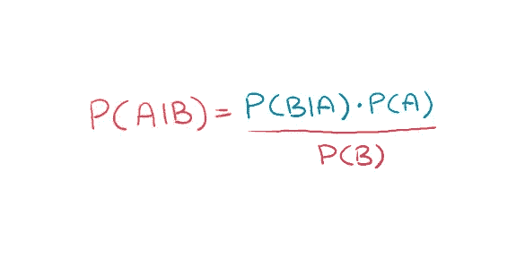
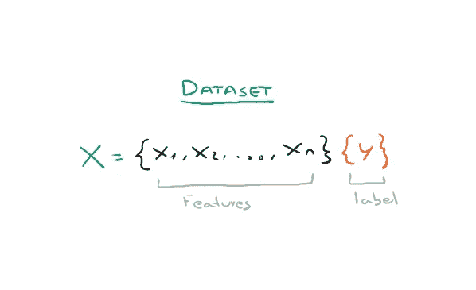
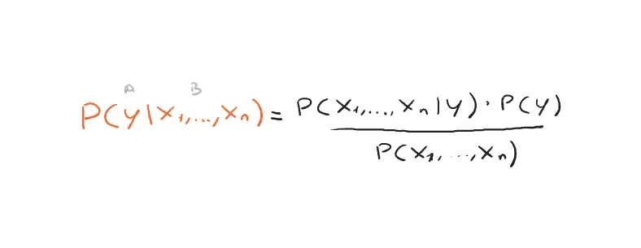
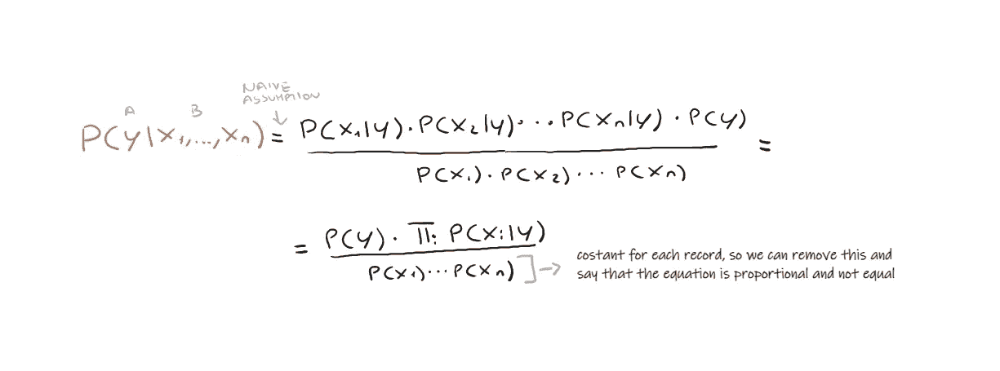
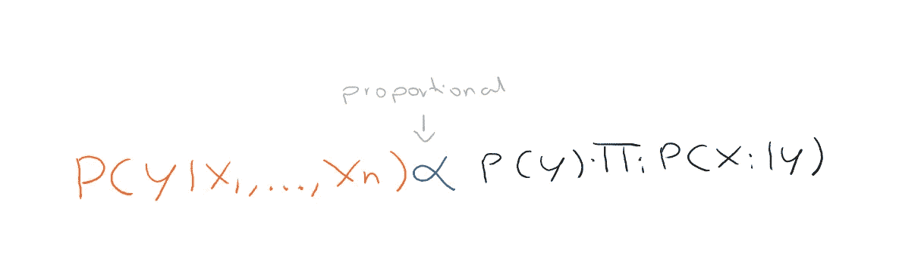
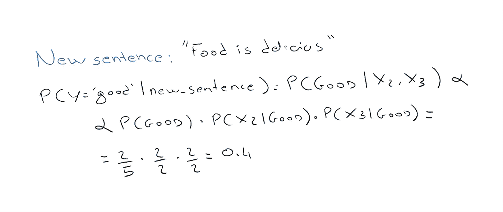
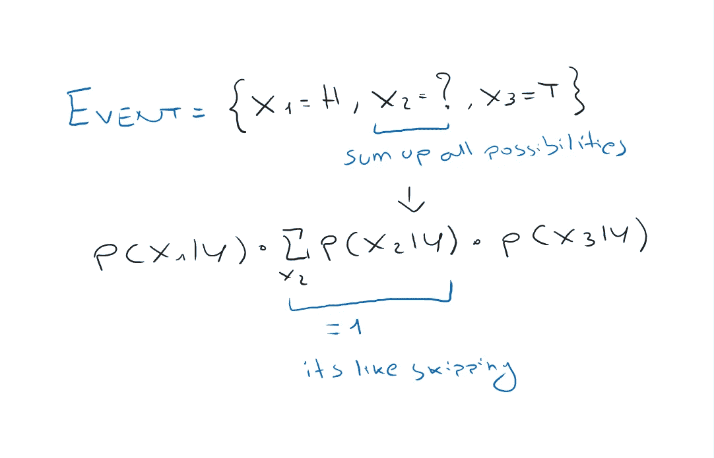

# 赢得机器学习面试——第三部分

> 原文：<https://towardsdatascience.com/ace-your-machine-learning-interview-part-3-af432f922aa7>

肯尼·埃利亚松在 [Unsplash](https://unsplash.com?utm_source=medium&utm_medium=referral) 上的照片

## 使用 Python 深入研究朴素贝叶斯分类器

这是我称为“Ace your Machine Learning 访谈”系列的第三篇文章，在这篇文章中，我回顾了机器学习的基础。如果你错过了前两篇文章，你可以在这里找到它们:

*   [***王牌你的机器学习面试-第一部分:*** *潜线性、套索和岭回归及其假设*](/ace-your-machine-learning-interview-part-1-e6a5897e6844)
*   [***Ace your Machine Learning 访谈-第二部分:*** *使用 Python 对分类问题进行逻辑回归*](/ace-your-machine-learning-interview-part-2-c58526b5faba)

## **简介**

朴素贝叶斯(Naive Bayes)是一种用于解决分类问题的机器学习算法，之所以这么说，是因为它基于贝叶斯定理。

称为分类器的算法为每个数据实例分配一个类别。例如，分类电子邮件是垃圾邮件还是非垃圾邮件。

## 贝叶斯定理

贝叶斯定理用于计算导致已验证事件的原因的概率。我们在概率课程中都学过的公式如下。

贝叶斯定理(作者图片)

所以这个定理回答了这个问题:***‘给定事件 B 已经发生，事件 A 发生的概率是多少？****’*有趣的是这个公式把问题反过来了。也就是说，我们可以通过查看每次事件 A 发生时 B 实际发生了多少次来计算这个概率。也就是**我们可以通过去看过去(资料)**来回答原问题。

## 朴素贝叶斯分类器

但是我们如何应用这个定理来创建一个机器学习分类器呢？假设我们有一个由*个特征*和*个目标*组成的数据集。

数据集(作者提供的图片)

因此，我们现在的问题是*‘给定这些特征发生的情况下，具有某个标签 y 的概率是多少？’*

例如，如果 *y =垃圾邮件/非垃圾邮件*， *x1 = len(email)* ，*x2 = number _ of _ attachments*，我们可能会问:

*‘给定 x1 = 100 个字符和 x2 = 2 个附件，y 是垃圾邮件的概率是多少？’*

要回答这个问题，我们只需要简单地应用贝叶斯定理，其中 A = {x1，x2，…，xn}和 B = {y}。

应用贝叶斯定理(图片由作者提供)

但这种分类器不叫贝叶斯分类器，而是叫朴素贝叶斯分类器。这是因为做了一个**天真的假设**来简化计算，即**特征被假设为彼此独立**。这使我们能够简化公式。

天真的假设(图片由作者提供)

这样，我们就可以计算出 *y =垃圾邮件*的概率。接下来我们就来计算一下 *y = not_spam* 的概率，看看哪个可能性更大。但是如果你想一想，在两个标签之间，具有较高概率的那个将是具有较大分子的那个，因为分母总是相同的: *P(x1) * P(x2)*…*

那么为了简单起见，我们也可以去掉分母，因为为了比较，我们不关心它。

简化公式(图片作者)

现在我们要**选择最大化这个概率**的类，我们只需要使用 **argmax** 。

Argmax 用于分类(图片由作者提供)

## 文本数据的朴素贝叶斯分类器

这种**算法通常用于文本数据的 NLP 领域**。这是因为我们可以将文本中出现的单个单词视为特征，并且天真地假设这些**单词是独立的**(这当然实际上不是真的)。

假设我们有一个数据集，其中每一行都有一个句子，每一列都告诉我们这个单词是否出现在句子中。我们删去了不必要的词，如冠词等。

现在我们可以用下面的方法来计算一个新句子好坏的概率。

文本示例(作者提供的图片)

## 我们来编码吧！

在 sklearn 中实现朴素贝叶斯算法非常简单，只有几行代码。我们将使用众所周知的虹膜数据集，它包含以下特征。

虹膜数据集(图片由作者提供)

sklearn 中的朴素贝叶斯(图片由作者提供)

## 优势

从好处的角度来看，朴素贝叶斯算法有其使用的简单性。虽然这是一个基本的过时的算法，但它仍然以相当的效率很好地解决了一些分类问题。然而，其应用仅限于少数特定情况。总结:

*   适用于许多功能
*   适用于大型训练数据集
*   训练时收敛快
*   它在分类特征上也表现得很好
*   对异常值稳健

## 不足之处

从弊端来看，下面要特别提一下。算法需要问题中所有数据的知识。尤其是简单概率和条件概率。这种信息通常很难获得，而且成本很高。该算法提供了问题的“简单”近似，因为它没有考虑实例特征之间的相关性。

如果一个概率为零，因为它从未在数据中被观察到，你必须应用[拉普拉斯平滑](https://en.wikipedia.org/wiki/Laplacian_smoothing)。

## 处理缺失值

您可以简单地跳过缺少的值。假设我们扔了 3 次硬币，但是我们忘记了第二次的结果。我们可以试着总结第二次投掷的所有可能性。

跳过缺少的值(作者图片)

# 最后的想法

朴素贝叶斯是处理机器学习时需要了解的主要算法之一。它已经被大量使用，特别是在文本数据问题上，比如垃圾邮件识别。正如我们所看到的，它仍然有它的优点和缺点，但肯定的是，当你被问及基本的机器学习时，会有一个关于它的问题！

# 结束了

*马赛洛·波利蒂*

[Linkedin](https://www.linkedin.com/in/marcello-politi/) ， [Twitter](https://twitter.com/_March08_) ， [CV](https://march-08.github.io/digital-cv/)