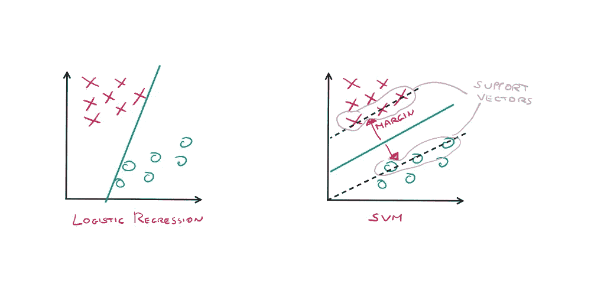
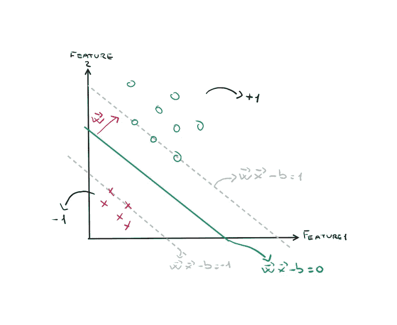
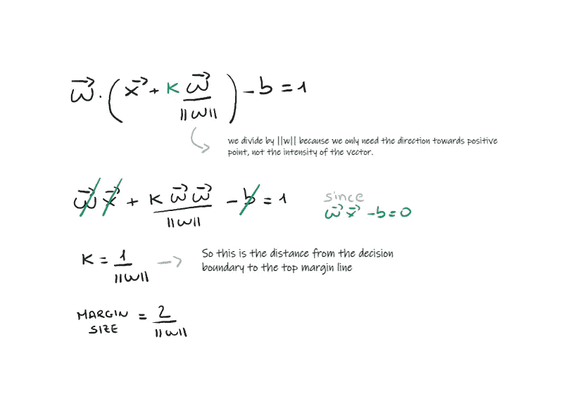
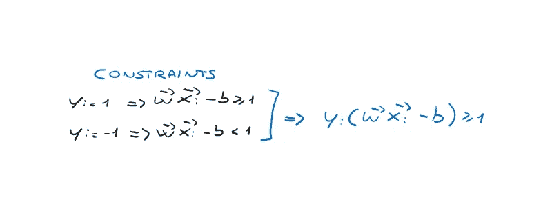
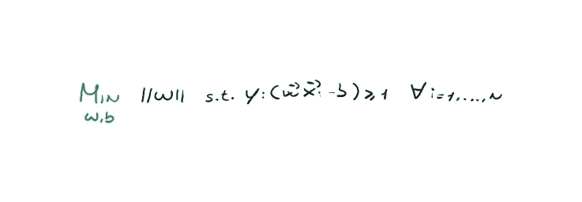
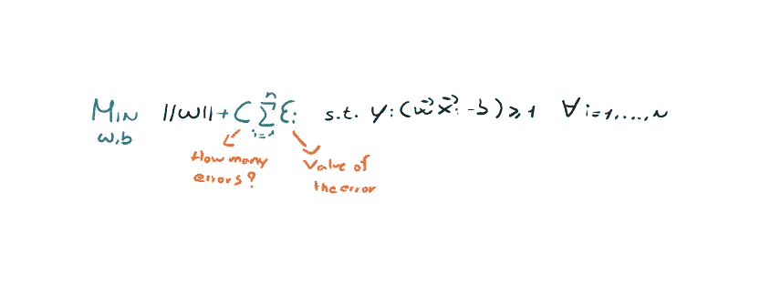
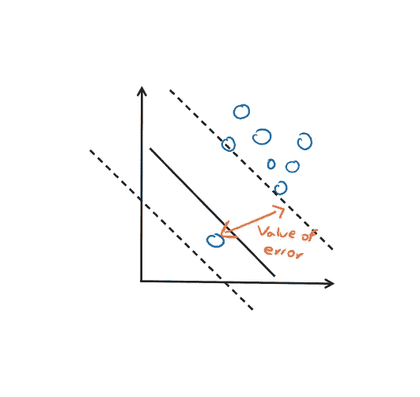
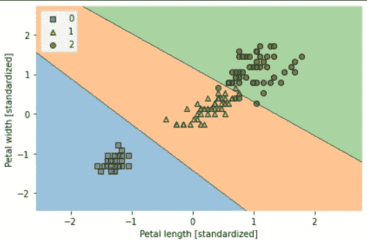

# 赢得机器学习面试——第四部分

> 原文：<https://towardsdatascience.com/ace-your-machine-learning-interview-part-4-e30b695ce63>

由[路](https://unsplash.com?utm_source=medium&utm_medium=referral)上[车头](https://unsplash.com/@headwayio?utm_source=medium&utm_medium=referral)拍摄

## 使用 Python 深入研究支持向量机

这是我的第四篇文章，致力于我开始的关于机器学习基础知识的系列，以便接近你的面试。我把以前文章的链接留在这里。

1.  [*Ace your Machine Learning 面试—第一部分*](/ace-your-machine-learning-interview-part-1-e6a5897e6844) *:深入线性、套索和岭回归及其假设*
2.  [*Ace your Machine Learning 访谈—第二部分*](https://medium.com/towards-data-science/ace-your-machine-learning-interview-part-2-c58526b5faba) *:使用 Python 深入研究分类问题的逻辑回归*
3.  [*Ace your Machine Learning 面试—第三部分*](https://medium.com/towards-data-science/ace-your-machine-learning-interview-part-3-af432f922aa7) *:使用 Python 研究朴素贝叶斯分类器*

## *简介*

支持向量机(SVMs)的算法直观上非常简单，尽管对于没有很强数学背景的人来说，数学可能很复杂。

与逻辑回归一样，我们希望使用一条直线或一个 *n* 维的超平面来分离两类点。但与逻辑回归不同，我们试图找到使边际最大化的超平面。

**裕度定义为分离超平面(决策边界)与最接近该超平面**的训练样本之间的距离，即所谓的**支持向量**。让我们看一个例子。

逻辑回归 VS SVM(图片由作者提供)

通过最大化余量，我们将找到一条线，如上例所示，它将具有很大的泛化能力。因此，它不仅要考虑拟合(或过拟合)训练数据，还要能够对新数据做出良好的预测。

**目标:**找到使边际最大化的超平面。大的页边距比小的页边距能让我们更好地概括。

## 它是如何工作的？

假设我们的正点数取值 *+1* ，负点数 *-1* 。因此，我们可以定义描述边缘和决策边界的函数。此外，我们通过 *w* 定义垂直于超平面的方向。让我们用下图总结一下。

SVM(作者图片)

现在假设你是一个正点 *x* ，它正好位于决策边界上，需要分类。在 *w* 的方向上你必须走多少 *k* 步才能被归类为正，让我们来计算一下。

SVM 数学(作者图片)

这将让你大致了解你是如何达到利润最大化的。但是为了最大化裕量，我们只需要**最小化 *||w||*** 因为它在分母中。显然，我们希望最小化 *||w||* 始终牢记想要正确分类点的约束。

约束 SVM(图片由作者提供)

最后，硬边界 SVM 优化问题可以定义如下。

硬边界优化问题(图片由作者提供)

## 软利润 SVM

正如你可能已经猜到的，如果有硬利润的 SVM，也会有软利润的 SVM。

在这个版本中，我们允许模型犯一些错误，也就是说，让一些点位于边缘线内。这样，通过允许存在一些错误，我们可以保持一个概括得很好的决策边界。在理论层面，我们引入了由 Vladimir Vapnik 于 1995 年首次引入的所谓的**松弛变量**。在 SVMs 的上下文中，**我们将该变量称为 C** ，它是要调整的网络的**超参数**。在这种情况下，我们的最小化问题变化如下。

软边 SVM(图片由作者提供)

软边距 SVM 中的错误(图片由作者提供)

## 我们来编码吧！

使用 sklearn 实现 SVM 非常简单，让我们来看看如何实现。这里我们还使用了众所周知的 Iris 数据集，它包含以下特征。

数据集由 sklearn 以开放许可的方式提供，你可以在这里找到它[。](https://scikit-learn.org/stable/modules/generated/sklearn.datasets.load_iris.html#)

出于可视化的目的，我们将仅使用 Iris 数据集的两个特征。因此，让我们加载并标准化我们的数据。

作者图片

现在，我们可以训练 SVM，并绘制决策边界。

作者图片

SVM 结果(作者图片)

# 最后的想法

朴素贝叶斯是处理机器学习时需要了解的主要算法之一。它已经被大量使用，特别是在文本数据问题上，比如垃圾邮件识别。正如我们所看到的，它仍然有它的优点和缺点，但肯定的是，当你被问及基本的机器学习时，会有一个关于它的问题！

支持向量机可以做的比我在本文中报道的多得多。特别地，SVM 核使得对不可从超平面分离的数据进行分类成为可能。使用核技巧，我们可以切换到具有更多维度的另一个维度空间，并在这个新空间中对数据集的点进行分类。在本系列的下一篇文章中，我们将详细介绍如何做到这一点！😁

# 结束了

*马赛洛·波利蒂*

[Linkedin](https://www.linkedin.com/in/marcello-politi/) ， [Twitter](https://twitter.com/_March08_) ， [CV](https://march-08.github.io/digital-cv/)