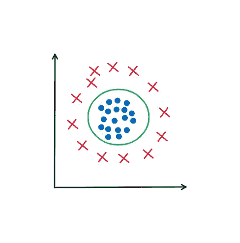
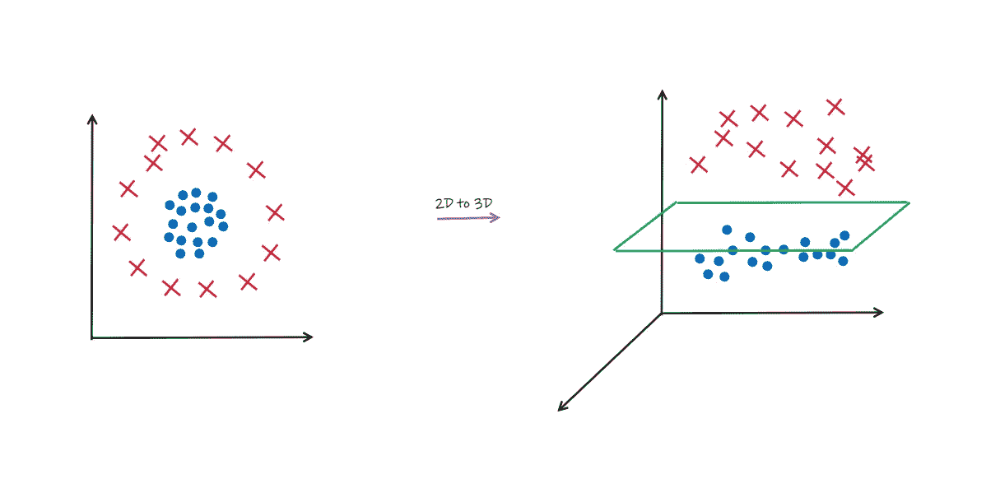
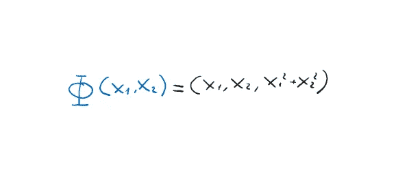
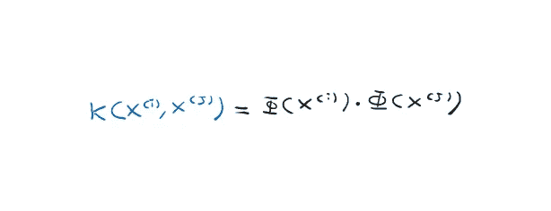
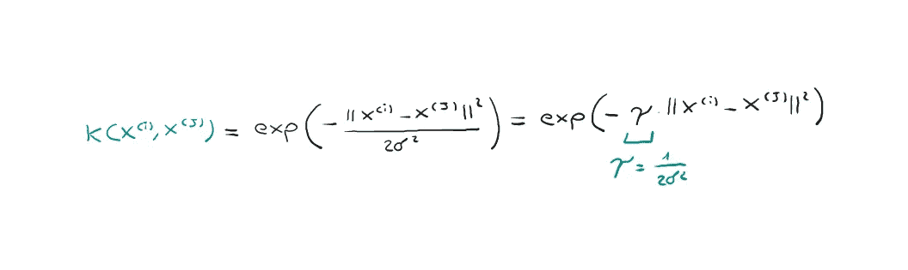
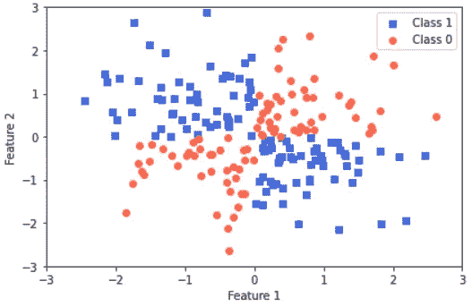
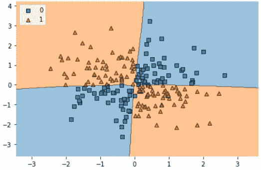
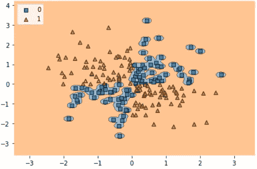

# 赢得机器学习面试——第五部分

> 原文：<https://towardsdatascience.com/ace-your-machine-learning-interview-part-5-3de48703cd65>

在 [Unsplash](https://unsplash.com?utm_source=medium&utm_medium=referral) 上由 [Austin Distel](https://unsplash.com/@austindistel?utm_source=medium&utm_medium=referral) 拍摄的照片

## 使用 Python 深入研究内核支持向量机

正如我在本系列的前一篇文章中提到的，我现在将继续谈论支持向量机，以及如何使用**核技巧**将它们用于对非线性可分数据集进行分类。

如果你错过了这个 *Ace your Machine Learning 面试系列*的前几篇文章，我留下了下面的链接:

1.  [*Ace your Machine Learning 面试—第一部分*](/ace-your-machine-learning-interview-part-1-e6a5897e6844) *:深入线性、套索和岭回归及其假设*
2.  [*Ace your Machine Learning 访谈—第二部分*](/ace-your-machine-learning-interview-part-2-c58526b5faba) *:使用 Python 深入研究分类问题的逻辑回归*
3.  [*Ace your Machine Learning 面试—第三部分*](/ace-your-machine-learning-interview-part-3-af432f922aa7) *:使用 Python 深入研究朴素贝叶斯分类器*
4.  [*Ace your Machine Learning 访谈—第四部分*](/ace-your-machine-learning-interview-part-4-e30b695ce63) *:深入研究使用 Python 的支持向量机*

## 介绍

在上一篇文章中，我们看到了如何通过最大化间隔来获得良好的概括，从而将支持向量机用于分类问题。

逻辑回归 VS SVM(图片由作者提供)

如果我们有一个不能用直线(或 n 维超平面)分类的数据集，我们该怎么办？

数据集不可线性分离(图片由作者提供)

请注意，在上图所示的数据集中，我们有两个类，red 和 blue。但是没有办法用一条直线把这两个类分开。唯一的方法是使用一种“循环”函数，绿色部分描述的函数。

这就是 SVM 核仁的神奇之处。它们允许我们**将数据集投射到更高维度的空间**。在这个新的空间中，很容易找到一个超平面来正确划分这两个类。

从 2D 到 3D 的转变(图片由作者提供)

因此，处理非线性可分数据的核方法的基本思想是创建原始特征的非线性组合，以便使用φ函数将数据集投影到新空间。让我们来看一个将我们从 2D 空间带入 3D 空间的**φ函数的例子。**

φ映射(图片由作者提供)

这种方法的问题是构建这些新功能在计算上非常昂贵。这就是所谓的内核技巧帮助我们的地方。首先，我们必须找出如何解决前一章中训练支持向量机的优化问题，但是数学是非常复杂的，并且会花费大量的时间。

总而言之，我们只需要明白我们需要**计算每个向量对*x _ I * x _ j*的点积。那么在我们的例子中，**我们应该首先使用函数φ将每个向量投影到新的空间中，然后计算*φ(x _ I)*φ(x _ j)***。**

所以有两件事要做:

*   将每个向量投影到新的空间
*   计算新空间中向量对之间的点积

**内核技巧是一个函数，它允许我们直接获得新空间中向量之间的点积结果，而不必将每个单独的向量投影到新空间中**。这将节省我们大量的时间和计算。更正式地说:

内核技巧(图片由作者提供)

但是这个内核技巧函数是什么样子的呢？不要担心，你不是必须找到这个函数的人，但它们是你可以在网上找到的众所周知的函数。让我们来看看最著名的**高斯核或者也叫径向基函数**。

高斯核(图片由作者提供)

其中 *y* 为待优化的自由参数。

> 术语核可以被解释为一对例子之间的相似性函数。负号将距离度量转化为相似性得分，并且由于指数项，所得的相似性得分将落在 1(对于完全相似的示例)和 0(对于非常不相似的示例)之间的范围内。

## 我们来编码吧！

首先，让我们使用 [xor](https://en.wikipedia.org/wiki/XOR_gate) 函数创建我们的线性不可分数据集。

线性不可分数据集(图片由作者提供)

现在我们可以使用参数**kernel =‘rbf’**训练一个 SVM，其中 RBF 代表径向基函数。我们可以看到分类器创建的决策边界。

决策界限(图片由作者提供)

您可以看到，SVM 能够使用 rbf 内核正确地分离这两个类！

如果我们增加 gamma 的值，我们将增加训练数据对决策边界的影响。因此**过高的 gamma 将产生决策边界，这些边界将形成我们训练数据的一种轮廓，从而失去泛化能力**。

过度拟合(图片由作者提供)

# 最后的想法

在本文中，我们看到了内核支持向量机背后的理论以及如何使用 sklearn 实现它们。我们看到了输出如何随着 gamma 参数的变化而受到影响，这为训练集数据提供了更多的权重。

SVM 核长期以来一直是包括计算机视觉在内的许多领域中机器学习的艺术状态。它们今天仍然被广泛使用，所以了解它们是很重要的！我希望这篇文章对你有用。如果是的话，就跟着我一起看这个*《王牌你机器学习面试》*系列的下篇文章吧！😁

# 结束了

*马赛洛·波利蒂*

[Linkedin](https://www.linkedin.com/in/marcello-politi/) ， [Twitter](https://twitter.com/_March08_) ， [CV](https://march-08.github.io/digital-cv/)