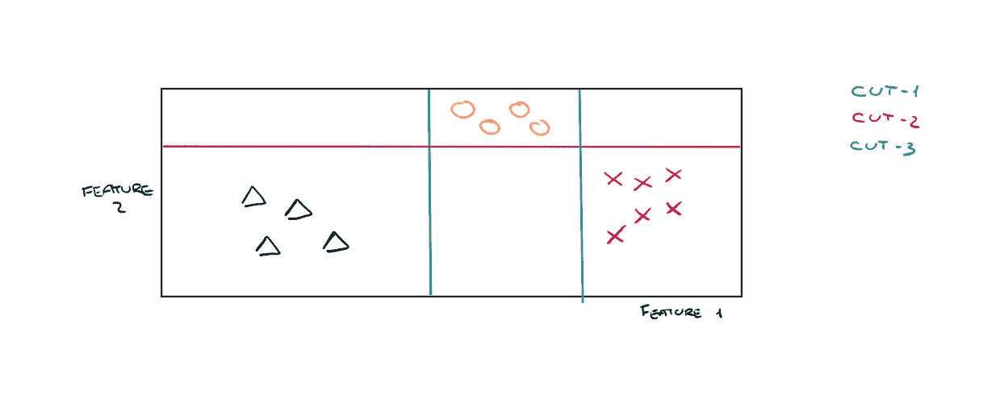
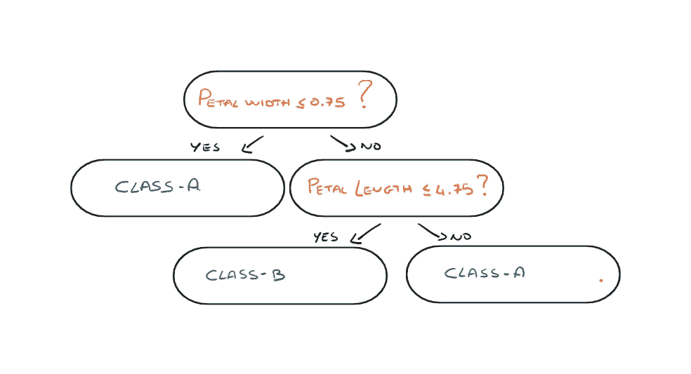
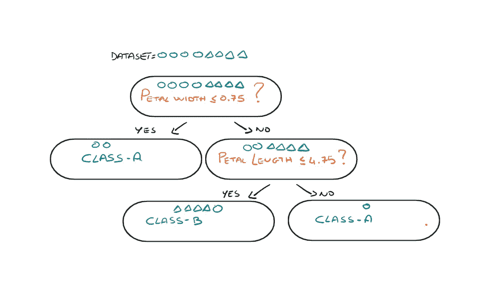
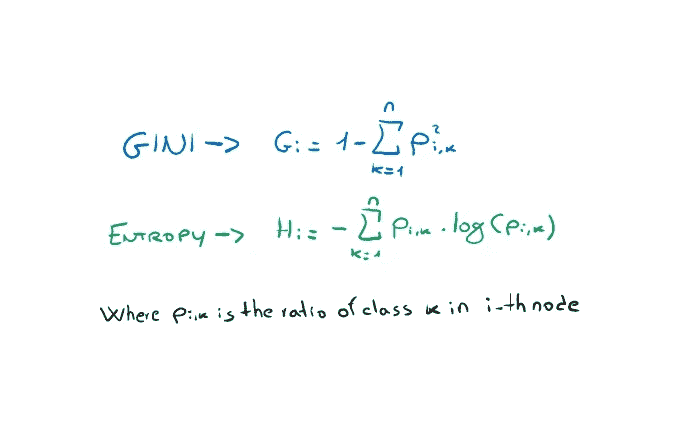
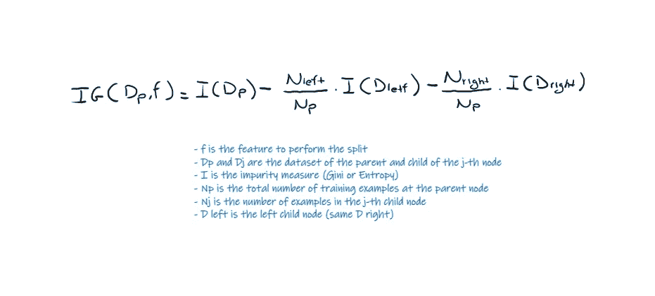
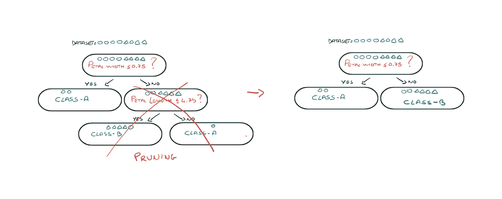
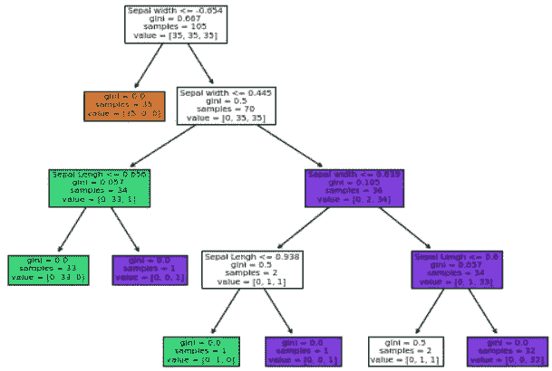

# 赢得机器学习面试——第六部分

> 原文：<https://towardsdatascience.com/ace-your-machine-learning-interview-part-6-5f0d84e435a1>

迪伦·吉利斯在 [Unsplash](https://unsplash.com?utm_source=medium&utm_medium=referral) 上的照片

## 使用 Python 深入决策树

今天我继续我的“Ace your Machine Learning Interview”系列的第六篇文章，讨论决策树！

如果您对本系列之前的文章感兴趣，我在这里留下了链接:

1.  [*Ace your Machine Learning 面试—第一部分*](/ace-your-machine-learning-interview-part-1-e6a5897e6844) *:深入线性、套索和岭回归及其假设*
2.  [*Ace your Machine Learning 访谈—第二部分*](/ace-your-machine-learning-interview-part-2-c58526b5faba) *:使用 Python 深入研究分类问题的逻辑回归*
3.  [*Ace your Machine Learning 面试—第三部分*](/ace-your-machine-learning-interview-part-3-af432f922aa7) *:使用 Python 研究朴素贝叶斯分类器*
4.  [*Ace your Machine Learning 访谈—第四部分*](/ace-your-machine-learning-interview-part-4-e30b695ce63) *:深入研究使用 Python 的支持向量机*
5.  [*Ace your Machine Learning 访谈—第五部分*](/ace-your-machine-learning-interview-part-5-3de48703cd65) *:深入研究使用 Python 的内核支持向量机*

## **简介**

我们现在已经到了引入决策树的时候了。让我们先说这个算法受到那些**高度重视模型的可解释性**的人的喜爱。也就是能够解释**机器学习模型为什么会给出某个输出结果**。想象一下你去银行申请抵押贷款。你的抵押贷款被拒绝了。然后你问为什么抵押贷款被拒绝给你。如果银行家回答你，“嗯……我不知道，电脑显示抵押贷款被拒绝了，所以我什么也做不了”，那就不太好了。这就是使用像神经网络这样的机器学习算法会发生的事情。相反，使用决策树，银行家将能够给你确切的原因。你的抵押贷款被拒绝有三个主要原因:(1)你的工资(2)你的年龄(3)你的历史。

我想马上告诉你，这个算法虽然用起来很简单，但并不是很'*强大'*，它很容易**导致数据过拟合**。但是我们将在后面看到**如何用一种组装方法**来改进它。

## 决策图表

当我想到决策树时，我总是想象有一个数据集，为了简化可视化，只有两个特征，并像切馅饼一样切这个数据集。

只有您可以制作的切片必须平行于作为轴的特征。

用决策树剪切(图片由作者提供)

在上图中，我们有一个由几个点组成的二维数据集。这些点中的每一个都与一个类别相关联:三角形、圆形或十字形。决策树一次进行一次切割，目的是将每个特定类别的点隔离在一个空间中。这样，在我们必须对一个新点进行分类的推断时刻，我们只需要看到它将被放置在哪个空间中，我们就可以立即对它进行分类。

## 更详细

但是这些削减意味着什么呢？让我们考虑特征 1 的第一个切割，绿色切割。假设特征 1 是虹膜数据集的*花瓣长度*特征。然后在轴的 f1 点把空间分成两部分的绿切简单的问“ ***你的花瓣长度值是大于还是小于 f1？*** “之后，我们将询问相同类型的问题，但针对特征轴 2 上的另一个值。同样的事情也发生在特征 1 上，蓝色切割等等…

最终，我们将会在每个点自己的子空间中对其进行正确的分类。

这就是模型的可解释性的来源！当我们对一个新的数据项进行分类时，我们所做的就是回答一系列这样的问题。当一个点被归类为某个标签 A 时，我们将完全能够说出原因！

为了便于可视化，这些问题以树的形式表示，为了对数据进行分类，我们必须从上到下遍历树。

决策树问题(图片由作者提供)

**这些类型的树不一定是二进制的，它们也可以是 d 进制的**，但是库的实现经常使用二进制的树，例如 sklearn。

## 如何找到最佳切工？

现在出现的问题是*“但是我应该在哪个特征上进行第一次切割，我应该在那个特征上进行切割的值是多少？”*

> 从树根开始，分割产生最大**信息增益(IG)** 的特征数据

基本上，我们从树中的一个节点开始，首先从根节点开始。每次我们进行分割(剪切)时，数据集中的一些数据将进入该节点的左侧子节点，一些数据将进入右侧子节点。如果这些子节点中的一个现在包含来自我们的数据集的数据，这些数据都具有相同的标签，我们将说该节点是纯的。否则，我们将继续使用其他拆分来拆分节点中的剩余数据集点。一个纯节点被称为树中的一片叶子。尽管一个节点不是纯的，它也可以变成一片叶子。在这种情况下，**与这个节点相关联的标签是它包含在其中的多数类的值。**

因此，如果一个叶子包含 10 个标签为 A 类的数据项，那么这个叶子的值将是 A。但是，如果一个叶子包含 8 个标签为 A 的数据和 2 个标签为 B 的数据，那么这个叶子的值仍然是 A。

决策树分类

所以现在在推理的时候，当我们被输入一个标签未知的数据项时，我们只需要遍历树，看看我们在哪个叶子上结束。我们将相应地对新数据项进行分类。

## 什么是纯洁？

我们直观地理解，我们做这些切割或分割是为了增加每个节点的纯度，也就是说，在每个节点上有一个单一类别的数据。**但是纯度或者更确切地说杂质是如何被正式描述的呢**？通常，有两种方法，我们可以使用熵或者基尼系数。

数学中的杂质(作者图片)

在每次拆分时，我们都希望减少每个节点的杂质。然而，我们也可以说，随着每一次分裂，我们希望增加信息增益。也就是说，**在每次分割之后，我将拥有越来越多的关于节点的信息，并且我将越来越确信我对它进行了正确的分类**。所以我们可以说，我们想要创建一个**决策树，目标是最大化信息增益(IG)** 。

DT 中的信息增益(图片由作者提供)

## 过度拟合

**决策树**没有被广泛使用，因为它们**容易过拟合**。事实上，**考虑到您可以对任何类型的数据集进行分类**，您只需进行连续的分割，直到您为输入数据的每一个点创建了一个节点叶。显然这样的 DT 会有**很差的泛化能力。那该怎么办呢？**我们可以设置正则化参数**。例如，我们可以说树的深度不应该超过 5 分，这样我们可以避免过度拟合。最常见的参数如下。**

*   *树的最大深度*
*   *最小样本分割*:一个节点在被分割之前必须拥有的最小样本数
*   *最小样本叶*:一个叶节点必须拥有的最小样本数

另一种广泛使用的方法是 ***后剪枝*** 。一旦树被创建，我们去剪一些叶子或子树，所以我们将有一个模型，将有更大的泛化能力。

DT 中的后期剪枝(图片由作者提供)

## 我们来编码吧！

像往常一样，我们将使用虹膜数据集。数据集由 sklearn 在开放许可下提供，可以在这里找到。数据集如下。

虹膜数据集

出于可视化的目的，我们将仅使用 Iris 数据集的两个特征。因此，让我们加载并标准化我们的数据。虽然 DT 不需要**特征缩放(酷！)**。

输入数据

现在，用 2 行简单的代码，我们将创建和适应 oud DT 模型。我们将绘制决策边界，以查看模型是否有效，是否能够对我们的数据进行分类。

一个非常酷的功能是让你绘制整个决策树，这样模型就不是一个黑盒，但你可以知道它背后发生了什么。

决策树(图片由作者提供)

# 最后的想法

我们来总结一下决策树的特点。

**优点:**

1.  清晰的可视化:算法易于理解、解释和可视化。DT 的输出很容易被人理解。
2.  决策树看起来像 if-else 语句，容易理解
3.  用于回归和分类
4.  可以处理分类变量和连续变量
5.  自动处理缺失值
6.  对异常值稳健
7.  训练很快
8.  不需要特征缩放。

**缺点:**

1.  它通常会导致过度拟合。为了拟合数据(即使是有噪声的数据)，它会不断生成新的节点。
2.  它不稳定。添加新的数据点会导致整个树的重新生成。
3.  不适合大型数据集。树可能长得太复杂，导致过度拟合。

😁

# 结束了

*马赛洛·波利蒂*

[Linkedin](https://www.linkedin.com/in/marcello-politi/) ， [Twitter](https://twitter.com/_March08_) ， [CV](https://march-08.github.io/digital-cv/)