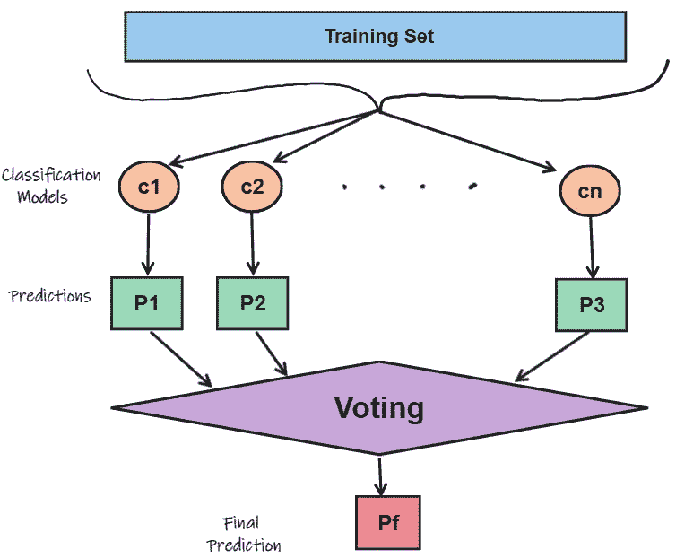
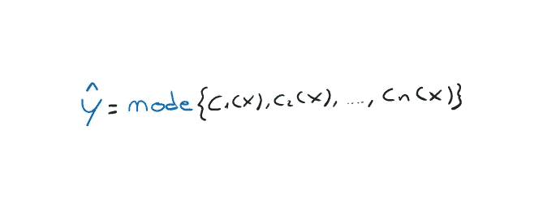
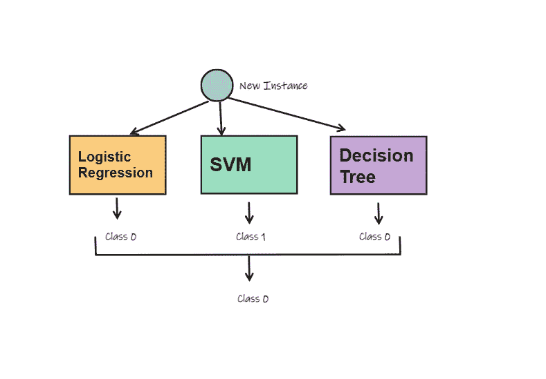

# 赢得机器学习面试——第七部分

> 原文：<https://towardsdatascience.com/ace-your-machine-learning-interview-part-7-2688de34805f>

在 [Unsplash](https://unsplash.com?utm_source=medium&utm_medium=referral) 上[空中聚焦](https://unsplash.com/@airfocus?utm_source=medium&utm_medium=referral)拍摄的照片

## 使用 Python 研究硬投票分类器的集成学习

我们来到了我的*“Ace your Machine Learning Interview”*系列的第七篇文章，在这篇文章中，我回顾了机器学习的一些基础知识，希望对你面对下一次面试有所帮助！😁

如果您对本系列之前的文章感兴趣，我在这里留下了链接:

1.  [*Ace your Machine Learning 面试—第一部分*](/ace-your-machine-learning-interview-part-1-e6a5897e6844) *:深入线性、套索和岭回归及其假设*
2.  [*Ace your Machine Learning 访谈—第二部分*](/ace-your-machine-learning-interview-part-2-c58526b5faba) *:使用 Python 深入研究分类问题的逻辑回归*
3.  [*Ace your Machine Learning 面试—第三部分*](/ace-your-machine-learning-interview-part-3-af432f922aa7) *:使用 Python 深入研究朴素贝叶斯分类器*
4.  [*Ace your Machine Learning 访谈—第四部分*](https://medium.com/towards-data-science/ace-your-machine-learning-interview-part-4-e30b695ce63) *:深入研究使用 Python 的支持向量机*
5.  [*Ace your Machine Learning 访谈—第五部分*](https://medium.com/towards-data-science/ace-your-machine-learning-interview-part-5-3de48703cd65) *:使用 Python 深入研究内核支持向量机*
6.  [*Ace your Machine Learning 面试—第六部分*](https://medium.com/towards-data-science/ace-your-machine-learning-interview-part-6-5f0d84e435a1) *:* 使用 Python 深入决策树

## **简介**

集成学习是一种允许你一起使用多个预测器、分类器或回归器的方法。通过这种方式，您可以基于各种机器学习模型的知识创建一个更健壮的系统。

如果你仔细想想，当我们对某事犹豫不决时，这是我们人类通常会做的事情。我记得《生活大爆炸》系列中有一集，谢尔顿还没有决定是买 Xbox 还是 PlayStation。然后，他询问朋友的意见，希望得到大多数人的支持，并据此做出决定。我把视频留在这里给你！

Ensembling 方法做的是同样的事情。如果必须对一个点进行分类，它会征求几个分类者的意见，并采用大多数结果。(多数的使用并不总是如此，但却是最常见的)

## 通用集成学习

所以我们已经知道了如何构造一个集合方法。例如，我们训练几个分类器，然后采用多数投票来分类一个新实例。

下图很好地总结了这一点。

集成学习架构(图片由作者提供)

从技术上来说，当我们处理二元分类时，我们说我们在使用**多数表决**。另一方面，当我们做多类分类时，我们说**多数投票**。基本上你实际做的是使用**模式函数，它在统计中从列表中取出最频繁的元素。**

寻找多数的模式(作者图片)

但是这些 C1，C2，…，Cn 量词是什么样子的呢？他们可以是你喜欢的分类器，重要的是，你然后分组，并在一个函数中使用他们的预测，比如多数投票。例如，我们可以使用逻辑回归、SVM 和决策树。

整体方法示例(图片由作者提供)

但是，除了在集成方法中使用所有不同的算法，**我们可以总是使用相同的算法吗？答案是肯定的！**

## 装袋、粘贴和随机森林

到目前为止，我们总是使用我们的整个数据集，并用它来训练不同的算法，然后我们将这些算法组合成一个集成方法。

我们可以做的另一件事是始终使用相同的算法，例如我们可以使用三个支持向量机，但是每个 SVM 将在初始数据集的不同子集上绘制。 **子集可以是数据集中所有记录的子集，也可以是特征**(保留所有记录)的子集。最后，我们像往常一样对预测进行多数投票。

如果我们有 900 条记录的训练集。我们可以从 300 条记录中随机抽取一个子集用于每个 SVM。请注意，如果我们对这个子集进行重复，我们将使用一种叫做**打包**的方法。否则，不重复，称为**粘贴**。

您曾经使用过或见过使用基于装袋或粘贴的**组装方法吗？我打赌你有。随机森林**！

我们在上一篇文章中提到，通常在集成方法中使用决策树(DT)算法来提高其鲁棒性。而只由一棵决策树组成的**ense bleng 被称为随机森林**，因为它是一种广泛使用的算法，性能非常好。

我们已经提到，DT 总是试图在它找到的最佳特性上进行分割。另一方面，一个**随机森林**，**在众多 DT 中实例化一个时，只给它分配特征**的一个子集。因此，DT 必须只在该特征子集内搜索最佳分割。

## **多余的树**

有一个随机森林的实现，允许更快的训练，但增加了噪声。在这种情况下，DT 的每个特征除了从特征的随机子集中提取之外，还将在**随机施加的阈值**上进行分割。因此，它们非常快，我们可以同时实例化多个 DTs。额外的树以更大的偏差换取更低的方差，训练起来更快。

## 我们来编码吧！

让我们首先来看看 3 种不同算法在 Iris 数据集上的结果。数据集由 sklearn 在开放许可下提供，可以在这里找到。数据集如下。

我们将使用这三种算法:*逻辑回归*、*决策树分类器*和*近邻分类器*。

此外，对于第一次和最后一次，我们将使用标准定标器进行一些数据处理。为了方便起见，我们将算法和定标器放在一个 sklearn 管道中。

输入数据

每个算法和管道将使用**交叉折叠验证**进行 10 次评估。

我在下面列出了我的算法:

*   ***Logistic 回归****:ROC AUC:0.92-STD:0.15*
*   ***决策树****:ROC AUC:0.87 STD:0.18*
*   ***KNN****:ROC AUC:0.85 STD:0.13*

让我们看看我们能否在多数投票制下做得更好。我们首先用下面的方式**定义一个名为 MajorityVotingClassifier** 的类。我们只需要**继承 BaseEstimator 和 ClassifierMixin** 这两个类，就可以继承常见的估计器功能，比如 get/set_params 函数。

现在我们只需要实例化一个新的 MajorityVotingClassifier 类型的分类器，并将其添加到我们已经比较过的分类器列表中。

让我们看看取得的成果。你的可能会和我的略有不同。

*   ***Logistic 回归****:ROC AUC:0.92 STD:0.15*
*   ***决策树****:ROC AUC:0.87 STD:0.18*
*   ***KNN****:ROC AUC:0.85 STD:0.13*
*   ***多数投票****:ROC AUC 0.98 STD:0.05*

你可以看到，这一次多数投票成功地超过了单个分类器几个百分点。

因此，通过利用较弱的分类器，我们能够创建一个达到 98%分数的分类器！

# 最后的想法

合奏法通常用于像 Kaggle 或类似的比赛，有时可以让你赢得额外的几个百分点。另一方面，**它在工业中并不总是有用的，因为通常不值得为了性能上的小改进而训练多分类器，所以人们必须有意识地使用这种方法。**

我自己用它在名为[**evalita 2020**](https://www.evalita.it/campaigns/evalita-2020/best-system-award/)的 NLP 竞赛中赢得了**最佳系统奖，在该竞赛中，我基于集成技术创建了一个分类器。你可以在这里阅读更多关于我开发的做[姿态检测的系统。😁](https://pdfs.semanticscholar.org/c248/cc7cfe59e27f4e14e53840a9dcd29febafaf.pdf)**

# 结束了

*马赛洛·波利蒂*

[Linkedin](https://www.linkedin.com/in/marcello-politi/) ， [Twitter](https://twitter.com/_March08_) ， [CV](https://march-08.github.io/digital-cv/)