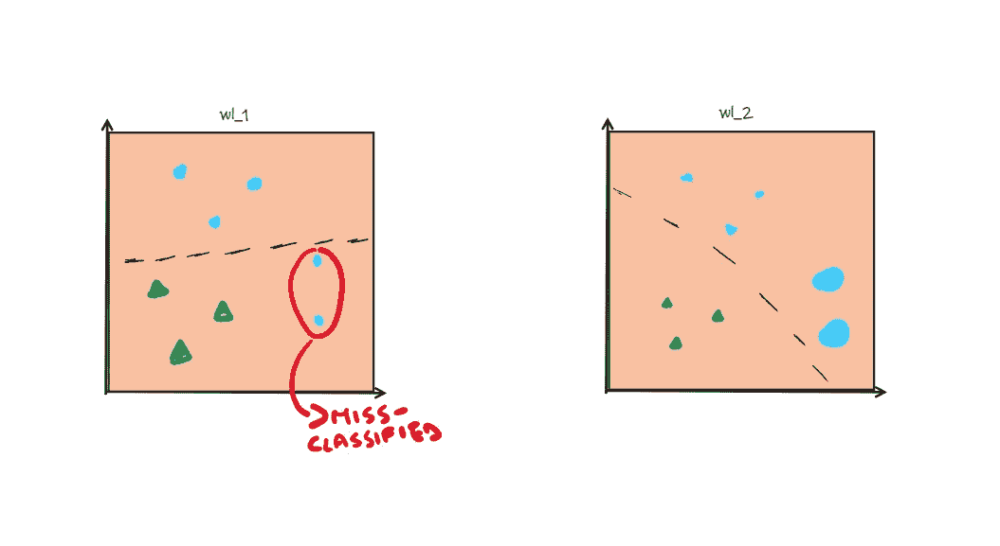
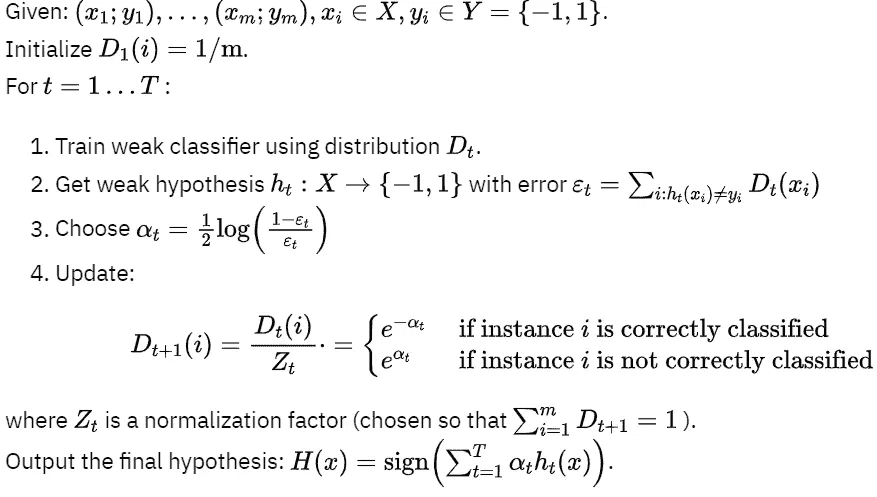

# 赢得机器学习面试——第八部分

> 原文：<https://towardsdatascience.com/ace-your-machine-learning-interview-part-8-a9b94b8ed468>

[女同胞](https://unsplash.com/@cowomen?utm_source=medium&utm_medium=referral)在 [Unsplash](https://unsplash.com?utm_source=medium&utm_medium=referral) 上拍照

## 使用 Python 从头开始使用 AdaBoost 进行集成学习

在我的系列文章“Ace your Machine Learning Interview”中，我继续谈论集成学习，特别是，我将重点关注 Boosting 算法，并特别提到 **AdaBoost** 。我希望我回顾机器学习基础知识的这一系列对你面对下一次面试有用！😁

如果您对本系列之前的文章感兴趣，我在这里留下了链接:

1.  [*Ace your Machine Learning 面试—第一部分*](/ace-your-machine-learning-interview-part-1-e6a5897e6844) *:深入线性、套索和岭回归及其假设*
2.  [*Ace your Machine Learning 访谈—第二部分*](/ace-your-machine-learning-interview-part-1-e6a5897e6844) *2:使用 Python 深入研究分类问题的逻辑回归*
3.  [*Ace your Machine Learning 面试—部分*](/ace-your-machine-learning-interview-part-1-e6a5897e6844) *3:使用 Python 深入研究朴素贝叶斯分类器*
4.  [*Ace your Machine Learning 访谈—第四部分*](https://medium.com/p/e30b695ce63/edit) *:深入研究使用 Python 的支持向量机*
5.  [*Ace your Machine Learning 访谈—第五部分*](https://medium.com/p/e30b695ce63/edit) *5:使用 Python 深入研究内核支持向量机*
6.  [*Ace your Machine Learning 面试—第六部分*](https://medium.com/p/5f0d84e435a1/edit) *:使用 Python 深入决策树*
7.  [*Ace your Machine Learning 面试—第七部分*](https://medium.com/p/2688de34805f/edit) *:使用 Python* 研究硬投票分类器的集成学习

## 介绍

我们在上一篇文章中讨论了什么是集成学习，我们已经看到并实现了基于多数投票的简单集成方法。

今天，我们通过特别参考**自适应增强或 AdaBoost** 来更详细地讨论一种称为 Boosting 的集成方法。你可能以前听说过这种算法，例如，它经常被用来赢得 Kaggle 比赛。

AdaBoost 的基本思想最早是在罗伯特·e·沙皮雷的论文*中陈述的。*

*这个想法是以一种组合的方式使用各种 ML 算法，这些算法被称为弱学习器，因为它们本身不是很好，它们只能比随机猜测好一点。通过依次使用这些弱学习器，可以获得非常强的结果。*

## *最初的 AdaBoost 想法*

*按照最初的设想，**增强最初是基于我们已经看到的叫做粘贴**的技术。*

*因此，实现了几个弱学习器，并且每个弱学习器在训练集数据的子集上被训练，而没有替换。我们将称为 ***wl_1、wl_2、…、wl_n* 的弱学习器被顺序训练**，并且每个 *wl_i+1* 在训练集的随机子集上被训练，来自 *wl_i* 的 50%的错误分类数据点被添加到该训练集中。通过这种方式，错误分类的数据点被赋予了更大的权重。*

*最后，他们会将所有落后的弱学习者合并成一个多数投票函数。*

## *adaboost 算法*

*基本思想保持不变，但现在 AdaBoost 算法略有不同。首先，**不再使用粘贴，而是在整个可用的训练集**上训练每个弱学习者。此外，使用另一种机制来给予被先前的弱学习者错误分类的点更多的重要性。弱学习者 ***wl_i+1* 将简单地给 *wl_i* 的错误分类的点更多的权重，给良好分类的点**更少的权重。*

**

*加权误分类数据点(图片由作者提供)*

*在实现这个算法之前，让我们看一下伪代码来了解一下。*

**

*伪代码 Adaboost(图片由作者提供)*

## *我们来编码吧！*

*所以首先我们初始化两个数组 *y* 和 *y_hat* ，它们将是+1 和-1 的二进制向量。这些将代表真实的类和预测的类。之后，我们创建一个布尔列表，每个条目告诉我们预测是否正确。*

*现在让我们初始化权重。首先，每个数据点的权重是相同的，因为我们有 10 个数据点，每个数据点的权重是 0.1。*

*使用这些初始权重和预测，我们继续计算误差和系数α，我们将需要计算伪代码中所示的新更新的权重。*

*现在我们准备计算新的权重，然后对它们进行归一化。注意，根据预测是正确还是不正确，我们有两个不同的公式来更新权重。*

*现在我们在第二步中有了新的权重。你可以选择做 m 步，把所有的东西放在一个 for 循环中。*

*幸运的是，各种库已经有了更有效的实现。所以**让我们看看如何使用 sklearn 来使用 AdaBoost！***

*以下虹膜数据集由 sklearn 在开放许可下提供，可以在[这里](https://scikit-learn.org/stable/modules/generated/sklearn.datasets.load_iris.html#)找到。*

*首先，我们导入数据，并将其分为训练集和测试集。注意:为简单起见，我们将在该数据集中仅使用两个要素。*

*现在只需几行代码，我们就可以创建一个基于 500 个简单决策树的 AdaBoost，每个决策树都有 *max_depth = 1* 。我们看到我们得到了比仅仅使用决策树更好的结果。*

*就是这样！通过几个简单的步骤，您可以创建 AdaBoost 算法并获得您的预测。*

# *最后的想法*

*所以在关于集成学习的第二篇论文中，我们看到了一种叫做 AdaBoost 的新算法。所谓的弱学习者是按顺序训练的，这被认为是不好的，因为这种顺序训练会浪费我们很多时间。然后，我们将能够**通过关注未满足的情况**，使每个预测器纠正其前任。**所以新的预测器更关注疑难病例。对于新的预测因子，我们增加了疑难病例的权重。***

*关注我的“Ace you 机器学习面试”系列新文章！😁*

# *结束了*

**马赛洛·波利蒂**

*[Linkedin](https://www.linkedin.com/in/marcello-politi/) ， [Twitter](https://twitter.com/_March08_) ， [CV](https://march-08.github.io/digital-cv/)*