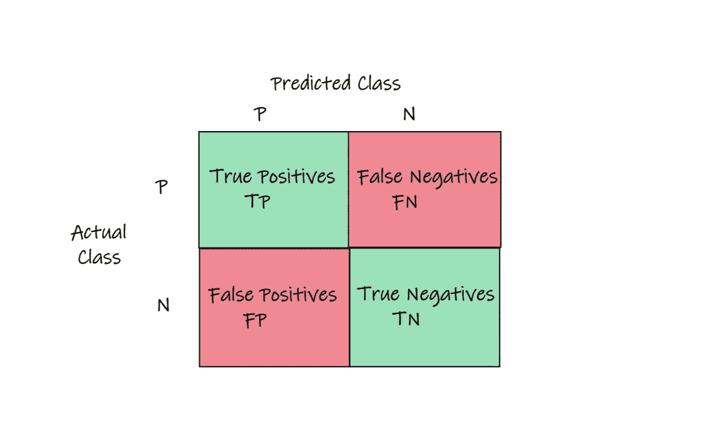
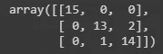
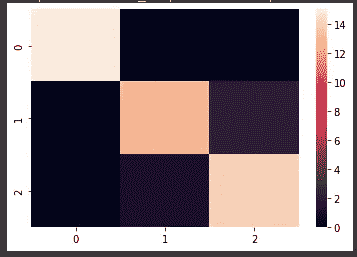

# 赢得机器学习面试——第九部分

> 原文：<https://towardsdatascience.com/ace-your-machine-learning-interview-part-9-2fd782b4bb8>

## 使用 Python 深入研究混淆矩阵的性能评估指标和热图可视化


[摄于](https://unsplash.com/@jopwell?utm_source=medium&utm_medium=referral) [Unsplash](https://unsplash.com?utm_source=medium&utm_medium=referral) 上的 Jopwell 系列

在这个*“Ace your Machine Learning Interview”*系列的这篇新文章中，我开始讨论一个不同的话题。我不会描述一种新的机器学习算法，而是向你展示如何评估一种算法是否工作良好。知道如何很好地评估一个 ML 系统和开发系统本身一样重要。

我希望你在处理下一次面试时会发现它很有用！😁

## 介绍

知道如何评估机器学习算法是非常重要的。如果我们不能判断算法的输出是好是坏，我们该如何改进我们的算法呢？有许多指标，有时很难浏览它们。你可能听说过类似于 **ROC** 或 **AUC** 的缩写，或者你可能听说过 **Precision** 和 **Recall** 以及其他指标。但是它们是什么，应该如何恰当地使用它们呢？

这些用于评估 ML 算法的各种度量可以从混淆矩阵中导出，混淆矩阵是算法预测我们的数据集中的标签有多好的一种“总结”。

在我参加的最后一次面试中，特别是在计算机视觉领域，我被要求解释什么是混淆矩阵，以及如何使用 Python 在实际练习中实现它。所以我决定写这篇文章来和你分享我的经历。

我也想给你一个建议，当你面临面试的时候，好好重温一下机器学习的基础知识。通常招聘的公司更感兴趣的是知道你能掌握机器学习的主要概念，而不是知道最新和最深奥的神经网络架构是什么。

所以我想谈谈如何阅读混淆矩阵，以及如何使用 Python 用几行代码实现它。

## 混淆矩阵

先说最简单的情况。假设你正在训练任何分类器:它可以是基于逻辑回归或朴素贝叶斯或任何其他你想要的算法的分类器。

给定输入的分类器只需说明该输入是肯定的还是否定的(狗或猫是同一个东西)。首先，你要做的是**计算出这个分类器错误输出了多少次，它猜对了哪些点**。

然后我们可以开始计算他出错的次数。也就是说，它应该预测为正但预测为负的所有时间，以及它应该预测为负但预测为正的所有时间。然后我们也感兴趣的是算法给出了多少次正确的输出。也就是它正确预测了多少次正反。

为了避免混淆，简单地**在一个被称为混淆矩阵** x. **的表格中总结所有这些值，行代表实际标签，列代表预测标签**。



困惑矩阵(图片由作者提供)

**真阳性(TP)** :分类器正确预测阳性。*例*:分类器预测患者有肿瘤，是真的！

**真阴性(TN):** 分类器正确预测阴性。*示例*:分类器预测患者没有肿瘤，事实上患者是健康的。

**假阳性(FP):** 又称***1 型错误。*** 分类器预测为阳性，但要预测的标签为阴性。*例*:分类器预测患者患有癌症，但实际上是健康的。

**假阴性(FN):** 又称***2 型错误。*** 分类器预测为阴性，但待预测的标签为阳性。*示例:*分类器预测患者没有肿瘤，而他有！

让我们来看一个如何在 Python 中使用 sklearn 计算混淆矩阵的例子。

以下虹膜数据集是 sklearn 在开放许可下提供的，在这里可以找到[。](https://scikit-learn.org/stable/modules/generated/sklearn.datasets.load_iris.html#)

首先，我们将**下载数据**并且**像往常一样通过使用 sklearn 函数将**分割成**训练和测试集**。

```
from sklearn import datasets
import numpy as np
from sklearn.model_selection import train_test_split

iris = datasets.load_iris()

x = iris.data
y = iris.target

x_train, x_test, y_train, y_test = train_test_split(x,y, test_size = 0.3, stratify = y)
```

现在用你喜欢的分类器，在训练数据上训练它。在这种情况下，我将使用简单的**逻辑回归**。

```
from sklearn.linear_model import LogisticRegression

lr = LogisticRegression()
lr.fit(x_train, y_train)
```

现在我们已经训练了我们的算法，剩下的就是对测试集进行预测。

```
predictions = lr.predict(x_test)
```

现在我们有了计算混淆矩阵所需的一切，从而对算法产生的错误有了更清楚的了解。为了计算混淆矩阵，我们只需要实现这两行代码。

```
from sklearn.metrics import confusion_matrix

cf = confusion_matrix(y_test, predictions)
print(cf)
```



困惑矩阵(图片由作者提供)

就这样:你现在拥有了你的混乱矩阵。如果我能再给你一个建议的话，在我看来，**这样显示出来的混淆矩阵还是可读性不太好**。**我经常喜欢把它显示成热图**，这样当数字高的时候我就有明亮的颜色。这样，只要看一眼，我就能对我的算法的进展有个印象。为此，我使用了 **Seaborn 库**。

```
import seaborn as sns

sns.heatmap(confusion_matrix(y_test, predictions))
```



混淆矩阵和热图(图片由作者提供)

我觉得好多了！因为大部分预测都是正确的，所以对角线上的颜色最浅。

# 最后的想法

知道如何评估你的机器学习算法是最重要的。为了做到这一点，知道如何计算和混淆矩阵代表什么肯定是第一步。在我经历的不同机器学习面试中，我经常不得不回答关于混淆矩阵和衍生指标的各种问题。因此，我希望这篇文章对您了解这个主题或刷新您的记忆有所帮助。😁

如果您对本系列之前的文章感兴趣，我在这里留下了链接:

1.  [*Ace your Machine Learning 面试—第一部分*](/ace-your-machine-learning-interview-part-1-e6a5897e6844) *:深入线性、套索和岭回归及其假设*
2.  [*Ace your Machine Learning 访谈—第二部分*](/ace-your-machine-learning-interview-part-1-e6a5897e6844) *2:使用 Python 深入研究分类问题的逻辑回归*
3.  [*Ace your Machine Learning 面试—部分*](/ace-your-machine-learning-interview-part-1-e6a5897e6844) *3:使用 Python 深入研究朴素贝叶斯分类器*
4.  [*Ace your Machine Learning 面试—第四部分*](https://medium.com/p/e30b695ce63/edit) *:深入研究使用 Python 的支持向量机*
5.  [*Ace your Machine Learning 访谈—第五部分*](https://medium.com/p/e30b695ce63/edit) *5:使用 Python 深入研究内核支持向量机*
6.  [*Ace your Machine Learning 面试—第六部分*](https://medium.com/p/5f0d84e435a1/edit) *:使用 Python 深入决策树*
7.  [*Ace your Machine Learning 面试—第七部分*](https://medium.com/p/2688de34805f/edit) *:使用 Python* 研究硬投票分类器的集成学习
8.  [*Ace your Machine Learning 面试—第八部分*](https://medium.com/p/a9b94b8ed468/edit) *:使用 Python 从头开始使用 AdaBoost 进行集成学习*

# 结束了

*马赛洛·波利蒂*

[Linkedin](https://www.linkedin.com/in/marcello-politi/) ， [Twitter](https://twitter.com/_March08_) ， [CV](https://march-08.github.io/digital-cv/)