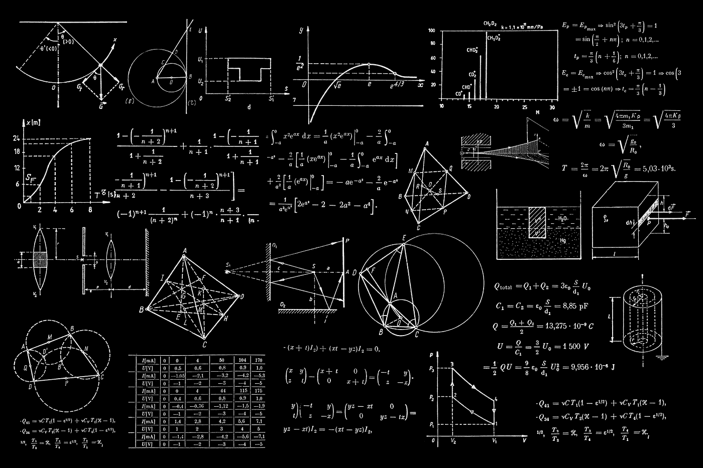

# 赢得下一次数据科学面试

> 原文：<https://towardsdatascience.com/ace-your-next-data-science-interview-2de74e26a96f>

## 所有真实的东西都有非常详细的问题

在这篇文章中，我将谈谈数据科学面试过程以及根据我的经验提出的问题。许多人害怕面试，但是，请注意，这是一个候选人的市场，如果你知道期待什么和如何准备，这个过程会很有趣。重要的是要记住，根据不同的公司，流程会有所不同。即使在同一家公司，不同的面试官可能会有不同的方法。不是所有的受访者都会被问到同样的问题。但总的来说，在你申请的大多数数据科学工作中，你应该会看到一些相似之处。

Avel Chuklanov 在 [Unsplash](https://unsplash.com/photos/DUmFLtMeAbQ) 上拍摄的照片

# 1.人力资源招聘人员的电话屏幕

这次介绍性面试的目的是更好地了解你的情况和一些你的学习和工作经验。在这一点上没有什么技术。这种对话相当简短，通常持续 15-30 分钟左右。

得到💬任何数据科学或编程问题的 GPT 式答案。为成千上万的人生成摘要和学习笔记📚只需一次点击即可获得学习资源。👉

  

# 2.经理和人力资源部的面试

以我的经验来看，这一轮不是太讲究技术性，除非管理者有很重的量化/技术背景。他们将重点了解你的目标和期望，你申请这份工作的原因，以及你如何适应这个职位、团队和公司文化。偶尔，他们会问一些问题，对你的相关技能进行全面评估。我被问到的一些问题包括:

## -你对公司了解多少？

这是一个古老的问题，但它确实不止一次发生在我身上。对你想为之工作的公司一无所知并不符合你的最佳利益。此外，了解这家公司及其代表的价值观也很有用。招聘人员会对你对公司使命的热情感到兴奋。对我来说，我将为之工作的公司遵循我欣赏的某些价值观也很重要。至少理论上是这样。

## -你为什么申请？你对这个角色的期望是什么？

对于这类问题，想想你想如何为团队做贡献，这份工作对你的学习和职业道路有什么好处。要有说服力，你要对自己的职业想追求什么有一个清晰的想法。即使你不知道，也要假装知道！

一个有用的建议是想想公司的痛苦——他们雇佣你的原因。他们不会无缘无故地雇佣你，而是为了一个尚未被满足的目的和需求。这又需要提前做研究，做出有根据的猜测。这样，你会显得更合适，因为你知道他们需要什么，你能做什么！

## -从职能方面解释你以前的相关经验。

简易柠檬榨汁机。预计他们会问一些关于你过去参与的项目的问题。总的来说，重点将放在功能方面。你不应该在这里谈技术。他们会感到厌烦。

## -你如何与同事合作。

团队合作对任何项目都至关重要。很有可能你会和来自不同背景、文化、信仰的同事一起工作。想一想你在工作中面临困境的时候，无论是挑战最后期限还是工作中的冲突，以及你如何解决它。

[女同胞](https://unsplash.com/@cowomen)在 [Unsplash 上的照片。](https://unsplash.com/photos/QziaoZM0M44)

# 3.采访高级/首席数据科学家

这个面试是一个技术、数学和概念的面试。我觉得这个没有固定的一套问题。对话的发展取决于你如何解释和回答事情，以及面试官对某个话题的经验/知识。

## -从功能和技术上描述你参与的 DS 项目(他们会在你的简历中选择一个)

在一次面试中，我被要求解释我在简历中提到的图像识别项目。

*   *数据量*
*   *由于您的数据很小，可以使用什么技术来增加数据量？*
*   *任何潜在的数据质量问题。他们想知道你是否做了适当的探索性数据分析*
*   *深入了解卷积神经网络背后的数学原理*😐

在另一次面试中，面试官一头扎进了时间序列预测模型，这也是我简历中的一个项目。人们问了很多问题，你可能会想到如下一些问题:

*   *我使用了哪些指标来衡量模型性能(MAE、RMSE、AICc 等…)。为什么我选择了一个指标而不是其他指标？*
*   *我是如何进行交叉验证的。因此，解释交叉验证背后的想法*
*   *解释选择的特征选择技术*
*   我使用的一个模型是随机森林回归器。列出随机森林的 3 个超参数以及如何进行超参数调整(例如 Gridsearch Sklearn 或任何其他框架)
*   我试验的另一个模特是 ARIMA。一位采访者说，这个模型基本上是自回归的。考虑上下文，你认为这是你的模型表现不好的原因吗？

丹·克里斯蒂安·pădureț在 [Unsplash](https://unsplash.com/photos/h3kuhYUCE9A) 上拍摄的照片

## -数据科学中的伦理问题

面试官解释了一个真实的商业情况，并问公司处理这种情况的方式是否合乎道德。你在这里一定是明智的。你想对自己诚实，但你也不想冒犯你的潜在雇主。它需要理解上下文和数据科学中的一些道德和公平概念。尽量多听，多分析情况，不确定的时候多提问。

但是如果你似乎不能提供一个答案，不要担心。我可以救你。一个完美的答案可能是:道德问题和不道德问题之间的界限有时非常模糊，没有进一步的背景，很难做出决定😉

## -我有数据，但没有商业案例。我能怎么做呢？

在真实的场景中，很多时候涉众会带着数据来找你，让你提出一些对他们有利的项目想法/倡议。因为他们来自企业，你不能指望他们总是知道他们可以对数据应用什么样的技术。您始终可以做的一件事是首先探索数据，将其可视化，并创建一个仪表板来提供见解。将它与利益相关者相关的主题联系起来。在我看来，这是我们作为数据科学家需要具备的技能。如果我们每天都与数据打交道，我们就有望提出关于我们可以用数据做什么的令人信服的商业案例想法。

# 4.编码任务

一旦你通过了技术面试，下一步可能是编码任务。你在有限的时间内进行编码练习。结果和代码将由负责人审查，他们将决定是否要与您继续合作。

不同公司的编码分配可能不同。**从字面上看，这可能是一个编码练习**，在这个练习中，你被要求解决一个现实世界的业务请求*，即连接不同的数据集并报告不同客户的数量*。**也可能是在做一个商业案例。给你一个数据集和一个要解决的业务问题。** 对我来说，一直是后者。有了这个任务，招聘公司不仅想测试你的建模和编程技能，还想测试你在面对这样的问题时的整体方法。

这个练习的好处是它通常是一个带回家的作业。把自己锁在一个房间里，然后开始工作。你有你需要的所有资源，书，互联网。Google 和 Stack Overflow 都在。

我认为公司允许你在家里这样做的原因是，实际上，在我们的日常工作中，我们也谷歌。完全可以参考 StackOverflow 或其他资源并消化这些代码解决方案。这是一个正常的学习过程。只要你会谷歌(没错！)，愿意学习，并且能够把点点滴滴联系起来，他们就满足了。同样，公司也不太担心你是否请其他人帮忙做这项练习。反正你讨论，得到同事的帮助。并且他们可以在代码审查/演示会议期间随时提问，以检查您对自己代码的理解以及您是如何处理问题的。

因为他们希望对您的方法有一个总体的了解，所以请确保您理解业务问题、数据，并且您使用的方法适合您想要解决的问题。我的一个朋友曾经告诉我，他有一次可怕的面试经历。采访者完全否定了他的方法。可怜的家伙。您将被要求发送您的笔记本(可能通过 GoogleColab 或任何类似的平台)和 ppt 演示文稿。如果可能，制作一个吸引人的幻灯片😊它有助于讲述一个故事，人们喜欢它。相信我，你可能在工作中经常这样做。

# 5.结果展示

厉害！你被选中展示你的成果。我们快到了。这样做的目的是探索你的方法的更多细节，所提供的解决方案是否合适，招聘公司是否想测试你与商业利益相关者交谈的能力。

你将有一些时间来展示你的作品，问题将会接踵而至。确保你理解你写在笔记本和幻灯片上的每一件小事。您应该会收到一些关于您的方法(即分类或回归)、您的特征工程和选择、您选择的模型、模型评估和任何潜在缺陷的问题。

通常，你向一组科学家和商业同事展示这个， ***所以说后者的语言，并确保你的故事与他们相关*** 。如果数据科学家面试官认为有必要，他们可以从技术角度出发。在一次采访中，我认为我在演讲中过多地解释了精确性和回忆(🙈)你也可以试着提前和朋友一起练习以获得反馈。

# **关于我如何学习和准备面试的建议**

*   查看招聘信息，将你的相关经历与职位描述联系起来。如果可能的话，为工作描述中的每项任务准备一个你曾经参与过的类似项目。有了这个，你就有充分的准备了。
*   了解所需的技术技能。他们通常在那里，因为他们将需要执行这项工作。自己学习准备。
*   回顾你的简历——确保你非常详细地理解了简历中的所有内容。他们会被问到的！
*   复习数学和概念面试题。我听到很多人说数据科学工作不需要数学或统计学。这是错误的，你确实需要它们。我被问了各种各样的问题，关于卷积神经网络、LSTM 的缩放输入特征以及算法背后的数学。老实说，你在不理解背后的直觉的情况下使用某样东西会感到舒服吗？
*   尽你所能对将要面试你的人做更多的调查。了解他们做什么并找到共同点会让你在猜测他们可能会问什么样的问题时有优势。
*   记住，你可以控制谈话向你想要的方向发展。
*   在任何面试中，你都应该表现出正确的举止。假设有两个候选人:一个拥有所有合适的技术技能，但反社会，另一个在技术上不如第一个强，但他/她很有魅力，自信，并表现出学习的态度。我认为第二个很有可能会被选中。经理也在寻找一个团队可以每天一起工作 8 小时的人。
*   什么让你与众不同:问关键问题。是的，对他们在面试中告诉你的每件事都持批评态度。我正在挑战他们告诉我的一个数据科学项目，经理很喜欢。你知道为什么吗？因为这也是他们对你日常工作的期望。
*   材料和平台:

代码练习:[leetcode.com](http://leetcode.com)，[learnpython.org](https://www.learnpython.org/)

数学和机器学习概念:[https://www . Amazon . com/Hands-Machine-Learning-Scikit-Learn-tensor flow/DP/1492032646](https://www.amazon.com/Hands-Machine-Learning-Scikit-Learn-TensorFlow/dp/1492032646)

时间序列预测:应用预测原理与实践:[https://otexts.com/fpp3/](https://otexts.com/fpp3/)

统计:[https://www . Amazon . com/Elementary-Statistics-12 th-Mario-Triola/DP/0321836960](https://www.amazon.com/Elementary-Statistics-12th-Mario-Triola/dp/0321836960)

就是这样！我的实际面试经验，我希望它们能帮助你做好准备，让你在下一次数据科学面试中取得成功。

*感谢您的阅读。如果你觉得我的帖子有用，并且你正在考虑成为一名中级会员，你可以考虑通过* [*推荐会员链接*](https://medium.com/@huonglanchu0712/membership) ☺️ *来支持我，我会收取你一部分会员费，不需要你额外付费。如果你决定这样做，非常感谢你的支持。*