# 使用变形金刚实现最先进的攻击性推文预测

> 原文：<https://towardsdatascience.com/achieving-state-of-the-art-for-offensive-tweet-prediction-using-transformers-8245e571c769>

## 利用蒸馏和微调进行文本分类

克劳迪奥·施瓦茨在 [Unsplash](https://unsplash.com?utm_source=medium&utm_medium=referral) 上拍摄的照片

虽然人们很容易理所当然地认为像拥抱脸这样的工具可以很容易地应用复杂的模型，并将学习转移到我们喜欢的任何问题上，但我认为展示这些工具可以在一个下午内实际实现最先进的(SOTA)结果是有益的。否则，努力又有什么意义呢？

我们的任务是预测一条推文是否无害。为此，我们将使用论文[*TweetEval:Tweet 分类的统一基准和比较评估*](https://paperswithcode.com/paper/tweeteval-unified-benchmark-and-comparative) 中的 Tweet eval 数据集。我们将只使用这个数据集的子集`offensive`，但是你可以查看其他子集，这些子集标记了诸如情绪和对气候变化的立场。我们正在执行一种文本分类，并将使用一个更小、更快的版本的 BERT transformer 模型，名为 [DistilBERT](https://arxiv.org/abs/1910.01108) 。

# 资料组

TweetEval 数据集的`offensive`配置在 Hugging Face 中有一个模型卡，它被描述为包含:

*   `text`:包含推文的`string`功能。
*   `label`:一个`int`分类标签，映射如下:`0`:非攻击性，`1`:攻击性

## 拥抱人脸数据集

让我们用`load_dataset()`函数加载适当的数据集:

`offensive`对象类似于 Python 字典，其键是数据集分割(训练、验证和测试)。

使用传统的 Python 字典语法允许我们访问这些单独的数据集。这些数据集将作为一个`Dataset`类返回，这是拥抱脸数据集中的一个关键结构。把一个`Dataset`看作一个特殊类型的数组，意味着我们可以索引它并得到它的长度。

这里需要理解的关键是，数据集中的单个项目(将此视为训练的一行)是一个字典，由关键字`text`和`label`组成，这些关键字中的值是推文本身，以及攻击性状态。

## 从数据集到数据框架

虽然用 Python 管理字典是可行的，但使用 Pandas DataFrames 更容易，特别是因为大多数数据科学家都非常熟悉它。拥抱脸允许我们在标准的`Datasets`物体和熊猫`DataFrame`之间转换。我们可以使用`set_format()`来做到这一点:

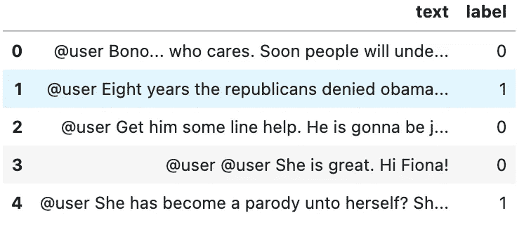

图片作者。

万一我们忘记 0 或 1 是攻击性标签，我们可以在标签整数和名称之间转换。为此，我们访问数据集的特征，然后使用索引访问标签，最后使用`int2str`函数:

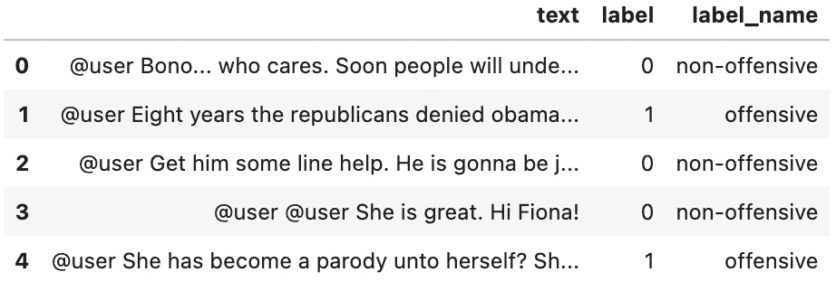

图片作者。

## 不平衡数据集-类的频率

有许多不同的策略来处理不平衡的数据，其中一些标签比其他标签出现得更频繁。通过简单的直方图，很容易看出我们的数据集是不平衡的:

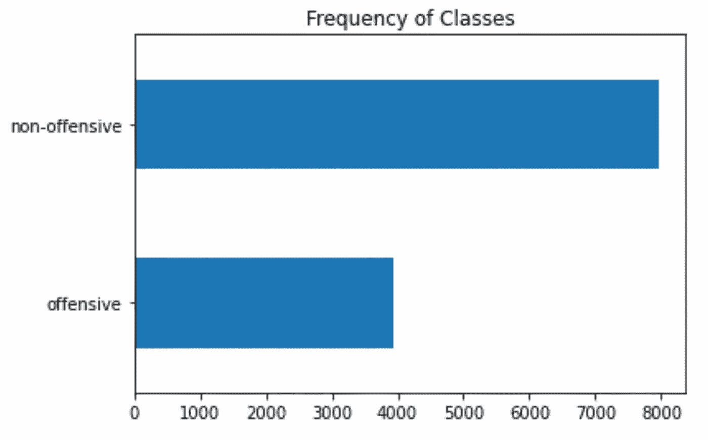

我们的两个类在数据集中的出现频率(图片由作者提供)。

虽然我不一定要在这里深入探讨我们如何解决这个问题，但我要指出的是，这一点很重要。这里有一个[处理分类问题中不平衡数据的好资源](https://neptune.ai/blog/how-to-deal-with-imbalanced-classification-and-regression-data)。

## 推文长度和最大模型上下文

不同的模型采用不同数量的上下文，其中上下文是用作输入序列的标记的数量。最大输入序列长度称为最大上下文大小。虽然上下文取决于标记的长度和我们如何标记，但我们可以通过检查每条推文的字数来估计我们的大多数输入(即推文)是否会超过最大上下文大小:

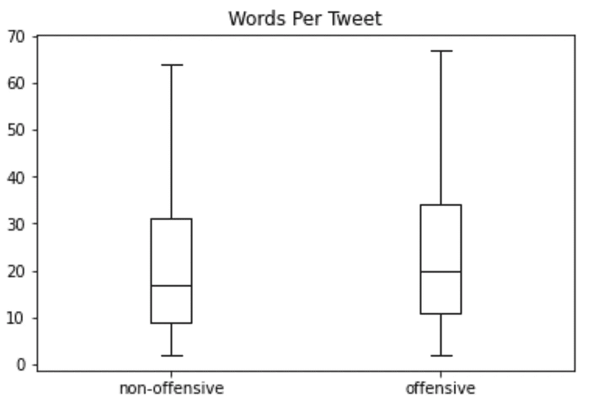

我们将使用 DistilBERT 模型，它的最大上下文大小为 512 个令牌。每条推文的上限是 70 个词，这意味着我们应该没问题。

# 符号化

当我们使用一个拥抱脸模型，特别是一个预训练的模型时，我们需要确保我们使用的是模型训练时使用的同一个标记器。如果您不确定这是为什么，可以考虑在加密每个令牌时使用不同的令牌化器。因此，以前表示“球”的标记现在有了不同的标记，这给模型增加了解密这个附加层的额外工作。

DistilBERT(我们将要使用的模型)使用了`WordPiece`标记器。我们不需要做任何花哨的事情来实例化它— `AutoTokenizer`是一个 HF 类，它使用`from_pretrained()`方法为我们提供了一个预训练模型的相关标记器:

因为我们想要标记整个数据集(包括它的子集)，所以我们使用内置的`map()`函数，它对数据集中的每一行应用一个处理函数。我们使用`padding=True`,所以示例都是批中最长项目的长度，其余的用 0 填充。`truncation=True`简单地确保每个示例小于最大上下文大小。

还要注意，除了返回编码后的 tweets 作为`input_ids`之外，tokeniser 还返回一个`attention_mask`数组列表。这是因为我们不希望模型被额外的填充标记弄糊涂:注意掩码允许模型忽略输入的填充部分。

我们最后使用`map`在所有数据集上应用记号化。`batched=True`意味着我们通过分批编码来加速这个过程，而`batch_size=None`意味着我们的分批将只是实际的数据集(例如，训练、验证)。这确保了输入具有相同的长度(即张量和注意力屏蔽)。

请注意，该映射向数据集中添加了新的列。

# 微调变压器

不幸的是，DistilBERT 只在预测序列中的屏蔽词方面受过训练。虽然大多数模型(身体*对英语有深刻的理解，但最后几层(头部*和头部*)经过专门训练，可以预测这些被屏蔽的单词。这和我们的任务不一样。我们只想输出一个序列属于某一类的概率。因为只有两个类，所以我们只输出两个概率。*

这意味着我们必须在最后一层训练隐藏状态，要求模型头是可微分的。与我们通常用 Pytorch 编写自己的训练循环不同，我们将遵循 fastai 方法，并使用 HF Transformers API 进行训练循环。

## 加载预训练的蒸馏模型

为了能够训练模型的最后几层，我们首先需要具有预训练权重的实际模型。拥抱脸通常会让我们使用方法`.from_pretrained()`抓取任何带有`AutoModel`类的模型。因为我们需要一个分类头，我们使用`AutoModelForSequenceClassification`,它只是在预训练权重的基础上，为分类选取合适的架构。唯一需要说明的是要预测的类的数量(在我们的例子中是两个):

## 定义绩效指标

训练器 API 需要的一个不太直观的东西是一个`compute_metrics()`函数，它接受一个`EvalPrediction` 对象(一个由`predictions`和`label_ids`属性组成的命名元组)并返回一个度量:值对的字典。由于我们正在进行二元分类，我们将使用准确度和 F1 分数作为我们的衡量标准:

## 训练跑步

如果我们想上传我们的模型运行并保存我们的性能，我们需要登录到 HF Hub。这将允许我们与其他用户共享我们的模型。你需要一个`write` API 访问令牌，你可以在[文档](https://huggingface.co/docs/hub/security)中读到。

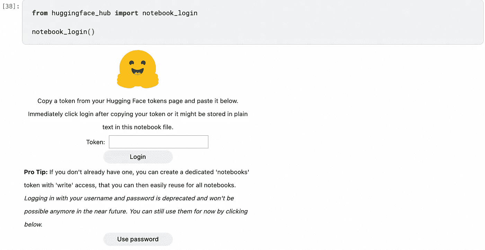

图片作者。

训练器 API 还需要训练参数(包括我们的超参数)。我们使用来自高频变压器的`TrainingArguments`类来做到这一点。重要的是，我们在`output_dir`中指定了所有训练结果的存储位置。

在这里，我们还设置了批量大小、学习速率、时期数和其他重要参数。最后，我们使用训练器 API 实例化模型，并调用`.train()`进行微调。

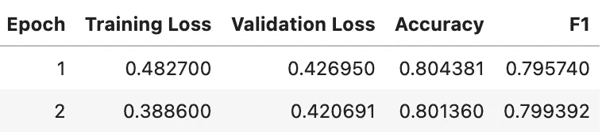

图片作者。

我们可以再坚持训练几个纪元，看能不能挤出更多的汁液。为了检查这个结果是否合适，我们可以在 scikit-learn 中实现一个虚拟分类器，它只预测最常见的类，并看看它能获得什么样的精度。在这里，预测每条推文无害的准确率为 65%。要使用它，你需要定义`X_train, y_train`等等。

所以我们的模型肯定比基线要好。然而，为了更好地了解我们的性能，我们应该与该数据集上的可用基线进行比较。

请注意，我们可以通过在验证数据集上使用训练器的`predict`方法，然后调用该对象的`metrics`特性来获得一个指标字典:

# 结果比较

将模型上传到 HF Hub 的一个好处是，它们会在一个名为 [Papers 的网站上自动评分，代码为](https://paperswithcode.com/)。这些人将论文、数据集和社区模型汇集在一起，记录整个 ML 中数千个不同任务的所有评估指标。

我们要做的第一件事是在我们的浏览器中登录到拥抱脸，然后单击特定的模型(它将在您命名的任何名称下)。

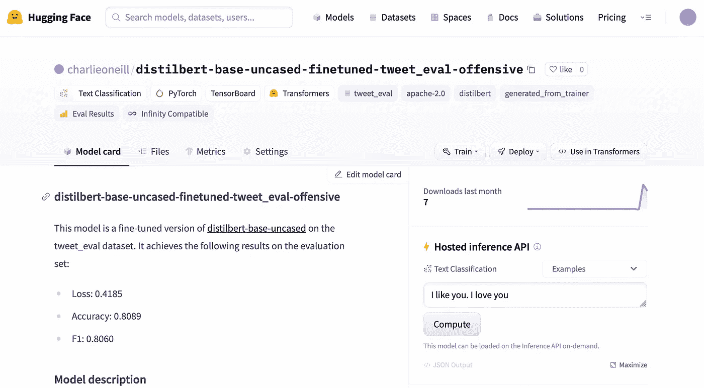

图片作者。

这个页面列出了模型的性能，还提供了一个推理 API，这样您就可以自己尝试这个模型了。此外，它还会记录一段时间内的超参数和训练表现:

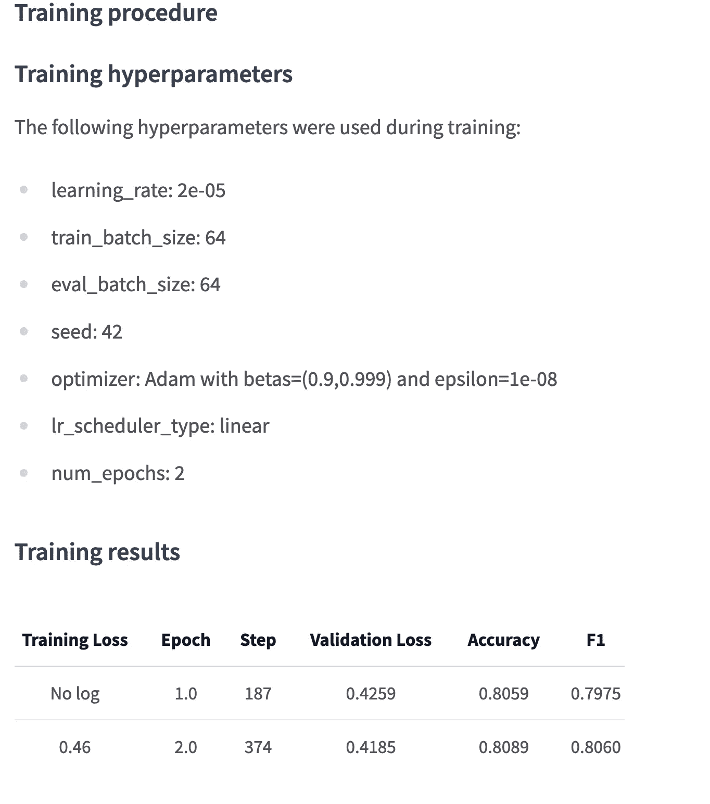

图片作者。

如果我们向下到右下角，我们可以转到带代码的论文，以查看该数据集和该任务的排行榜。

图片作者。

令人印象深刻的是，我们在微调预训练模型方面做得相当好。在这个特定的数据集上，我们现在是世界第一，无论是准确性还是 F1 分数。

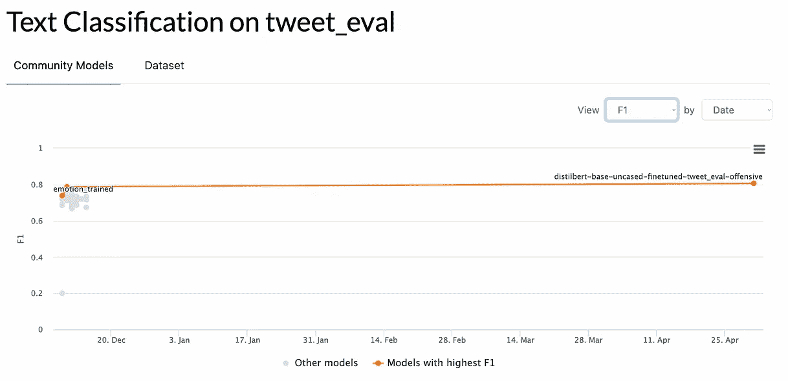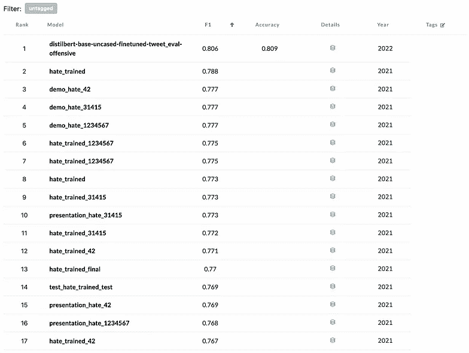

F1 得分与之前的基线相比。注意，我们在这个数据集上实现了 SOTA(图片由作者提供)。

我们甚至在[的论文中得到认可，将数据集](https://paperswithcode.com/dataset/tweeteval)的代码页作为最先进的基准:

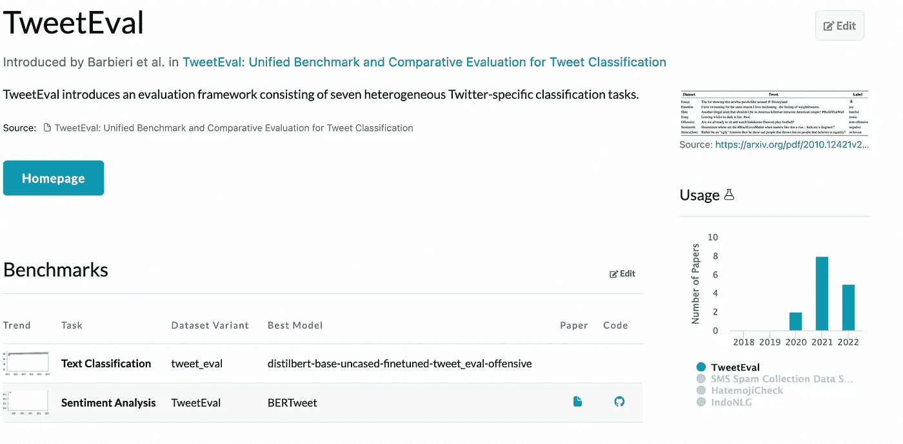

我们的模型***distil Bert-base-un cased-fine tuned-tweet _ eval-offensive***现在以 Code 网站作为这个数据集的基准(图片由作者提供)列在论文上。

# 结论

这次排练真实地展示了杰瑞米·霍华德常说的一句话:不需要数学博士或昂贵的图形处理器就能在一个下午内完成一项任务。像拥抱脸和 fastai 这样的工具可以让我们快速训练模型，并在模型上迭代。使用越来越容易获得的预训练模型的迁移学习更多地利用了这些工具。

如果你对快速探索变形金刚拥抱脸的能力感兴趣，看看我在这里做的这个演示。

## 参考

[1] L. Tunstall、L. Werra 和 T. Wolf，[用转换器进行自然语言处理](https://learning.oreilly.com/library/view/natural-language-processing/9781098103231/copyright-page01.html) s (2022)，奥赖利媒体

[2] [维克多·桑](https://arxiv.org/search/cs?searchtype=author&query=Sanh%2C+V)、[弗拉达利出道](https://arxiv.org/search/cs?searchtype=author&query=Debut%2C+L)、[朱利安·肖蒙德](https://arxiv.org/search/cs?searchtype=author&query=Chaumond%2C+J)、[托马斯·沃尔夫](https://arxiv.org/search/cs?searchtype=author&query=Wolf%2C+T)、*蒸馏版伯特:更小更快更便宜更轻* (2019)、arxiv

[3] F .巴比耶里，j .卡马乔-科拉多斯，L .内维斯，路易斯·埃斯皮诺萨-安克，*Tweet eval:Tweet 分类的统一基准和比较评估* (2020)，arxiv

[4] J. Howard 和 S. Ruder，[面向文本分类的通用语言模型微调](https://arxiv.org/pdf/1801.06146.pdf) (2018)，arxiv

[5] [拥抱脸部数据集文档](https://huggingface.co/docs/datasets/index) (2022)