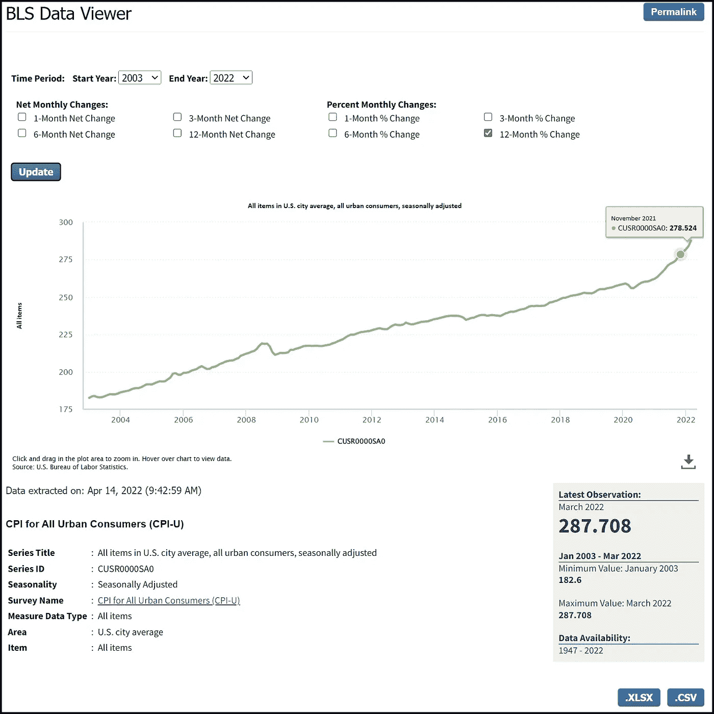
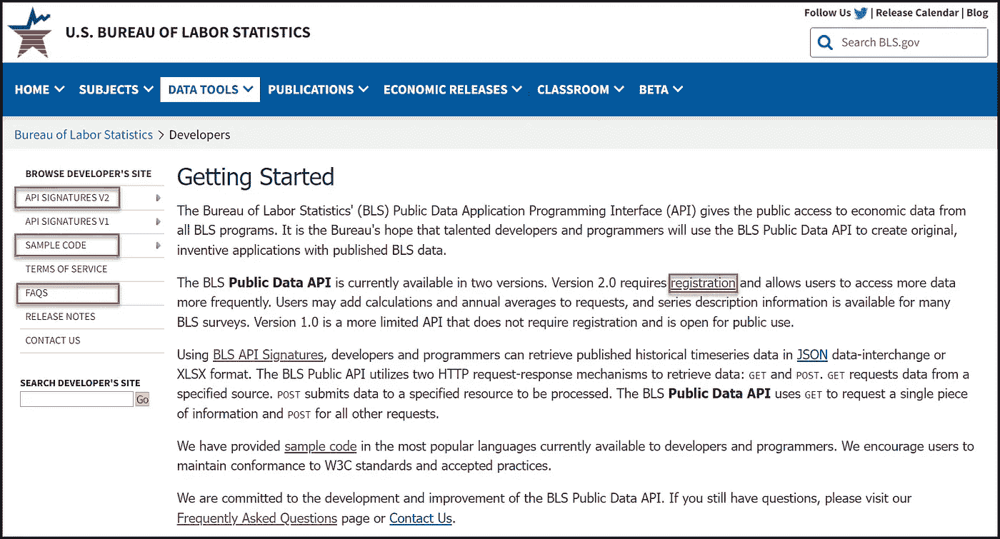
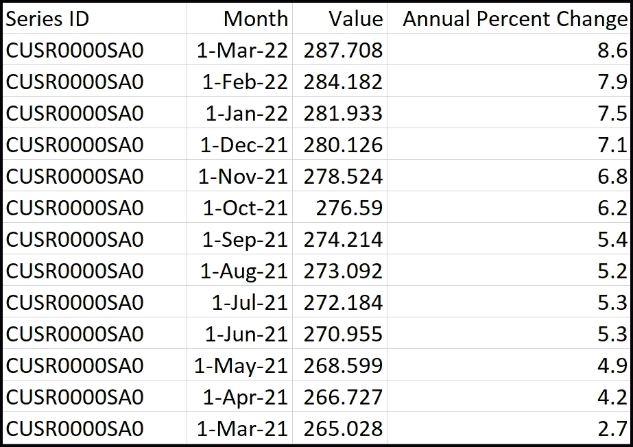
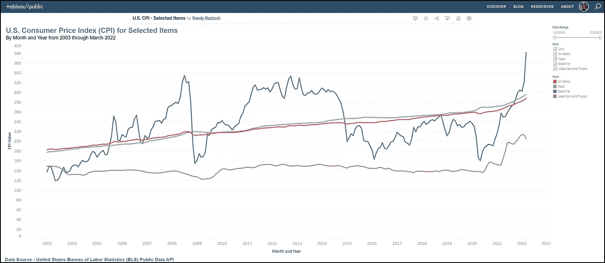

# 使用 BLS API、Python 和 Tableau 获取并可视化美国通货膨胀数据

> 原文：<https://towardsdatascience.com/acquire-and-visualize-us-inflation-data-with-the-bls-api-python-and-tableau-409a2dca1537>

## 经济学、通货膨胀、数据工程和数据分析

## 美国劳工统计局(BLS)收集和分析劳动经济学领域的数据。本文将向您展示如何使用 Python 和 BLS 公共数据 API 挖掘 BLS 数据。

通货膨胀削弱了货币的购买力。在 [Unsplash](https://unsplash.com/s/photos/cashier?utm_source=unsplash&utm_medium=referral&utm_content=creditCopyText) 上由 [Towfiqu barbhuiya](https://unsplash.com/@towfiqu999999?utm_source=unsplash&utm_medium=referral&utm_content=creditCopyText) 拍摄的照片。

> “在没有金本位的情况下，没有办法保护储蓄不被通胀没收。没有安全的价值储存。”——艾伦·格林斯潘，美国美联储第 13 任主席

世界卫生组织(世卫组织)于 2020 年 3 月 11 日宣布新冠肺炎感染危机为全球疫情。到 2022 年 4 月，COVID 已经感染了超过 5 亿人，并导致 610 万人死亡。此外，与流行病相关的问题导致食品和燃料等消费品价格上涨。比如，在截至 2022 年 3 月的一年中，美国标准化“市场篮子”中所有商品的价格都上涨了 8.6%，这是四十年来最大的年度涨幅。

劳工统计局(BLS)是美国劳工部的一个单位。它是美国政府在劳工经济和统计领域的主要事实调查机构。它将收集和分析的大部分数据(如通胀数据)提供给美国公众、美国国会、其他联邦机构、州和地方政府、企业和劳工代表。

BLS 在其网站上以图表、图形、表格、Excel 文件、CSV 文件等形式提供了大量数据。但它也管理 BLS 公共数据 API，该 API 允许任何具有基本编程技能的人通过各种编程语言查询和获取数据。本教程将向您展示如何编写一个 Python 程序，使用 API 来获取几个与通货膨胀相关的数据序列。

# BLS 数据概述

BLS 捕获、存储、分析并提供各种类型的数据。以下是它的一些数据主题:

*   通货膨胀和价格
*   薪酬和福利
*   支出和时间使用
*   失业
*   雇用
*   工作场所查询
*   职业要求
*   生产力
*   国际技术合作
*   国际进出口价格指数
*   地理信息

例如，让我们看看消费者价格指数(CPI)数据。CPI 是家庭购买的一揽子消费品和服务的加权平均值。人们和实体使用 CPI 及其组成部分来跟踪一段时间内的价格变化。

下面的 BLS 数据浏览器截图显示了从 2003 年到 2022 年 3 月的 CPI 数据。请注意，数据可以下载到 XLSX (Excel)和逗号分隔值(CSV)文件。BLS 管理的大部分数据在这样的视图中对公众开放。

2003 年至 2022 年 3 月美国城市平均所有项目的消费者价格指数。Randy Runtsch 截图。

# BLS 公共数据应用编程接口简介

BLS 的[公共数据应用编程接口](https://www.bls.gov/developers/home.htm) (API)提供了对来自所有 BLS 程序的经济数据的公共访问。有了这个 API，程序员和数据工程师可以检索 JSON 或 XLSX (Excel 格式)的历史时间序列数据。

美国劳工统计局开发者主页。Randy Runtsch 截图。

BLS 公共数据 API 有两个版本:版本 1.0 和版本 2.0。虽然 1.0 版不要求用户注册，但它限制了用户可以做的事情。例如，它将每天的查询次数限制为 25 次，并且不返回值的百分比变化。相比之下，2.0 版本的用户每天最多可以进行 500 次查询，并在检索的数据集中包含随时间变化的百分比。

要对 BLS 公共数据 API 有一个基本的了解，请阅读以下页面:

*   [API 签名 V2](https://www.bls.gov/developers/api_signature_v2.htm)
*   [Python 的示例代码](https://www.bls.gov/developers/api_python.htm)
*   [常见问题解答](https://www.bls.gov/developers/api_faqs.htm)

# 运行程序以调用 BLS 公共数据 API 的先决条件

要运行下一节中显示的代码，您需要以下内容:

1.  BLS API 注册密钥。你可以在这里免费申请一个。
2.  你电脑上最新版本的 Python。本教程我用的是 Python 3.10，[这里有](https://www.python.org/downloads/)。
3.  代码编辑器或集成开发环境(IDE)。我使用免费的微软 Visual Studio Community 2022 for Windows。你可以在这里[下载](https://visualstudio.microsoft.com/vs/community/)。如果您选择使用它，一定要安装它的 Python 应用程序项目工具。如果需要，可以稍后通过 Visual Studio 的内置安装程序添加特定于语言的工具。

在我编写并测试了通过 BLS 公共数据 API 检索 CPI 数据的程序之后，我使用 Tableau Public 构建了一个简单的仪表板来可视化数据。如果你想尝试 Tableau Public，它是免费的，在这里可以找到[。请注意，您发布到 Tableau 公共服务器网站的任何内容，世界上的任何人都可以使用。](https://public.tableau.com/en-us/s/resources)

# 示例 Python 程序

本教程将向您展示如何使用 BLS 公共 API 2.0 版来检索从 2003 年到 2022 年 3 月的四个时间序列的 CPI 数据。在检索到 JSON 格式的数据后，程序将转换一些数据，并将数据记录写入一个简单的逗号分隔值(CSV)文件。

虽然可以修改程序来检索和保存 JSON 或 XLSX 格式的数据，但我选择 CSV 作为本教程的参考，原因如下:1) CSV 文件很简单，不需要特殊的电子表格软件来读取它们，2) CSV 文件可以很容易地导入 Tableau 和其他数据可视化工具。

## BLS 数据系列 ID 值

对 BLS 公共数据 API 的每个调用都必须包含一个或多个数据序列 ID。id 指定了要检索的数据的具体类型。

在这个演示中，我选择通过 BLS 公共数据 API 检索这些 CPI 数据序列(ID 后跟标题):

*   **CUSR0000SA0** —美国城市平均值中的所有项目，所有城市消费者，经季节性调整
*   **CUSR0000SETB01** —美国城市平均汽油(所有类型)，所有城市消费者，季节性调整
*   **CUSR0000SAF1** —美国城市平均食品，所有城市消费者，季节性调整
*   **CUSR0000SETA02** —美国城市平均二手车和卡车，所有城市消费者，季节性调整

您可以在 BLS 网站的多个位置找到数据系列 id。[热门精选](https://data.bls.gov/cgi-bin/surveymost?bls)页面列出了热门剧集。在 BLS 数据查看器中也可以找到它们，如下图所示。

注意 BLS 数据查看器中的数据“系列标题”和“系列 ID”值。使用 BLS 公共数据 API 请求数据时需要“系列 ID”值。作者截图。

## Python 代码

下面是调用 BLS 公共数据 API 来检索上述四个与通货膨胀相关的数据系列的 Python 代码。该程序由以下代码模块组成:

*   **c_bls_data.py** —该文件包含 c_bls_data 类，该类使用指定的参数调用 API，将返回的 JSON 数据结构转换为 CSV 记录，并将每个记录写入 CSV 文件。
*   **run_get_bls_data.py** —该文件是程序的入口点。它用指定要检索的数据的参数调用 c_bls_data 类。

下一节包括描述代码如何工作的伪代码。

## 程序伪代码

文件 cls_bls_data.py 中的 Python 类 c_bls_data 执行程序的工作。程序入口点在文件 run_get_bls_data.py 中，它只是创建一个 c_bls_data 的实例，并向它发送几个参数。这段伪代码描述了程序的工作原理:

1.  使用以下参数创建 c_bls_data 的实例:API 注册键、输出文件夹和文件名、要检索数据的数据系列 id 列表、数据系列的起始年份以及数据系列的结束年份。
2.  在 c_bls_data 的构造函数中，设置一些变量，构建调用 API 所需的参数。调用 get_data()函数来检索数据。
3.  get_data()函数将 API 请求发送到 BLS 服务器。然后，它将生成的 JSON 数据集返回给构造函数。
4.  函数的作用是:打开一个输出 csv 文件。接下来，它写入一个头并设置 CSV 数据写入器。然后，它遍历 JSON 结构中的数据，将感兴趣的数据放入变量中。它连接期间名称(月)、“1”和年份，以“2022 年 1 月 1 日”的格式创建一个月值最后，它用所需的字段写入 CSV 记录。

若要在 Visual Studio 中运行代码，请按照下列步骤操作:

1.  创建文件夹，程序将在其中写入其输出 CSV 文件。示例程序使用较旧的“c:/bls_data”
2.  创建 Python 程序项目。
3.  保存上面代码窗口中命名的两个文件。
4.  将 run_get_bls_data.py 设置为启动文件。
5.  运行程序。

如果一切顺利，程序将创建一个包含所需记录的 CSV 文件。下面的屏幕截图显示了文件中的一些示例数据。

Python c_bls_data 类编写的 CSV 文件中的示例数据。作者截图。

# 示例 Tableau 仪表板

我使用 Tableau Public 创建了一个简单的[数据可视化仪表板来显示一段时间内的 CPI 数据](https://public.tableau.com/app/profile/randall.runtsch/viz/U_S_CPI-SelectedItems/CPI-SelectedItems)。虽然创建仪表板的说明超出了本文的范围，但是您可以随意下载仪表板并将其加载到 Tableau Desktop(公共或商业版本)中，看看它是如何组装的，并根据您自己的需要进行更改。

通货膨胀仪表板在 Tableau 公共。由 Randy Runtsch 创建的仪表板。

如果你想学习 Tableau，请看这里的[21 个操作视频](https://public.tableau.com/en-us/s/resources)开始学习 Tableau Public。

# 摘要

BLS 公共数据 API 使得程序员和数据工程师可以用 Python 和其他语言轻松获取美国经济数据。本文演示了一个 Python 程序，该程序调用 API 来检索四个与通货膨胀相关的数据系列，并将数据写入一个 CSV 文件。最后，它在一个 Tableau 公共仪表板中显示数据。

请随意使用和修改 c_bls_data 类，并根据您的需要进行调整。像这里显示的数据一样，通货膨胀数据是广大公众感兴趣的。但是您可以使用 BLS 公共数据 API 来访问和分析您、您的团队或您的公司感兴趣的其他数据。