# 神经网络中的激活功能:你可能不知道的

> 原文：<https://towardsdatascience.com/activation-functions-in-neural-networks-what-you-may-not-know-2d99ad093246>

## 如何识别最佳(和最差)激活函数

照片由 [JJ 英](https://unsplash.com/es/@jjying?utm_source=unsplash&utm_medium=referral&utm_content=creditCopyText)在 [Unsplash](https://unsplash.com/s/photos/neural-network?utm_source=unsplash&utm_medium=referral&utm_content=creditCopyText) 上拍摄

当我第一次开始学习 ML 时，我被告知激活是用来模仿大脑中的“神经元激活”，因此得名神经网络。直到很久以后，我才了解到这个积木的更精细的复杂性。

在这篇文章中，我将解释深层神经网络中激活函数背后的两个关键概念和直觉:

*   为什么我们需要它们，
*   为什么我们不能选择任何非线性函数作为激活函数。

> 本文中的所有数字和结果都是作者创作的:等式是使用 [TeXstudio](https://www.texstudio.org/) 编写的；使用 [Keras](https://keras.io/) 创建模型，使用 [Netron](https://github.com/lutzroeder/netron) 可视化；使用 [matplotlib](https://matplotlib.org/) 绘制图形。

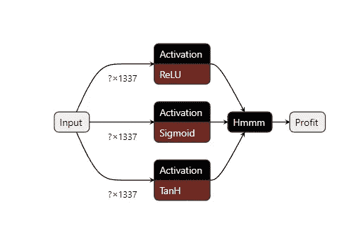

Keras 支持的一些激活

# 为什么我们需要激活函数？

*术语*:激活是一个非线性函数。简单地说，它是不属于形式`y = mx + b`的任何函数。

在神经网络中，这些函数通常放在每个卷积或全连接(又称密集)层的输出之后。他们的主要工作是“激活神经元”，即**捕捉模型的非线性**。

但是什么是非线性，为什么它很重要？

考虑以下具有两个密集图层的简单网络(如果您使用过 MNIST 数据集，可能会觉得很熟悉):

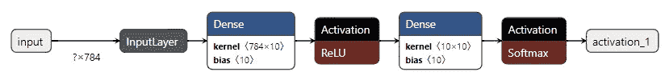

简单的双层网络

设输入为`x`，第一层的权重和偏差为`W_1, b_1`，第二层的权重和偏差为`W_2, b_2`。用激活功能`σ_1, σ_2`，第一层的输出是:

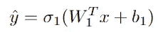

整个模型的输出是:

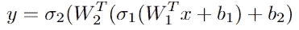

但是如果我们不使用任何激活功能呢？如果没有`σ_1`和`σ_2`，新的输出将是:

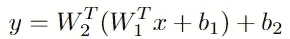

注意，这个等式可以简化为:

这相当于具有一个密集层的浅网络。简单来说，第二层根本没有添加任何有用的信息。我们的模型现在相当于:

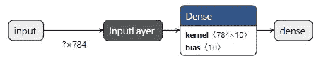

浅层单层网络

我们可以将这种分析推广到任意层数，结果仍然成立。(微积分类似的结果:线性函数合成还是线性函数。)

> 因此，为了让深层网络有意义，我们必须对每个隐藏的输出进行激活。

否则，我们的网络将会很浅，学习能力将会受到严重限制。

这里有一个关于 MNIST 的快速实验来进一步说明这个结果:

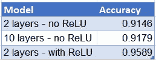

MNIST 的一些快速结果

# 一些流行的激活功能

对于大多数实际系统/模型，激活是以下三种之一:ReLU、Sigmoid 或 Tanh(双曲正切)。

## 热卢

最简单的(也可以说是最好的)激活。如果隐藏层的输出为负，我们只需将其设置为零:

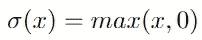

ReLU 的图形是:

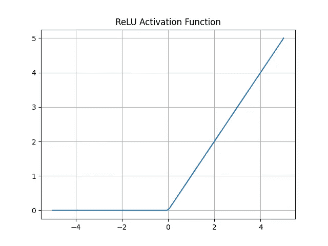

ReLU 激活功能

**优点:**

*   高效的反向传播计算。
*   没有消失梯度问题。
*   [在许多情况下收敛得更快。](https://proceedings.neurips.cc/paper/2012/file/c399862d3b9d6b76c8436e924a68c45b-Paper.pdf)

**缺点:**

*   Dead ReLU:如果所有输出都是负的，梯度将被削波为零。这可以通过更好的权重初始化来避免。

## 乙状结肠和 Tanh

这些函数具有以下形式:

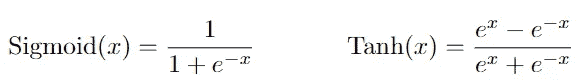

(你能推导出这些函数的导数吗？不要担心，PyTorch 和 TensorFlow 等现代 ML 框架免费提供这些激活，反向传播已经内置并优化。)

他们的图表是:

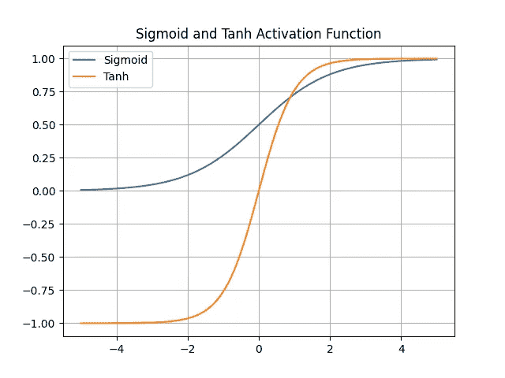

Sigmoid 和 Tanh 激活函数

它们的行为非常相似，只是 Sigmoid 的输出上限在[0，1]之间，Tanh 的输出上限在[-1，1]之间。

**优点:**

*   不会破坏激活。
*   Sigmoid 适合捕捉“概率”，因为输出上限在 0 和 1 之间。(这些概率的总和不是 1，为此我们需要 Softmax 激活。)

**缺点:**

*   较慢的反向传播计算。
*   [很多情况下收敛较慢。](https://proceedings.neurips.cc/paper/2012/file/c399862d3b9d6b76c8436e924a68c45b-Paper.pdf)
*   消失梯度:当输入远离零时，图形是平坦的。这可以通过使用正则化来避免。

# 为什么不是其他非线性函数？

说到非线性，我会想到其他一些函数:二次函数、平方根函数、对数函数…

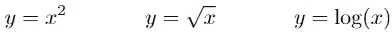

为什么我们在实践中不使用这些函数？

根据经验，良好的激活:

*   应该为所有实数定义，
*   是可微分的，并且可以有效地实现反向传播，
*   可以“启发式”解释。

上述三个函数的一些问题是:

*   二次:没有给出有意义的信号。输出-2 或 2 将给出相同的结果。
*   平方根:没有为`x < 0`定义。
*   对数:没有为`x <= 0`定义，这个函数在零附近也是无界的。

作为练习，可以考虑微积分/线性代数中遇到的其他非线性函数。想想我们为什么不使用它们。这是一个很好的练习，可以提高你对深度学习的直觉。

比如:我能不能把平方根函数扩展到负值(通过对称绘制)，并以此作为激活函数？

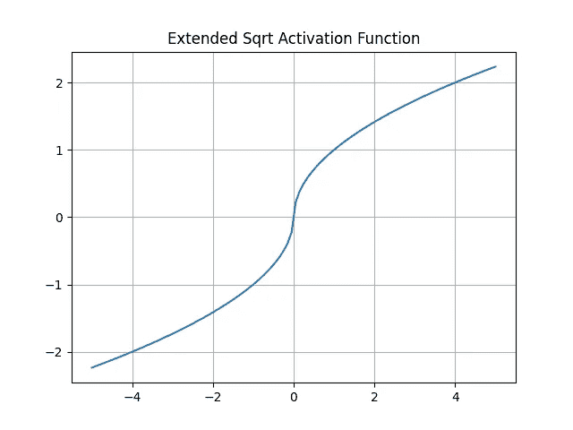

扩展平方根函数

*(提示:这个激活功能很有问题！)*

# 结论

在建立深度学习模型时，激活功能通常是事后想起的。然而，在它的机制中有一些微妙之处，你应该知道。希望这篇文章能让你更好地理解激活的基本概念，以及为什么我们会选择一些功能而不是其他。

快乐学习！

如果你愿意支持 Thu，你可以考虑注册成为一名中等会员。每月支付 5 美元，你就可以无限制地阅读媒体上的故事。如果你使用他的推荐链接，Thu 也会得到一小笔佣金。

 [## 通过我的推荐链接加入媒体- Thu Dinh

### 阅读 Thu Dinh 的每一个故事(以及媒体上成千上万的其他作家)。你的会员费直接支持周四…

medium.com](https://medium.com/@tdinh15/membership)