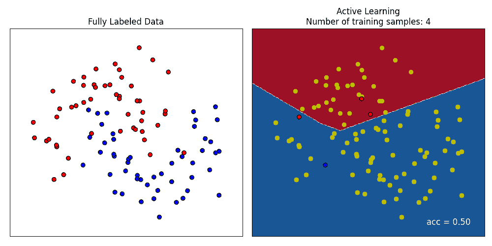
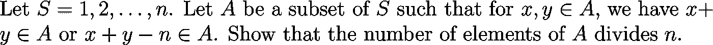
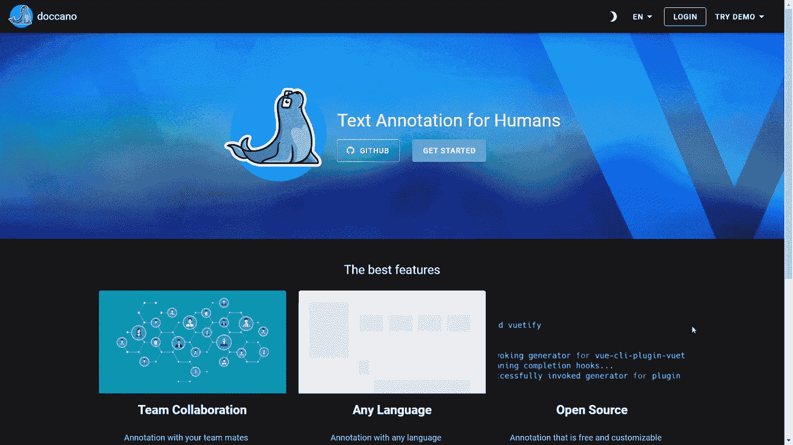
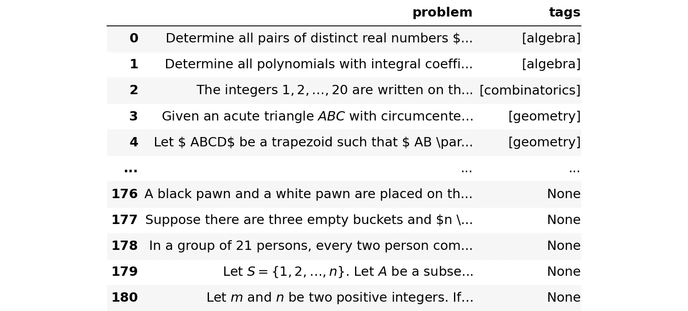
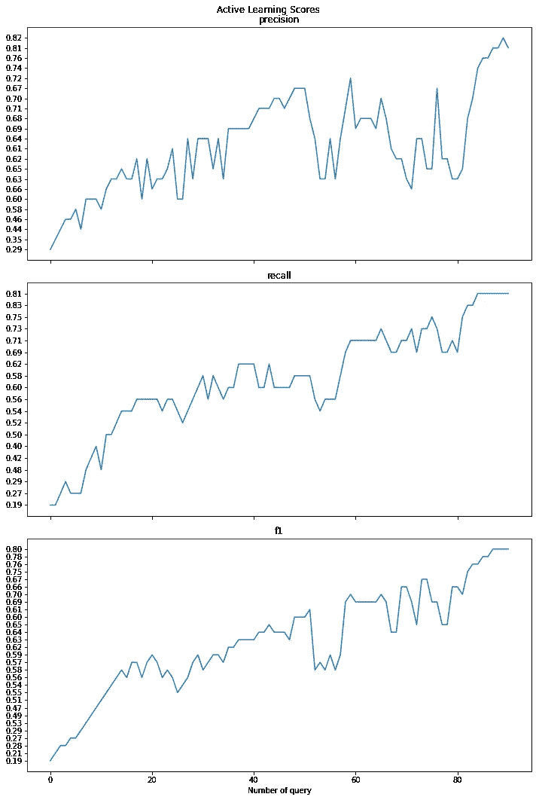

# 主动学习:改善数据标注体验的实用方法

> 原文：<https://towardsdatascience.com/active-learning-a-practical-approach-to-improve-your-data-labeling-experience-26da83983393>

## 实践教程

## 使用 doccano 和 modAL 的更智能的人类标记方式


[米歇尔·图尔凯维奇](https://unsplash.com/@absrdld?utm_source=medium&utm_medium=referral)在 [Unsplash](https://unsplash.com?utm_source=medium&utm_medium=referral) 拍摄的照片

```
**Table of Contents**· [Human Labeling](#19f8)
· [Active Learning](#7fa3)
  ∘ [Performance with all observations](#af68)
  ∘ [Performance with active learning](#b947)
· [Wrapping Up](#a7fb)
```

好了，让我们来讨论一件在数据科学领域没有得到太多关注的事情:*标记你的数据*。这是一个痛苦的过程，这可能会导致你在互联网上找到的教程或你参加的训练营中忽视它。然而，它是数据管道中最重要的组件之一，你知道，垃圾进垃圾出。一个不好的标签导致一个不好的模型和一个不好的生产实践。

> 最近，一种以数据为中心的机器学习方法将这一想法引入了一个全新的研究领域。

这个故事是一个关于如何执行人类标签的教程。我们将会看到这是一种费力的活动，因此，以后我们会寻求一种替代方法，如主动学习。主动学习的理念是智能地查询最有信息的观察，为你贴上标签。

作为主动学习的一个例子，请看下图。有 100 个二维观测值，分为红色和蓝色两类。主动学习只查询了 13 个观察值，已经达到了 91%的准确率(见右图右下角)。在这种情况下，主动学习的最终决策边界也相当不错。



行动中的主动学习。插图由[作者](http://dwiuzila.medium.com/membership)提供，只要作者引用了这个故事的链接，就可以分发。

在这个故事中，为了让我们在主动学习中脱颖而出，我们将使用一个名为`problems.json`的数据集，它有两个键:`problem`键包含 LaTeX 格式的数学问题，而`tags`键很快将填充一到两个代数、组合学、几何或数论类。


请注意，一个问题可以分为多个类别。例如，下面这个问题被归类为代数和组合学。



总共有 181 个不同的问题。目前来看，这些问题没有任何标签。在这个故事中，我们的主要目标是给他们合适的标签。

# 人类标记

社区已经为数据标注开发了多种工具。对于一般用途和数据类型，我们有 [Prodigy](https://prodi.gy/) 、 [Labelbox](https://labelbox.com/) 或 [Label Studio](https://labelstud.io/) 等等。然而，我们将使用 [doccano](https://github.com/doccano/doccano) ，一个用于文本分类、序列标记和序列到序列任务的开源文本注释工具。原因是 doccano 是专门为文本数据构建的，所以我们不需要安装通用标记工具有时需要的附加库。我们不需要手动将数据连接到数据库，也不需要担心数据安全性。此外，doccano 是免费的，并具有黑暗模式功能😄

如果您没有安装 doccano，请在终端中使用 pip 命令立即安装。

```
$ pip install doccano
```

然后，如果您是第一次运行 doccano，请执行以下命令。他们将初始化一个数据库，并创建一个用户名为“admin”和密码为“pass”的超级用户。您可以随意更改用户名和密码。如果你以前做过，你可以跳过这一步。

```
$ doccano init$ doccano createuser --username admin --password pass
```

之后，在本地机器上启动一个 web 服务器。

```
$ doccano webserver --port 8000
```

现在，在不同的终端中，启动任务队列来处理文件上传/下载。

```
$ doccano task
```

打开[**http://127 . 0 . 0 . 1:8000/**](http://127.0.0.1:8000/)，你将被定向到 doccano 主页。使用您的用户名和密码登录，导入`problems.json`文件，然后开始标记！



设置 doccano |插图作者[作者](http://dwiuzila.medium.com/membership)

您可以从 doccano 服务器导出带标签的数据，并从那里开始工作。我们把它命名为`problems_labeled.json`吧，以后把它读成熊猫数据帧。

你可能已经猜到了，人类标记需要很长时间。我们需要另一种方法。

# 主动学习

我们了解到的一点是，人类标记是昂贵的，即使使用最复杂的标记工具。一个原因是太多的观察结果无法标注。那么，如果我们只标记值得的观察值，那些我们的模型最困惑的观察值，并假设其他观察值很容易预测，因此没有太多新的信息可以学习，会怎么样呢？因此，新的工作流程将不是标记所有观察值，而是:

1.  标记一小组初始观察值来训练模型
2.  请训练好的模型预测未标记的数据
3.  根据预测置信度最低的样本(不确定性采样)，从未标记的数据中确定要标记的新观察值
4.  重复操作，直到达到所需的性能

这个工作流程叫做[主动学习](https://en.wikipedia.org/wiki/Active_learning_(machine_learning))。幸运的是，对于第一步，我们已经有了一些来自 doccano 的标记数据，并可以从中初始化。

这种技术的一个缺点是需要一个模型，因此需要首先对数据进行预处理。然而，您不必实现花哨的预处理或最先进的模型，因为它们仅用于选择哪些最佳观测值需要标记，仅此而已。

为了比较主动学习和纯人类标记，我们将对两者采用相同的模型。主动学习将从 doccano 的 50 个标记观察开始进行。您将看到，主动学习的性能将接近使用较少数据的人类标记。



探索性数据分析提出了一些清理策略:

1.  小写所有文本
2.  删除 URL
3.  删除所有 LaTeX 数学表达式和[渐近线](https://asymptote.sourceforge.io/)代码块。它们可能会传达有用的信息，但就目前而言，我们不想太超前。
4.  删除错误的 LaTeX 语法和停用词
5.  处理过滤器和非字母数字字符
6.  堵塞物

上述清洁步骤中的第 3 步是最具挑战性的一步。为此，我们形式化了 4 种类型的数学表达式:

1.  单或双美元符号，`\$...\$`或`\$\$...\$\$`
2.  一对括号`(...)`
3.  一对支架`[...]`
4.  `\begin...\end`命令

为了使用正则表达式匹配 LaTeX 语法，我们使用递归，因为四种类型中的每一种都可以包含在其他类型中。模式相当复杂，如下所示。

这同样适用于渐近线模式。

现在，该打扫卫生了！

我们可以查询一些标签和标记，看看从给定的标记中猜测标签是否有意义。

```
['number theory']
let let let product element prove nanang susyanto jogjakarta['combinatorics', 'number theory']
determin proof number permut valu fix valu integ multipl['algebra']
let real number ration number prove integ['combinatorics', 'geometry']
hall castl regular hexagon side length 6 meter floor hall tile equilater triangular tile side length 50 centimet tile divid three congruent triangl altitud orthocent see below small triangl color tile differ color two tile ident color mani color least requir tile s pattern is['geometry']
given triangl right angl show diamet incent
```

正如我们在上面看到的，从标记中猜测标签是合理的。例如，如果一个标记包含“triangl”或“incircl”，其中一个标签很可能是“geometry”。

主动学习的策略类似于通常的机器学习建模:将数据集分为训练和测试，在训练数据集上训练模型，并在测试数据集上寻找性能。训练和测试数据集是从标记的观察值构建的。如果你目前没有这些，先标记一小部分观察结果。未标记的观察值将由人类标记(不是所有人，只是一些你的模型最容易混淆的观察值),并包含在我们所谓的*池*数据集中。

将标签转换成 4 个二进制列，依次代表`algebra`、`combinatorics`、`geometry`和`number theory`。

```
Classes: ['algebra' 'combinatorics' 'geometry' 'number theory']
```

对于模型管道，我们将首先将文本特征提取到 TF-IDF 的矩阵中，然后采用具有平衡类别权重的逻辑回归(以解决类别不平衡)。该模型将在一个多类设置中作为一个对其余的训练。

然后，创建下面的`calc_score`函数，计算模型在加权精度、召回率和 f1 分数方面的性能。

## 所有观察的性能

首先，让我们使用来自 doccano 标记过程输出的所有观察结果来查看模型的性能。请记住，我们希望主动学习者的表现以后会使用更少的数据接近这种表现。

```
{'precision': '0.87', 'recall': '0.83', 'f1': '0.84'}
```

## 主动学习的表现

对于这一个，将分类器包装在一个带有`min_confidence`的`ActiveLearner`模型中，用于多标签查询策略。

让我们训练模型，看看它在精确度、召回率和 f1 分数方面的表现。

```
{'precision': '0.29', 'recall': '0.19', 'f1': '0.19'}
```

正如所料，该模型最初的表现非常糟糕。主动学习从池数据集中一次查询一个观察值，人工标记观察值(使用 python 中的`input()`函数)，然后主动学习用新观察值的附加知识教导模型。

完成查询，使得所查询的观察是模型最不确定它属于哪个标签的观察。如果模型性能已经足够好，则可以停止该过程。具体来说，让我们逐一查询 90 个观测值。



每次查询的主动学习性能|图片作者[作者](http://dwiuzila.medium.com/membership)

```
Scores after active learning
============================
precision: 0.81
recall: 0.81
f1: 0.80
```

我们看到，通过仅使用 70%的所有观察值，所有得分都有显著提高，从 0.2–0.3 提高到 0.8。这接近使用所有观察值的同一模型的 0.83–0.87 分。来自`X_pool`的标记观察值被附加到`X_init`，未标记的观察值留在`X_pool`。让我们把它们都存起来以备将来使用。

# 包扎

主动学习是一种数据标记方法，其中将模型应用于小型手动标记数据集，以查询模型最不可信的未标记数据点。因此，主动学习为标注者提供了一种选择值得标注的数据点的方法，从而节省了大量时间。在这个故事中，我们看到了主动学习在多标签分类任务中的应用。我们只使用了所有数据点的 70%,就有了高质量的标签。


🔥你好！如果你喜欢这个故事，想支持我这个作家，可以考虑 [***成为会员***](https://dwiuzila.medium.com/membership) *。每月只需 5 美元，你就可以无限制地阅读媒体上的所有报道。如果你注册使用我的链接，我会赚一小笔佣金。*

🔖*想了解更多关于经典机器学习模型如何工作以及如何优化其参数的信息？或者 MLOps 大型项目的例子？有史以来最优秀的文章呢？继续阅读:*


[艾伯斯·乌兹拉](https://dwiuzila.medium.com/?source=post_page-----26da83983393--------------------------------)

## 从零开始的机器学习

[View list](https://dwiuzila.medium.com/list/machine-learning-from-scratch-b35db8650093?source=post_page-----26da83983393--------------------------------)8 stories

[艾伯斯·乌兹拉](https://dwiuzila.medium.com/?source=post_page-----26da83983393--------------------------------)

## 高级优化方法

[View list](https://dwiuzila.medium.com/list/advanced-optimization-methods-26e264a361e4?source=post_page-----26da83983393--------------------------------)7 stories

[艾伯斯·乌兹拉](https://dwiuzila.medium.com/?source=post_page-----26da83983393--------------------------------)

## MLOps 大型项目

[View list](https://dwiuzila.medium.com/list/mlops-megaproject-6a3bf86e45e4?source=post_page-----26da83983393--------------------------------)6 stories

[艾伯斯·乌兹拉](https://dwiuzila.medium.com/?source=post_page-----26da83983393--------------------------------)

## 我最好的故事

[View list](https://dwiuzila.medium.com/list/my-best-stories-d8243ae80aa0?source=post_page-----26da83983393--------------------------------)24 stories

艾伯斯·乌兹拉

## R 中的数据科学

[View list](https://dwiuzila.medium.com/list/data-science-in-r-0a8179814b50?source=post_page-----26da83983393--------------------------------)7 stories[](https://dwiuzila.medium.com/membership)