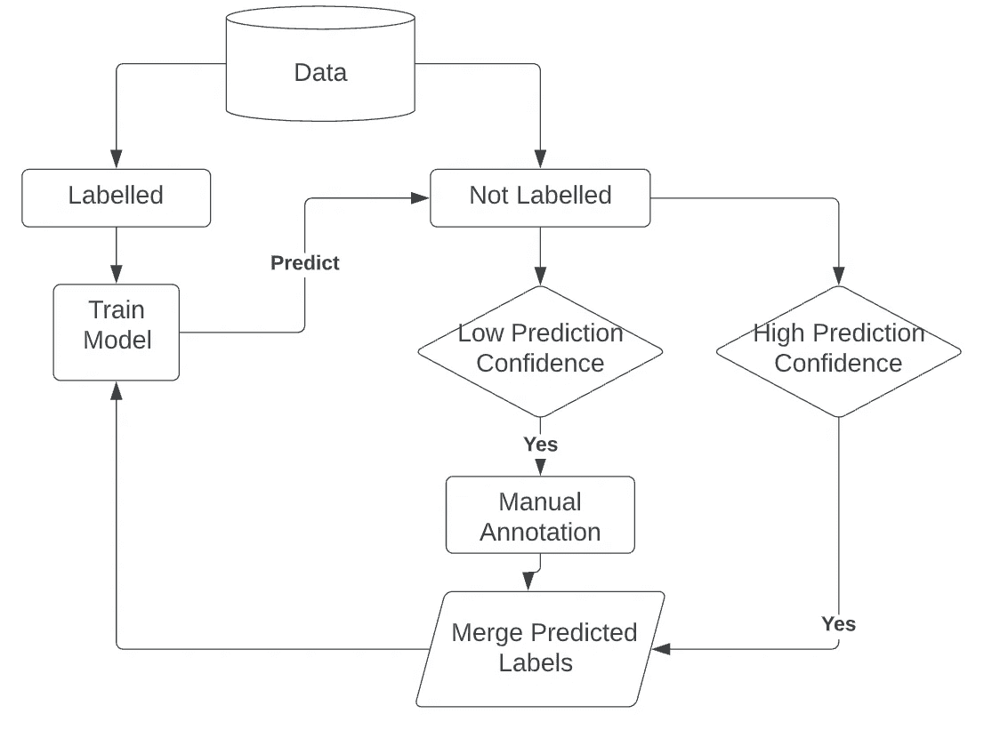
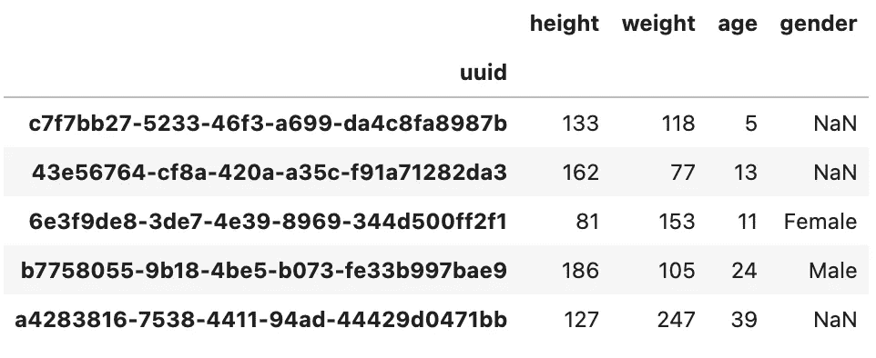
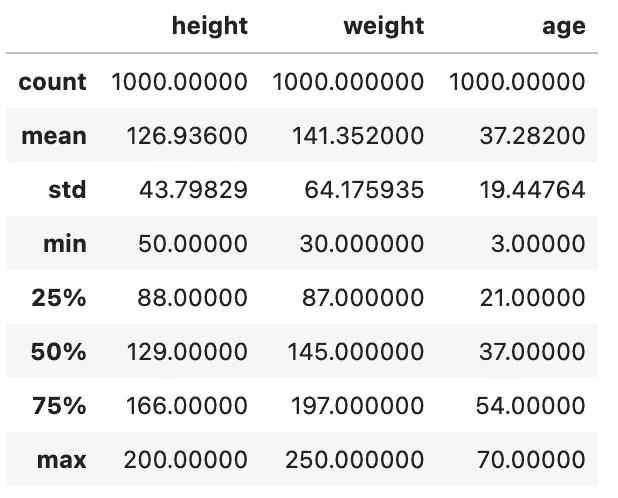
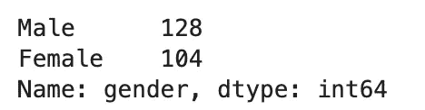
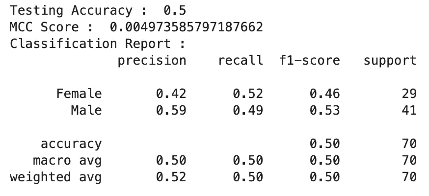
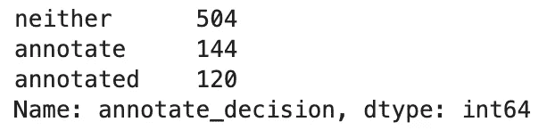
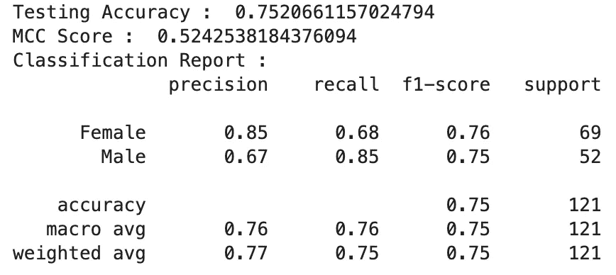

# 机器学习中的主动学习解释

> 原文：<https://towardsdatascience.com/active-learning-in-machine-learning-explained-777c42bd52fa>

## Python 中主动学习管道的直觉和实现


由 [fynn](https://unsplash.com/@fynn_it) 从 [Unsplash](https://unsplash.com/photos/DEnuB_zok9M) 拍摄的图像

本文的重点将是解释主动学习管道的概念、直觉和简单实现。管道将在 Python 中构建，当标记数据量有限时，我们将使用主动学习来提高二进制分类模型的性能。

**目录**

*   什么是主动学习？
*   主动学习的应用
*   问题陈述
    -要求
*   主动学习解决方案架构
*   生成数据
    -标注数据
*   建模
    -训练模型
    -模型性能
    -预测
    -预测-标签分解
    -再训练模型
    -再训练模型性能
*   结束语
*   资源

# 什么是主动学习？

主动学习是机器学习的一个分支，其中模型可以访问新标记的数据点。当有大量未标记的数据并且手动注释过程非常昂贵时，这是一种常用的策略[1]。主动学习可以描述为一个迭代的监督学习过程。

与主动学习相关的体系结构可以概括如下。假设您有数百万行数据，而这些行中只有 1%被标记。你可以在这 1%的数据上训练一个模型，并让它在另外 99%的未标记的数据上进行预测。预测必须具有某种与之相关的置信度，该置信度将指示这是正确预测的可能性。然后，您需要确定所有非常可能正确的预测(比如预测概率大于 95%的预测)和不太可能正确的预测(比如预测概率小于 60%的预测)。现在，您仔细检查并手动注释模型不信任的所有数据点，将其与之前标记的数据点以及模型信任的数据点合并。现在，您有了一组标记数据，比您训练的初始模型大得多。您现在可以重新训练模型，希望新重新训练的模型在更多的数据点上产生更好的性能。这个过程可以反复进行，直到你对你试图解决的问题的结果感到满意为止。

# 主动学习的应用

主动学习常用于各种行业和问题。通常，可以实现主动学习来解决自然语言处理、计算机视觉和推荐系统中的问题。例如，在推荐系统的环境中，冷启动问题是一个常见的问题，但在将推荐系统推向生产时会反复出现。如果没有任何与新用户或产品相关联的标记数据，模型很难做出有价值的推荐。主动学习可以通过将人保持在循环中来解决这个问题，人会做一些手动注释，以尝试在新引入的产品和平台上的其他产品/用户之间形成连接。然后，这可以反馈到模型中，以提供有价值的建议。

# 问题陈述

我们要解决的商业问题与人口统计学建模有关。给定一些与我们平台上的用户相关联的重要统计数据，我们希望确定与该用户相关联的性别。我们有大量的生命统计数据，但很少或没有标记的数据点。目标是建立一个主动学习管道来训练一个模型，以识别给定用户的性别。

## 要求

```
Python=3.8.8
pandas=1.2.4
numpy=1.20.1
sklearn=0.24.1
```

还有一些其他的需求，比如`uuid`和`random`模块，但是这些都是 Python 预装的。

# 主动学习解决方案架构

给定大的未标记数据集，以下是与构建用于预测与用户相关联的性别的分类器相关联的架构。

1.  标记一些数据点——这个过程可以随机进行，也可以有选择地进行。
2.  在这些标记的数据点上训练一个标为`m1`的模型。
3.  使用模型`m1`对所有未标记的数据点进行预测。确定与这些预测相关的模型的可信度。
4.  对于模型非常有信心的所有点，将它们视为新的附加标记数据
5.  对于模型不确定的所有点，注释这些结果
6.  将来自步骤 1 的标记点、来自步骤 4 的置信结果和来自步骤 5 的带注释的非置信结果合并在一起，成为更大的标记数据数据集。
7.  在这个更大的标记数据上训练一个新的模型`m2`，并评估它与`m1`相比的性能
8.  重复过程 1 到 7，直到你对结果满意为止。



主动学习框架。图片由作者提供

# 生成数据

如果需要说明这一点，如果您使用这种方法来解决一个突出的问题，不要麻烦生成数据集，使用您正在处理的数据集。我只是为了简单性和可再现性而生成一个数据集，并概述如何使用主动学习来解决这样一个问题的用例。

我们将生成与人类相关的虚假生命统计数据。我们正在构建的函数将随机生成虚假的身高、体重和年龄数据。下面列出的函数产生的数据帧将产生一个 CSV，其中包含:

```
- uuid (UUID4) : A unique identifier to the user 
- height (Integer) : The height of the user in cm 
- weight (Integer) : The weight of the user in pounds (lbs) 
- age (Integer) : The age of the user 
- gender (String) : The gender associated with the user if known
```



生成数据的前 5 行。图片由作者提供。

当然，由于我们随机生成数据，我们会有奇怪的标签值，比如一个 11 岁的女孩，体重 153 磅，身高 81 厘米。



与生成的数据集相关联的统计数据。图片由作者提供。

请记住，由于这是随机生成的，如果您试图复制该流程，您将会生成不同的值。

## 注释数据

在这里，人们通常会标注与标签相关的数据集，为了快速和简单起见，我将选择随机分配的性别数据。您可以研究各种各样的采样策略(如有目的的采样和方便的采样)来最好地选择要注释的数据点。有目的的抽样指的是能够为模型提供信息的选择性抽样。方便抽样是指太容易给信息贴标签。请注意，与随机采样相比，这两种方法都会在标注过程中引入偏差，并可能对模型性能产生积极/消极影响(很难说，这在很大程度上取决于您要解决的问题)。



带注释的数据行。图片由作者提供。

最后，我们有 232 行标记数据和 768 行未标记数据。

# 系统模型化

我将使用梯度推进模型来训练二元分类器，在现实世界中，你应该尝试许多不同的分类器(如 SVC，逻辑回归，KNN，XG Boost 等。)并评估每个的性能。您还应该对这些模型进行超参数调整，以优化性能。

## 火车模型

## 模型性能



模型的性能。图片由作者提供。

尽管考虑到我们是如何生成数据的，这些数字是非常没有意义的，但我们可以看到该模型几乎有 50%的准确性，这是有意义的，因为这是随机机会。

## 预测

我们希望确定与每个类别相关的预测和预测概率。当考虑预测概率时，我们可以将它们存储在一个字典中，其中键是类，值是与该类相关联的预测概率。

## 预测-标签分解

具有低预测概率的预测将由用户手动注释，而具有高预测概率的预测将被假定为由模型生成的良好预测。这将允许我们增加我们的标记数据，并根据以前模型的最佳表现结果重新训练新模型。出于本教程的目的，我将`low prediction`阈值设置为小于或等于 0.6，将`high prediction`阈值设置为大于或等于 0.9。这两个范围之间的任何值都不会被标记。



我们标记为注释/注释/都不是的预测数量。图片由作者提供。

同样，出于简单起见，我将随机指定一个性别(因为这是随机生成的数据)，但实际上您应该手动标记它。

现在完成这个过程后，我们有了`401`标记的数据点。这远远大于我们之前在训练模型时拥有的标记数据点的数量(232)。

## 再训练模型

现在，我们可以在新标记的 401 个数据点上重新训练模型，并重新评估模型的性能。

## 重新训练的模型性能



与重新训练的模型相关联的模型性能。图片由作者提供。

现在我们可以看到模型有了实质性的改进，给出的数据是如何产生的，结果是没有意义的。希望这给了你一些关于主动学习如何改进数据驱动管道的标签和建模组件的想象。

# 结束语

主动学习是一种迭代的监督学习过程，可用于解决推荐系统、自然语言处理、计算机视觉或其他具有大量未标记数据的问题。

该过程开始于在一组标记数据上训练模型，生成预测，并在由人/模型标记的附加数据上重新训练模型。这个过程反复进行，直到用户对模型性能感到满意。

请注意，上述教程中的示例与随机生成的数据相关，该示例旨在展示主动学习的强大功能，以及如何在标记数据数量有限的情况下使用它来解决问题。尽管模型的性能有所提高，但该模型本质上是在学习随机性，所以对这些结果不能全信。

您可以在 Jupyter 笔记本上遵循本文中使用的代码。完整的文件可以在我的 GitHub [这里](https://github.com/vatsal220/medium_articles/blob/main/active_learning/active.ipynb)找到。

# 资源

*   [1][https://en . Wikipedia . org/wiki/Active _ learning _(machine _ learning)](https://en.wikipedia.org/wiki/Active_learning_(machine_learning))

如果你喜欢这篇文章，这里有一些我写的其他文章，你可能也会感兴趣。

[](/text-summarization-in-python-with-jaro-winkler-and-pagerank-72d693da94e8)  [](/link-prediction-recommendation-engines-with-node2vec-c97c429351a8)  [](/recommendation-systems-explained-a42fc60591ed)  [](/text-similarity-w-levenshtein-distance-in-python-2f7478986e75)  [](/bayesian-a-b-testing-explained-344a6df88c1a) [## 贝叶斯 A/B 测试解释

towardsdatascience.com](/bayesian-a-b-testing-explained-344a6df88c1a) [](/word2vec-explained-49c52b4ccb71)  [](/louvains-algorithm-for-community-detection-in-python-95ff7f675306) 