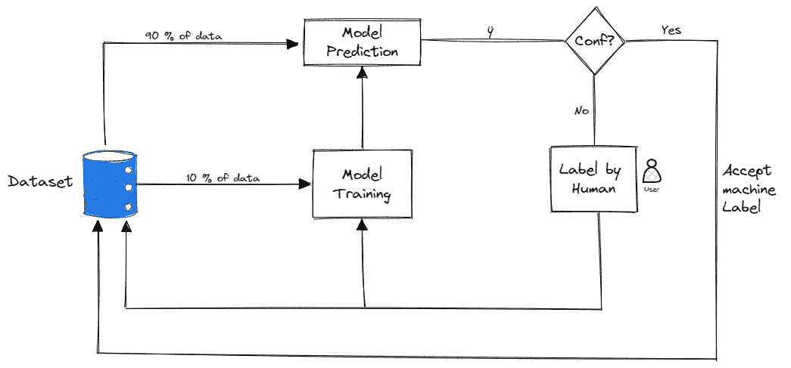
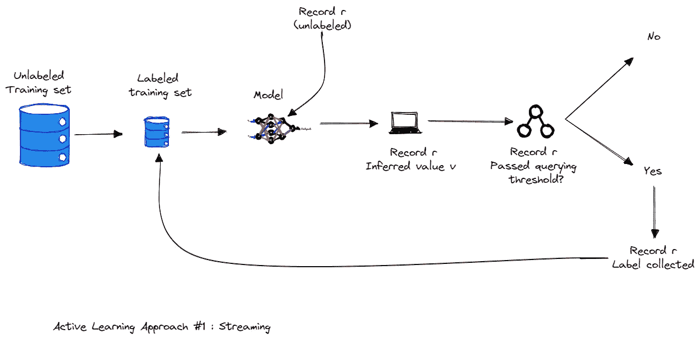
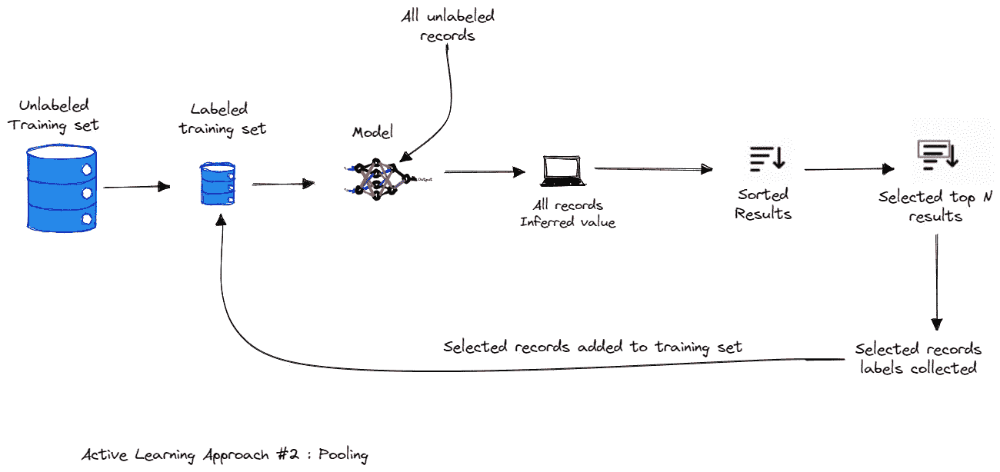
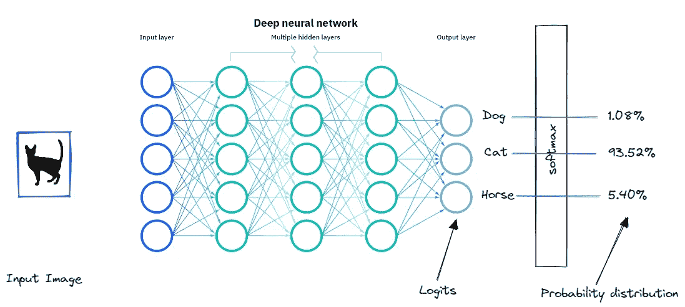
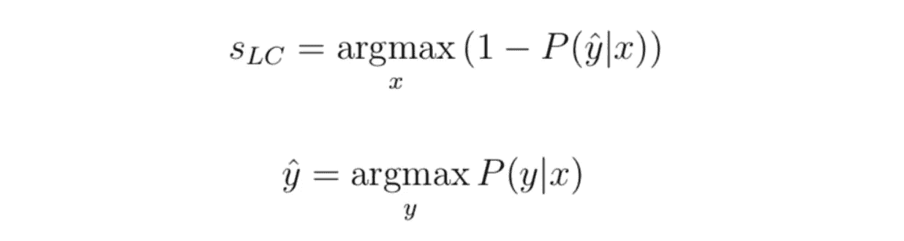
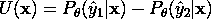
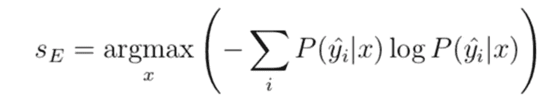
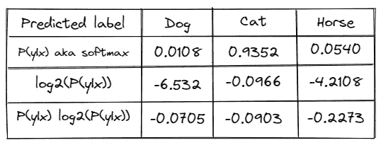

# 主动学习概述:策略和不确定性测量

> 原文：<https://towardsdatascience.com/active-learning-overview-strategies-and-uncertainty-measures-521565e0b0b>

作者图片

## 直觉和主动学习术语概述，并动手进行不确定性抽样计算。

# 1.主动学习

主动学习是对需要标记的数据进行优先排序的过程的名称，以便对训练监督模型产生最大影响。

主动学习是一种策略，在这种策略中，学习算法可以交互式地询问用户(教师或 oracle ),以便用真正的标签标记新的数据点。主动学习的过程也称为最优实验设计。

主动学习的动机是理解到并非所有标记的例子都同样重要。

主动学习是一种方法，有时可以大大减少训练模型所需的标记数据量。它通过为专家区分标签工作的优先级来做到这一点。

*   主动学习可以在提高准确性的同时降低成本。
*   是对现有模型的增强。
*   是策略/算法，不是模型。
*   但是可能很难。**“主动学习容易理解，不容易执行上”**

主动学习背后的关键思想是，如果允许机器学习算法选择它学习的数据，它可以用更少的训练标签获得更高的准确性。— [主动学习文献调查，毛刺落定](http://burrsettles.com/pub/settles.activelearning.pdf)

主动学习不是一次收集所有数据的所有标签，而是优先考虑模型最容易混淆的数据，并只请求这些数据的标签。然后，该模型对这少量的标记数据进行一些训练，然后再次为最容易混淆的数据要求更多的标签。

通过对最容易混淆的例子进行优先排序，该模型可以使专家专注于提供最有用的信息。这有助于模型更快地学习，并让专家跳过对模型没有太大帮助的标记数据。结果是，在某些情况下，我们可以大大减少我们需要从专家那里收集的标签数量，同时仍然可以获得一个很好的模型。这意味着为机器学习项目节省时间和金钱！

# **2。主动学习策略**

**主动学习的步骤**

文献中研究了多种方法，涉及如何在标记时区分数据点的优先级以及如何迭代该方法。然而，我们将只介绍最常见和最简单的方法。

在未标记数据集上使用主动学习的步骤是:

1.  首先需要做的是，需要手工标记该数据的一个非常小的子样本。
2.  一旦有了少量的标记数据，就需要对模型进行训练。该模型当然不会很好，但会帮助我们了解参数空间的哪些区域需要首先标记以改进它。
3.  在训练该模型之后，该模型用于预测每个剩余的未标记数据点的类别。
4.  基于模型的预测，在每个未标记的数据点上选择分数。在下一小节中，我们将介绍一些最常用的可能得分。
5.  一旦选择了对标记进行优先排序的最佳方法，就可以迭代地重复该过程:可以在新的标记数据集上训练新的模型，该数据集已经基于优先级分数进行了标记。一旦在数据子集上训练了新的模型，未标记的数据点可以通过模型运行，以更新优先化分数，从而继续标记。这样，随着模型变得越来越好，人们可以不断优化标记策略。

作者的 AL / Image 的一般策略

## 2.1 主动学习方法#1:流

在基于流的主动学习中，所有训练样本的集合作为流呈现给算法。每个示例都被单独发送给算法进行考虑。该算法必须立即决定是否标记该示例。从该池中选择的训练样本被 oracle 标记，并且在显示下一个样本以供考虑之前，该标签被算法立即接收。

作者图片

## 2.2.主动学习方法#2:集中

在基于池的采样中，训练样本是从大量未标记的数据中选择的。从该库中选择的训练样本由 oracle 标记。

作者图片

## 2.3 主动学习方法#3:委员会提问

用词委员会的质疑是使用多个模型而不是一个。

另一种方法，称为委员会查询，维护模型(委员会)的集合，并选择最“有争议”的数据点来标记下一个数据点，即模型不同意的数据点。使用这样的委员会可以让我们克服单一模型所能表达的限制性假设，尽管在任务开始时，我们仍然无法知道我们应该使用什么样的假设。

# **3。不确定性测量**

识别接下来要标记的最有价值的例子的过程被称为“采样策略”或“查询策略”。抽样过程中的评分函数称为“采集函数”。如果被标记，则具有较高分数的数据点被期望为模型训练产生较高的值。有不同的抽样策略，如不确定性抽样、多样性抽样、预期模型变化等，在本文中，我们将只关注最常用的不确定性测量策略。

不确定性采样是一套技术，用于识别当前机器学习模型中接近决策边界的未标记项目。虽然很容易确定模型何时有信心(有一个结果有很高的信心)，但您有许多方法来计算不确定性，您的选择将取决于您的用例以及对您的特定数据最有效的方法。

最具信息性的例子是分类器最不确定的例子。

这里的直觉是，模型最不确定的例子可能是最困难的例子——特别是位于类边界附近的例子。学习算法将通过观察困难的例子获得关于类边界的最多信息。

让我们举一个具体的例子，假设你试图建立一个多类分类来区分 3 类猫，狗，马。该模型可能会给出如下预测:

此输出很可能来自 softmax，它使用指数将对数转换为 0–1 范围的分数。

作者图片

**3.1。最不自信:**

最低置信度取 1 (100%置信度)和每个项目最有把握预测的标签之间的差。

虽然您可以仅根据置信度对顺序进行排序，但是将不确定性分数转换为 0-1 范围会很有用，其中 1 是最不确定的分数。在这种情况下，我们必须将分数正常化。我们从 1 中减去该值，将结果乘以 n/(1-n)，其中 n 是标签的数量。我们这样做是因为最小置信度绝不会小于 1 除以标签数，这是所有标签具有相同预测置信度的时候。

让我们把这个应用到我们的例子中，不确定性分数将是:
(1–0.9352)*(3/2)= 0.0972。

最小置信度是最简单和最常用的方法，它给出了预测的等级顺序，其中您将对预测标签具有最低置信度的项目进行采样。

**3.2。置信区间抽样**

不确定性抽样最直观的形式是两个最有把握的预测之间的差异。也就是说，对于模型预测的标签，它比下一个最有信心的标签有多少信心？这被定义为:

同样，我们可以将其转换为 0–1 的范围。我们又要从 1.0 中减去，但是最大可能的分数已经是 1 了，所以不需要乘以任何因子。

让我们将置信区间抽样应用于我们的示例数据。“猫”和“马”是最有信心和第二有信心的预测。在我们的例子中，这个不确定性分数是 1.0-(0.9352–0.0540)= 0.1188。

**3.3。比率采样**

信心比率是信心边际的一个微小变化，着眼于最高两个分数之间的比率，而不是差异。

现在让我们再次插入我们的数字:0.9352 / 0.0540 = 17.3185。

**3.4。熵采样**

应用于概率分布的熵包括将每个概率乘以其自身的对数，然后取负和:

让我们计算示例数据的熵:

按作者分类的表格

对这些数字求和并求反得出 0-SUM(–0.0705，-0.0903，-0.2273)= 0.3881

除以标签数量的对数得出 0.3881/ log2(3) = 0.6151

# **关闭**

机器学习社区的大部分焦点是创建更好的算法来从数据中学习。但是获得有用的带注释的数据集是困难的。真的很难。这可能会很昂贵、耗时，并且最终仍然会出现一些问题，比如某些类别中缺少注释。主动学习是这方面的一个重要组成部分，在我看来并没有得到充分利用。

# 参考

[1][https://www . manning . com/books/human-in-the-loop-machine-learning](https://www.manning.com/books/human-in-the-loop-machine-learning)

[2][https://towards data science . com/introduction-to-active-learning-117 e 0740 D7 cc](/introduction-to-active-learning-117e0740d7cc)

[3][https://www . cs . CMU . edu/~ Tom/10701 _ sp11/renditions/returnation _ 13 . pdf](https://www.cs.cmu.edu/~tom/10701_sp11/recitations/Recitation_13.pdf)

[4][https://www.youtube.com/watch?v=l6HFdqk480o&feature = youtu . be](https://www.youtube.com/watch?v=l6HFdqk480o&feature=youtu.be)