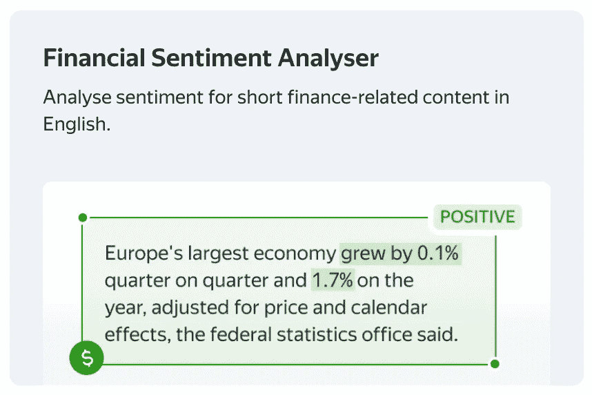
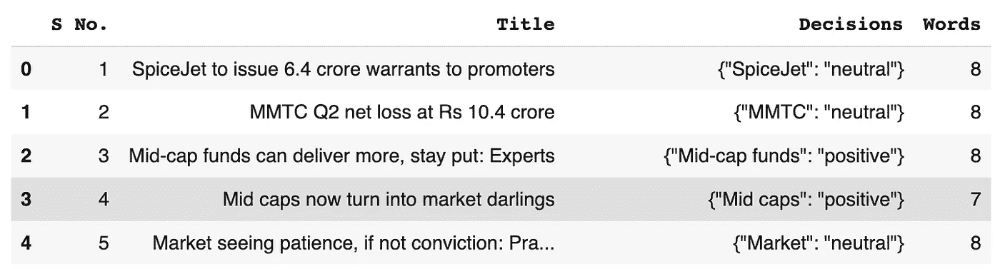
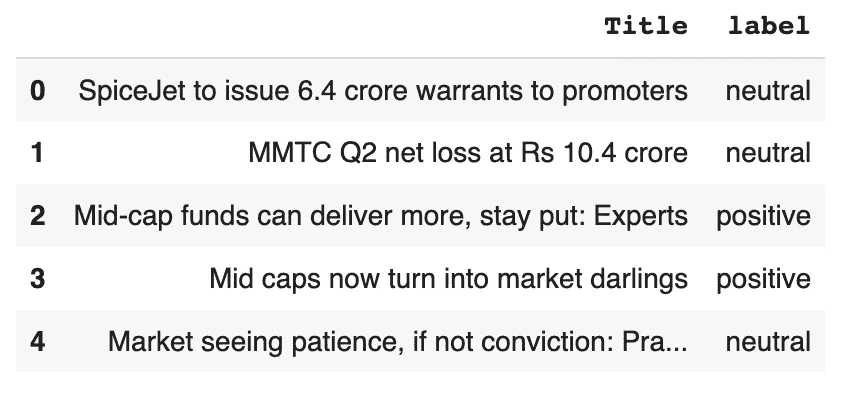
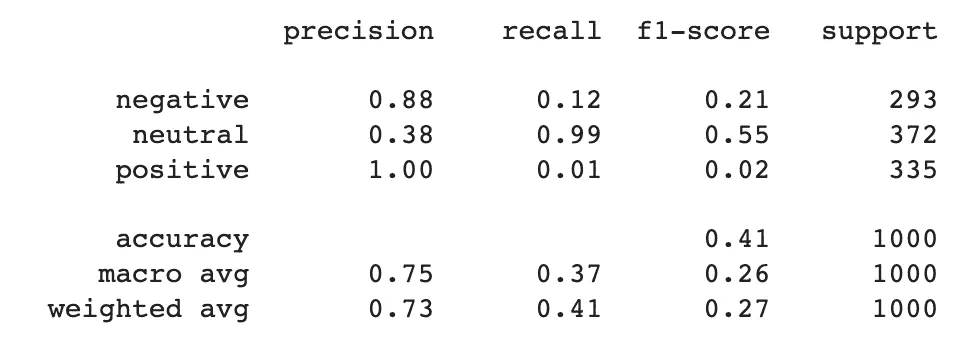
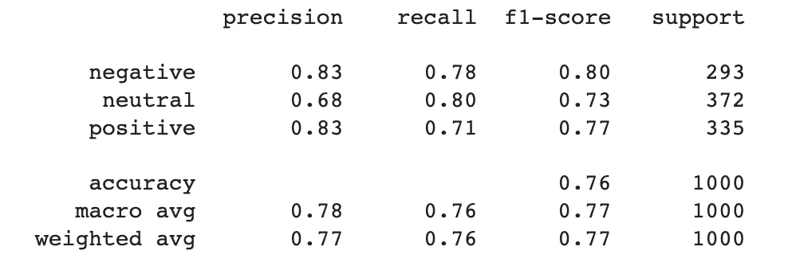
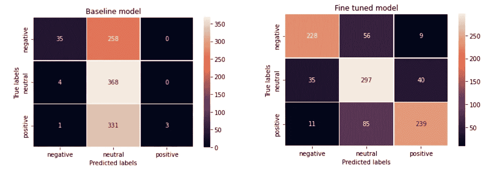

# 使情感分析模型适应定制领域

> 原文：<https://towardsdatascience.com/adapting-a-sentiment-analysis-model-to-a-custom-domain-62ec386516bc>

## **我们的实验发现和您尝试模型的机会**

作者图片

**简介**

你能把一个通用的 ML 模型用于情感分析，使它适应一个特定的领域，并得出可接受的结果吗？这是多大的挑战？

事实证明，只要付出合理的努力，这是可行的。Toloka 的 [ML 团队最近在金融领域调整了一个一般情绪模型，我很高兴分享我们的实验结果。](https://toloka.ai/adaptive-ml-models)

你可以在这里尝试微调后的情绪分析模型[或者继续阅读了解更多细节。](https://tolokamodels.tech/models/8e9a8503-8fa7-459c-a52c-d431f956048c?tabs-model=Interaction)

**基线模型**

我们使用的基线模型是本文中[描述的基于 RoBERTa 的分类器。](https://journals.sagepub.com/doi/full/10.1177/00222437211037258)

它是一个通用的自然语言处理模型，执行简单的情感分析任务。它将英语文本分为三类:

*   积极情绪😀
*   中性情绪😐
*   消极情绪🙁

这种深度学习模型相对擅长于识别与它接受训练的内容相似的简短、类似推特的文本的情绪，但当我们检查它在金融领域的表现时，这种能力下降了。这是 ML 团队将模型应用于特定领域的绝佳机会。

**微调模型**

我们使用了[financialphasebank 数据集](https://huggingface.co/datasets/financial_phrasebank)。它由来自金融新闻的 4840 个英语句子组成，按情感分类。同样，我们有三节课:

*   积极情绪😀
*   中性情绪😐
*   消极情绪🙁

在我们的实验中，我们仅使用 1e-2 的学习速率来调整分类头，运行它五个时期，并且仅使用一半的数据。仅调整头部(冻结其余权重)是一种不同寻常的训练深度学习模型的方法。这种方法通常应用在 CV 中，并且显著降低了训练的复杂性。它可以在较小的 GPU 上完成，但该过程并不总是有效——对于某些任务来说，它可能是不够的。幸运的是，在我们的案例中，以这种方式训练的模型在测试集上给了我们令人印象深刻的结果，我们决定使用一组不同的财务数据来评估它。

**评估数据集**

我们用来评估这两个情感分析模型的数据集来自 Kaggle，可以从这里下载。这是一个长长的金融标题列表，上面标注了与其中的金融实体相关的情感。你可以看到下面的前几行。

作者图片

因为我们的情感分析模型不是基于方面的，所以我们必须在评估数据集之前对其进行预处理。我们决定给每个标题贴上这样的情感标签:

*   如果标题中提到的所有实体都有相同的情感，我们可以假设这是整个标题的情感
*   如果实体有混合的情感，我们从数据集中删除它们

这导致了每个标题独特的整体情绪，如下图所示。

作者图片

我们只使用了 1000 个条目，假设这足以进行可靠的评估。你可以查看[这本 colab 笔记本](https://colab.research.google.com/drive/1CnmnpFiFfTRHoxR25bLUP5i6JGx2fBxE#scrollTo=weTaQkituFMs)，找到我们在实验中使用的代码，以及我们如何对每个模型进行情感分析的更多细节。

**情绪分析结果**

在我们为两个机器学习模型收集了情感分析预测之后，我们可以通过查看准确度、精确度、召回率和 f 分数来建立它们之间的公平比较。我们使用 scikit-learn 库打印了两种模型的分类报告。

基线模型—作者提供的图片

微调模型，图片由作者提供

从上面的图片中，您可以看到微调版本在所有平均指标上都优于基线:

*   精确度从 0.73 到 0.77
*   回忆从 0.41 到 0.76
*   f 值从 0.27 降到了 0.77

单独的结果表明，基线模型的正类和负类的召回率非常低:分别为 0.01 和 0.12。对新模型的微调使得积极类的召回率为 0.71，消极类的召回率为 0.78。

在这种情况下，这种高召回率是域调整的结果。基线模型在其训练中没有遇到评估数据集中存在的金融术语，这就是它在这种情况下努力寻找积极和消极词汇的原因。在模型被修改并暴露于领域内的训练数据后，它发生了决定性的变化，并导致积极和消极类别的回忆的增加。

然而，中性类的回忆从 0.99 下降到 0.8。阴性和阳性的精确度也略有下降。这些是我们需要记住的指标，尽管高基线分数是由模型过度预测中性类引起的。

混乱矩阵说明了这种情况。

情感模型:混淆矩阵，作者图片

仔细观察就会发现基线模型在标记积极情绪和消极情绪时存在的问题。它 331 次将正面标题误标为中性。同样，负面类被误标为中性的有 258 次。这对于在这种情感分类任务中应该被可靠地检测到的类别来说是非常差的性能。

微调后的模型解决了这个问题，给了我们更正确的预测。正面类只有 85 次被误标为中性，负面类有 56 次被误标为中性。这再次归功于对模型的调整，以及在 find tuning 过程中，它学习了金融文本中的积极和消极指标。

**总结**

[Toloka ML 团队](https://toloka.ai/adaptive-ml-models)已经证明，在不同领域训练的情感模型可以被微调到一个新的领域，从而相对容易地创建一个定制的情感分析模型，而无需太多数据。

我们的基线模型被训练来检测社交媒体帖子的情绪，使其容易在金融领域出错。但是在金融领域对模型进行微调，即使使用完全不同的金融数据集，也能显著改善结果。

你可以在[这个 colab 笔记本](https://colab.research.google.com/drive/1CnmnpFiFfTRHoxR25bLUP5i6JGx2fBxE#scrollTo=prDBB8EI6yWz)里通读实验的代码。

也欢迎你使用微调过的[型号](https://tolokamodels.tech/models/8e9a8503-8fa7-459c-a52c-d431f956048c?tabs-model=Interaction)，并在下面的评论中告诉我们你的想法。

*PS:我正在 Medium 和*[***aboutdatablog.com***](https://www.aboutdatablog.com/)*上写文章，深入浅出地解释基本的数据科学概念。你可以订阅我的* [***邮件列表***](https://medium.com/subscribe/@konkiewicz.m) *在我每次写新文章的时候得到通知。如果你还不是中等会员，你可以在这里加入***。**

*下面还有一些你可能喜欢的帖子*

*     *