# 机器学习的自适应参数方法

> 原文：<https://towardsdatascience.com/adaptive-parameters-methods-for-machine-learning-6f7101a9a71>

## 让我们探索一些方法来适应您的参数随着时间的推移。


罗斯·芬登在 [Unsplash](https://unsplash.com/es/fotos/mG28olYFgHI) 上的照片

在这篇文章中，我将讨论机器学习的自适应参数方法背后的思想，以及为什么和什么时候使用 python 作为一些实际例子来实现它们。

# **1。简介**

自适应方法(也称为参数调度)是指使用调度在训练时更新一些模型参数的策略。

这种变化将取决于模型在时间 *t 的状态；*例如，您可以根据损失值、迭代次数/时期数、经过的训练时间等来更新它们。

例如，一般来说，对于神经网络，学习速率的选择有几个结果；如果学习率过大，可能会超调最小值；如果它太小，可能需要很长时间才能收敛，或者可能陷入局部最小值。

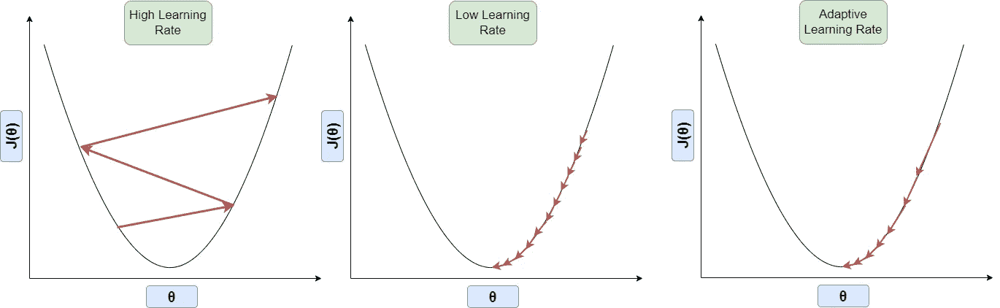

适应性学习率。图片由作者提供。

在这种情况下，我们选择改变学习率作为历元的函数；这样，你可以在训练开始时设定一个较大的速率，并顺应时代的增长；您可以减小该值，直到达到较低的阈值。

你也可以把它看作是一种探索的方式与剥削的策略，所以在开始的时候，你允许更多的探索，在结束的时候，你选择剥削。

# 2.适配器

有几种方法可以选择来控制参数从初始值到最终阈值的形式和速度；在本文中，我将它们称为“适配器”，并且我将把重点放在将参数值改变为迭代次数的函数的方法上(在神经网络的情况下，是迭代次数)。

我将介绍一些定义和符号:

初始值表示参数的起点，结束值是经过多次迭代后得到的值，自适应速率控制从初始值到结束值的速度。

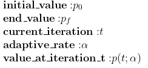

在这种情况下，每个适配器应该具有以下属性:

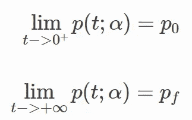

在本文中，我将解释三种类型的适配器:

*   指数的
*   相反的
*   潜在的

# 2.1 指数适配器

指数适配器使用以下形式来更改初始值:

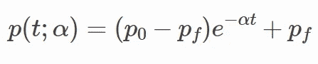

根据这个公式，alpha 应该是一个正值，以获得所需的属性。

如果我们为不同的 alpha 值绘制这个适配器，我们可以看到参数值如何随着不同的形状而减少，但是它们都遵循指数衰减；这显示了 alpha 的选择如何影响衰减速度。

在本例中，initial_value 为 0.8，end 值为 0.2。可以看到，alpha 值越大，收敛到接近 0.2 的值所需的步数/迭代次数就越少。

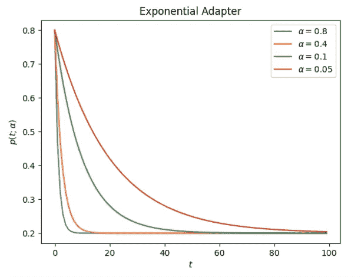

指数衰减。图片由作者提供。

如果您选择的初始值小于结束值，您将执行指数上升，这在某些情况下很有帮助；例如，在遗传算法中，你可能在第一代开始时有一个低的交叉概率，并随着代的发展而增加。

如果起点是 0.2，一直到 0.8，上面的图看起来是这样的:你可以看到衰变的对称性。

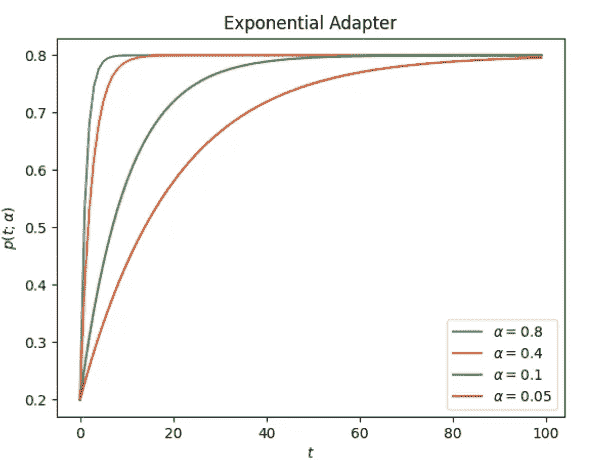

指数上升。图片由作者提供。

# 2.2 反向适配器

反向适配器使用以下形式来更改初始值:

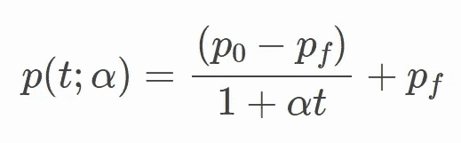

根据这个公式，alpha 应该是一个正值，以获得所需的属性。这是适配器的外观:

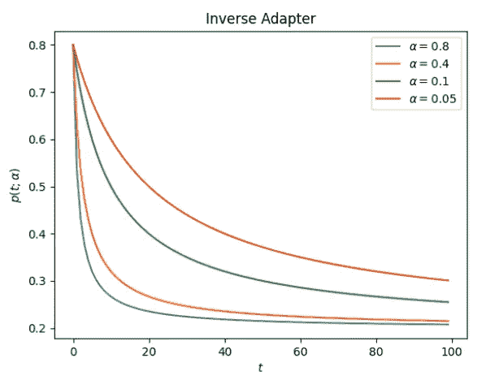

逆衰变。图片由作者提供。

# 2.3 潜在适配器

反向适配器使用以下形式来更改初始值:

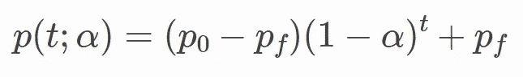

该公式要求 alpha 在(0，1)范围内，以获得所需的属性。这是适配器的外观:

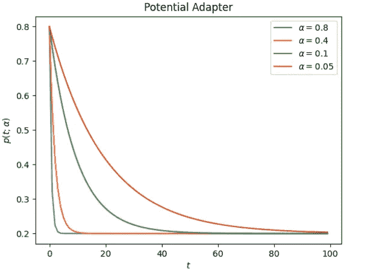

潜在衰变。图片由作者提供。

# 2.4 比较适配器

正如我们所看到的，所有的适配器以不同的速率改变初始参数(这取决于 alpha)，所以比较一下它们的行为是有帮助的；这是固定 alpha 值为 0.15 时的结果。

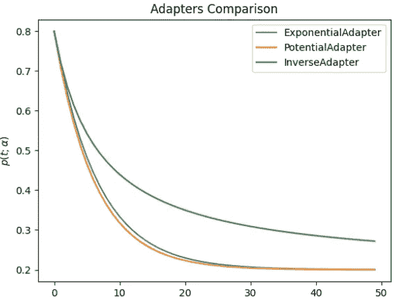

适配器比较。图片由作者提供。

你可以看到，潜在的适配器是一个下降更快，紧随其后的是指数；反向适配器可能需要更长次数的迭代才能收敛。

这是用于这种比较的代码，以防您想使用参数来查看其效果；首先，确保安装软件包[2]:

```
pip install sklearn-genetic-opt
```

# 3.Python 示例

在本节中，我们希望使用一种算法来自动调整超参数；这种算法通常带有控制优化过程的选项；例如，我将使用遗传算法，通过指数适配器来控制变异和交叉概率；这些与算法的探索与探索策略相关。

你可以查看[我写的另一篇文章](/hyperparameters-tuning-from-grid-search-to-optimization-a09853e4e9b8?gi=df7242c6437c)来了解更多关于超参数调整的遗传算法。

首先，让我们导入我们需要的包。我将使用 digits 数据集[1]并微调一个随机森林模型。

**注意:**我是示例中使用的包的作者；如果你想进一步了解，投稿或者提出一些建议，可以查看本文末尾的文档和 GitHub 资源库。

para_grid 参数界定了模型的超参数搜索空间，并定义了数据类型；我们将使用交叉验证准确性来评估模型的超参数。

我们定义了优化算法，并创建了自适应交叉和变异概率。我们将从高变异概率和低交叉概率开始；随着代数的增加，交叉和变异概率将分别增加和减少。

我们还将打印和绘制一些统计数据来理解结果。

在这个特定的例子中，我得到了 0.941 的准确度分数(在测试数据上)，并找到了这些参数:

```
{‘min_weight_fraction_leaf’: 0.01079845233781555, ‘bootstrap’: True, ‘max_depth’: 10, ‘max_leaf_nodes’: 27, ‘n_estimators’: 108}
```

您可以检查搜索空间，它显示了该算法研究了哪些超参数。

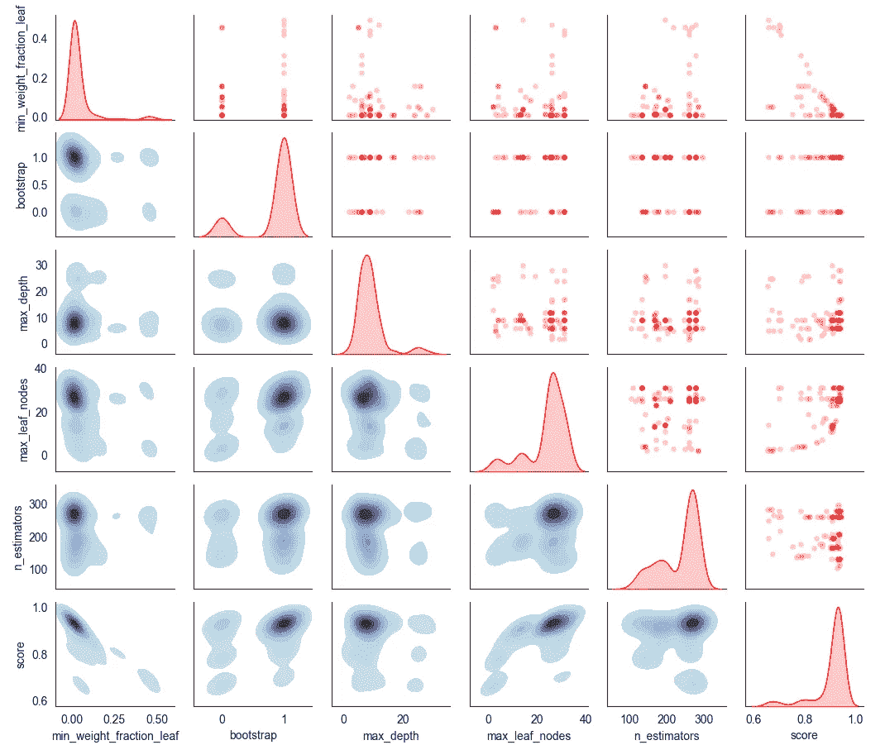

带适配器的示例空间。图片由作者提供。

作为参考，这是没有自适应学习的采样空间的样子；该算法探索了具有固定低变异概率(0.2)和高交叉概率(0.8)的较少区域。

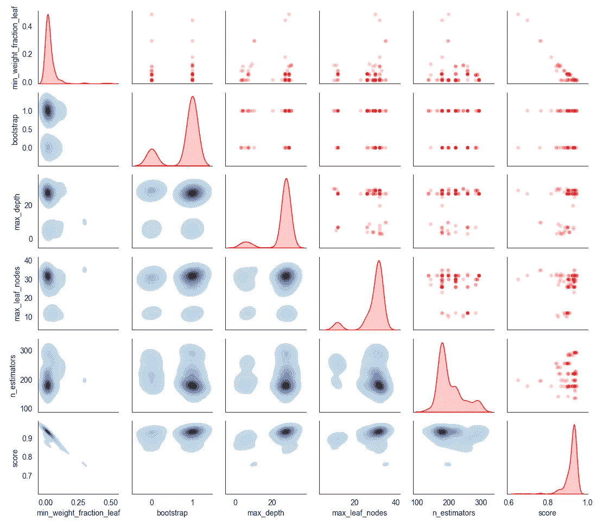

没有适配器的采样空间。图片由作者提供。

# 结论

当训练机器学习算法时，调整或调度参数可能非常有用；它可以让你更快地收敛算法，或者用动态策略探索复杂的空间区域，即使文献主要将它们用于深度学习，正如我们已经展示的那样，你也可以将它用于传统的机器学习，并调整其思想，将其扩展到任何其他可能适合变化参数策略的问题集。

如果你想了解更多关于 sklearn-genetic-opt 的信息，你可以查看这里的文档:

[](https://sklearn-genetic-opt.readthedocs.io/en/stable/index.html) [## sklearn genetic opt 文档

### Sklearn-genetic-opt 使用 deap 包中的进化算法来选择一组超参数…](https://sklearn-genetic-opt.readthedocs.io/en/stable/index.html) 

# 参考

[知识共享署名 4.0 国际](https://creativecommons.org/licenses/by/4.0/legalcode) (CC BY 4.0)许可下的[1]数字数据集:[https://archive-beta . ics . UCI . edu/ml/datasets/optical+recognition+of+手写+数字](https://archive-beta.ics.uci.edu/ml/datasets/optical+recognition+of+handwritten+digits)

[2] sklearn-genetic-opt 回购:【https://github.com/rodrigo-arenas/Sklearn-genetic-opt 