# 如何使用 Pi 增强汽车上的 ADAS？

> 原文：<https://towardsdatascience.com/adas-collision-avoidance-system-on-indian-cars-bac64cc8a863>

## *启用防撞系统(CAS) &使用 Pi 在您的汽车上实现智能环绕视野。这种低成本的解决方案，即 T2 使用的技术，如激光雷达-相机低空传感器融合技术，非常适合发展中国家。*

虽然印度只占 1%的车辆，[世界银行的调查](https://timesofindia.indiatimes.com/city/pune/pune-students-create-ai-powered-driverless-car-to-help-curb-accidents-deaths/articleshow/85454149.cms)报告**全球******道路死亡的 11%发生在印度！**在发展中国家，加强道路安全势在必行，在这些国家，大多数车辆没有先进的驾驶辅助功能，他们也负担不起为提高安全性而升级汽车的费用。此外，这些国家提出了一系列独特的挑战。这些包括过时的车辆，缺乏人行车道，混乱的交通，动物过马路，等等。**

**在这种背景下，**该解决方案旨在为印度最便宜的汽车配备** **超便宜的 ADAS 级，即防撞和智能全景。**配有前方碰撞预警系统(FCW)或自主紧急制动系统(AEB)的现代汽车价格昂贵，但**我们可以以较低的成本在旧车上增加这些功能。****

# **项目演示**

**ADAS-CAS 小工具通过声光指示器警告驾驶员**

****此解决方案的完整源代码可在** [**此处**](https://github.com/AdroitAnandAI/ADAS-Collision-Avoidance-System-on-Indian-Roads) 获得**

**这个想法是使用电池供电的 Pi 连接到安装在汽车引擎盖上的激光雷达、Pi Cam、LED SHIM 和 NCS 2，以感知前方物体的深度和方向。这个**不仅启用了** **前向碰撞预警系统，还启用了** **智能驾驶辅助，对交通标志** **或行人、沿路边行走**、**或过马路**发出警报。**

**激光雷达使用激光束根据反射时间计算距离。**

**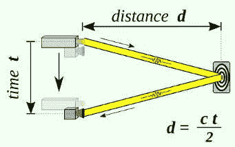**

**激光测距[5]。c =光速**

**相机的分辨率通常比激光雷达高，但相机的 FOV 有限，无法估计距离。旋转**激光雷达**有 **360** 视场， **Pi Cam** 只有 **62x48 度** **水平 x 垂直视场。**当我们在这里处理多个传感器时，我们需要使用**视觉融合技术**来整合传感器输出，即获得车辆前方障碍物的距离和角度。在动手实施之前，我们先讨论一下传感器融合的理论基础。**

# **传感器融合的思想**

**每种传感器都有自己的优缺点。以雷达为例，它的分辨率很低，但却擅长在没有视线的情况下进行测量。在自动驾驶汽车中，通常使用激光雷达、雷达和摄像头的组合来感知环境。这样，我们可以通过结合所有传感器的优点来弥补缺点。**

*   ****相机:**非常适合理解场景或**对物体进行分类****
*   ****激光雷达**:优于**利用**脉冲激光波**估计距离****
*   ****雷达:**可以利用**多普勒效应**测量**障碍物的速度****

**该相机是一个 2D 传感器，通过它可以识别边界框、交通灯、车道划分等特征。激光雷达是一种输出一组点云的 3D 传感器。**融合技术找到激光雷达探测到的点和**摄像机**探测到的**点之间的对应关系。为了统一使用激光雷达和相机来构建 ADAS，**需要通过以下步骤将 3D 传感器输出与 2D 传感器输出**融合。**

**1.**将激光雷达点云** (3D)投影到 2D 图像上。**

**2.**使用 YOLOv4 等算法进行物体检测**。**

**3.**匹配 ROI** 找到感兴趣的激光雷达投影点。**

**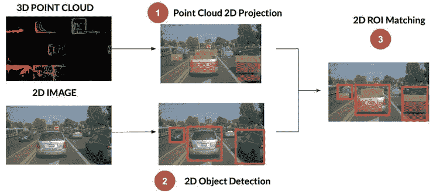**

**激光雷达-相机传感器融合[2]**

**通过以上 3 个步骤，**周围的** **物体将******使用激光雷达-相机融合进行测量和分类。******

# ****激光雷达-相机传感器融合考虑****

****当来自 cam 的原始图像与来自雷达或激光雷达的原始数据融合时，这被称为**低级融合或早期融合**。在后期融合中，检测在融合之前完成。请注意，在 2D 影像上投影 3D 激光雷达点云存在许多挑战。在执行融合时，必须考虑两个传感器之间的**相对方位和平移**。****

*   ******旋转:**激光雷达和相机的**坐标系可以不同**。激光雷达上的距离可能在 z 轴上，而相机上的距离在 x 轴上。**我们需要在激光雷达点云上应用旋转**以使坐标系相同，即**将每个激光雷达点乘以** **旋转矩阵。******

****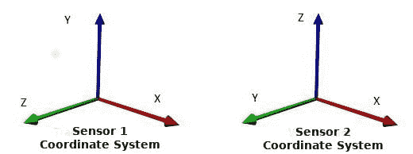****

****我们需要旋转，使激光雷达和相机坐标系相同****

*   ******翻译:**在自动驾驶汽车中，激光雷达可以位于中央顶部，摄像头位于两侧。每个装置中激光雷达和摄像机的**位置可以不同。**基于相对传感器位置，**通过乘以平移矩阵平移激光雷达点。******
*   ******立体校正:**对于立体摄像机设置，我们**需要** **做立体校正** **使左右图像共面。**因此，我们需要乘以矩阵 R0 来沿着**水平核线**对齐所有东西。****
*   ******内在校准:**校准是告诉你的相机如何将 3D 世界中的点转换成像素的步骤。为此，我们需要乘以包含工厂校准值的固有校准矩阵。****

****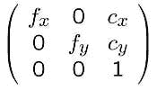****

****内在校准矩阵。f =焦距。c =光学中心****

****综上所述，**我们需要将激光雷达点乘以所有的 4 个矩阵**才能投影到相机图像上。****

******将 3D 中的点 X 投影到 2D 的点 Y 上，******

****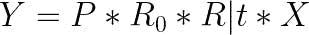****

****激光雷达-相机投影公式****

*   *****P =摄像机内部校准矩阵*****
*   *****R0 =立体校正矩阵*****
*   *****R|t =旋转&从激光雷达到摄像机的平移*****
*   *****X =三维空间中的点*****
*   *****Y = 2D 图像中的点*****

****请注意，我们将刚体变换、旋转和平移组合在一个矩阵 R|t 中。将这三个矩阵 P、R0 和 R|t 放在一起，说明**外部和内部校准**将激光雷达点投影到相机图像上。然而，**矩阵值高度依赖于我们定制的传感器安装。******

****这只是拼图的一部分。我们的目标是为任何廉价汽车增加一个**端到端防撞系统** **和智能全景。**这将包括我们选择的传感器、传感器位置、数据采集、自定义视觉融合和物体检测，以及一个数据分析节点，以实现传感器间的同步，从而触发驾驶员辅助警告以避免危险。****

# ****RPi 和 RPLIDAR A1 的实际实施****

****首先，我们需要用 RPLIDAR A1、Pi Cam、LED 垫片和 NCS 2 组装 Pi。 **2D 激光雷达被用来代替 3D 激光雷达**，因为我们的目标是使这个小玩意**最便宜**成为可能。该装置由 5V 3A 10K 毫安电池供电。为了便于组装，**激光雷达支架是 3D 打印的**并附在 RPi 上。挂载设计的一部分取自从[这里](https://www.thingiverse.com/thing:3970110)获得的 STL 文件****

****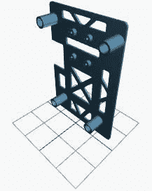****

****STL 可视化:Raspberry Pi 的激光雷达挂载****

****使用微型 USB 电缆将 RPLIDAR A1 与连接到 Pi USB 的 USB 适配器连接。激光雷达的适配器提供电源，并将激光雷达的内部 UART 串行接口转换为 USB 接口。使用 Aux-to-Aux 电缆将 RPi 连接到扬声器。由于物理限制，使用 LED 垫片代替 Blinkt 来发出警告信息。虽然**ADAS 小工具的总成本约为 150-200 美元，**人们可能需要至少再支付**10-20000 美元，** **才能获得具有如此先进功能的汽车模型。******

****让我们想象一下，3D 激光雷达的连接方式与上述相同。首先，我们将尝试在上面的小工具上解决 **3D 激光雷达-相机传感器融合**。然后我们将看到 2D 激光雷达-相机融合的**变化，以便使其在 RPLIDAR A1 上工作。******

****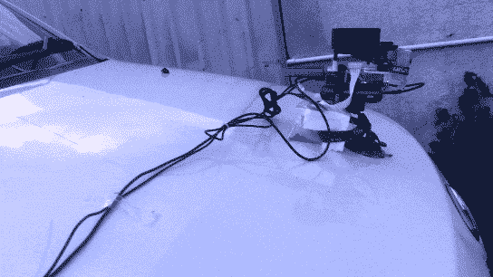****

****安装在汽车引擎盖上的 ADAS 设备****

# ****3D 激光雷达-相机传感器融合****

****从上面的讨论中可以清楚地看到，我们需要进行**旋转、平移、立体校正**、**和内部校准**来将激光雷达点投影到图像上。我们将基于我们构建的自定义小工具尝试应用上述公式。****

****从上面的图像中，您可以估计 Pi Cam 位于激光雷达扫描平面下方 10 mm 处。即沿着 3D 轴的[0，-10，0] 的**平移。考虑将威力登 HDL-64E 作为我们的 3D 激光雷达，其**需要 180°旋转**以将坐标系与 Pi Cam 对齐。**我们现在可以计算** **R|t 矩阵**了。******

**当我们在这里使用一个**单目摄像机**时，立体校正矩阵将是一个**单位矩阵。**我们可以根据 V2 Pi Cam 的**硬件规格制作内部校准矩阵。****

**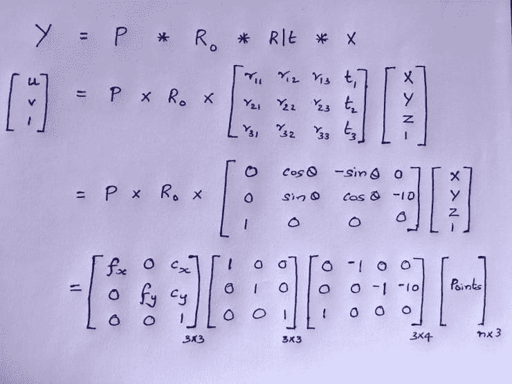**

**我们可以输入“n”个点，而不是 1 个点**

****为****树莓派 V2 相机，****

*   **焦距(FL) = 3.04 毫米**
*   **FL 像素=焦距* sx，其中 sx =真实世界与像素的比率**
*   **焦距* sx = 3.04mm 毫米* (1/ 0.00112 毫米每像素)= 2714.3 像素**

**由于**形状不匹配，矩阵无法相乘**。为了使它工作，我们**需要通过添加 0 和 1 作为最后一行或一列来从欧几里得坐标转换到齐次坐标**。完成乘法运算后，我们需要将**转换回齐次**坐标。**

**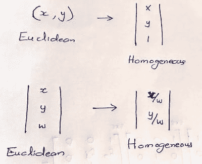**

**欧几里德到齐次的相互转换**

**在 3D 点云上应用投影公式后，可以看到 **3D LIDAR-CAM 传感器融合投影输出**。从 360 威力登 HDL-64E 和摄像机下载**输入传感器数据**并输入。**

**然而， **3D 激光雷达的成本是**构建廉价解决方案的一个障碍。我们可以使用便宜的 2D 激光雷达，并做必要的调整，因为它只能扫描一条水平线。**

# **2D 激光雷达-相机传感器融合**

**我们的小工具配备了 2D 反相激光雷达 A1，以最大限度地降低成本。这台激光雷达**在 2D 平面上扫描环境，与相机平面**正交。旋转扫描将对从 0°**到 360°**的每个角度估计到障碍物的距离。由于激光雷达 w.r.t. Pi Cam 在小工具中的位置，**相机在激光雷达几何图形上处于+90°**。但是请注意 Pi 凸轮 V2 的视野在水平 x 垂直方向分别为**62 x48**。******

****设备的集成前视图如下所示。****

****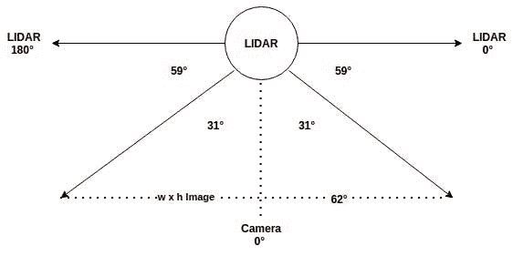****

****激光雷达-照相机几何学****

****由于激光雷达和相机传感器数据都可以在**正面 62 弧**中获得，我们需要融合这些数据。在激光雷达扫描平面中，相机数据从+59 到+59**+62**=**121。**我们可以**在图像上运行对象检测**来获得感兴趣对象的边界框。**例如**:人、汽车、自行车、红绿灯等。由于 2D 激光雷达只有宽度信息，因此只考虑每个边界框的 x_min 和 x_max。********

****我们需要**计算对应于图像像素的激光雷达角度**，以便估计到像素的距离。为了找到到边界框内物体的距离，**使用下面的公式计算对应于 x_min & x_max 的θ_min 和θ_max** ，**基于上图，******

****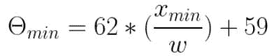****

****w =图像宽度。对θ_max 也应用相同的公式****

****现在，您可以根据最新的激光雷达扫描数据找到θ_min 和θ_max 之间每个角度的**距离。然后**计算对着物体边界框**的所有激光雷达点的中间距离** **以估计物体深度。如果距离低于阈值，则基于角度触发警告。如果在后续帧中长方体中心移动了很大距离，则重复警告。******

**为了构建无阻塞的系统流程，采用了模块化架构，其中，**每个独立节点依赖于不同的硬件组件。**即**“物体检测”节点使用 Movidius** 进行推断，而**“距离估计”节点将 LIDAR 数据**作为输入，而**“警报”模块向 Pimoroni Blinkt 和** **扬声器发送信号。**模块通过 MQTT 消息就各自的主题进行**交流。****

# **架构图**

**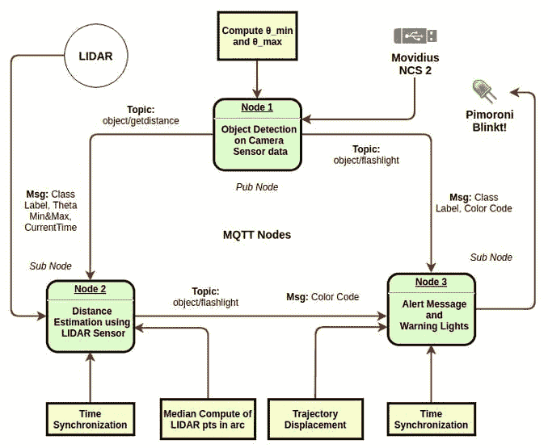**

**3 个独立的 MQTT 节点，每个都链接到不同的硬件，运行在 Pi 上**

****时间同步**模块负责传感器融合的**“数据相关性因子”。**对于 ADAS,“节点 1”检测到的物体的位置可能会随着物体的移动而改变。因此，**到******边界框的距离估计可能会在 2-3 秒**后出错(而消息可能会保留在 MQTT 队列中)。为了同步，**当前时间= 60 *分钟+秒**被附加到消息中(忽略滞后的消息)。****

****模型输出从节点 1 发送到**节点 2，在此发生 LiDAR-Cam 传感器融合，**进一步将消息推送到节点 3。为了使系统正常运行，**3 个 MQTT 节点应该协同工作，由 MQTT 消息**进行编排，发布和订阅各自的主题。****

****在这篇文章的顶部，你可以看到这个小工具**行驶在印度的道路上，在感知到周围的物体以及它们的深度和方向后，给出驾驶员辅助警报。扬声器内部连线**或集成蓝牙扬声器，使驾驶员更容易听到通知。****

******这个 ADAS 设备可以连接到 can 总线**上，让它加速、转向或刹车。RPi 没有内置的 CAN 总线，但**它的 GPIO 包括 SPI 总线，它受到许多 CAN 控制器**如 MCP2515 的支持。因此，通过将该设备连接到 can 总线，可以实现自动紧急制动(AEB)和防撞系统(CAS)。****

# ****适应印度的条件****

****印度的交通难题如此独特，以至于需要定制的解决方案。首先，我们需要**用印度的交通工具训练物体检测模型，比如卡车、tempos、货车、汽车、人力车等等。******

****此外，为了增强智能环绕视图，我们**需要用印度交通标志和标牌**训练 **型号** **，以便在印度道路上给出更有意义的驾驶员辅助警告。这在印度是常见的景象，像牛、猪、水牛、山羊、狗等动物。**，穿越道路和高速公路。因此，检测它们也是有益的。****

****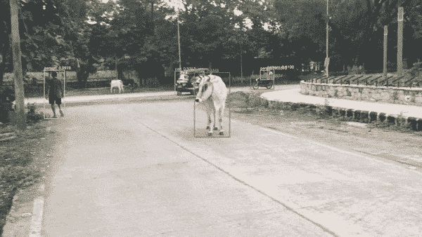****

****YOLO 能够对行走在印度道路上的奶牛进行分类****

****对于概念验证，请参见 **SSD-Mobilenet 模型的输出，该模型被训练用于根据印度招牌对印度交通标志进行分类。**你可以进一步对交通标志进行分类，以破译标志的确切含义。****

****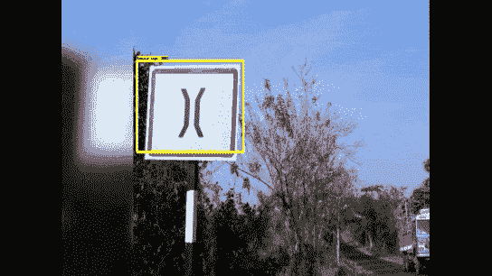****

****SSD-MobileNet 模型能够对印度交通标志(黄色 Bbox)和标志牌(绿色 Bbox)进行分类****

*****带注释的印度交通标志数据集由印度 Datacluster 实验室提供。他们还没有完成*“*印度车辆”数据库的注释。****只是训练时间问题*** *制造这个小玩意，为印度量身定做。*****

****为了从图像中找出 ROI，我们使用了 **SSD MobileNet** 对 COCO 进行了训练，过滤了潜在的对象。为了只检测人和车辆，你可以使用[这种](https://github.com/openvinotoolkit/training_extensions/tree/develop/models/object_detection/model_templates/person-vehicle-bike-detection/person-vehicle-bike-detection-2000)模式来获得更好的速度和准确性。****

****更重要的是，**可以用你定制的带注释的数据训练一个对象检测模型，用 OpenVINO** 做硬件优化，部署在 Pi 上，只要这些层受 OpenVINO 支持。通过这样做，我们可以在 RPi 上部署一个对象检测模型来定位定制对象。****

****1.首先，**选择针对低功耗硬件的高效对象检测模型**，如 **Efficientdet、SSD-Mobilenet、Tiny-YOLO、YOLOX** 等。**我在 RPi 4B 和 SSD-Mobilenet 上对所有提到的模型进行了实验** **获得了最高的 FPS。******

****2.**使用您的自定义数据进行对象检测模型**的迁移学习**。******

**3.**转换**经过培训的*。pb 文件**到中间表示** — *。xml 和*。使用**模型优化器的 bin。****

> **export PATH = "<omz_dir>/deployment _ tools/inference _ engine/demos/common/python/:$ PATH "</omz_dir>**
> 
> **python 3**<OMZ _ 目录>/部署 _ 工具/模型 _ 优化器/mo_tf.py** —输入 _ 模型<冻结 _ 图形. pb > —反向 _ 输入 _ 通道—输出 _ 目录<输出 _ 目录>—tensor flow _ object _ detection _ API _ pipeline _ config<到 SSD _ mobilenet _ v2 _ coco . config>的位置—tensor flow _ use _ custom _ operations _ config【T61**
> 
> **python 3 object _ detection _ demo . py-d CPU-I<input_video>—labels labels . txt-m<location of="" frozen_inference_graph.xml="">—在 ssd</location></input_video>**

**4.最后，**在 Pi 上部署硬件优化模型**。**

****此解决方案的完整源代码可在** [**此处**](https://github.com/AdroitAnandAI/ADAS-Collision-Avoidance-System-on-Indian-Roads) 获得**

*****如有任何疑问或建议，可在此*** 联系我<https://www.linkedin.com/in/ananduthaman/>**

# ***参考***

***1.**激光雷达-相机传感器融合高水平:【https://www.thinkautonomous.ai/blog/?】T43**p =自动驾驶汽车中的激光雷达和摄像头传感器融合***

***2.**Adafruit 的激光雷达数据扫描码存根:**[https://learn . Adafruit . com/remote-IOT-environmental-sensor/code](https://learn.adafruit.com/remote-iot-environmental-sensor/code)***

***3.**摄像机标定和内禀矩阵估计:**[https://www . cc . gatech . edu/classes/ay 2016/cs 4476 _ fall/results/proj 3/html/agartia 3/index . html](https://www.cc.gatech.edu/classes/AY2016/cs4476_fall/results/proj3/html/agartia3/index.html)***

***4.**自动驾驶汽车的视觉融合**PyImageSearch 大学的课程:【https://www.pyimagesearch.com/pyimagesearch-university/ ***

***5.【https://en.wikipedia.org/wiki/Lidar】激光雷达距离估计:***

***6. **RPLIDAR A1 M8 硬件规格:**[https://www . generation robots . com/media/RP lidar-A1 M8-360 度激光扫描仪-开发-套件-数据表-1.pdf](https://www.generationrobots.com/media/rplidar-a1m8-360-degree-laser-scanner-development-kit-datasheet-1.pdf)***

***7.**模型训练，数据清洗&增强:**[www.roboflow.com](http://www.roboflow.com)***

*****8。**印度交通标志模型已经使用由印度**数据集群实验室提供的**交通数据集**进行了训练。*****