# 在 Data Studio 中添加多个比较期间

> 原文：<https://towardsdatascience.com/add-multiple-comparison-periods-in-data-studio-533b41e71a5a>

## 一目了然地发现您的表现，比较不同的时间段

艾萨克·史密斯在 [Unsplash](https://unsplash.com/) 上拍摄的照片

# 介绍

您是否遇到过这样的情况:在分析数据时，您需要同时了解“以前”和“同比”的变化？你知道这不是科幻小说中的场景，当你想要执行一个完整而有洞察力的数据分析时，这种情况经常发生。🤓

Data Studio 是一个功能强大的工具，它为您提供了大量漂亮的图表来可视化您的数据并高效地讲述您的故事。但是，当您想要比较两个不同日期期间的数据性能时，会发生什么情况呢？

让我们考虑一下使用 Data Studio 时的直接选项:

1.  你可以决定你最想要什么，因为没有办法把两个比较日期加到一个图中。
2.  您创建了一个全新的页面(第一个页面的副本)来添加第二个比较期间。

好吧，不要失望，因为我有一个解决方案给你，这将引导你到一个美丽而有洞察力的视觉化。

# 该过程

出于本文的目的，我将使用来自谷歌商品商店的模拟账户的谷歌分析数据。当然，您可以使用任何来源的数据，包括历史信息。

## 过程背后的想法:我需要什么？

让我们再次运用我们的创新思维…

我将要描述的解决方案仅适用于**记分卡**，包括:

*   两个相同指标的记分卡。
*   每个记分卡的不同比较日期。
*   一点点定制看起来花里胡哨。

## 让我们这样做吧…

我将尽可能描述得更详细，以方便您的生活，并能够专注于您的数据，而不是可视化的机制。

## **第一步:连接你的数据源**

在开始为报表创建记分卡之前，您需要首先连接数据。

在 Data Studio 的众多连接器中进行选择…

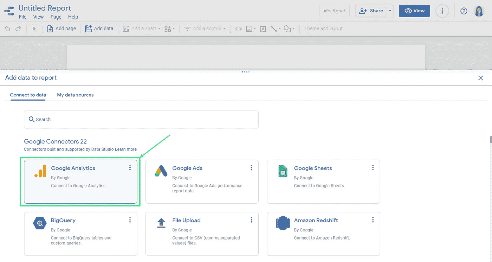

作者照片

…选择包含您要分析的数据的数据库…

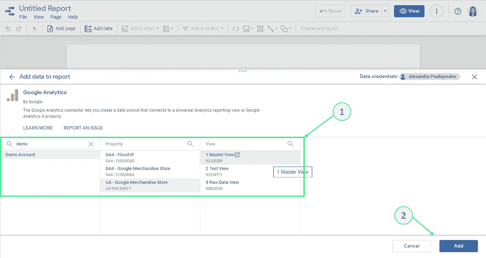

作者照片

…并将它们添加到您的报告中。

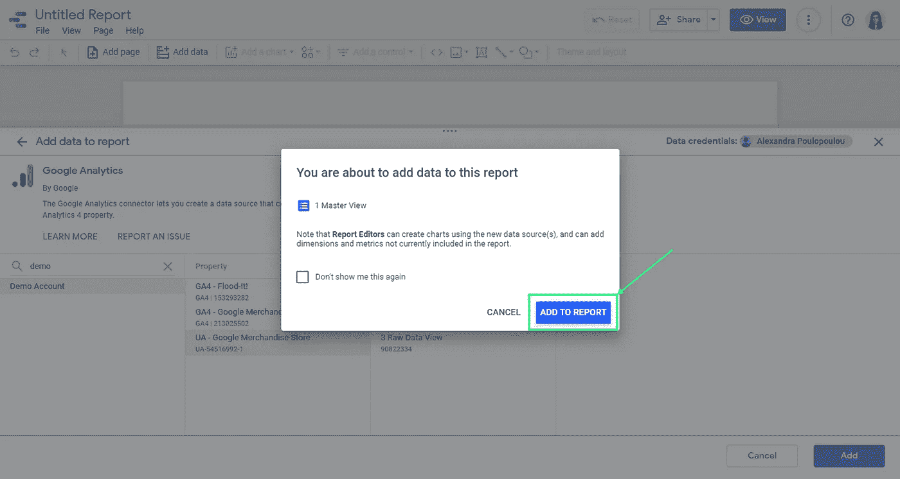

作者照片

## **第二步:创建你的第一张记分卡**

点击“添加图表”选项，选择“记分卡”选项…

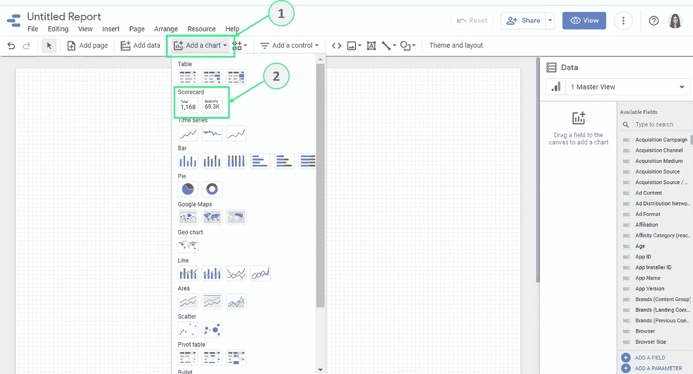

作者照片

…并为您的记分卡选择所需的指标。

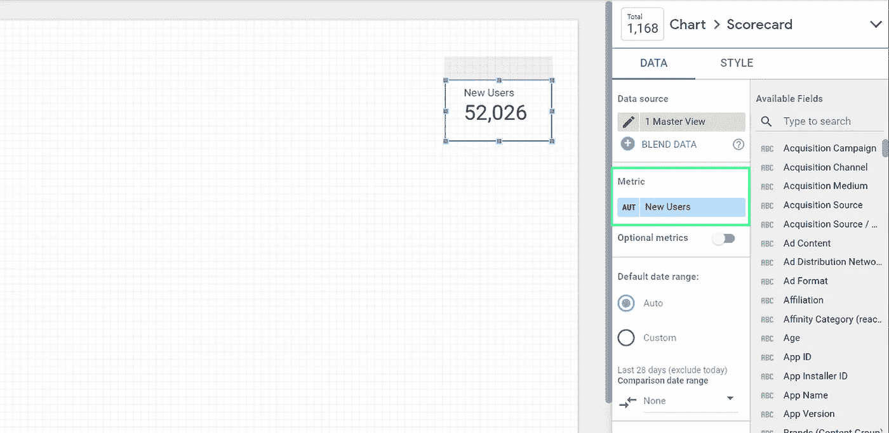

作者照片

## **第三步:选择您的主要比较日期**

转到“数据”窗格，向下滚动到“默认日期范围”部分，然后单击“比较日期范围”下拉菜单…

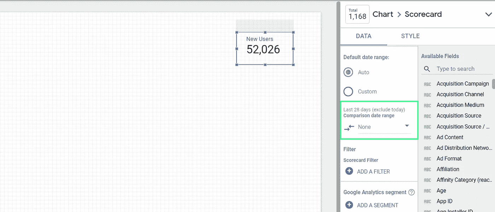

作者照片

…选择“前期”选项，然后单击“应用”。

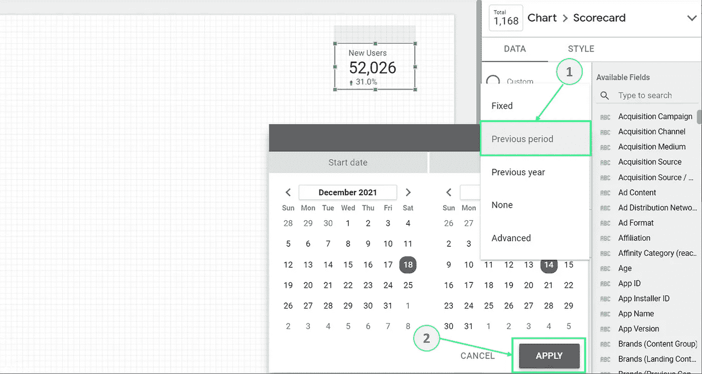

作者照片

## **步骤 4:复制您的记分卡**

使用完全相同的指标复制您的记分卡，以便创建二级比较计算。

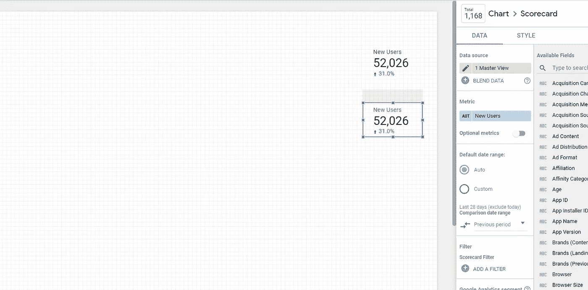

作者照片

## **第五步:选择你的第二比较日期**

对于第二个记分卡，选择“上一年”选项，遵循与之前相同的步骤。

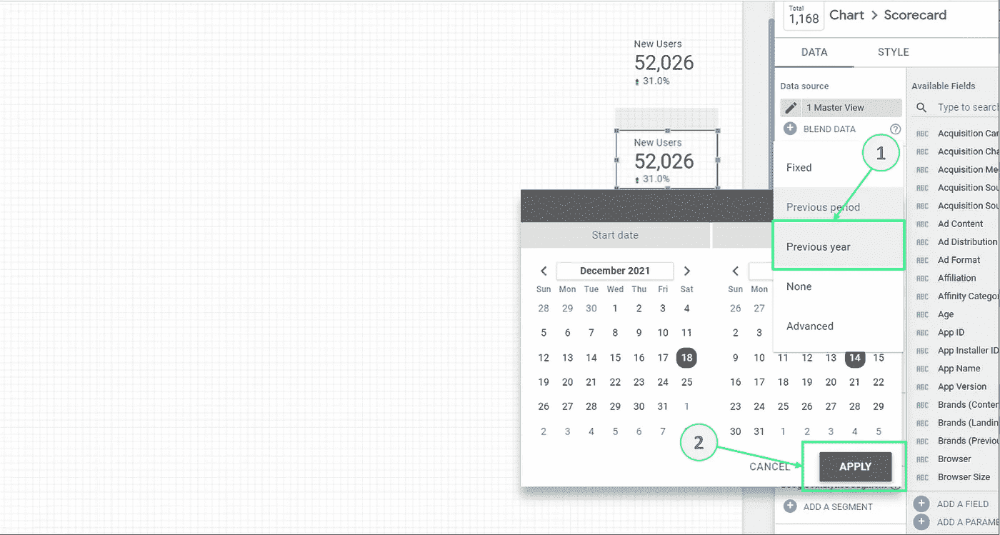

作者照片

## **第六步:让你的视觉富有洞察力**

更改第二个记分卡的标签颜色—我选择白色，因为我的背景颜色，但您应该选择与仪表板背景相匹配的颜色。

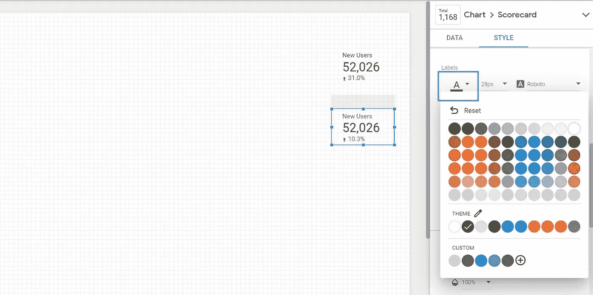

作者照片

正确安排图表——将第二张记分卡放在后面，或者将第一张放在前面。

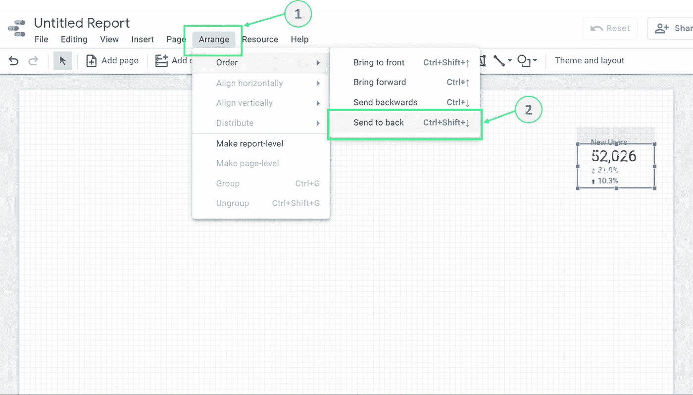

作者照片

转到“填充”部分，从“行高”下拉列表中为您的主要记分卡留出一些空间，我通常选择 48，但这取决于您。

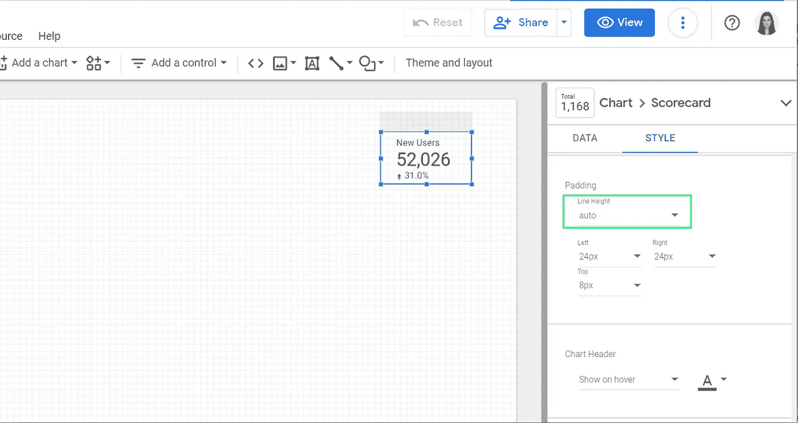

作者照片

为比较添加标签，并为文本选择更中性的颜色，以使视觉效果易于阅读。

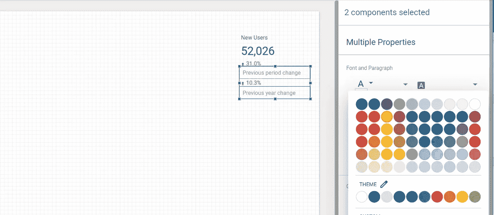

作者照片

## **第七步:向仪表盘添加更多数据**

你不必就此打住！将更多信息添加到您的仪表板，以讲述您的完整故事…

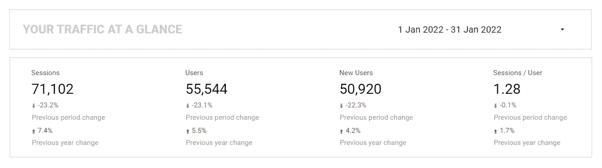

作者照片

这就对了！！！✨

# 最后的想法

我已经说过很多次我对 Data Studio 的钦佩。这是一个强大的工具，在可视化方面有很多选项。其中一些是直截了当的，而另一些则需要更多的挖掘。但是没有一次我不能得到我想要的任何东西。所以，每当你在使用 Data Studio 得到你想要的东西时遇到困难，后退一步，想得更简单，尝试不同的解决方案，直到你得到你想要的结果…我告诉你，你永远不会输。

> 我叫 Alexandra Poulopoulou，是希腊 Reprise Digital 的一名数据和分析架构师。在我的职业生涯中，我参与了几个分析项目，以推动成功的商业决策。
> 
> 如果你喜欢刚刚阅读的内容，请在 [Medium](https://apoulopoulou.medium.com/) 、 [LinkedIn](http://www.linkedin.com/in/alexandra-poulopoulou-93a72313b) 或 [Twitter](https://twitter.com/alexpoulopoulou) 上关注我，了解更多信息。
> 
> 如果你愿意支持我们的努力，你可以点击并订阅[这里](https://apoulopoulou.medium.com/membership)。