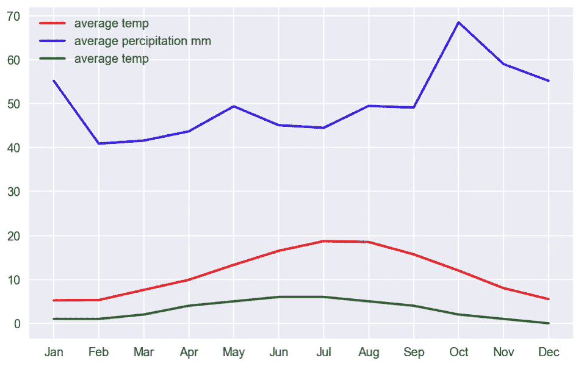
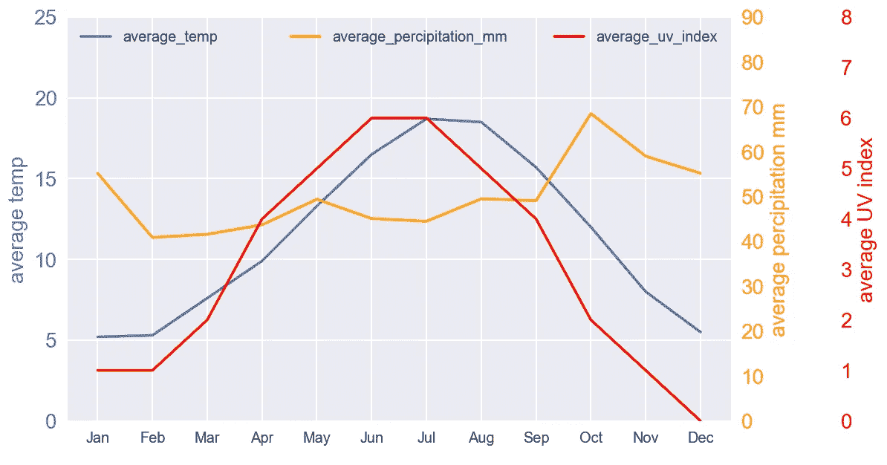
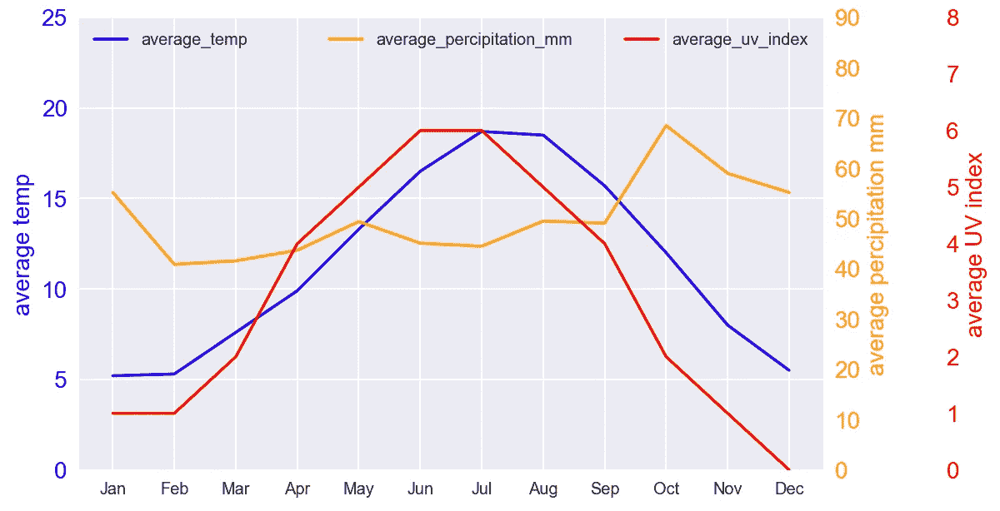
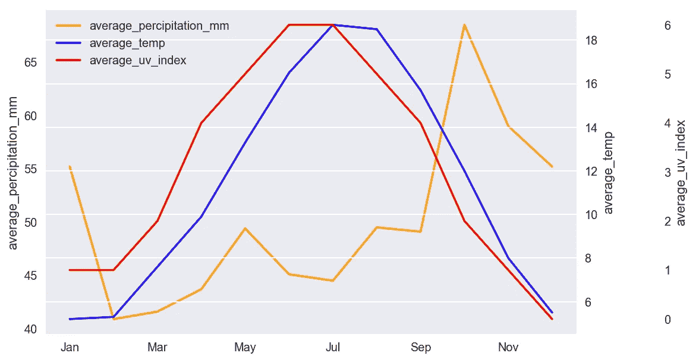

# 向 Python 组合图添加第三个 Y 轴

> 原文：<https://towardsdatascience.com/adding-a-third-y-axis-to-python-combo-chart-39f60fb66708>

## 使用 Matplotlib、Seaborn 和 Pandas plot()创建多 Y 轴组合图的实践教程


由[艾萨克·史密斯](https://unsplash.com/@isaacmsmith?utm_source=unsplash&utm_medium=referral&utm_content=creditCopyText)在 [Unsplash](https://unsplash.com/s/photos/data-visualization?utm_source=unsplash&utm_medium=referral&utm_content=creditCopyText) 上拍摄的照片

> *可视化数据对于分析数据至关重要。如果你看不到你的数据——从多方面看，你将很难分析这些数据。*
> 
> *来源于 Python 数据【1】*

Python 中有许多不同的图形来可视化数据，幸好有 Matplotlib、Seaborn、Pandas、Plotly 等。在数据分析过程中，你可以做一些非常强大的可视化。其中**组合图**是在同一个图形上两种图表类型(如条形图和折线图)的组合。这是 Excel 最受欢迎的内置图表之一，广泛用于显示不同类型的信息。

在之前的[文章](/creating-a-dual-axis-combo-chart-in-python-52624b187834)中，我们已经讨论了如何创建双轴组合图。在某些情况下，添加第三个或更多的 y 轴非常有用，可以直观地突出不同数据集之间的差异。在本文中，我们将探索如何用 Matplotlib、Seaborn 和 Pandas `plot()`添加第三个 y 轴。这篇文章的结构如下:

1.  Matplotlib
2.  海生的
3.  熊猫`plot()`

> 请查看[笔记本](https://github.com/BindiChen/machine-learning/blob/main/data-visualization/0010-multiple-y-axis/multiple-y-axis-combo-chart.ipynb)获取源代码。更多教程可从 [Github Repo](https://github.com/BindiChen/machine-learning) 获得。

为了演示，我们将使用来自维基百科的[伦敦气候数据](https://en.wikipedia.org/wiki/London):

```
**x** = ['Jan', 'Feb', 'Mar', 'Apr', 'May', 'Jun', 'Jul', 'Aug', 'Sep', 'Oct', 'Nov', 'Dec']
**average_temp** = [5.2, 5.3,7.6,9.9,13.3,16.5,18.7, 18.5, 15.7, 12.0, 8.0, 5.5]
**average_percipitation_mm** = [55.2, 40.9, 41.6, 43.7, 49.4, 45.1, 44.5, 49.5, 49.1, 68.5, 59.0, 55.2]
**average_uv_index** = [1,1,2,4,5,6,6,5,4,2,1,0]london_climate = pd.DataFrame(
  {
    'average_temp': average_temp,
    'average_percipitation_mm': average_percipitation_mm,
    'average_uv_index': average_uv_index
  }, 
  index=x
)
```

在同一个图表上绘制多个图表非常容易。例如，使用 Matplotlib，我们可以简单地一个接一个地调用图表函数。

```
plt.**plot**(x, average_temp, "-r", label="average temp")
plt.**plot**(x, average_percipitation_mm, "-b", label="average percipitation mm", )
plt.**plot**(x, average_uv_index, "-g", label="average temp")plt.legend(loc="upper left")
plt.show()
```



单轴组合图(图片由作者提供)

这当然会创建一个组合图，但是所有的线条都使用相同的 Y 轴。查看和解释可能非常困难，尤其是当数据在不同的范围内时。我们可以使用多个 Y 轴来改进它。但是一开始使用多个 Y 轴可能会有点混乱。让我们继续探索如何向 Python 组合图添加第三个 Y 轴。

# 1.Matplotlib 添加第三个 Y 轴

在上一篇文章中，我们已经学习了通过调用`twin()`生成共享同一 X 轴的两个独立的 Y 轴来制作双轴组合图的技巧。通过创建另一个`twinx()`轴并使用`set_postion()`偏移第三个轴的右脊椎位置，可以类似地创建第三个 y 轴:

```
# Create figure and axis #1
fig, ax1 = plt.subplots()# plot line chart on axis #1
p1, = ax1.plot(x, average_temp) 
ax1.set_ylabel('average temp')
ax1.set_ylim(0, 25)
ax1.legend(['average_temp'], loc="upper left")
ax1.yaxis.label.set_color(p1.get_color())
ax1.yaxis.label.set_fontsize(14)
ax1.tick_params(axis='y', colors=p1.get_color(), labelsize=14)# set up the 2nd axis
**ax2 = ax1.twinx()** 
# plot bar chart on axis #2
p2, = ax2.plot(x, average_percipitation_mm, color='orange')
ax2.grid(False) # turn off grid #2
ax2.set_ylabel('average percipitation mm')
ax2.set_ylim(0, 90)
ax2.legend(['average_percipitation_mm'], loc="upper center")
ax2.yaxis.label.set_color(p2.get_color())
ax2.yaxis.label.set_fontsize(14)
ax2.tick_params(axis='y', colors=p2.get_color(), labelsize=14)# set up the 3rd axis
**ax3 = ax1.twinx()**
# Offset the right spine of ax3\.  The ticks and label have already been placed on the right by twinx above.
**ax3.spines.right.set_position(("axes", 1.15))**
# Plot line chart on axis #3
p3, = ax3.plot(x, average_uv_index, color='red')
ax3.grid(False) # turn off grid #3
ax3.set_ylabel('average UV index')
ax3.set_ylim(0, 8)
ax3.legend(['average_uv_index'], loc="upper right")
ax3.yaxis.label.set_color(p3.get_color())
ax3.yaxis.label.set_fontsize(14)
ax3.tick_params(axis='y', colors=p3.get_color(), labelsize=14)plt.show()
```

像我们通常做的那样，在`ax1`上绘制第一条线图。我们调用`ax2 = ax1.twinx()`来设置第二轴并绘制第二线图。之后，我们再次调用`ax3 = ax1.twinx()`来设置第三轴并绘制第三线图。窍门是调用`ax3.spines.right.set_position(("axes", 1.15))`偏移`ax3`的右脊线。请注意，调用`ax2.grid(False)`和`ax3.grid(False)`是为了避免网格显示问题。通过执行代码，您应该得到以下输出:



使用 Matplotlib 的第三个 y 轴组合图(图片由作者提供)

# 3.Seaborn 添加第三个 Y 轴

Seaborn 是一个构建在 ***Matplotlib*** 之上的高级数据可视化库。在幕后，它使用 ***Matplotlib*** 来绘制它的情节。对于底层配置和设置，我们总是可以调用 ***Matplotlib*** 的 API，这就是在 ***Seaborn*** 中制作多 Y 轴组合图的诀窍:

```
# plot line chart on axis #1
ax1 = sns.lineplot(
    x=london_climate.index, 
    y='average_temp', 
    data=london_climate, 
    sort=False, 
    color='blue'
)
ax1.set_ylabel('average temp')
ax1.set_ylim(0, 25)
ax1.legend(['average_temp'], loc="upper left")
ax1.yaxis.label.set_color('blue')
ax1.yaxis.label.set_fontsize(14)
ax1.tick_params(axis='y', colors='blue', labelsize=14)# set up the 2nd axis
**ax2 = ax1.twinx()**
# plot bar chart on axis #2
sns.lineplot(
    x=london_climate.index, 
    y='average_percipitation_mm', 
    data=london_climate, 
    sort=False, 
    color='orange', 
    **ax = ax2**       # Pre-existing axes for the plot
)
ax2.grid(False) # turn off grid #2
ax2.set_ylabel('average percipitation mm')
ax2.set_ylim(0, 90)
ax2.legend(['average_percipitation_mm'], loc="upper center")
ax2.yaxis.label.set_color('orange')
ax2.yaxis.label.set_fontsize(14)
ax2.tick_params(axis='y', colors='orange', labelsize=14)# set up the 3rd axis
**ax3 = ax1.twinx()**
# Offset the right spine of ax3\. The ticks and label have already been placed on the right by twinx above.
**ax3.spines.right.set_position(("axes", 1.15))**
# Plot line chart on axis #3
p3 = sns.lineplot(
    x=london_climate.index, 
    y='average_uv_index', 
    data=london_climate, 
    sort=False, 
    color='red', 
    **ax = ax3**       # Pre-existing axes for the plot
)
ax3.grid(False) # turn off grid #3
ax3.set_ylabel('average UV index')
ax3.set_ylim(0, 8)
ax3.legend(['average_uv_index'], loc="upper right")
ax3.yaxis.label.set_color('red')
ax3.yaxis.label.set_fontsize(14)
ax3.tick_params(axis='y', colors='red', labelsize=14)plt.show()
```

`sns.lineplot()`返回一个 Matplotlib 轴对象`ax1`。然后，类似于 Matplotlib 解决方案，我们调用`ax2 = ax1.twinx()`来设置第二个轴。之后，使用参数`ax = ax2`调用`sns.lineplot()`在现有轴`ax2`上绘图。对于第 3 行，我们再次调用`ax3 = ax1.twinx()`来设置第 3 轴，并使用参数`ax=ax3`调用`sns.lineplot()`在现有轴`ax3`上绘图。我们应用同样的技巧`ax3.spines.right.set_position(("axes", 1.15))`来偏移`ax3`的右脊椎。通过执行代码，您应该得到以下输出:



使用 Seaborn 的第三个 y 轴组合图(图片由作者提供)

# 4.熊猫图()-添加第三个 Y 轴

熊猫用`plot()`法制作图表。默认情况下，它调用 Matplotlib 的 API。我们可以将参数`secondary_y`设置为`True`，以允许在辅助 Y 轴上绘制第二个图表。要添加带有第三个 Y 轴的第三个图表，我们可以应用与之前相同的技巧。

```
# Create the figure and axes object
fig, ax = plt.subplots()# Plot the first x and y axes:
london_climate.plot(
    use_index=True, 
    y='average_percipitation_mm', 
    **ax=ax,** 
    color='orange'
)
ax.set_ylabel('average_percipitation_mm')# Plot the second x and y axes. 
# By secondary_y = True a second y-axis is requested
ax2 = london_climate.plot(
    use_index=True, 
    y='average_temp', 
    **ax=ax,** 
    **secondary_y=True,** 
    color='blue'
)
ax.legend().set_visible(False)
ax2.set_ylabel('average_temp')# Plot the third x and y axes
**ax3 = ax.twinx()
ax3.spines.right.set_position(("axes", 1.15))**
london_climate.plot(
    use_index=True, 
    y='average_uv_index', 
    **ax=ax3,** 
    color='red'
)
ax3.grid(False)
ax3.set_ylabel('average_uv_index')# Set up legends
ax3.legend(
    [ax.get_lines()[0], ax2.get_lines()[0], ax3.get_lines()[0]], 
    ['average_percipitation_mm','average_temp','average_uv_index'], 
    loc="upper left"
)plt.show()
```

注意，我们设置`use_index=True`使用索引作为 x 轴的刻度。通过执行代码，您应该得到以下输出:



使用熊猫图()的第三个 y 轴组合图(图片由作者提供)

# 结论

在本文中，我们学习了如何用****Seaborn***和 ***Pandas*** `plot()`创建一个多 Y 轴组合图。组合图是数据可视化中最流行的图表之一，知道如何创建多 Y 轴组合图对分析数据非常有帮助。*

*感谢阅读。请查看[笔记本](https://github.com/BindiChen/machine-learning/blob/main/data-visualization/0010-multiple-y-axis/multiple-y-axis-combo-chart.ipynb)获取源代码，如果您对机器学习的实用方面感兴趣，请继续关注。更多教程可从 [Github Repo](https://github.com/BindiChen/machine-learning) 获得。*

# *参考*

*   *[1] Python 数据— [可视化数据—用 Python 叠加图表](https://pythondata.com/visualizing-data-overlaying-charts/)*