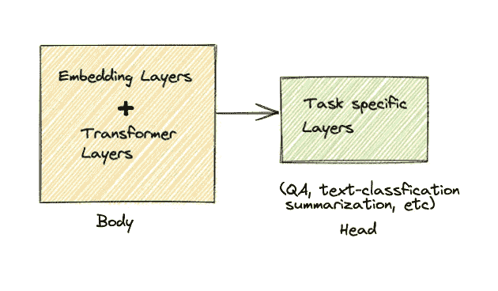
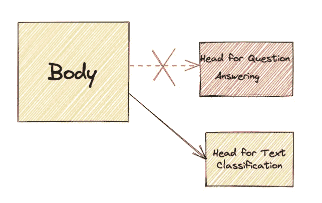
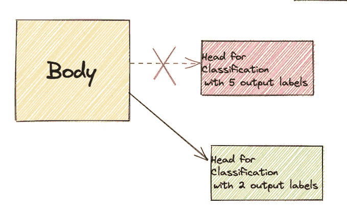
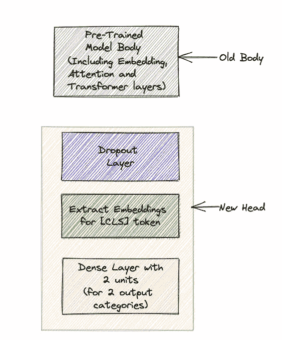

# 在拥抱脸模型上添加自定义层

> 原文：<https://towardsdatascience.com/adding-custom-layers-on-top-of-a-hugging-face-model-f1ccdfc257bd>

## 了解如何从拥抱脸模型体中提取隐藏状态，在其上修改/添加特定于任务的层，并使用 PyTorch 端到端地训练整个自定义设置

在开始之前，这篇文章假设对拥抱脸有基本的了解(使用开箱即用的模型)。此外，在 [**拥抱脸**](https://huggingface.co/) 的人们大声喊出来，建立一个对初学者友好的学习环境！

# 你会从这个博客中学到什么？

1.  从拥抱面部中枢使用特定于任务的模型，并使它们适应你手头的任务。
2.  将模型的头部与身体分离，并使用身体来利用特定领域的知识。
3.  在 PyTorch 中构建一个定制的头部并将其连接到 HF 模型的主体上，并对系统进行端到端的训练。

# 拥抱脸模型的剖析

这是一个典型的高频模型的样子



作者图片

# 为什么我需要分别使用头部和身体？

拥抱脸的一些模型在问答或文本分类等下游任务中接受训练，并包含关于它们在权重中接受训练的数据的知识。

**有时，特别是当我们手头的任务包含非常少的数据或者是特定领域的任务(如医疗或体育特定任务)时，我们可以利用** [***中枢***](https://huggingface.co/models) **上接受过任务*(不一定与我们手头的任务相同，但属于同一领域，如体育或医疗)*训练的其他模型，并利用这些模型的一些预先训练的知识来提高我们自己任务的性能。**

1.  一个非常简单的例子是，假设我们**有一个小数据集**来分类一些财务报表在情绪方面是积极的还是消极的。**然而，我们去了中心，发现很多模型已经被训练用于与金融相关的 QA。我们可以从这些模型中使用**T21s**来改进我们自己的任务。**
2.  另一个简单的例子是，当某个特定于领域的模型已经学会从一个巨大的数据集中将文本分类成 5 个类别时，它是在上被训练的。**假设我们有一个相似的分类任务，一个完全不同的数据集在同一个域中，我们只想将数据分为 2 类而不是 5 类。我们可以再次使用模特的身体，并添加我们自己的头部，试图在我们自己的任务中增加特定领域的知识。**

概略地说，这就是我们正在努力做的



作者图片



作者图片

# 跳入代码！

**我们的任务很简单，讥讽检测来自 Kaggle 的**<https://www.kaggle.com/rmisra/news-headlines-dataset-for-sarcasm-detection>****数据集。****

****你可以在这里** **查看完整代码** [**。出于时间的考虑，我没有包括下面的预处理和一些训练细节，所以请确保查看笔记本以获得完整的代码。**](https://jovian.ai/rajbsangani/emotion-tuned-sarcasm)**

***我将使用一个在巨大的推特语料库上训练的具有 5 个分类输出的模型来分类 5 种不同的情绪，提取身体并在 PyTorch 中为我们的任务添加自定义层(2 个标签，讽刺和非讽刺)，并端到端地训练新模型。***

****注意:您可以使用本例中的任何模型(不一定是为分类而训练的模型)，因为我们将只使用该模型的身体，而不使用头部。****

**这就是我们的工作流程**

****

**作者图片**

**我将跳过数据预处理步骤，直接跳到主类，但是您可以在本节开头的链接中查看完整的代码。**

## **标记化和动态填充**

## **提取身体并添加我们自己的层**

****如你所见，我们首先从 PyTorch 中派生出 nn 模块的子类，使用 AutoModel(从 transformers 中)提取模型主体，并向我们想要使用其主体的模型提供检查点。****

***注意，返回一个****token classifier output(来自变形金刚库)*** *，这确保我们的输出与中枢上的拥抱人脸模型的输出格式相似。***

## **端到端培训新模型**

**如您所见，我们使用这种方法获得了不错的性能。**请记住，这篇博客的目的不是分析这个特定数据集的性能，而是学习如何使用预先训练好的身体并添加自定义头部。****

# **结论**

**我们看到了如何使用 Hugging Face Hub 向预训练模型的身体添加自定义层。**

**一些要点:**

1.  **这种技术在以下情况下特别有用:我们有特定于领域的小型数据集，并且希望利用在同一领域(任务不可知)的大型数据集上训练的模型来提高小型数据集的性能。**
2.  **我们可以选择已经在不同于我们自己的任务的下游任务上训练过的模型，并且仍然使用来自该模型主体的知识。**
3.  **如果您的数据集足够大且通用，这可能完全没有必要，在这种情况下，您可以使用 AutoModelForSequenceClassification 或任何其他您必须使用类似 BERT 的检查点来解决的任务。事实上，如果是这样的话，我会强烈建议不要构建自己的头部。**

**查看我的 [**GitHub**](https://github.com/rajlm10) 其他一些项目。可以联系我 [***这里***](https://rajsangani.me/) ***。*** 感谢您的配合！**

**如果你喜欢这个，这里还有一些！**

**</interpreting-an-lstm-through-lime-e294e6ed3a03>  </locality-sensitive-hashing-in-nlp-1fb3d4a7ba9f>  </dealing-with-features-that-have-high-cardinality-1c9212d7ff1b>  </powerful-text-augmentation-using-nlpaug-5851099b4e97>  </regex-essential-for-nlp-ee0336ef988d>  

# 参考

1.  [令人惊叹的拥抱脸示例部分！](https://huggingface.co/course/chapter3/1?fw=pt)
2.  数据集的引用和数据集[的引用](https://rishabhmisra.github.io/publications/)

```
@article{misra2019sarcasm,
  title={Sarcasm Detection using Hybrid Neural Network},
  author={Misra, Rishabh and Arora, Prahal},
  journal={arXiv preprint arXiv:1908.07414},
  year={2019}
}
```