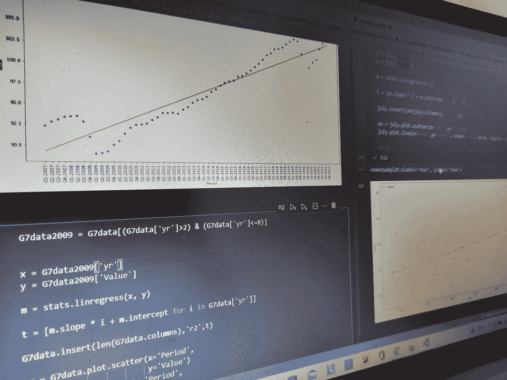
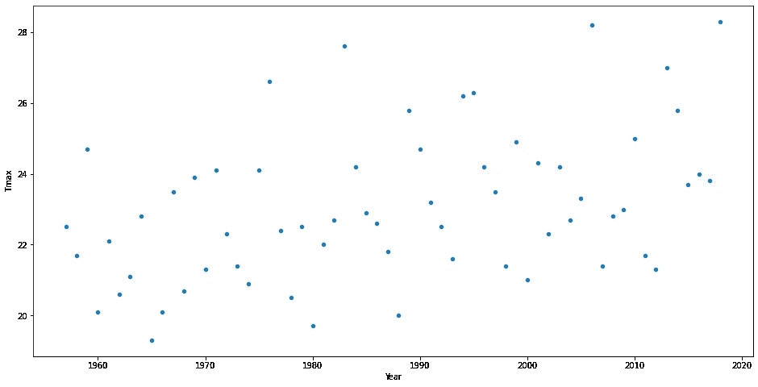
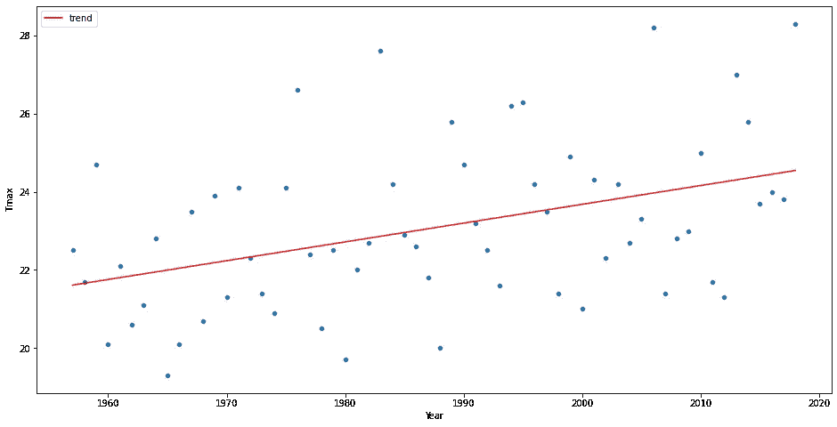
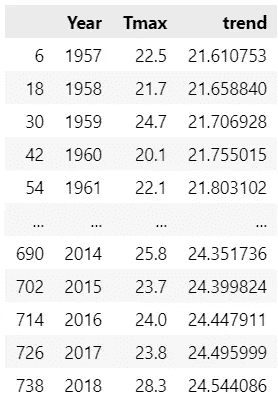
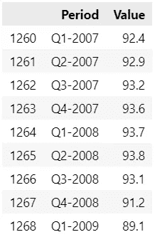
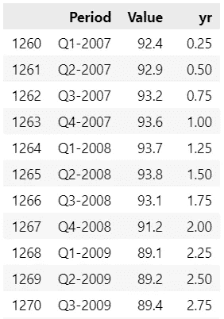
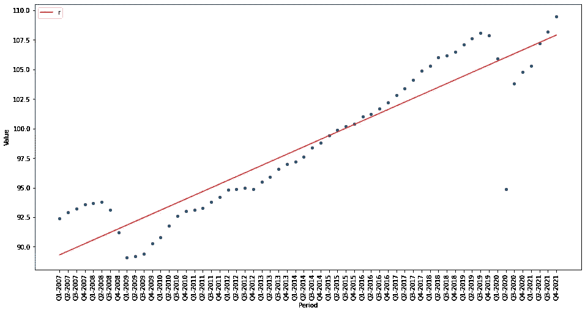
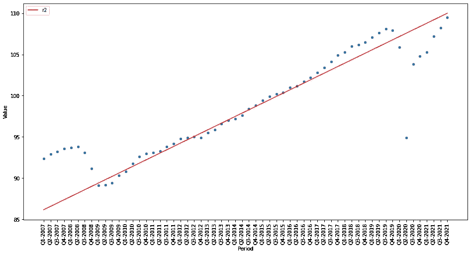

# 熊猫和 SciPy 的回归图

> 原文：<https://towardsdatascience.com/adding-regression-lines-to-pandas-plots-with-scipy-2e23fd524adb>

## 回归可用于预测未来或识别数据中的趋势和关系



作者图片

回归模型可用于两个不同的目的，发现数据趋势和进行预测。

Plain old Pandas plots 没有内置回归功能，但可以使用 SciPy 轻松生成，用他们自己的话说，SciPy 库提供了“Python 中科学计算的基本算法”。我们将使用的 SciPy API 部分是包含回归功能的 *scipy.stats* 。

在本文中，我们将首先了解如何构建一个简单的回归模型来揭示数据的趋势，然后我们将继续了解如何将回归模型用作预测器。

## 寻找趋势

我在伦敦及其周边生活了很多年，感觉那里的夏天越来越暖和了。它们是真的还是我想象出来的？如果是 15 或 25 岁，所有那些在夏日阳光的第一个迹象出现在摄政公园的赤裸上身的比基尼男女都会在那里，所以这种间接证据没有多大帮助。我们需要数字，幸运的是我们有一些。

在本文的第一部分，我们将看看伦敦过去几十年的夏季平均气温，看看我们能否得出任何关于首都变暖的结论。

我们将使用一些来自英国气象局公开数据的数字。你可以在这里下载[—另存为`londonweather.csv`](https://raw.githubusercontent.com/alanjones2/dataviz/master/londonweather.csv)

这里的所有代码都是作为 Jupyter 笔记本用 Python 开发的，下面的每个代码块代表笔记本中的单个单元。

让我们导入库。

```
import pandas as pd
from scipy import stats
```

只有两个库:Pandas，因为我们将使用数据帧，并用 Pandas 绘图函数绘制结果；我们从 SciPy 导入了 *stats* 模块。

首先，我们将数据加载到名为`weather`的数据帧中。您下载的数据不仅仅包含全年的温度数据，因此我们将对其进行过滤，去掉我们不会用到的数据。基本上，我们只想要七月的最高温度(那通常是最热的夏季)。每个月的最高温度在`Tmax`栏中给出。

因此，我们通过只选择七月(`'Month == 7'`)来从`weather`创建数据帧`july`，然后我们只复制列`Year`和`Tmax.`

我们现在有一个包含伦敦 1957 年至 2018 年 7 月最高温度的数据框架。

在这里，我们使用 Pandas 的`scatter`函数绘制了一个散点图。

```
weather = pd.read_csv('londonweather.csv')

july = weather.query('Month == 7')[['Year','Tmax']]
july.plot.scatter(y='Tmax',x='Year', figsize = (16,8))
```



作者图片

这些点几乎无处不在，很难看出一个清晰的趋势。尽管在以后的几年里气温可能会更高——看起来图表的左上角和右下角有相对较空的区域，这表明在最初的几年里高温较少，而在以后的几年里低温较少。

为了验证这一点，我们将使用 SciPy 的`stats.linregress`函数构建一个简单的线性回归模型。该函数有两个参数，都是列表。列表是构建模型的 *x* 和 *y* 值，在我们的例子中 *x* 是年份， *y* 是七月的最高温度。

从包含模型参数的函数返回一个对象。这里我们使用截距和斜率的值来计算代表回归线的值列表，并将它们添加到名为`trend`的新 dataframe 列中。

完成这些后，我们现在绘制原始散点图和趋势线图。

```
x = july['Year']
y = july['Tmax']m = stats.linregress(x, y)t = [m.slope * i + m.intercept for i in x]july.insert(len(july.columns),'trend',t)ax = july.plot.scatter(x='Year',
                       y='Tmax')
july.plot.line(x='Year',
               y='trend', 
               color='red', 
               ax=ax, 
               figsize = (16,8))
```



作者图片

现在可以清楚地看到有上升的趋势。如果我们看一下数据图，我们可以看到，我们的趋势线显示，从 1957 年到 2018 年，气温上升了近 3 摄氏度。



作者图片

通过肉眼观察数据，我们可能会发现温度的上升，但是添加一条回归线会使观察变得容易得多。

因此，我们可以看到回归线如何有助于发现模式。接下来我们将看看它的预测能力。

## 预测值

我们将使用的下一个数据集是经济合作与发展组织 **(** OECD)公开提供的 G7 国家集团的国内生产总值(GDP)。

GDP 本质上是对一个国家财富的衡量，但我们的数据并没有显示绝对值，而是代表了 GDP 随时间的变化。因此，它们是衡量经济增长的指标。从 2007 年到 2021 年，记录了一年中每个季度的数据，每个值都与 2015 年的 GDP 相关。2015 年的国内生产总值被认为是 100，所以如果加拿大的国内生产总值在 2007 年第一季度是 88.1，这意味着实际的国内生产总值是 2015 年加拿大国内生产总值的 88.1%。

由于国内生产总值通常会随着时间的推移而逐渐增加，数据往往显示 2015 年之前的数值略低于 100，而在以后几年略高。然而，经济冲击，如 2008 年的金融危机和当前的乔维德疫情可能会导致所有国家的国内生产总值迅速下降。

你可以在这里下载我的数据副本。将其保存为`QNA_26022022111050612.csv` (这是它的正式名称——如果你愿意，可以称之为更简单的名称，但要记得相应地修改下面的代码)。

下面的代码将数据加载到 dataframe 中并对其进行过滤:首先，我们只需要*卷*数据 VIXOBSA(如上所述)，并且我们只对 G7 国家感兴趣。代码

`(gdpdata['MEASURE']=='VIXOBSA') & (gdpdata['Country']=='G7')`

为我们做过滤。

然后我们进一步减少数据，只复制列`Period`(例如，Q1 2007)和`Value`(GDP 数字)。

```
gdpdata = pd.read_csv('QNA_26022022111050612.csv')

G7data = gdpdata[(gdpdata['MEASURE']=='VIXOBSA') 
               & (gdpdata['Country']=='G7')]

G7data = G7data[['Period','Value']]
```

产生的数据框架来自 Q1–2007 年第四季度–2021 年，如下所示:



作者图片

Period 列不是一个非常有用的格式，所以我将在数据帧中添加一个新列`yr`,如下所示:

```
def formyr(x,data):
   d = data['Period'].values[x]
   y= int(d[-4:])+int(d[1:2])*0.25 - 2007
   return y yr=[formyr(x,G7data) for x in range(len(G7data)) ]
G7data['yr'] = yr
```

现在看起来是这样的:



作者图片

新列表示特定条目的年份，并从零开始编号。季度由季度表示，所以 Q1 2007 年是 0.25，而 2009 年第三季度是 2.75。这个数字列使得创建模型更加容易。

现在，我们以与之前相同的方式制作模型，绘制原始数据的散点图，并在其上覆盖回归图。

```
x = G7data['yr']
y = G7data['Value']m = stats.linregress(x, y)t = [m.slope * i + m.intercept for i in x]
G7data.insert(len(G7data.columns),'r',t)ax = G7data.plot.scatter(x='Period',
                         y='Value')
G7data.plot.line(x='Period',
                 y='r', 
                 color='red', 
                 ax=ax, 
                 figsize = (16,8), 
                 rot=90)
```



作者图片

我们可以看到，在整个时期内创建一个模型会产生一条趋势线，但这并不是一个特别好的预测指标。这是因为 2008 年和 2020 年的重大事件导致了如此大的增长波动。

然而，我们可以看到，在两次重大中断之间，增长相当一致。所以我们可以在这中间的几年里尝试一个模型。让我们创建一个模型，从第 2 年到第 8 年(即 2009 年到 2014 年)的数据开始，看看这是否更有意义。

下面的代码就是这么做的。该模型是在中间年份创建的，然后应用于整个范围。

```
G7data2009 = G7data[(G7data['yr']>2) & (G7data['yr']<=8)]x = G7data2009['yr']
y = G7data2009['Value']m = stats.linregress(x, y)t = [m.slope * i + m.intercept for i in G7data['yr']]G7data.insert(len(G7data.columns),'r2',t)ax = G7data.plot.scatter(x='Period',
                         y='Value')
ax = G7data.plot.line(x='Period',
                      y='r2', 
                      color='red', 
                      ax=ax, 
                      figsize = (16,8), 
                      rot=90)
```

看下面的图，我们可以看到模型在预测 2009 年到 2019 年底之间相对稳定的时间方面做得相当好。



作者图片

那么，这告诉我们什么呢？

我认为有两件事:

1.  在“正常”情况下，一个简单的回归模型可以用来进行预测
2.  现实生活中发生的随机事件是无法预测的

模型总是对现实的简化，有时它们在预测未来趋势时很有用，但有时随机事件会介入并使它们出错。

我希望你已经通过回归图的使用以及如何用 SciPy 将它们轻松地添加到熊猫图中享受了这次漫游。你可以欣赏它们被用来识别模式或进行预测的方式。但是你也要意识到，随机事件会打乱任何预测模型，不管它有多复杂(或者在这种情况下很简单)。

一如既往地感谢您的阅读，如果您想知道我何时发表新文章，请考虑注册下面的电子邮件提醒，或者订阅我在 [Substack](https://technofile.substack.com/) 上偶尔发布的免费简讯。

如果你还不是一个媒体订阅者，那就注册吧，这样你就可以每月花 5 美元阅读尽可能多的文章。在这里注册，我将赚取一小笔佣金。

## 密码

你可以下载一个 Jupyter 笔记本，里面有我的 Github 资源库中的所有代码，这里是。

## 脚注

1.  英国气象局的数据来源于 https://www . metofice . gov . uk/research/climate/maps-and-data/historic-station-data 的记录，并由我根据[开放政府许可](https://www.nationalarchives.gov.uk/doc/open-government-licence/version/3/)的条款进行了修改
2.  经合组织(2022 年)，*季度国民账户:七国集团国民生产总值 EI 副本*，网址:[https://stats.oecd.org/Index.aspx?QueryId=77241](https://stats.oecd.org/Index.aspx?QueryId=77241)(2022 年 2 月 26 日访问)