# 解决过度拟合 2023 指南— 13 种方法

> 原文：<https://towardsdatascience.com/addressing-overfitting-2023-guide-13-methods-8fd4e04fc8>

## 您的一站式学习场所，了解防止机器学习和深度学习模型过度拟合的 13 种有效方法


埃里克·范·迪克在 [Unsplash](https://unsplash.com/?utm_source=unsplash&utm_medium=referral&utm_content=creditCopyText) 上的照片

***谁不喜欢为大多数数据科学家面临的最糟糕的问题寻找解决方案呢？【过拟合问题】***

本文可能是学习机器学习和深度学习模型中防止过拟合的许多有效方法的一站式地方。

# 过度拟合会发生什么？

过度拟合通常发生在模型*过于复杂*的时候。当模型过度拟合训练数据时，会发生以下情况:

*   **模型试图记忆训练数据，而不是从数据中学习基本模式。**机器学习涉及*从数据中学习*模式和规则，而不是*记忆*数据。
*   **该模型仅在训练数据上表现良好，而在新的未知数据上表现不佳。**一个好的模型应该能够在训练数据上表现良好，并且能够在新的未知数据上进行很好的概括。

# 如何检测过度拟合

下一个问题是:

> 我们如何识别机器学习和深度学习模型中的过拟合？

## 使用学习曲线

过度拟合是我们肉眼看不到的东西！一个简单而有效的[机器学习可视化](/10-amazing-machine-learning-visualizations-you-should-know-in-2023-528282940582)称为*学习曲线*可以用来检测机器学习和深度学习模式中的过度拟合。

> 学习曲线绘制了训练和验证分数与时期数的关系。

学习曲线表明模型过度拟合:

*   如果训练分数和验证分数之间有明显的差距。
*   当验证误差(损失)在某个点开始增加，而训练误差(损失)仍然减少时。在准确度的情况下，验证准确度在某个点开始降低，而训练准确度仍然增加。

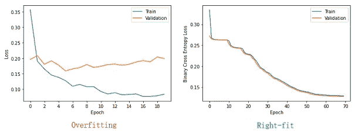

**用学习曲线检测过度拟合**(图片由作者提供)

## 使用验证曲线

学习曲线在深度学习模型中非常常见。以检测诸如决策树、随机森林、k-最近邻等一般机器学习模型中的过拟合。，我们可以使用另一个[机器学习可视化](/10-amazing-machine-learning-visualizations-you-should-know-in-2023-528282940582)称为*验证曲线*。

> 验证曲线描绘了*单个*超参数对训练和验证集的影响。

x 轴代表给定的超参数值，而 y 轴代表训练和验证分数。

对于单个超参数的给定值，我们可以使用验证曲线来检测机器学习模型中的过度拟合。

为此，我们需要确定最重要的模型超参数，并使用验证曲线绘制其值的影响。

这方面的一些例子包括:

*   我们可以使用验证曲线来绘制决策树或随机森林模型的 *max_depth* (树深度)超参数的影响。
*   我们可以使用验证曲线来绘制 KNN 模型的 *n_neighbors* (邻居数量)超参数的影响。

下图显示了为随机森林分类器创建的验证曲线，用于测量 *max_depth* (树深度)超参数对训练和验证分数(精确度)的影响。

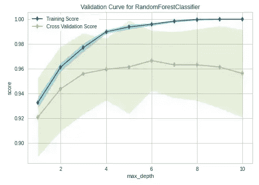

**验证曲线**(图片由作者提供)

在 *max_depth* 值为 6 之后，模型开始过度拟合训练数据。换句话说，验证精度在 *max_depth=6* 处开始下降，而训练精度仍在增加。

## 使用多个评估指标

根据我们使用的机器学习算法的类型，Scikit-learn 和 TensorFlow 提供了不同类型的模型评估指标。我们可以使用(甚至组合)这些评估指标来监控模型在训练期间的性能，然后通过分析评估指标的值来确定模型是否过度拟合。

下图显示了完全成熟的决策树分类器的训练和测试精度，以及测试数据的混淆矩阵。

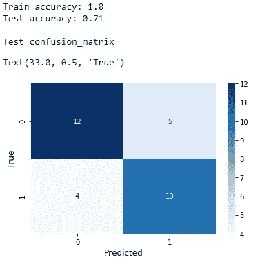

**评估决策树分类器**(图片由作者提供)

在完全成熟的决策树中，过度拟合是有保证的！100%的训练准确率意味着决策树分类器模型在训练集上表现良好。71%的测试准确度清楚地表明，该模型在新的看不见的数据上表现不好。测试精度远低于训练精度。换句话说，训练和测试的准确性之间有明显的差距。这些事情表明模型明显过度拟合。

在这种情况下，假阳性和假阴性的数量也很高。这是该模型在测试数据上表现不佳的另一个迹象。

在应用适当的正则化技术(限制树的增长和创建系综)之后，我们得到以下评估值。

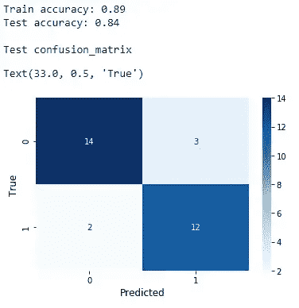

(图片由作者提供)

训练和测试准确度分数都很高，它们之间没有明显的差距。除此之外，假阳性和假阴性的数量也减少了。现在很明显，正则化决策树模型现在并没有过拟合。

# 解决过度拟合的 13 种有效方法

这里总结了机器学习和深度学习模型中用于防止过拟合的方法。我们将详细讨论每种方法。

```
**Addressing Overfitting - 13 Methods**
-----------------------------------
01\. [Dimensionality Reduction](#76e6)
02\. [Feature Selection](#2943)
03\. [Early Stopping](#c513)
04\. [K-Fold Cross-Validation](#ae2a)
05\. [Creating Ensembles](#832f)
06\. [Pre‐Pruning](#5b1b)
07\. [Post‐Pruning](#235d)
08\. [Noise Regularization](#bbc5)
09\. [Dropout Regularization](#8cde)
10\. [L1 and L2 Regularization](#27c3)
11\. [Data (Image) Augmentation](#4d98)
12\. [Adding More Training Data](#e080)
13\. [Reducing Network Width & Depth](#3dc4)
```

> ***注意:*** 如果你想获得下面讨论的每种方法的实践经验，我已经为此创建了一个单独的文章集！访问[此链接](https://rukshanpramoditha.medium.com/list/handson-practice-for-addressing-overfitting-2023-guide-de3820029e5a)获取所有文章。在那里，您将通过编写代码来学习如何应用每种方法！

我们开始吧！

## 1️⃣通过降维解决过拟合问题

当模型*太复杂*时，过度拟合经常发生。模型复杂的主要原因是数据中存在许多特征(变量)。数据中特征的数量称为其维数。

> 当训练数据的维数较高时，模型往往会过度拟合训练数据。

减少数据中的特征数量称为*降维*。我们应该尽可能多地保留原始数据中的差异。否则，我们会丢失数据中的有用信息。

降维处理过拟合，如下所示。

1.  降维减少了数据中的特征数量。应用降维后，模型的复杂度也将降低。因此，模型不会再过度拟合训练数据！
2.  降维还可以去除数据中不必要的噪声。噪声数据会导致过度拟合。该模型将防止在去除数据中的噪声之后过度拟合训练数据。

最常见的降维方法是*主成分分析*。它为低维形式的数据找到一组新的不相关特征。

> PCA 可以有效地消除过拟合问题。

## 2️⃣通过特征选择解决过拟合问题

特征选择可以被认为是一种降维方法，因为它从数据集中移除了冗余(不必要)的特征。这减少了数据中的特征(维度)数量。

特征部分方法不是寻找一组新的特征，而是通过移除数据中不需要的特征来仅保留最重要的特征。原始值保持不变。这就是特征选择与 PCA 的不同之处，在 PCA 中我们得到新的变换值。

一个简单的[机器学习可视化](/10-amazing-machine-learning-visualizations-you-should-know-in-2023-528282940582)叫做*特征重要性图*可以用来选择最重要的特征。该图是基于每个特征的相对重要性而创建的。下图显示了使用包含 30 个特征的*乳腺癌*数据集创建的图。

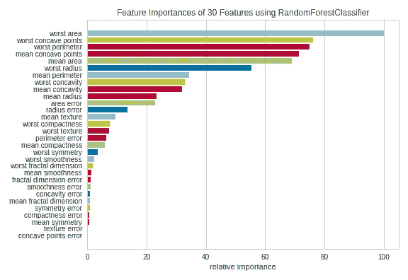

**用于*乳腺癌*数据集**的特征重要性图(图片由作者提供)

您可以看到一些特征对模型没有太大的贡献。他们的贡献微不足道。因此，我们可以删除这些特征，只使用最重要的特征来构建模型。

> 从数据中移除最不重要的特征将降低模型的复杂性，并消除数据中的噪声(如果有的话)。这就是特征选择如何防止模型过度拟合。

## 3️⃣通过提前停止解决过度拟合问题

早期停止是防止机器学习和深度学习模型中过拟合的另一种有效方法。

> 在早期停止中，我们通过查看学习曲线或验证曲线，在模型开始过度拟合之前，有意地提前停止模型训练过程。

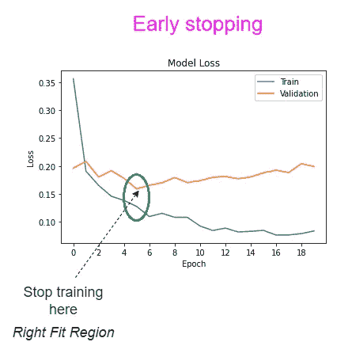

**使用学习曲线**执行提前停止(图片由作者提供)

在第 5 个时期之后，模型开始过度拟合训练数据。如果我们在那个时期之后继续训练，尽管训练误差进一步减小，但是验证误差增加。训练分数和验证分数之间的差距也会增大。这些都是过度拟合的迹象。

## 4️⃣通过 k 倍交叉验证解决过度拟合问题

k 倍交叉验证是一种数据分裂策略。在构建 ML 和 DL 模型时，我们通常将整个数据集分成训练集和测试集。这里的问题是，模型在训练过程中只看到一组特定的实例(数据点)。

在 k-fold 交叉验证中，根据 *k* 的值(通常为 5 或 10)，将整个数据集拆分成不同的折叠。每个文件夹包含不同类型的实例(数据点)。该模型在每次迭代中对 k-1 倍的数据进行训练。在每次迭代中使用剩余的数据折叠进行评估。如下图所示，训练和评估折叠在每次迭代时都会发生变化。在每次迭代中计算评估分数，并取平均值。

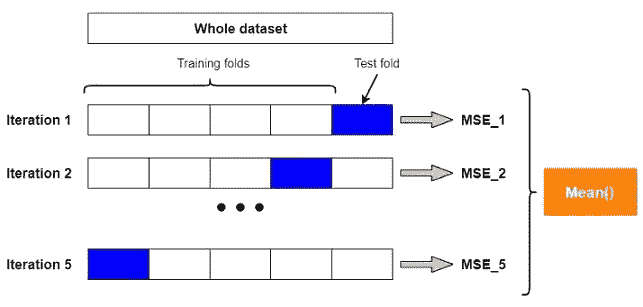

**K 倍交叉验证程序:k=5** (图片由作者提供)

在 k-fold 交叉验证中，模型在训练期间看到不同的实例集(数据点),因为在每次迭代中训练和评估折叠都发生了变化。该模型将学习所有需要的模式，并将对新的看不见的数据进行很好的归纳。换句话说，k 重交叉验证可以防止模型过度拟合。

## 5️⃣通过创建合奏解决过度配合问题

这种方法仅限于基于树的模型。决策树模型总是过度拟合训练数据，除非我们通过为 *max_depth* (树深度)超参数设置一个较低值来限制树的增长。

即使我们在训练期间限制了树的增长，决策树模型仍然可能过度拟合训练数据。减少决策树过度拟合的一个有用方法是创建集成。集成(组)是从训练数据和特征的子集创建的多个决策树的集合。

例如，随机森林是包含一组不相关的决策树的集合。

> 与决策树模型相比，随机森林由于其额外的随机性，不太可能过度拟合训练数据。

由于*不相关*树，额外的随机性出现在随机森林中。当创建随机森林时，数据混合得很好。除此之外，通过平均每个不相关树的结果来计算最终结果。因此，随机森林比单一决策树能产生更准确和稳定的结果。

## 6️⃣通过预修剪解决过度拟合问题

修剪方法用于防止决策树中的过度拟合。有两种主要的修剪方法，称为预修剪和后修剪。

默认情况下，决策树会增长到其最大深度。完全长大的树总是超过训练数据。

> 在决策树中，修剪是控制树的生长的过程。

预修剪应用提前停止规则，该规则过早地停止决策树的生长。预剪枝后，决策树的分支更少。我们可以通过限制以下超参数的值来在决策树中应用预修剪。

*   **max_depth:** 树的最大深度。减小该值可以防止过度拟合。
*   **min_samples_leaf:** 一个叶节点所需的最小样本数。增加该值可以防止过度拟合。
*   **min_samples_split:** 分割内部节点所需的最小样本数。增加该值可以防止过度拟合。

有两种常用的方法来调整这些超参数。

*   一次测量一个超参数的影响，同时保持其他超参数的默认值。为此，我们可以使用验证曲线来检测过度拟合。
*   一次调整多个超参数。此处不能使用验证曲线来测量多个超参数的影响。这里，应使用[网格搜索或随机搜索](/python-implementation-of-grid-search-and-random-search-for-hyperparameter-optimization-2d6a82ebf75c)一次调整多个超参数。

## 7️⃣通过后期修剪解决过度拟合问题

> 后期修剪是指在树完全长成后，除去树的某些部分的过程。

成本复杂性剪枝(ccp)是一种后剪枝方法。它包括为 Scikit-learn 决策树类中的***CCP _ 阿尔法*** 超参数找到正确的值。

*ccp 阿尔法*的默认值是零，这意味着默认情况下不执行修剪。较大的值会增加要修剪的节点数，并降低树的深度。因此，*CCP _ 阿尔法*的较大值可以防止过度拟合。

要找到***CCP _ 阿尔法*** 超参数的最佳值:

*   我们可以尝试 0.01、0.02、0.05、0.1 等不同的值。，并监控培训和验证分数。
*   我们可以将所有有效的阿尔法值一次一个地传递给 **ccp 阿尔法**超参数，然后计算训练和验证分数。阿尔法的所有有效值都可以通过**CCP _ 阿尔法属性**访问。

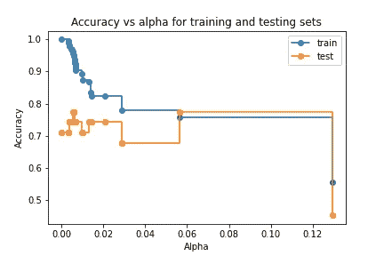

**调整 ccp 阿尔法超参数**(图片由作者提供)

在 *alpha=0.06* 时，验证精度开始增加，而训练精度几乎保持不变。alpha 的下一个可用值是 0.12，它的性能分数非常低。根据该图，α的最佳值是 0.06。

## 用噪声正则化解决过拟合的 8️⃣

向现有数据添加噪声是防止神经网络中过拟合的有效正则化方法。我们通常将噪声添加到神经网络的输入层，因为输入层保存训练数据，尽管也可以将噪声添加到隐藏层和输出层。

当向训练数据添加噪声时，将向每个训练实例添加少量噪声，并生成同一实例的不同版本。这将扩展原始数据集！这将隐式地向原始数据集中添加更多的训练数据。添加更多的训练数据将有助于防止过度拟合。

除此之外，在将噪声添加到数据之后，模型将 ***而不是*** 单独捕获训练数据中的噪声。这也将有助于减少过度拟合。

## 9️⃣通过调整辍学来解决过度适应问题

放弃正则化是一种特定于神经网络的正则化方法，用于防止神经网络中的过拟合。

在丢弃正则化中，该算法根据我们在每层中定义的概率值，在训练期间从网络中随机删除一些节点。被移除的节点不参与参数更新过程。基于每一层应用丢失正则化。这意味着我们可以在每一层分别设置不同的退出概率。

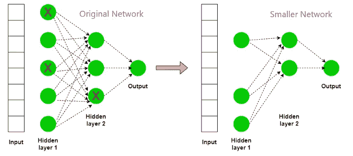

**辍学正规化流程**(图片由作者提供)

在应用退出正则化之后，原始网络变得更小。较小的网络灵活性较差，因此不会出现过度拟合。

在丢失正则化中，一些权重值为零，因为它们的节点是不活动的。因此，所有其他权重都需要参与权重更新过程。网络的输出不依赖于某些大的权重。这可以减少神经网络中的过拟合。

> 丢失正则化是防止神经网络过拟合的最有效方法。

## 用 L1 和 L2 正则化解决过拟合的 1️⃣0️⃣

L1 和 L2 正则化通常应用于神经网络模型，以防止过拟合。L1 和 L2 正则化的选择取决于我们在训练期间添加到损失函数中的正则化项。

当正则项为 ***L1 范数*** [ *λ *(权重绝对值之和)* ]时，称为 *L1 正则化*。当正则项为 ***L2 范数*** [ *λ *(权值的平方值之和)* ]时，称为 *L2 正则化*。

神经网络的 L1 和 L2 正则化定义如下。

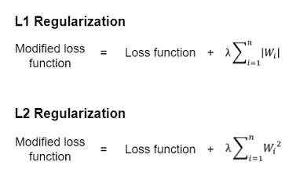

**L1 和 L2 正规化**(图片由作者提供)

λ控制正则化的级别。因此称为正则化参数(因子)。

*   `lambda=0`:最小值。没有应用正则化。
*   `lambda=1`:最大值。应用完全正则化。

λ值越大，意味着正则化越强，从而减少了神经网络中的过拟合。

通常，L1 和 L2 正则化保持神经网络的权重较小。不会有任何大的权重过分强调某些输入。小权重值对输入数据中存在的噪声不太敏感。因此，在 L1 和 L2 正则化神经网络中不会发生过拟合。

L1 和 L2 正则化方法也可以应用于一般的机器学习算法，如逻辑回归、线性回归等。

在 logistic 回归中，有一个超参数叫做*(取值:*‘L1’**‘L2’*和*‘elastic net’*)**来选择正则化的类型。注意' *elasticnet'* 同时将 L1 和 L2 正则化应用于模型。***

***对于线性回归，Scikit-learn 为每种正则化类型提供了三个单独的类，称为`Ridge()`(应用 L2 正则化)、`Lasso()`(应用 L1 正则化)和`ElasticNet()`(应用 L1 和 L2 正则化)。***

## ***1️⃣1️⃣用数据(图像)寻址过拟合 a **增强*****

***数据扩充通常在图像数据上执行。因此，数据增强在某些上下文中也被称为*图像增强*。***

***图像增强是通过对同一幅图像进行某种变换，产生新的变体，从而增加图像数量的过程，这种变换包括*缩放*、*翻转*、*旋转*、*移动*、*缩放*、*光照*、*压缩*、*裁剪*等。***

***图像增强最重要的是保留图像的上下文。换句话说，当扩充图像时，图像上下文不应该被改变。***

***图像增强更适合经常需要更多训练数据的深度学习模型。这是一种为模型提供更多训练数据的廉价方法！***

***图像增强如下减少了神经网络中的过拟合。***

1.  ***图像增强通过添加更多的训练实例来扩展数据集。添加更多的训练数据将防止过度拟合。***
2.  ***图像增强允许神经网络在训练期间看到相同图像的许多变体。这减少了在学习重要特征时对图像原始形式的依赖。当在新的看不见的数据上测试时，网络将变得更加健壮和稳定。***

## ***1️⃣2️⃣通过添加更多训练数据解决过度拟合问题***

***向模型中添加更多的训练数据将防止过度拟合。有许多方法可以将更多的训练数据添加到模型中。***

*   ***收集新的相关数据(昂贵)***
*   ***通过向数据添加噪声来扩展原始数据集(成本低廉)***
*   ***数据扩充(廉价)***

## ***1️⃣3️⃣通过减小网络宽度和深度解决过拟合问题***

***神经网络的结构由其宽度和深度定义。*深度*定义了神经网络中隐藏层的数量。*宽度*定义了神经网络每层的节点(神经元/单元)数量。***

***减少隐藏层的数量和隐藏单元的数量会降低网络的灵活性。灵活性较低的网络无法捕获数据中的噪声，也不会过度拟合训练数据。***

***今天的帖子到此结束。***

***如果您有任何问题或反馈，请告诉我。***

## ***阅读下一篇(强烈推荐)***

*   *****获得“解决过度装配 2023 指南”的实践操作*****

***[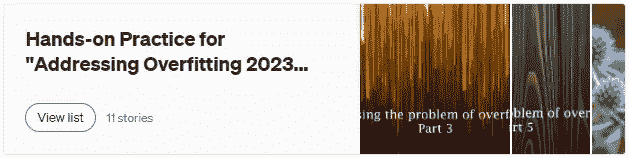](https://rukshanpramoditha.medium.com/list/handson-practice-for-addressing-overfitting-2023-guide-de3820029e5a)

(作者截图)*** 

## ***支持我当作家***

***我希望你喜欢阅读这篇文章。如果你愿意支持我成为一名作家，请考虑注册成为会员，不受限制地使用媒体。它只需要每月 5 美元，我会收到你的会员费的一部分。***

***<https://rukshanpramoditha.medium.com/membership>  

非常感谢你一直以来的支持！下一篇文章再见。祝大家学习愉快！

[鲁克山·普拉莫蒂塔](https://medium.com/u/f90a3bb1d400?source=post_page-----8fd4e04fc8--------------------------------)
**2022–11–22*****