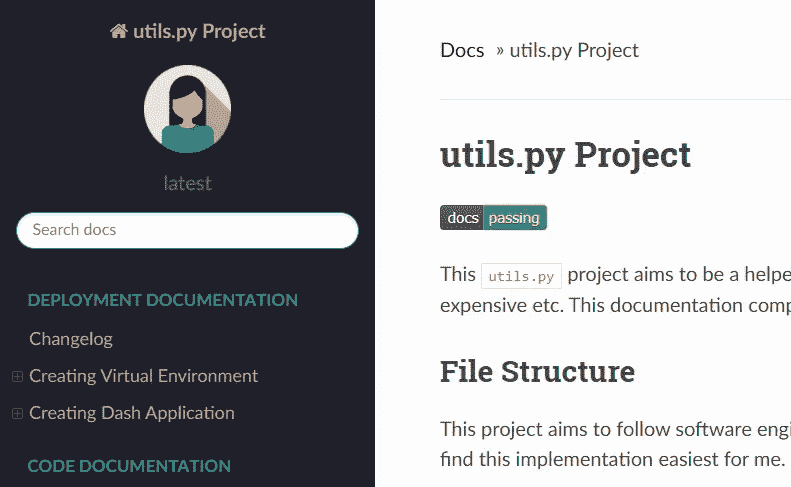
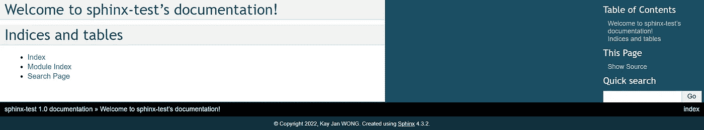
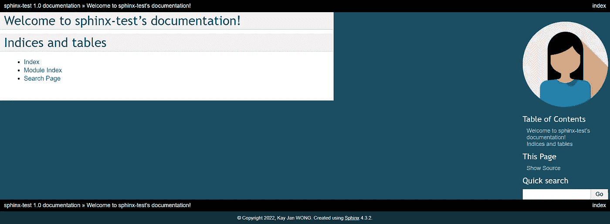
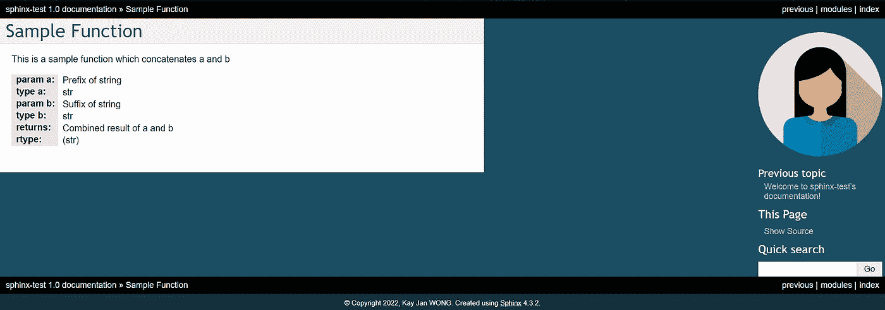

# 注释和文档字符串之外的高级代码文档

> 原文：<https://towardsdatascience.com/advanced-code-documentation-beyond-comments-and-docstrings-2cc5b2ace28a>

# 注释和文档字符串之外的高级代码文档

## 使用 Sphinx 并阅读文档以获得用户友好的界面来理解代码库——即使对于非技术用户也是如此

***更新*** *:本文是系列文章的一部分。退房* [*第二部分*](/advanced-code-documentation-with-sphinx-part-2-32c82860a535)*[*第三部分*](/advanced-code-documentation-with-coverage-and-unit-tests-part-3-3f7b698497fb) *！**

**

*使用 Sphinx 的文档托管在 Read Docs 上—图片由[作者](https://kayjan.readthedocs.io/en/latest/)提供*

*文档向用户展示如何使用或理解项目，根据项目类型有不同类型的文档。如果您正在从事 Python 项目——无论是编写 Python 包还是仅仅是个人项目，并且您希望您的读者理解代码正在做什么的高层次细节，而不是代码是如何完成的。*

*对于任何项目来说，可理解性都是很重要的，一个项目的好坏取决于它的文档。如果除了开发者之外的人不理解它是如何工作的，那么它是没有用的。文档使不同的开发人员能够更有效地协作，当一个项目从一个人移交给另一个人时，文档尤其重要。*

> *适当的文档不仅节省了理解代码的大量时间，还减少了出错时的挫折感。*

*为 Python 项目编写文档的一种方法是为您的类和函数编写文档字符串。如果您对 docstring 完全陌生，或者您的代码中已经有了 docstring，并且正在寻找一种以用户友好的方式显示它的方法，请继续阅读！*

*本文将详细介绍您可以采用的 3 种流行的 docstring 格式，使用 Sphinx 以用户友好的方式显示文档，Sphinx 的一些基本定制，最后在 Read Docs 上托管它！*

# *目录*

*   *[Google、Numpy 和 reStructuredText 文档字符串格式](https://medium.com/p/2cc5b2ace28a/#c256)*
*   *[斯芬克斯设置](https://medium.com/p/2cc5b2ace28a/#fe0b)*
*   *[斯芬克斯文件夹结构解释](https://medium.com/p/2cc5b2ace28a/#fb18)*
*   *[定制主题、图像和风格](https://medium.com/p/2cc5b2ace28a/#64ee)*
*   *[添加文档内容](https://medium.com/p/2cc5b2ace28a/#69f1)*
*   *[托管文档关于阅读文档](https://medium.com/p/2cc5b2ace28a/#599e)*

# *Google、Numpy 和 reStructuredText 文档字符串格式*

*我将快速阐述三种更流行的 docstring 格式。没有可以使用的最佳格式，但是为了一致性，在整个代码库中坚持一种格式是很重要的。就我个人而言，我更喜欢 Google docstring 格式，因为它用更少的代码行产生更宽的文档字符串。Numpy docstring 格式倾向于导致更窄的 docstring 和更多的代码行。下面是不同格式的演示，示例函数接受参数`a`和`b`。*

## *Google 文档字符串格式*

```
*def sample_function_google(a, b):
    """Google style

    Args:
        a:
        b:

    Returns:

    """*
```

## *Numpy 文档字符串格式*

```
*def sample_function_numpy(a, b):
    """Numpy style

    Parameters
    ----------
    a
    b

    Returns
    -------

    """
    pass*
```

## *重构文本格式*

```
*def test_function_restructured_text(a, b):
    """reStructuredText style

    :param a:
    :param b:
    :return:
    """
    pass*
```

*一旦为类和函数编写了 docstrings，就可以进入下一部分了！*

# *Sphinx 设置*

**

*斯芬克斯标志—图片由[如何不编码](https://hownot2code.com/2017/11/30/sphinx/)*

*Sphinx 是一个将代码中的文档字符串转换成美观、可读的 HTML 文件的工具。它需要一次性的努力来建立和只有一行命令来刷新文件(阅读到最后，以了解如何自动刷新文件！)*

*首先，将下面列出的包添加到您的`requirements.txt`中，并执行`pip install`。这将安装软件包及其依赖项。*

*要初始化 Sphinx，在同一个命令提示符下运行下面几行代码。请注意，安装时只需运行一次。该程序将提示您输入项目名称、作者姓名、项目版本和项目语言，您可以相应地填写。在这一步之后，额外的文件夹和文件将出现在您的项目中，我将在下一节中详细介绍。*

```
*$ mkdir docs
$ cd docs
$ sphinx-quickstart*
```

*最后，可以调用下面几行代码来分别呈现和删除文件。当你想刷新你的文件时，可以使用它们。现在你准备好了！*

```
*$ make html
$ make clean*
```

# *解释了 Sphinx 文件夹结构*

*如前所述，有几个文件夹和文件被添加到项目中，但是不要担心，你只需要编辑`source`文件夹中的内容。*

*`build`文件夹包含渲染的 HTML 文件，您可以在运行`make html`命令后查看。`source`文件夹包含两个重要组件*

*   *`conf.py`处理文档的配置*
*   *各种`.rst`文件，控制你想添加到文档中的内容*

*现在，你应该只有一个可用的`index.rst`文件，你的 HTML 文件应该看起来非常简单。下一节将讨论如何定制和美化你的文档。*

**

*最初的狮身人面像文档——作者图片*

# *自定义主题、图像和样式*

*最恰当的改进是选择一个狮身人面像主题。你可以在[斯芬克斯主题文档](https://www.sphinx-doc.org/en/master/usage/theming.html)上查看主题的完整列表。出于演示目的，我将选择经典主题，并在`conf.py`文件中相应地修改主题和主题选项。*

```
*html_theme = "classic"
html_theme_options = {
    "rightsidebar": "true",
    "relbarbgcolor": "black"
}*
```

*刷新文档现在看起来像这样—稍微好一点。*

**

*斯芬克斯文档经典主题—作者图片*

*下一个改进是在你的文档中添加图像，用于标识和 HTML 标签。这可以在两行代码中完成，注意图像文件路径应该是相对于`conf.py`文件所在路径的。*

```
*html_favicon = '../../assets/documentation-icon.svg'
html_logo = '../../assets/favicon.ico'*
```

*最后，我想提到的改进是使用 CSS 样式定制文档。CSS 是一个非常强大的工具，可以控制 HTML 页面上任何元素的样式。这可以通过添加一个 CSS 文件到`source/_static`文件夹来完成。假设我创建了一个名为`custom.css`的 CSS 文件，我可以将它链接到`conf.py`文件，*

```
*def setup(app):
    app.add_css_file('custom.css')*
```

*用添加的图像和 CSS 样式刷新文档以控制我的图像的大小，现在看起来像这样—*

**

*狮身人面像文档，带有图片和样式——作者图片*

# *添加文档内容*

*当然，如果文档只有漂亮的风格而没有内容，那它有什么用呢？使用`.rst`文件可以添加内容，但首先我们必须将 codebase 的根目录添加到文件路径中，并指出这个项目使用的是哪种类型的 docstring 格式。*

*要将代码库的根添加到文件路径中，请将以下代码行添加到您的`conf.py`中，如果您有不同的文件夹结构，您可以更改它。*

```
*import os
import sys
sys.path.insert(0, os.path.abspath('.'))
sys.path.insert(0, os.path.abspath('../..'))*
```

*默认情况下，Sphinx 接受 reStructuredText docstring 格式。如果您正在使用 Google 或 Numpy docstring 格式，请将以下代码添加到您的`conf.py`文件中。*

```
*extensions = ['sphinx.ext.napoleon', 'numpydoc']*
```

*这就结束了对`conf.py`文件所做的所有修改，最终的文件应该是这样的，*

*继续讨论`.rst`文件，我建议创建一个类似于你的代码库文件结构的`rst`文件结构，并使用`index.rst`链接到其他`rst`文件。下面是一些例子，你可以在这里查看我的 Github 库。*

*在`index.rst`内，*

```
*:doc:`sample_function`
    Documentation for sample-function*
```

*在`sample_function.rst`内(由上述`index.rst`调用)*

```
*Sample Function
--------------------------

.. automodule:: sample_function.sample_function_google
    :members:
    :undoc-members:
    :show-inheritance:*
```

*现在，我的示例函数的文档看起来像这样—*

**

*我的示例函数的 Sphinx 文档—作者图片*

# *在阅读文档时托管文档*

*恭喜你，你已经成功地建立了一个可读的 HTML 格式的文档！然而，这些文件只存在于你的电脑上，任何人都不能共享。要在 Read Docs 上托管它，您的存储库必须首先位于一个公共的 GitHub 存储库中。申请一个[Read Docs](https://readthedocs.org/)账号，分别链接到你的 GitHub 和选择你的库。这将在线构建和托管您的文档。现在，一旦您将任何更改推送到您的 GitHub 库，文档将自动刷新！*

*或者，可以选择手动上传文件，但这不会利用自动刷新。*

*希望您已经学习了设置、定制和托管 Sphinx 文档的基础知识。通过样式化、定制函数和类的格式、添加徽章、使用扩展来查看 Jupyter notebook 和 Markdown 文本，甚至在 Confluence 等其他平台上托管它，有更多的方法来增强文档。有需求的话可以出续集；)*

*[](/advanced-code-documentation-with-sphinx-part-2-32c82860a535) [## Sphinx 高级代码文档—第 2 部分

### Sphinx 的扩展提供了一个用户友好的界面来理解代码库——即使对于非技术用户也是如此

towardsdatascience.com](/advanced-code-documentation-with-sphinx-part-2-32c82860a535) 

这些是 [GitHub 库](https://github.com/kayjan/sphinx-test)和[阅读演示中使用的文档文档](https://kayjan-sphinx-test.readthedocs.io/en/latest/)的链接。

**感谢您的阅读！如果你喜欢这篇文章，请随意分享。*** 

# *相关链接*

*阅读我个人项目的文档:[https://kayjan.readthedocs.io/](https://kayjan.readthedocs.io/)*

*狮身人面像文献:[https://www.sphinx-doc.org/en/master/](https://www.sphinx-doc.org/en/master/)*