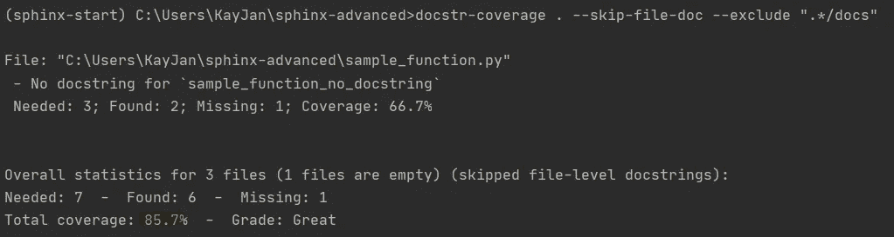
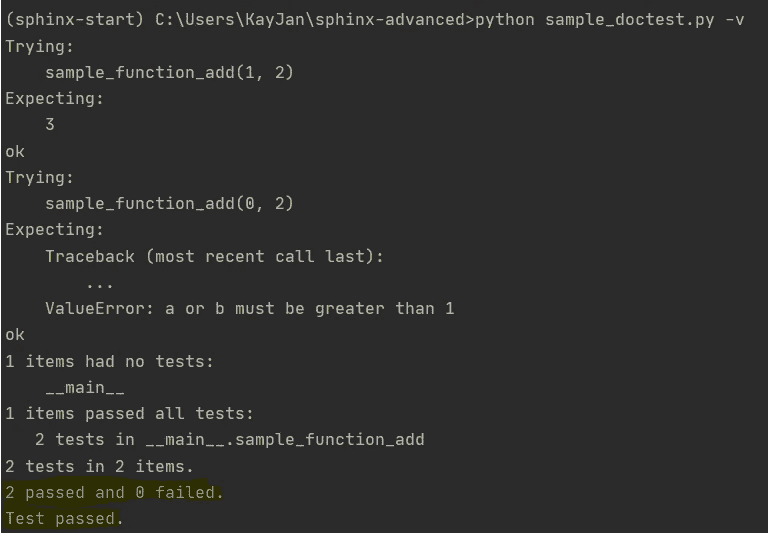

# 包含覆盖率和单元测试的高级代码文档—第 3 部分

> 原文：<https://towardsdatascience.com/advanced-code-documentation-with-coverage-and-unit-tests-part-3-3f7b698497fb>

# 包含覆盖率和单元测试的高级代码文档—第 3 部分

## 评估文档的完整性并对文档字符串执行单元测试——使用和不使用 Sphinx

***更新*** *:本文是系列文章的一部分。查看* [*第一部分*](/advanced-code-documentation-beyond-comments-and-docstrings-2cc5b2ace28a) ， [*第二部分*](/advanced-code-documentation-with-sphinx-part-2-32c82860a535) *！*


尼克·莫里森在 [Unsplash](https://unsplash.com?utm_source=medium&utm_medium=referral) 上拍摄的照片

第一篇文章展示了[如何设置、定制和部署 Sphinx 文档](/advanced-code-documentation-beyond-comments-and-docstrings-2cc5b2ace28a)，第二篇文章提到了[使用 Sphinx 扩展来处理更复杂的项目结构、合并多种文件类型和添加徽章](/advanced-code-documentation-with-sphinx-part-2-32c82860a535)。只要您的代码库中有某种形式的文档字符串，这一切都可以工作，但是您如何真正知道您的文档字符串是否足够好呢？本文将介绍对文档字符串执行单元测试的方法，并检查文档字符串的覆盖率——使用和不使用 Sphinx 都可以。

# 目录

*   [文档字符串的覆盖测试—使用 Sphinx](https://medium.com/p/3f7b698497fb/#40c6)
*   [文档字符串的覆盖测试—无 Sphinx](https://medium.com/p/3f7b698497fb/#7037)
*   [文档字符串的单元测试](https://medium.com/p/3f7b698497fb/#8e00)
*   [访问编写函数的文件串](https://medium.com/p/3f7b698497fb/#23c9)

# 使用 Sphinx 对文档字符串进行覆盖率测试

> 覆盖率是指包含文档的范围(类、函数、模块)的比例。良好的覆盖率意味着代码库得到了很好的解释。

可以使用我在第二篇文章中提到的 [Sphinx 扩展来检查文档字符串的覆盖率。简单回顾一下，扩展允许您添加特性或修改 Sphinx 布局。用于检查覆盖率的 Sphinx 扩展不需要安装额外的 Python 包，只需将`sphinx.ext.coverage`添加到`conf.py`文件的扩展列表中，并在命令提示符下运行下面一行，](/advanced-code-documentation-with-sphinx-part-2-32c82860a535)

```
$ sphinx-build -v -b coverage docs/source docs/build/coverage
```

为了分解上面的命令，`-v`增加了详细度，将额外的日志打印到控制台，`-b coverage`在`conf.py`所在的源目录`docs/source`中运行覆盖构建器，覆盖结果将保存到输出目录`docs/build/coverage`。

我特意留下了一个没有 docstrings 的函数，覆盖结果可以在`/docs/build/coverage/python.txt`中找到，如下所示，

```
Undocumented Python objects
===========================
sample_function
---------------
Functions:
 * sample_function_no_docstring
```

**注意**:如果覆盖率测试没有成功标记没有文档字符串的函数，检查您的`.rst`文件中是否有`:undoc-members:`并删除这一行。

**注意**:如果您收到`No module named ..; .. is not a package`警告等警告，请检查您的`.rst`文件。确保您指向的是 Python 文件，而不是 Python 文件中的函数。

# 不使用 Sphinx 的文档字符串覆盖测试

如果您的 Python 包不支持 Sphinx，您仍然可以使用`docstr-coverage` Python 包检查您的代码库的覆盖率，安装该包并在命令提示符下运行下面一行，

```
docstr-coverage . --skip-file-doc --exclude ".*/docs"
```

为了分解上面的命令，`.`表示当前目录，这是代码库的位置，`--skip-file-doc`忽略检查每个文件顶部的文档字符串，`--exclude ".*/docs"`添加排除路径以避免运行覆盖测试。

和以前一样，我特意留下了一个没有文档字符串的函数，覆盖率结果如下所示



覆盖率测试结果-作者图片

也就是说，文档字符串覆盖只是覆盖测试的一个方面，还有其他的代码覆盖测试，它们关注函数覆盖(检查冗余函数)、语句覆盖(检查冗余语句)、条件覆盖(检查冗余 if-else 语句)，等等。

# 文档字符串的单元测试

代码覆盖率度量可能与项目的整体代码质量相关，但不能正确测试代码库，而代码库是通过单元测试来实现的。

> 单元测试是测试一个单元或代码库中可以逻辑隔离的最小代码段，这在测试驱动开发(TDD)中至关重要。它允许在开发周期的早期发现实现中的错误。

正如我们正在讨论的文档主题，简单的测试可以用函数 docstring 编写，并使用内置 Python 库的`doctest` Python 包进行测试。

用函数 docstring 编写的测试信息丰富，因为它向用户展示了如何使用样本输入和预期输出与函数进行交互。然后用`doctest`完成，它能够测试预期的返回值和预期的错误。

为了举例说明，我编写了一个简单的函数，将两个数相加。为了简单起见，我删除了 docstring 中定义函数描述、参数和返回值的部分。您也可以通过复制代码并使用`python sample_doctest.py -v`在命令提示符下运行 Python 文件来尝试，其中`-v`增加了冗长性。



单元测试结果-作者图片

**警告**:使用`doctest`作为单元测试的手段不如流行的 Python 框架如`unittest`或`pytest`强大。

# 访问编写函数的文档字符串

由于我们总是可以调用打印出文档字符串信息的`help(*function_name*)`,所以很少使用访问编写函数的文档字符串。但是，如果我们需要将编写的函数的文档字符串检索到一个字符串变量中，有两种方法可以做到这一点，即使用`inspect`内置 Python 库或访问函数的`__doc__`属性。

```
import inspect
*function_name*.__doc__  # will have indent
inspect.getdoc(*function_name*)  # will not have indent
```

希望你已经学会了一些有用的方法来检查、测试你的文档字符串并与之交互。我希望这一系列文章已经充分介绍了关于 docstring 和文档的主题。如果有其他有趣的方面，请留下您的评论。

**感谢您的阅读！如果你喜欢这篇文章，请随意分享。**

# 相关链接

`sphinx.ext.coverage`文档:[https://www . sphinx-doc . org/en/master/usage/extensions/coverage . html](https://www.sphinx-doc.org/en/master/usage/extensions/coverage.html)

`docstr-coverage`文档:[https://pypi.org/project/docstr-coverage/](https://pypi.org/project/docstr-coverage/)

`doctest`文件:【https://docs.python.org/3/library/doctest.html 

`inspect`文件:[https://docs.python.org/3/library/inspect.html](https://docs.python.org/3/library/inspect.html)