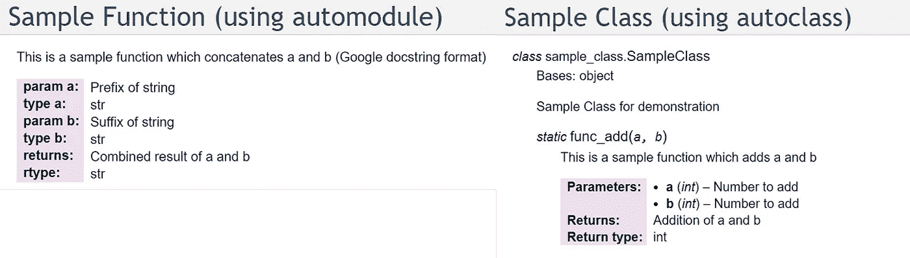
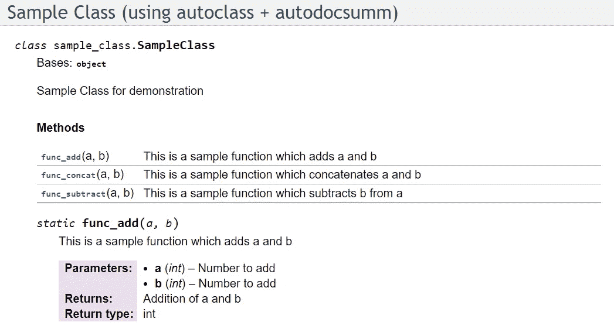
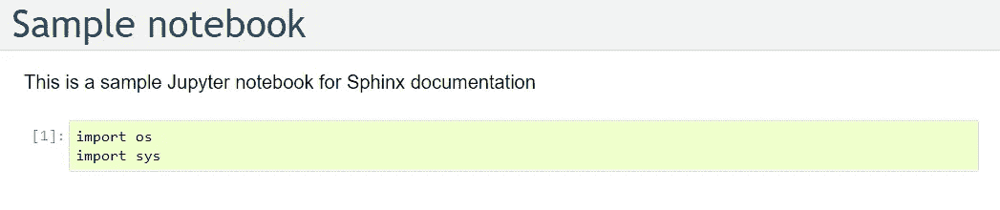
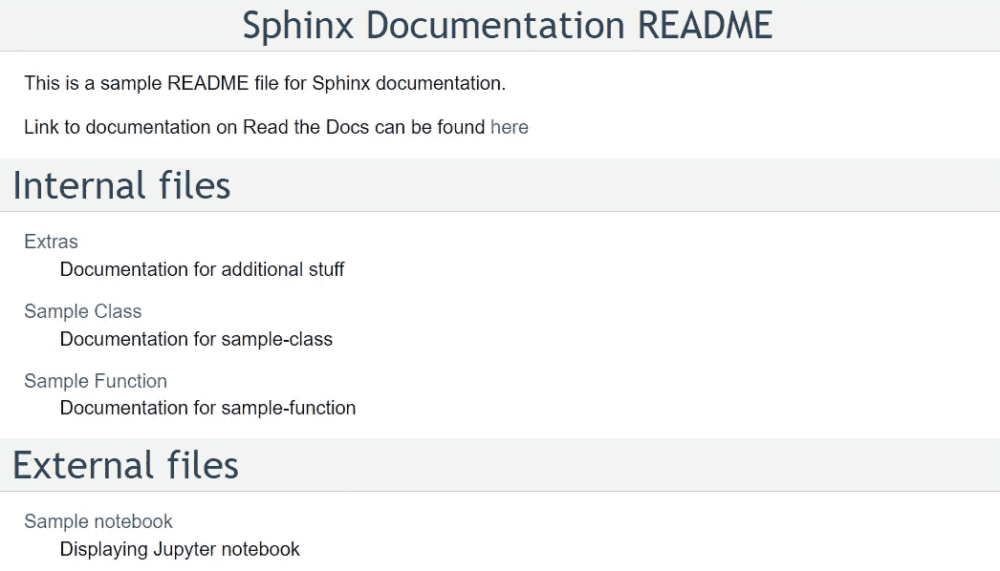
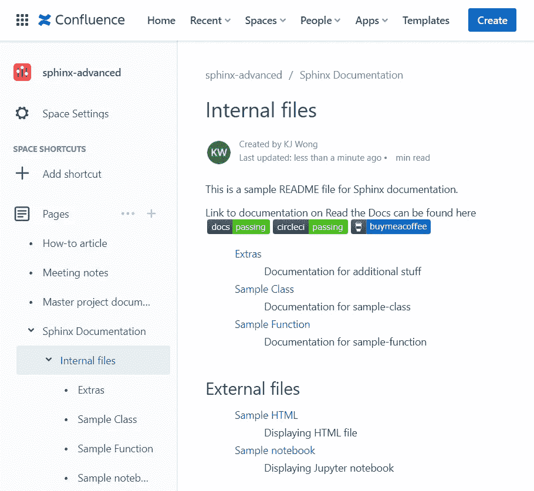

# Sphinx 高级代码文档—第 2 部分

> 原文：<https://towardsdatascience.com/advanced-code-documentation-with-sphinx-part-2-32c82860a535>

## Sphinx 的扩展提供了一个用户友好的界面来理解代码库——即使对于非技术用户也是如此

***更新*** *:本文是系列文章的一部分。查看* [*第 1 部分*](/advanced-code-documentation-beyond-comments-and-docstrings-2cc5b2ace28a) *，* [*第 3 部分*](/advanced-code-documentation-with-coverage-and-unit-tests-part-3-3f7b698497fb) *！*


格伦·卡斯滕斯-彼得斯在 [Unsplash](https://unsplash.com?utm_source=medium&utm_medium=referral) 上拍摄的照片

上周，我在 Read Docs 上发表了一篇关于[如何设置、定制和部署 Sphinx 文档的文章，这应该足以让你的第一稿启动并运行。但实际上，您的代码库可能是一个复杂的函数和类结构，或者您可能希望向观众展示如何使用 Jupyter 笔记本与您的代码库进行交互的示例。这篇文章将涉及到增强你的(不那么)初始文档的方法。](/advanced-code-documentation-beyond-comments-and-docstrings-2cc5b2ace28a)

[](/advanced-code-documentation-beyond-comments-and-docstrings-2cc5b2ace28a) [## 注释和文档字符串之外的高级代码文档

### 使用 Sphinx 并阅读文档以获得用户友好的界面来理解代码库——即使对于非技术用户也是如此

towardsdatascience.com](/advanced-code-documentation-beyond-comments-and-docstrings-2cc5b2ace28a) 

# 目录

*   [函数和类的更多格式](https://medium.com/p/32c82860a535/#0bb3)
*   [使用扩展查看 Jupyter 笔记本和减价文本](https://medium.com/p/32c82860a535/#601b)
*   [添加徽章以展示代码质量](https://medium.com/p/32c82860a535/#041f)
*   [托管关于融合的文档](https://medium.com/p/32c82860a535/#dd64)

# 函数和类的更多格式

Python 类允许对函数和数据进行分组，并提供面向对象编程(OOP)的特性，这是一种构建灵活、可重复代码的方式。类中的函数被称为类方法。

在第一篇文章中，我们使用`automodule`将文档字符串转换成函数的文档。当使用类时，我们可以使用`autoclass`执行同样的操作。



使用自动模块(左)和自动类(右)的文档–作者图片

> Sphinx 很灵活，有其他方法可以达到相同的效果，甚至可以更改显示以包含或排除项目。修改 Sphinx 布局是通过使用扩展实现的，这可能需要安装额外的 Python 包，修改`conf.py`文件，或者更改`.rst`文件。

在后面的章节中，扩展的使用也是相关的。完整的扩展列表的一部分可以在 [Sphinx 文档中找到。](https://www.sphinx-doc.org/en/master/usage/extensions/index.html)



使用 *autodocsumm 的文档–作者图片*

要以表格格式显示所有类方法的列表，安装 Python 包`autodocsumm`并将其包含在`conf.py`中，如下所示:

```
extensions = ["autodocsumm"]
autodoc_default_options = {"autosummary": True}
```

我发现`autodocsumm`扩展非常有用，因为我可以用表格的形式查看所有的类方法。还有其他流行的扩展如`autodoc`和`autosummary`。个人觉得`autodocsumm`是两者的结合，比较好用。

# 使用扩展查看 Jupyter 笔记本和减价文本

Jupyter 笔记本是自包含的文档，可以向用户展示如何与你的代码库交互，展示一个示例案例研究，或者它只是一种漂亮的、有组织的方式来显示代码。本着持续集成持续交付(CI/CD)的精神，最好让 Sphinx 文档显示 Jupyter 笔记本，而不是通过文本、代码和图像在`.rst`文件中复制笔记本。

要展示 Jupyter 笔记本，安装 Python 包`nbsphinx`并将其添加到`conf.py`文件的扩展列表中，类似于上一节。您还需要运行`conda install pandoc`。这就完成了安装，Jupyter 笔记本路径可以添加到`index.rst`中，就像`index.rst`指向其他`.rst`文件一样。



狮身人面像上展示的朱庇特笔记本——作者图片

降价文本是常用于`README`的文本文件。为了展示 Markdown 文件，所需的 Python 包应该是`myst_parser`，类似地，将其添加到`conf.py`中的扩展列表。现在，您可以通过以下方式指向`index.rst`中的降价文本，

```
.. include:: ../../README.md
   :parser: myst_parser.sphinx_
```

还有其他扩展如`m2r`、`m2r2`或`recommonmark`也可以显示降价文本，但是`myst_parser`是 [Sphinx 文档](https://www.sphinx-doc.org/en/master/usage/markdown.html)中推荐的处理降价文本的方式。



在 Sphinx 上整合 README Markdown–作者图片

您还可以在 Sphinx 上包含其他格式的文件，请访问我的 [GitHub 库](https://github.com/kayjan/sphinx-advanced)以保持更新！

# 添加徽章以展示代码质量


狮身人面像上的徽章——作者图片

徽章显示文档的状态——构建状态、单元测试结果、维护质量、python 包版本、发布版本、python 版本兼容性、许可证、下载次数等。

徽章通常由图像 URL、路径 URL 和替代文本组成。它在`.rst`文件中有这样的格式

```
.. image:: image-URL
   :target: path-URL
   :alt: Alt-Text
```

下面是`.md`文件中徽章的格式

```
[](path-URL)
```

徽章可以是静态的也可以是动态的。对于静态徽章，我推荐使用 [shields.io](https://img.shields.io) 或[badgen.net](https://badgen.net)来生成图片 URL。动态徽章会被刷新，并且通常会由持续集成持续交付(CI/CD)流程自动刷新。动态徽章的一些示例包括[阅读文档](https://readthedocs.org/)、[圈子 CI](https://circleci.com/) 或 [Travis CI](https://www.travis-ci.com/) 徽章等等。

# 托管关于 Confluence 的文档

[Confluence](https://www.atlassian.com/software/confluence) 是一个团队知识共享工作区，团队成员可以在这里协作处理工作和文档信息。将 Sphinx 与 Confluence 集成在一起，可以将项目文档和代码文档保存在一个一站式门户中。

要进行设置，这需要 Python 包`sphinxcontrib-confluencebuilder`，同样将其添加到`conf.py`中的扩展列表。在 Confluence 中，从`Space Settings > Manage space > Space details`获取空格键，并在这里创建一个 API 令牌[。现在您已经有了在 Confluence 上发布 Sphinx 文档的所有细节！](https://id.atlassian.com/manage-profile/security/api-tokens)

要执行链接 Sphinx 和 Confluence 的最后一步，在`conf.py`中添加以下信息，最后运行`make confluence`来构建您的 Confluence 文档。

```
confluence_publish = True
confluence_space_key = CONFLUENCE_SPACE_KEY
confluence_server_url = 'https://<your-page>.atlassian.net/wiki/'
confluence_server_user = '<your-email>@gmail.com>
confluence_server_pass = CONFLUENCE_API_KEY
```



Confluence 页面上的 Sphinx 文档–图片由作者提供

希望你已经学会了一些先进实用的使用斯芬克斯的方法。Sphinx 绝对是一个让代码库脱颖而出的工具，为用户提供可读性和可理解性。

[](/advanced-code-documentation-with-coverage-and-unit-tests-part-3-3f7b698497fb) [## 包含覆盖率和单元测试的高级代码文档—第 3 部分

### 评估文档的完整性并对文档字符串执行单元测试——使用和不使用 Sphinx

towardsdatascience.com](/advanced-code-documentation-with-coverage-and-unit-tests-part-3-3f7b698497fb) 

这些是演示中使用的 [GitHub 库](https://github.com/kayjan/sphinx-advanced)、[阅读文档文档](https://kayjan-sphinx-advanced.readthedocs.io/en/latest/)和[汇合页面](https://kayjan.atlassian.net/wiki/spaces/SPHINXADVA/overview)的链接。

**感谢您的阅读！如果你喜欢这篇文章，请随意分享。**

# 相关链接

阅读我个人项目的文档:[https://kayjan.readthedocs.io/](https://kayjan.readthedocs.io/)

狮身人面像文献:[https://www.sphinx-doc.org/en/master/](https://www.sphinx-doc.org/en/master/)

带有 Confluence 的 Sphinx 文档:[https://sphinxcontrib-Confluence builder . readthedocs . io/en/stable/](https://sphinxcontrib-confluencebuilder.readthedocs.io/en/stable/)