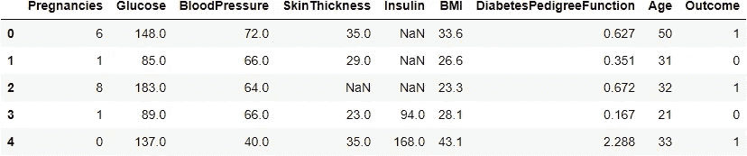
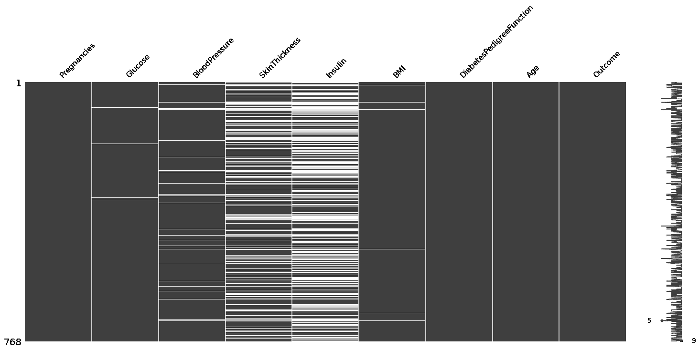
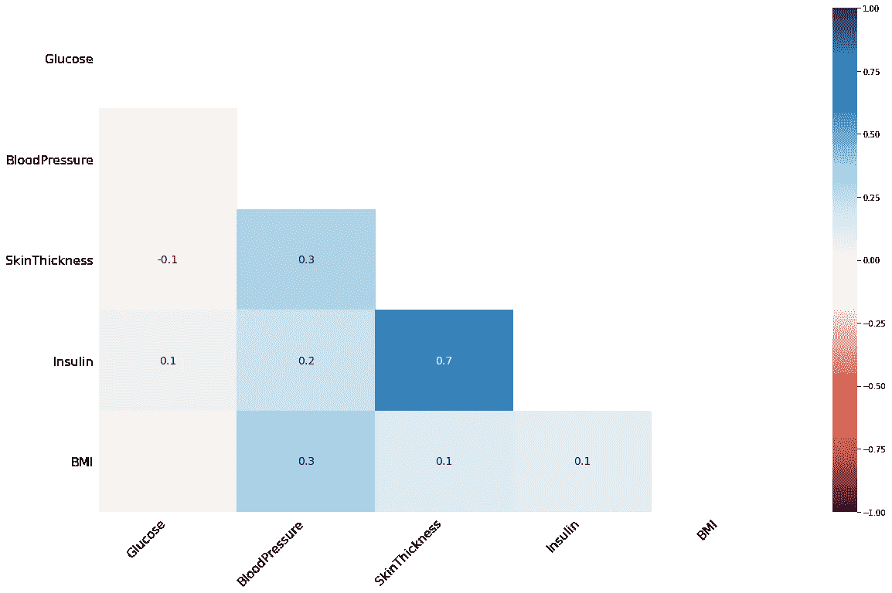
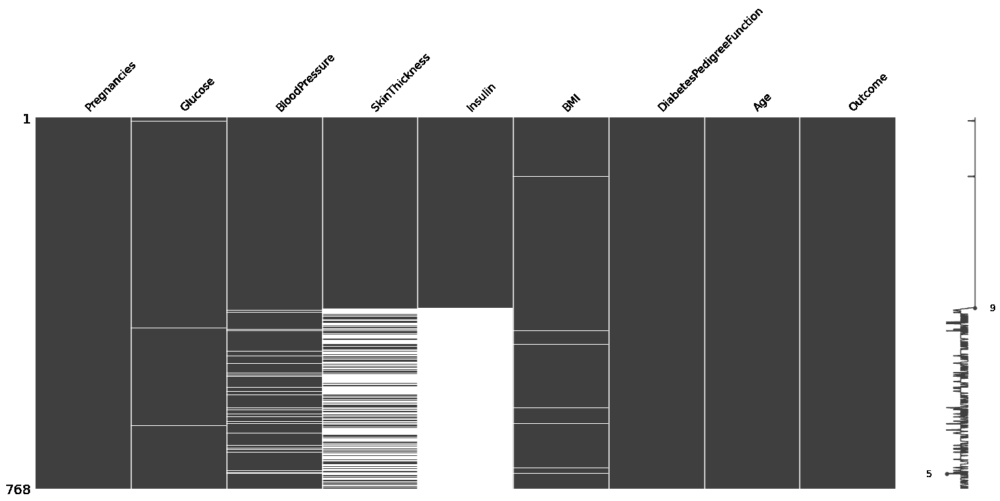
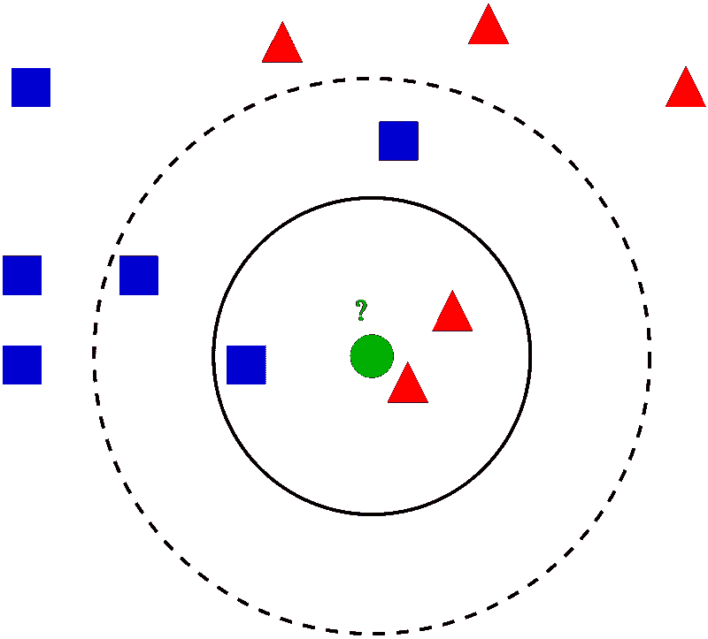
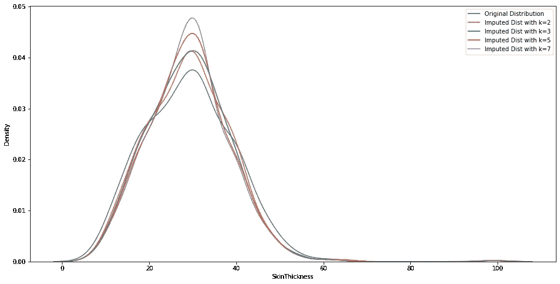
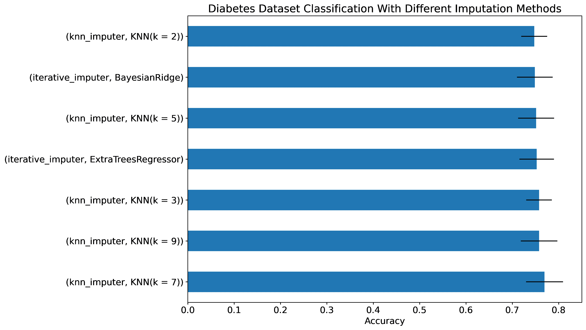

# Sklearn 高级缺失数据插补方法的深入教程

> 原文：<https://towardsdatascience.com/advanced-missing-data-imputation-methods-with-sklearn-d9875cbcc6eb>

## 学会利用强大的基于模型的插补技术。


由[安妮·伦凯](https://www.pexels.com/photo/close-up-photo-of-painting-3219951/)拍摄

## 介绍

尽管有大量的 MOOCs 和其他在线资源，但在处理某些数据问题方面仍然存在技能差距。一个例子是正确处理现实世界数据集中的缺失数据。新手往往对这个问题掉以轻心，也不怪他们。尽管这是一个如此紧迫的问题，但丢失数据问题的复杂性被大大低估了，因为存在小的、易于使用的玩具数据集。

因此，许多初学数据的科学家不会超越简单的均值、中值或众数插补。虽然这些方法对于简单的数据集来说可能足够了，但是对于处理大型数据集中的缺失数据来说，它们并不是一个合适的解决方案。

像数据科学工作流程的任何其他阶段一样，缺失数据插补是一个迭代过程。你应该能够使用多种方法并有效地比较它们的结果。虽然基本技术可能表现良好，但这种情况很少发生，因此您需要一些备份策略。

本教程将介绍 Sklearn 中两个更健壮的基于模型的插补算法— `KNNImputer`和`IterativeImputer`。您将学习它们的基本用法，调整它们的参数，最后，看看如何直观地测量它们的效果。

[](https://ibexorigin.medium.com/membership) [## 通过我的推荐链接加入 Medium-BEXGBoost

### 获得独家访问我的所有⚡premium⚡内容和所有媒体没有限制。支持我的工作，给我买一个…

ibexorigin.medium.com](https://ibexorigin.medium.com/membership) 

获得由强大的 AI-Alpha 信号选择和总结的最佳和最新的 ML 和 AI 论文:

[](https://alphasignal.ai/?referrer=Bex) [## 阿尔法信号|机器学习的极品。艾总结的。

### 留在循环中，不用花无数时间浏览下一个突破；我们的算法识别…

alphasignal.ai](https://alphasignal.ai/?referrer=Bex) 

## 识别缺失的类型

实施有效插补策略的第一步是确定值缺失的原因。尽管每个案例都是独一无二的，但失踪可以分为三大类:

*   **完全随机缺失(MCAR)** :这是一个真实的数据随机缺失案例。例如数据输入中的突然错误、暂时的传感器故障或与任何外部因素无关的一般丢失数据。丢失的数量很少。
*   **随机失踪(MAR)** :这是一个更广泛的 MCAR 案例。尽管乍一看，丢失的数据似乎是随机的，但它将与*其他观察到的特征*有一些系统的关系——例如——在计划的维护中断期间，观察设备中丢失的数据。空值的数量可能会有所不同。
*   **非随机缺失(MNAR)** :缺失值可能大量存在，缺失的原因与我们无法控制或了解的因素有关。

> 确定你的问题属于哪一类可以帮助你缩小解决方案的范围。

让我们使用[糖尿病数据集](https://www.kaggle.com/uciml/pima-indians-diabetes-database)进一步探究这些缺失类型:



作者图片

有五个要素具有不同比例的缺失值。识别缺失类型的第一步是绘制缺失矩阵。这个特殊的情节可以通过`missingno`包获得，我们可以将它作为`msno`导入:



作者图片

该矩阵显示了空值是如何分散在数据集中的。白色的线段或线条表示缺失值所在的位置。葡萄糖、身体质量指数和血压列可被视为 MCAR，原因有二:

*   缺失值的比例很小。
*   缺失值完全随机分布在数据集中。

但是，胰岛素和 SkinFoldThickness 列有异常多的缺失数据点。那么，他们的失踪有什么关系吗？

为了回答这个问题，MSNO 提供了一个缺失率热图，显示了缺失率之间的相互关系:

```
>>> msno.heatmap(diabetes);
```



作者图片

从图中我们可以看到皮肤厚度和胰岛素之间有很强的相关性。我们可以通过对任一列进行排序来确认这一点:

```
>>> msno.matrix(diabetes.sort_values("Insulin"));
```



作者图片

该图显示，如果 SkinThickness 中的数据点缺失，我们可以猜测它也从胰岛素列中缺失，反之亦然。由于这种联系，我们可以有把握地说两列中缺失的数据不是随机缺失的(MNAR)。

我们还可以看到血压和皮肤厚度之间的弱相关性，这表明血压并非完全随机缺失(MCAR)，而是与皮肤厚度的缺失值有一定关系。换句话说，就是随机缺失(MAR)。

你可能需要一段时间来理解这些思念的类型。要更深入地了解，你可以参考我写的另一篇文章，专门讨论想念类型和 MSNO 套餐:

[](https://towardsdev.com/how-to-identify-missingness-types-with-missingno-61cfe0449ad9) [## 如何用缺失号识别缺失类型

### 编辑描述

towardsdev.com](https://towardsdev.com/how-to-identify-missingness-types-with-missingno-61cfe0449ad9) 

## 用 KNNImputer 输入

现在，让我们来介绍一些插补方法。

除了基本的`SimpleImputer`，Sklearn 还提供了`KNNImputer`类，它使用 K-Nearest-Neighbors 算法来估算数值。如果您不熟悉它，我推荐您阅读我关于它的另一篇文章:

[](/intro-to-scikit-learns-k-nearest-neighbors-classifier-and-regressor-4228d8d1cba6) [## Scikit-learn 的 k 近邻分类器和回归器简介

### 编辑描述

towardsdatascience.com](/intro-to-scikit-learns-k-nearest-neighbors-classifier-and-regressor-4228d8d1cba6) 

作为参考，下面是一篇文章的节选，简要介绍了 KNN 算法的工作原理:

“假设您有一个包含两个类别的变量，此处显示了这两个类别:



**图片由维基百科**

给定一个新的未知样本，如何判断它属于哪一组？当然，你会看周围的点。但是结果真的取决于你看得多远。如果您查看最近的三个数据点(实心圆内)，绿点将属于红色三角形。如果你看得更远，(虚线圆圈内)点将被归类为蓝色方块。

KNN 也是如此。根据 k 的值，该算法通过分类中最近的 k 个邻居的多数投票对新样本进行分类。对于预测新样本的实际数值的回归，该算法取最近的 k 个邻居的平均值。"

KNNImputer 是 KNN 算法的一个略微修改的版本，它试图通过平均其 *k* 最近邻居之间的距离来预测*数值*的无效值。对于已经使用 Sklearn 一段时间的人来说，它的 Sklearn 实现应该不成问题:

有了这个估算器，问题就是为 *k* 选择正确的值。由于您无法使用 GridSearch 对其进行调优，因此我们可以采用可视化方法进行比较:



作者图片

在第 5 行中，我们绘制了缺失值的原始皮肤厚度分布。然后，在第 6–9 行，我们用不同的 k 值估算相同的分布，并在原始分布的顶部绘制。估算分布越接近原始分布，估算就越好。在这里，似乎 k=2 是最佳选择。

## 用迭代估算器估算

另一种更健壮但计算成本更高的技术是使用`IterativeImputer`。它采用任意的 Sklearn 估计量，并尝试通过将其他要素建模为具有缺失值的要素的函数来估算缺失值。以下是对其功能的更详细的逐步说明:

1.  回归量被传递给转换器。
2.  选择具有缺失值的第一个特征( *feature_1* )。
3.  数据被分成训练集/测试集，其中训练集包含 *feature_1，*的所有已知值，测试集包含缺失样本。
4.  回归变量适合所有其他变量作为输入，而 *feature_1* 作为输出。
5.  回归预测器预测缺失值。
6.  转换器继续这个过程，直到所有的特征都被输入。
7.  步骤 1-6 被称为一轮迭代，这些步骤按照`max_iter` transformer 参数的规定执行多次。

这意味着`IterativeImputer` (II)预测单个缺失样本的可能值不是一个而是 *max_iter* 个。这样做的好处是将每个缺失数据点视为一个随机变量，并将缺失值带来的固有不确定性联系起来。这也被称为**多重插补，**，它是大多数其他插补技术的基础(是的，还有很多其他技术)。

当所有迭代完成后，II 只返回预测的最后结果，因为通过每次迭代，预测都会得到改善。该算法还有一个早期停止功能，如果两轮之间没有明显的差异，它可以终止迭代。

根据 Sklearn 的说法，IterativeImputer 的这种实现受到了更流行的 R MICE 包(通过链式方程进行多元插补)的启发。让我们来看看它的实际应用:

> `*IterativeImputer*`仍然是一个实验性的特性，所以不要忘记包含上面代码片段的第二行。

当`estimator`设置为无时，算法会自行选择。但是，在阅读了 Sklearn 关于`IterativeImputer`的官方指南[之后，我了解到`BayesianRidge`和`ExtraTreeRegressor`产生了最好的结果。](https://scikit-learn.org/stable/auto_examples/impute/plot_iterative_imputer_variants_comparison.html#sphx-glr-auto-examples-impute-plot-iterative-imputer-variants-comparison-py)

## 不同技术的性能比较

现在是检验估算效果的时候了。为了实现这一点，我们将预测患者是否患有糖尿病(*结果*)，因此这是一项二元分类任务。让我们构建功能/目标阵列:

我们将使用交叉验证来测试`KNNImputer`和`IterativeImputer`。对于估算器，我们将使用推荐的`BayesianRidge`和`ExtraTreesRegressor`:



作者图片

我们可以从最终的结果中看到，在 RandomForests 上训练时，具有七个邻居的 KNNImputer 是数据集的最佳选择。尽管我提到过`IterativeImputer`会更健壮，但你永远无法确定。也许，我们可以通过调整它的参数来获得更好的性能。

## 摘要

数据缺失是一个应该重视的问题。如果你连先决数据问题都解决不了，那么花几个小时学习复杂的 ML 算法是没有意义的。请记住，模型的好坏取决于对其进行训练的数据。这意味着您必须尽最大努力处理缺失的数据点，因为它们在现实世界的数据集中无处不在。

在本文中，您学习了如何使用两种基于模型的技术来处理缺失:`KNNImputer`和`IterativeImputer`。以下是它们的文档链接、官方的 Sklearn 使用指南以及有助于您理解的相关资源:

*   [缺失值插补，Sklearn 指南](https://scikit-learn.org/stable/modules/impute.html)
*   [迭代输入文档](https://scikit-learn.org/stable/modules/generated/sklearn.impute.IterativeImputer.html)
*   [KNNImputer 文档](https://scikit-learn.org/stable/modules/generated/sklearn.impute.KNNImputer.html)
*   [用迭代输入器的变量输入缺失值](https://scikit-learn.org/stable/auto_examples/impute/plot_iterative_imputer_variants_comparison.html#sphx-glr-auto-examples-impute-plot-iterative-imputer-variants-comparison-py)

感谢阅读！

[](https://ibexorigin.medium.com/membership) [## 通过我的推荐链接加入 Medium-Bex t。

### 作为一个媒体会员，你的会员费的一部分会给你阅读的作家，你可以完全接触到每一个故事…

ibexorigin.medium.com](https://ibexorigin.medium.com/membership) [](https://ibexorigin.medium.com/subscribe) [## 每当 Bex T .发布时收到电子邮件。

### 每当 Bex T .发布时收到电子邮件。注册后，如果您还没有中型帐户，您将创建一个…

ibexorigin.medium.com](https://ibexorigin.medium.com/subscribe) 

**我的更多故事:**

[](/10-minute-effortless-sql-tutorial-for-die-hard-pandas-lovers-a64c36733fd0) [## 10 分钟轻松的 SQL 教程，适合铁杆熊猫爱好者

### 曾几何时，情况正好相反

towardsdatascience.com](/10-minute-effortless-sql-tutorial-for-die-hard-pandas-lovers-a64c36733fd0) [](/how-to-create-slick-math-animations-like-3blue1brown-in-python-457f74701f68) [## 如何用 Python 创建像 3Blue1Brown 这样流畅的数学动画

### 学习将你对数学和编程的热爱结合起来的最佳方式

towardsdatascience.com](/how-to-create-slick-math-animations-like-3blue1brown-in-python-457f74701f68) [](/matplotlib-vs-plotly-lets-decide-once-and-for-all-dc3eca9aa011) [## Matplotlib vs. Plotly:让我们决定一劳永逸

### 从 7 个关键方面进行深入快速的比较

towardsdatascience.com](/matplotlib-vs-plotly-lets-decide-once-and-for-all-dc3eca9aa011) [](https://ibexorigin.medium.com/yes-these-unbelievable-masterpieces-are-created-with-matplotlib-b62e0ff2d1a8) [## 是的，这些令人难以置信的杰作是用 Matplotlib 创作的

### 它们让我的作品看起来像孩子画的树

ibexorigin.medium.com](https://ibexorigin.medium.com/yes-these-unbelievable-masterpieces-are-created-with-matplotlib-b62e0ff2d1a8)