# 在一行代码中创建令人惊叹的可视化熊猫数据框架

> 原文：<https://towardsdatascience.com/advanced-pandas-plots-e2347a33d576>

## 一个简单的技巧，使您的图表具有交互性和视觉吸引力


来自[佩克斯](https://www.pexels.com/photo/person-with-body-painting-1209843/?utm_content=attributionCopyText&utm_medium=referral&utm_source=pexels)的[莎伦·麦卡琴](https://www.pexels.com/@mccutcheon?utm_content=attributionCopyText&utm_medium=referral&utm_source=pexels)的照片

伟大的视觉化带来卓越的洞察力。

几乎每个使用 Python 的数据科学家也用[熊猫](https://pandas.pydata.org/)。这是事实上的用于数据争论的 Python 库。开箱即用的熊猫为常见的图表类型提供了一些很好的可视化效果。

但是默认并不是最好的。

我们可以用一个像 Plotly 这样的配套框架做得更好。我们可以将绘图后端设置为 Plotly，并在我们的项目中使用其时尚的图表。

但是单独设置后端并不能给我们的数据帧带来[的全部好处。例如，Pandas 没有表面绘图选项。此外，Plotly 创建图表的方式与熊猫略有不同。](https://plotly.com/)

[袖扣](https://github.com/santosjorge/cufflinks)是另一个弥合这一鸿沟的图书馆。我们可以用同样的熊猫叫声来制作更令人惊叹的图表。此外，我们可以开发高级图表，如曲面图。

</how-to-do-a-ton-of-analysis-in-the-blink-of-an-eye-16fa9affce06>  

# 如何从数据帧创建情节-纯熊猫的方式。

在 Pandas 中，如果要创建条形图、箱线图等图表，只需调用 plot 方法即可。我们可以指定我们需要的图表类型和其他几种配置。

在下面的例子中，我们使用 panda 的内置绘图功能创建了一个条形图。

```
df.plot(kind='bar', x="month", y="passengers")
```

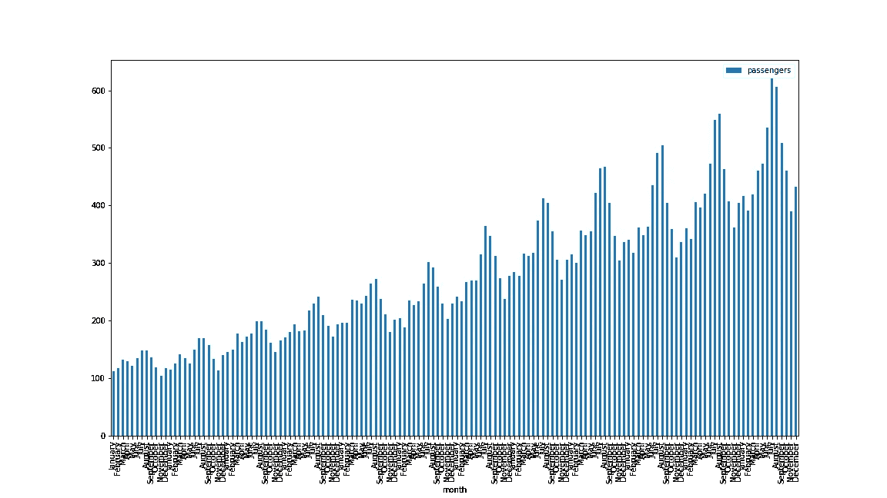

Pandas 使用 Matplotlib 后端创建的条形图—作者截图。

以上很直白。然而，它的外观并没有那么好。

Pandas 默认的绘图后端是 [Matplotlib](https://matplotlib.org/stable/index.html) 。它在许多情况下都工作得很好。但是如果有不同的后端，图表会更好。

通过将绘图后端改为 Plotly，我们可以快速将这个普通的图表变成一个漂亮的图表。

```
pip install plotly==5.5
# conda install -C plotly plotly==5.5.0
```

如果您的计算机上还没有安装 Plotly，请使用上面的代码。

我们可以用下面一行代码将后端设置为 Plotly。我建议您在将熊猫导入笔记本(或项目)后立即添加这一行。)

```
 import pandas as pd
pd.options.plotting.backend = “plotly”
```

生成的图表更具美感，而且总结得很好。

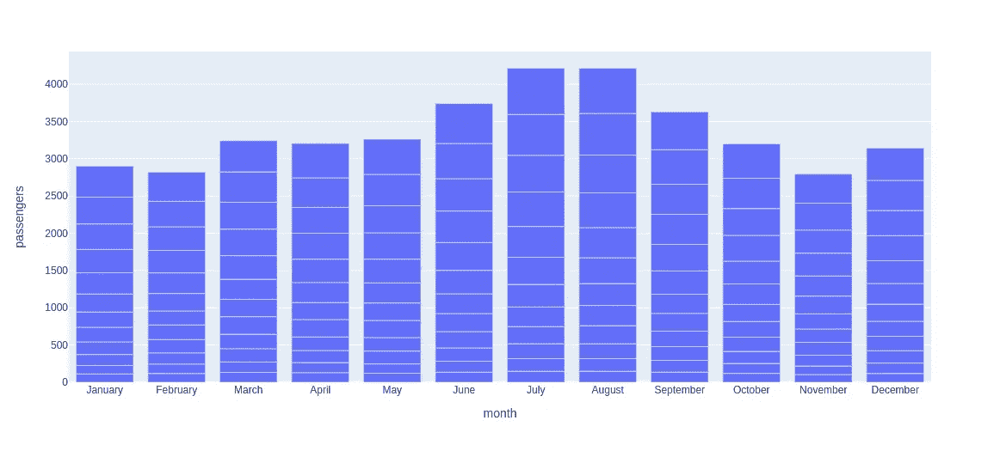

条形图由熊猫的 Plotly 后端创建-作者截图。

但是，正如我前面提到的，它仍然缺少一些关键图表。我们换个方式来挖掘 Plotly 的最大潜力。

</9-easy-steps-to-make-great-charts-33e2c4612e39>  

# 如何使用袖扣从数据框中创建图

Cufflinks 是一个 Python 库，它帮助我们以一种类似熊猫的自然语法来使用熊猫。它还增加了比我们通常在熊猫数据框中看到的更令人印象深刻的图表类型。

我们可以导入它，配置一次全局主题和其他选项，并使用添加到每个数据帧的`iplot` API，而不是默认的绘图方法。

让我们用下面的命令从 [PyPI](https://pypi.org/project/cufflinks/) 安装它。

```
pip install cufflinks
```

安装完成后，我们可以在笔记本中导入并配置它。

```
import pandas as pd
import cufflinks as cf
import numpy as npcf.set_config_file(theme='pearl')
```

我们现在可以使用`iplot`方法创建许多不同的图表。这里有一个例子。

```
cf.datagen.lines(4,1000).iplot()
```

我们使用了袖扣包装的`datagen`模块。它允许我们为各种情况生成随机数据。我们将用它来为这篇文章的其余部分创建数据。

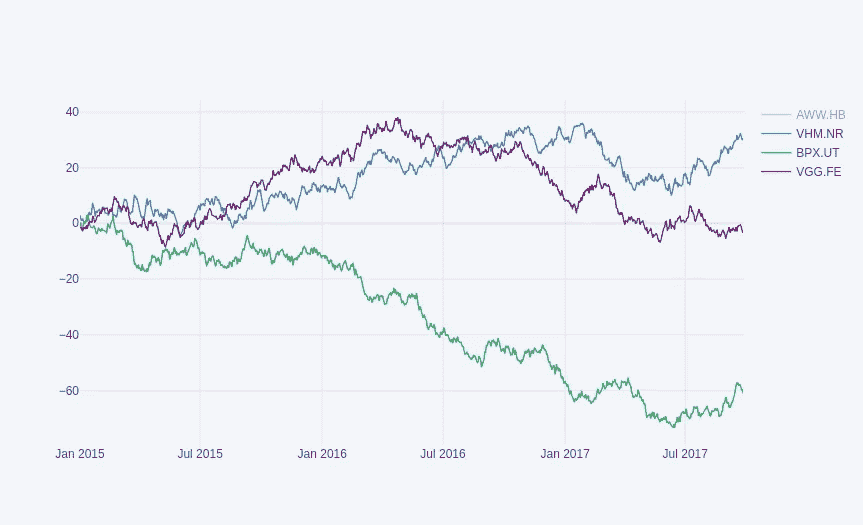

使用袖扣、熊猫和 Plotly 生成的折线图--作者截图。

这个小小的调整极大地提高了图表的可展示性，而没有显著改变我们的代码。

# 我们可以在数据帧上创建的图形数据可视化类型。

Plotly 有几种不同的图表类型。其中一些可以通过袖扣买到，我们可以直接从数据框中调用。

</plotly-dashboards-in-python-28a3bb83702c>  

以下是一些熊猫身上没有的图表，但通过袖扣却成为可能。

## 3D 曲面图。

曲面图是三维数据的可视化表示。它在很多应用中都很有用。例如，我们在机器学习中使用曲面图来研究成本函数和梯度下降优化。

以下代码从 dataframe 创建表面图。袖扣选择列和行索引作为 x 轴和 y 轴。数据帧的值在 z 轴上。

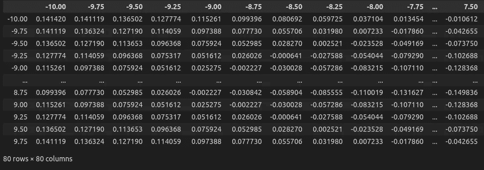

表面图的数据集。作者截图。

```
cf.datagen.sinwave(10,.25).iplot(kind='surface')
```

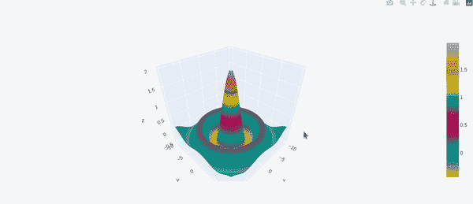

用袖扣、Plotly 和熊猫创建的表面图。—作者 GIF。

如果数据集的所有值都在不同的列中，请在绘制之前使用如下所示的透视函数将其转换为兼容的格式。


在曲面图中使用的数据透视表。—作者截图。

## 气泡图

气泡图是以有意义的方式可视化多维度的另一个好方法。我们可以在一张图中描绘出四个特征，包括一个分类变量。

下面的图表显示了行星大小如何随着它与太阳的距离以及每个行星的质量而变化(当然是假数据。)

```
cf.datagen.bubble(prefix="planet").iplot(kind='bubble',x='x',y='y',size='size',categories='categories',text='text', xTitle='Relative Mass',yTitle='Distance from the Sun',title='Plannet Size, Mass and Distance')
```

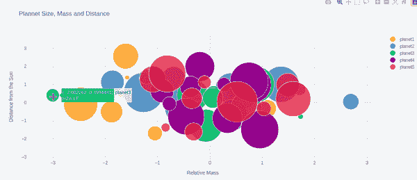

用袖扣、熊猫和 Plotly 创建的气泡图——作者的屏幕记录。

另外，请注意，您使用袖扣扩展创建的图表是交互式的。将鼠标悬停在任何气泡上以查看其详细信息。你可以点击任何类别来打开或关闭它。

## 热图图表

热图通常是在数据集中找出热点的一种更简单的方法。它们就像表面图，允许我们同时可视化三个数据维度。但是在这里，我们用的不是 z 轴，而是色谱。

像其他图表类型一样，创建热图也很容易。

```
cf.datagen.heatmap(20,20).iplot(kind='heatmap',colorscale='spectral')
```

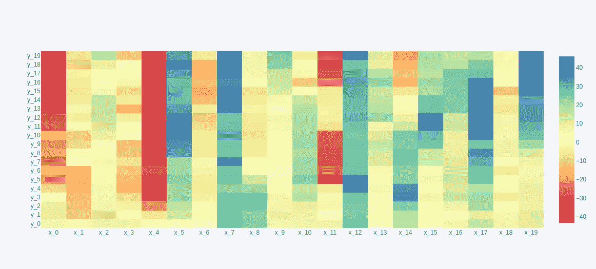

用袖扣创建的热图，绘在熊猫数据帧上——作者截图。

## 传播图表

假设你在一段时间内跟踪两个类别的变量；你可能还想看看它们的差异是如何随着时间而变化的。你可能要看看差距是否正在缩小，甚至翻转。或者可能是差异本身的趋势。

分布图是一种很好的方式来显示两个变量随时间的分布。

```
cf.datagen.lines(2).iplot(kind='spread',xTitle='Dates',yTitle='Return')
```

电子表格的工作原理就像折线图一样。但是除了绘制各条线之外，它还会在折线图下方生成一个面积图。它们共享同一个时间轴，因此很容易理解。

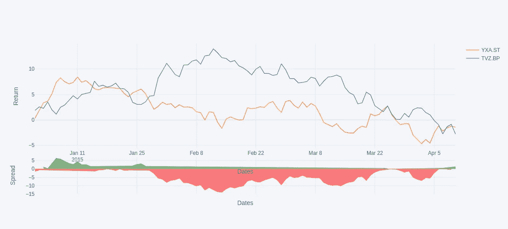

用袖扣和熊猫数据框绘制的电子表格。—作者截图。

这些只是你可以用袖扣扩展创建的许多图表中的一部分。当然，您也可以从 pandas 默认 API 中获得更常见的图表。

</how-to-create-stunning-web-apps-for-your-data-science-projects-c7791102134e>  

# 改变图表的主题。

通过袖扣配置，你可以轻松地在几种颜色主题之间切换。我们有以下选项来选择一个。

```
ggplot, pearl, solar, space, white, polar, henanigans
```

在本文的顶部，我们第一次配置袖扣时使用了珍珠主题。下面是我们如何把它改成不同的主题。

```
cf.set_config_file(theme='henanigans')
```

下面是我们使用的最后一个例子如何出现在其他颜色主题中。

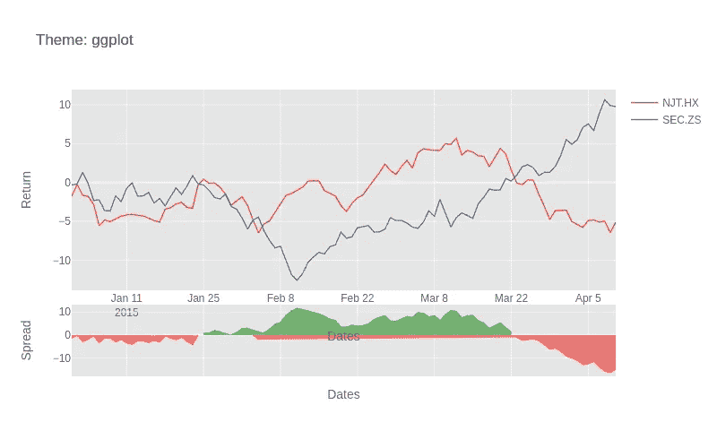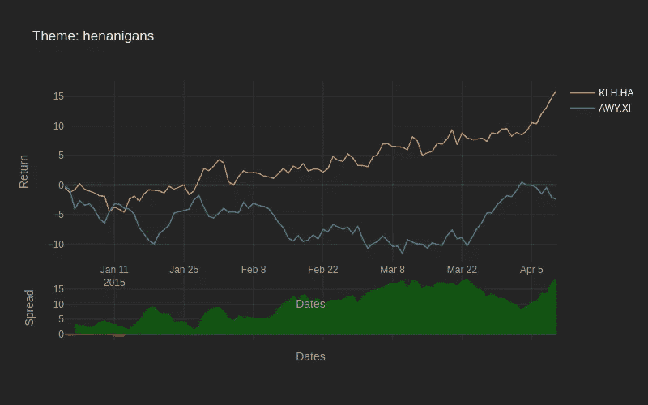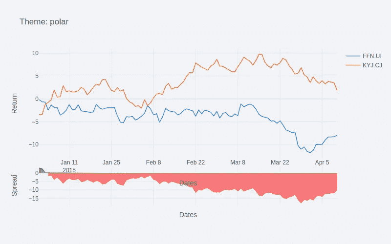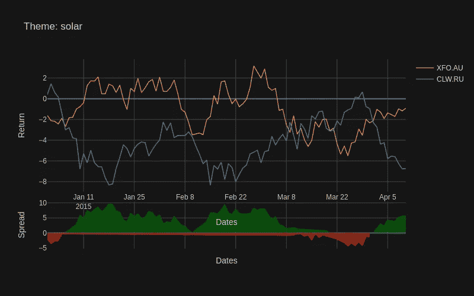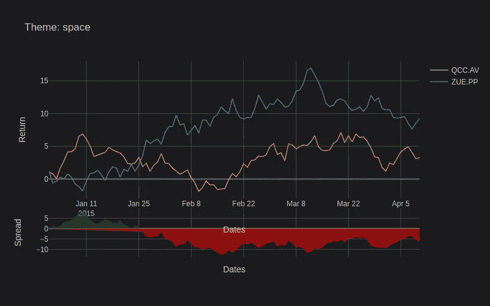

袖扣中不同主题生成的电子表格-作者截图。

# 最终想法

可视化使得我们可以用手头的数据做的事情完全不同。

当使用 Pandas dataframes 时，我们主要使用其默认的绘图方法来创建图形。但是这些图表的风格不足以很好地呈现它。一个快速的技巧是将绘图后端改为 Plotly 并拥有漂亮的图表。

然而，熊猫数据框的另一个巧妙绑定，称为袖扣，为默认的熊猫绘图选项增加了额外的可能性。有了它，我们可以在几个预配置的主题之间快速切换，并解锁 Pandas 中没有的图表。

这篇文章讨论了如何开始使用熊猫、Plotly 和袖扣。我们还在一行代码中创建了一些奇妙的数据帧视觉效果。

</5-python-gui-frameworks-to-create-desktop-web-and-even-mobile-apps-c25f1bcfb561>  </summarize-pandas-data-frames-b9770567f940>  

> 朋友，感谢你的阅读！在[***LinkedIn***](https://www.linkedin.com/in/thuwarakesh/)*[***Twitter***](https://twitter.com/Thuwarakesh)*，以及*[***Medium***](https://thuwarakesh.medium.com/)*上跟我打招呼。**
> 
> **还不是中等会员？请使用此链接* [***成为会员***](https://thuwarakesh.medium.com/membership) *因为，在不为你额外付费的情况下，我为你引荐赚取一小笔佣金。**