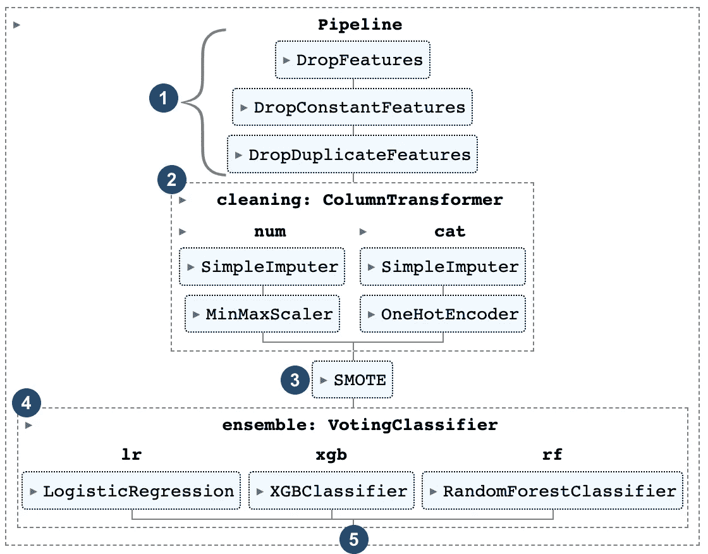
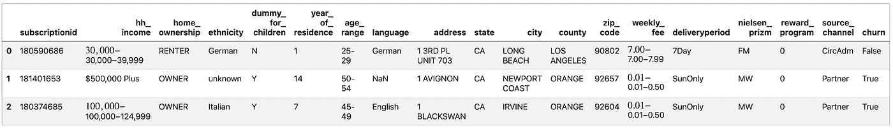
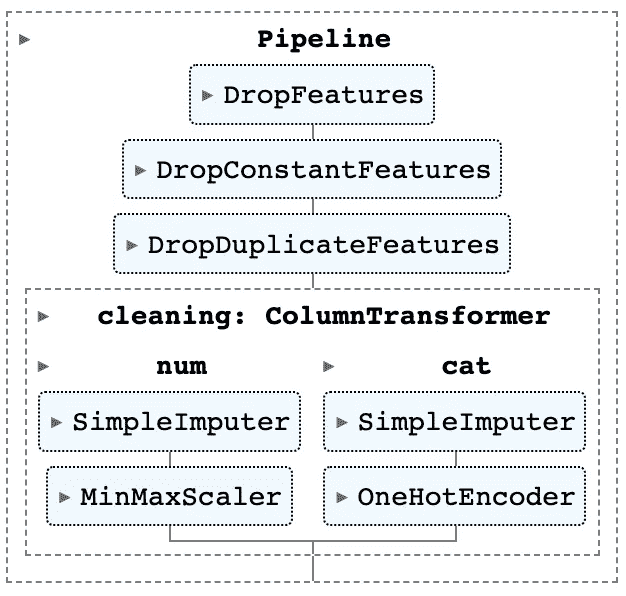
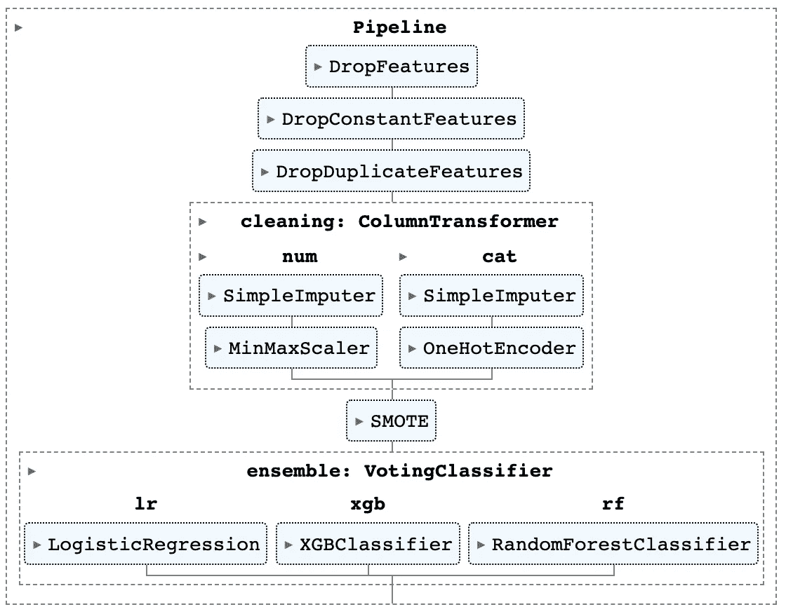
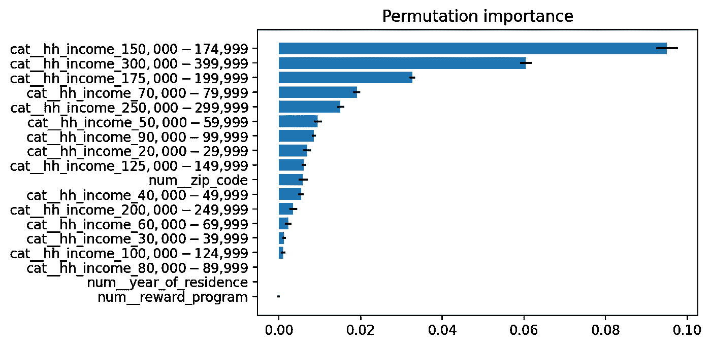

# 使用 scikit 的高级管道-了解

> 原文：<https://towardsdatascience.com/advanced-pipelines-with-scikit-learn-4204bb71019b>

## 整合来自 imblearn 的模块、管道中的功能引擎，并提取功能重要性图


照片由 [Pexels](https://www.pexels.com/de-de/foto/metallrohre-mit-manometer-372796/) 拍摄。

在您的机器学习项目中使用管道有助于为您的工作流带来更多的结构。它们使您的不同过程步骤更容易理解、重现，并防止数据泄漏。

Scikit-learn pipeline 与其变压器、模型和其他模块配合得非常好。**然而**，当一个人试图**将** scikit-learn 的管道与**来自 imblearn 等其他包**的管道解决方案或模块进行合并或集成时(即使它是建立在 scikit-learn 之上的)，这可能(非常)具有挑战性。

可能会出现这样的问题:

```
**TypeError**: All intermediate steps should be transformers and implement fit and transform or be the string ‘passthrough’ ‘SMOTE()’ (type <class ‘imblearn.over_sampling._smote.base.SMOTE’>) doesn’t
```

即使完全坚持 scikit-learn 功能，从管道中提取最终使用的特性来创建**特性重要性图**也常常是具有挑战性的。

本文通过构建一个用于客户流失预测的集成或投票分类器的例子向您展示**如何** …

*   从 **scikit-learn** 、 **imblearn** 和 **feature-engine** 包中构建一个包含模块的管道**。**
*   **在编码步骤之后，从你的管道中提取特征**(例如，一键编码)。
*   创建一个**特征重要性**图。

> **重要提示**:我建议安装最新版本的 scikit-learn(在撰写本文时是 1.1.1)以便能够从管道中提取特性。由于这个要求，代码将不能在 Google Colab (1.0.2)上运行。

# Outlook 最终解决方案:在一个管道中组合来自不同包的几个模块



图一。最终管道(图片由作者提供)。

图 1 显示了我们希望在本文末尾看到的内容。下面，我们将实现这些步骤中的每一个。从丢弃不相关的特征(步骤 1)到应用估算器和缩放器(步骤 2)和处理类别不平衡(步骤 3)到我们的集成模型(步骤 4)。在第 5 步中，我们应用超参数优化并创建一个特征重要性图。

> EDA、特征构建、最大化模型性能、分析和解释结果不在本文的范围之内。目标是向您展示**如何使用集成了来自不同包的模块的管道**。

# 步骤 0:准备和数据加载

在设置我们的管道之前，我们必须加载我们需要的包和示例数据。

下面的代码向您展示了本文中所需的包和模块。

上面的代码导入了常见的嫌疑人(熊猫、numpy 等。)，提到的软件包 scikit-learn(或 sklearn)，imblearn 和 feature-engine。它还导入了 xgboost，这是我们的集成分类器的一部分，以及用于超参数调整的 scipy 包中的 loguniform 模块。

> 如果你以前没有听说过 imblearn 和特性引擎包，这里有一个简短的解释。 [**Imblearn**](https://imbalanced-learn.org/stable/) 通过提供不同的采样策略，帮助你处理**类不平衡**。 [**特征引擎**](https://feature-engine.readthedocs.io/en/latest/) 提供模块**管理数据集中的列或特征**(例如，删除不相关的)。

## 数据集:报纸流失

所使用的数据集来自以前的 [Kaggle 竞赛](https://www.kaggle.com/datasets/andieminogue/newspaper-churn)并获得 *CC0:公共领域*许可。它包含 15.855 条记录和 19 列，包括目标变量*订户*(是/否)。大多数特征都是典型的。

下面的代码加载数据并应用一些预备步骤，比如将所有列名转换成小写并将目标变量转换成布尔值。

在应用这些次要的预清理步骤后，数据应该如下所示:



图二。摘录报纸资料(图片由作者提供)。

# 步骤 1:排除特征

管道中的第一步是排除或删除对我们的预测没有帮助的列。例如，列 *subscriptionid，*每行有不同的值，这是有意义的，但是这个特性对我们的建模步骤没有好处。我们还可以排除重复的特征(例如，具有相同值的相同列两次或更多次)和包含常数值的特征。

上面的代码创建了一个[管道](https://scikit-learn.org/stable/modules/generated/sklearn.pipeline.Pipeline.html)对象(`line 1`)，并添加了三个步骤(`lines 3–5`)。步骤被定义为元组，第一个元素定义步骤的名称(例如，*‘drop _ columns’*)，第二个元素定义转换器(例如， *DropFeatures()* )。

> 这些都是非常简单的步骤，也可以应用到管道之外(例如，熊猫)。然而，本文的想法是在管道中集成尽可能多的功能。更多关于特性引擎包的信息可以在[这里](https://feature-engine.readthedocs.io/en/latest/api_doc/index.html)找到*📗*。
> 
> 蓝色圆圈中的“步骤”(图 1)和标题是指导您阅读本文的步骤。上面代码中的步骤是“真正的”管道步骤。

# 步骤 2:估算和转换值

在我们删除了不相关的列之后，我们现在关注于处理缺失值和特性缩放。我们的数据集包含不同类型的列( *integer* 和 *categorial* )。这就是为什么我们必须定义两个独立的工作流。

我们添加了一个名为*清理*的新步骤，并创建了一个 ColumnTransformer 对象(`line 8`)。在 ColumnTransformer 中，我们设置了两条新管道。一个用于处理数值(`line 10`)，一个用于处理类别值(`line 16`)。为了确保为每个步骤选择正确的列，我们使用了 *make_column_selector* 方法(`lines 13,19`)。

> 我们通过使用 dtype_include 参数来选择相关的列。当然，我们也可以提供列名列表或 regex 语句。

# 第三步:取样

流失或欺诈分类的一大挑战是处理类别不平衡。Imblearn 提供了一系列可供您应用的采样方法。在这个例子中，我们将使用 SMOTE 采样方法(`line 23`)。

## 从管线中提取变换和缩放的特征

在第 4 步建立我们的集成分类器之前，我们要检查哪些特征通过了管道，它们看起来像什么。

图 3 显示了我们管道的当前状态。



图 3。步骤 3 后的管道(图片由作者提供)。

pipeline 对象提供了一个名为*get _ feature _ names _ out()*的方法。但是在使用它之前，我们必须在数据集上安装管道。由于步骤 3 (SMOTE)只关注我们的 y 数据，我们可以忽略它，只关注步骤 1–2。

上面的代码(`line 1`)提取了从 *DropFeatures* ( `[0:`)到*cleaning:column transformer*(`:4]`)步骤的流水线步骤，并拟合训练数据(`line 2`)。管道拟合好后，我们可以调用*get _ feature _ names _ out()*方法。结果看起来像这样:

```
0                    num__year_of_residence
1                             num__zip_code
2                       num__reward_program
3        cat__hh_income_$  20,000 - $29,999
4        cat__hh_income_$  30,000 - $39,999
                        ...                
12122               cat__source_channel_TMC
12123            cat__source_channel_TeleIn
12124           cat__source_channel_TeleOut
12125               cat__source_channel_VRU
12126          cat__source_channel_iSrvices
Length: 12127, dtype: object
```

由于一次热编码，产生了许多新功能( *cat__XX_XX* )。命名约定向您显示该特征是数字特征还是类别特征(如 *cat__* )、其名称(如 *source_channel_* )以及相关值( *TMC* )。

> 为了[像我一样显示您的管道](https://scikit-learn.org/stable/auto_examples/miscellaneous/plot_pipeline_display.html)(例如，图 3)，只需在调用您的管道对象(例如，`ppl`)之前将`set_config(display="diagram")`放在您的代码中。参见步骤 0“准备和数据加载”代码行 33。

# 步骤 4:构建集成分类器

现在是时候建立我们的集成或投票分类器。在本例中，我们想使用下面三个模型的**均值预测**(`lines 2–6`)。这就是为什么我们将*投票参数*设置为*软* ( `line 8`)。

在定义集合模型之后，我们准备将它集成到我们的管道中。

如果你已经注意到了，那么你已经看到了`line 1`的变化。我们现在用的不是 sklearn 的 *Pipeline* 对象，而是 imblearn 的*im Pipeline*。

如果我们不这样做，那么在拟合(`ppl.fit(X_train, y_train)`)数据时，我们会得到以下错误:

```
**TypeError**: All intermediate steps should be transformers and implement fit and transform or be the string 'passthrough' 'SMOTE()' (type <class 'imblearn.over_sampling._smote.base.SMOTE'>) doesn't
```

太好了！我们终于组装好了管道。结果可以在图 4 中看到。



图 4。最终管道(图片由作者提供)。

# 步骤 5:超参数调整和特性重要性

## 超参数调谐

下面的代码显示了如何通过使用 *RandomizedSearchCV* 来应用超参数调整。

定义的参数(`lines 3-17`)遵循特定的命名惯例:

*   第一个参数( *ensemble__* ):投票分类器的名称
*   第二个参数( *lr__* ):我们集合中使用的模型的名称
*   第三个参数(*解算器*):模型相关超参数的名称

因为我们必须处理类不平衡，我们将在这个例子中使用重复分层 k-fold ( `line 20`)。更多关于其优势的信息可以在[这里](https://machinelearningmastery.com/cross-validation-for-imbalanced-classification/)找到。

> 如果您**不想使用超参数调整**而想使用您自己的超参数值，您可以在模型初始化(步骤 4)时设置它们，或者在之前添加一个新行**用`*ppl.set_params(**dict_with_best_params)*` *拟合语句(`*ppl.fit()*`)。***

## 特征重要性图

为了使用我们的管道创建一个特征重要性图，我们使用了 [**排列重要性**](https://scikit-learn.org/stable/auto_examples/inspection/plot_permutation_importance.html) 。

`Lines 3 to 13`显示一个函数，该函数稍后将绘制我们的特征重要性。`lines 16 to 18`中的代码提取了我们管道中使用的特性名称(作为一个例子，我们在第 3 步结束时做了同样的事情)。在最后两行(`lines 20 to 21`)中，我们在训练数据上使用拟合的模型/管道来计算排列重要性。

查看特征或排列重要性图(图 5)，我们可以看到特征 *hh_income* 主导了预测。由于该特性包含可排序的值(30–40k 小于 150–175k)，我们可以使用不同的编码方式(例如，使用 LabelEncoding)。



图 5。排列重要性图(图片由作者提供)。

# 结论

使用管道可能会让人神经紧张。特别是如果你想提取特性，组合和使用不同包中的模块，并创建一个特性重要性图。本文通过一个带有不平衡类的分类问题的例子展示了如何创建一个高级管道并应用上面提到的所有步骤。

# 来源

**数据集**:[https://www . ka ggle . com/datasets/andieminogue/newspaper-churn](https://www.kaggle.com/datasets/andieminogue/newspaper-churn)(**CC0**:公共领域)

**Scikit-learn**:[https://Scikit-learn . org/stable/modules/generated/sk learn . pipeline . pipeline . html](https://scikit-learn.org/stable/modules/generated/sklearn.pipeline.Pipeline.html)

**不平衡学习**:[https://不平衡学习. org/stable/references/generated/imb learn . pipeline . pipeline . html](https://imbalanced-learn.org/stable/references/generated/imblearn.pipeline.Pipeline.html)

**特征-引擎**:【https://feature-engine.readthedocs.io/en/latest/ 

**创建特征重要性图**:[https://inria . github . io/scikit-learn-mooc/python _ scripts/dev _ features _ importance . html](https://inria.github.io/scikit-learn-mooc/python_scripts/dev_features_importance.html)