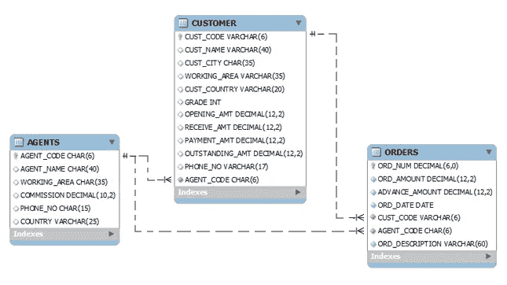
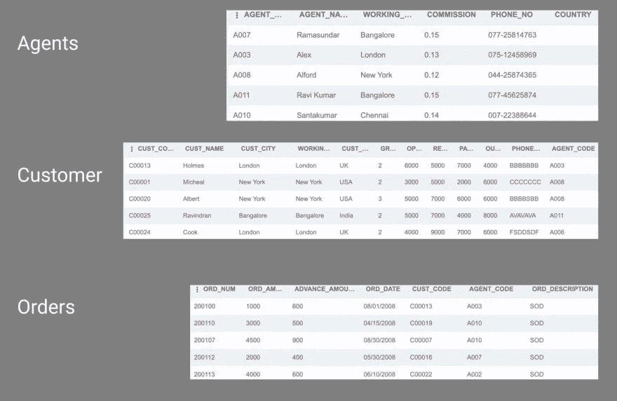
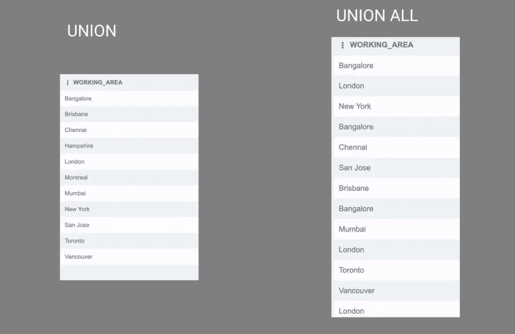
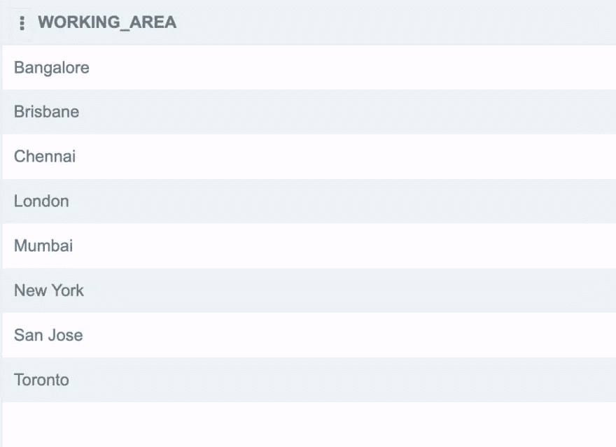
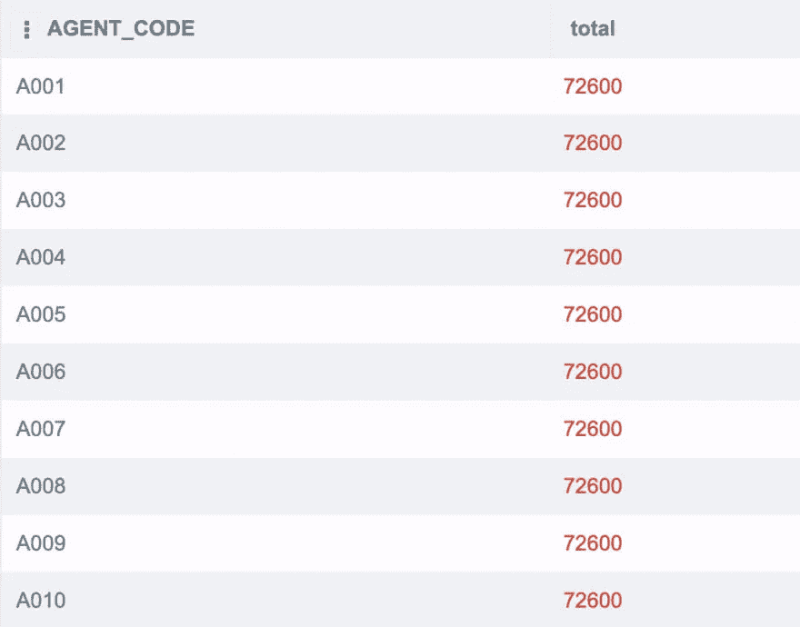
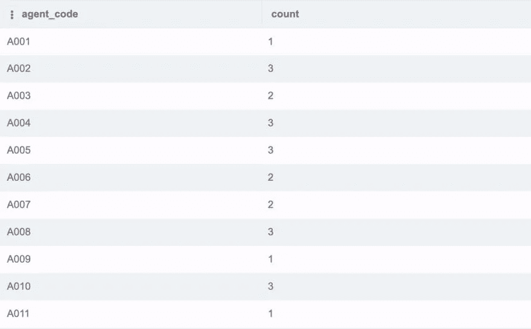
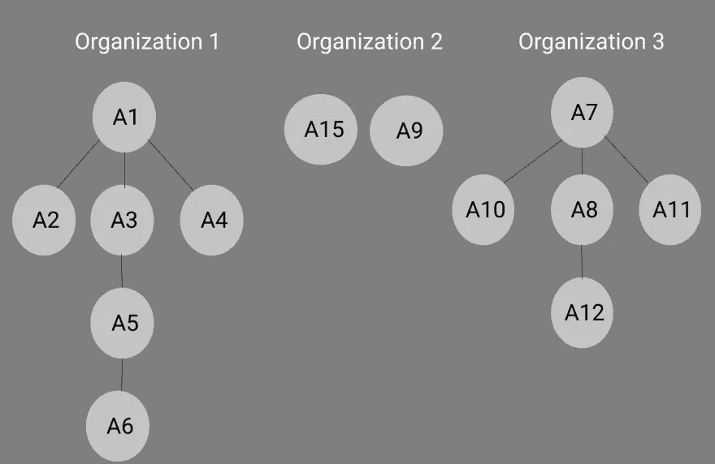

# 高级 SQL:超越基础

> 原文：<https://towardsdatascience.com/advanced-sql-going-beyond-the-basics-bbcae047fe7e>


卡斯帕·卡米尔·鲁宾在 [Unsplash](https://unsplash.com/s/photos/sql?utm_source=unsplash&utm_medium=referral&utm_content=creditCopyText) 上的照片

结构化查询语言(SQL)为您的工具箱增添了一大亮点。它可能不像 Python 或 JavaScript 那样受欢迎，但了解 SQL，尤其是高级 SQL，会带来很多好处。

一方面，了解高级 SQL 技术可以帮助您从数据中获得更好的洞察力，从而可以更有效地交流您的想法。由于 SQL 和其他语言一样存在性能瓶颈和性能问题，因此更深入的了解将有助于您优化查询。

最后，额外的知识将帮助您从其他开发人员中脱颖而出，这些开发人员可能知道 CRUD 操作，但不知道高级 SQL 概念。这给了你一个职业优势。

本文将向您介绍一些高级 SQL 概念，包括子查询、运行总计和公共表表达式(cte)。接下来，您可以使用任何支持 SQL 的数据库和您选择的编辑器。你也可以使用一个在线 SQL 编辑器。

以下示例使用在线 SQL 编辑器和 SQLite 数据库。如果您正在使用 PostgreSQL 之类的数据库，您可能需要更改语法；然而，基本概念是相同的。

# 并集、交集和例外运算符

您可以使用本资源中[的样本数据。在这个例子中，所有的命令都被合并到这个库](https://www.w3resource.com/sql/sql-table.php)中的一个脚本中。运行该脚本，它将创建三个包含示例数据的表。以下是表格的模式:



[*图片由 w3 resource*](https://www.w3resource.com/sql/sql-table.php)*(CC BY 4.0)*

每个表格的前五行如下所示:



作者截图

`UNION`、`INTERSECT`和`EXCEPT`运算符帮助您组合两个查询的结果。在处理集合时，SQL 中的运算符类似于数学运算符。你必须记住以下规则:

> *第一个查询返回的表中的列数和列顺序必须等于第二个查询返回的表中的列数和列顺序。此外，相应列的数据类型必须兼容。*

下面是在 SQL 中使用运算符的一般语法:

```
SELECT * FROM TABLE1
OPERATOR
SELECT * FROM TABLE2
```

# 联合运算符

`UNION`操作符返回来自两个查询的表的组合。默认情况下，结果不会有重复值。但是，如果您想保留副本，可以使用`UNION ALL`操作符。

以下命令将返回所有不同城市的列表:

```
SELECT working_area FROM AGENTS
UNION
SELECT cust_city FROM CUSTOMER
```

以下命令将返回所有城市的列表，包括重复的城市:

```
SELECT 
  working_area 
FROM 
  AGENTS 
UNION ALL
SELECT 
  cust_city 
FROM 
  CUSTOMER
```

下图比较了`UNION`和`UNION ALL`的输出:



作者截图

如你所见，在右边的表格中，伦敦和班加罗尔被重复。

# 交集运算符

`INTERSECT`操作符返回第一个和第二个查询返回的表中的公共元素。

```
-- Returns a list of common cities in both columns
SELECT 
  working_area 
FROM 
  AGENTS 
INTERSECT 
SELECT 
  cust_city 
FROM 
  CUSTOMER
```

结果如下所示:



作者截图

# 操作员除外

`EXCEPT`操作符返回第一个查询返回的表中所有不在第二个查询返回的表中的元素。

```
SELECT 
  working_area 
FROM 
  AGENTS 
EXCEPT 
SELECT 
  cust_city 
FROM 
  CUSTOMER
```

上面的命令将返回一个包含温哥华的单行表。你会注意到温哥华是唯一一个在`CUSTOMER.cust_city`而不在`AGENTS.working_area`的城市。

# 子查询

在 SQL 中，可以在查询中包含一个查询，也称为子查询。子查询中也可以包含查询。子查询有三种主要形式:

*   作为`SELECT`语句的一部分
*   在`FROM`之后
*   在`WHERE`之后

子查询帮助您将复杂的连接和联合分解成更小的部分，使您的查询更具可读性和可维护性，特别是因为您可以使用现有查询的结果。子查询还使调试更容易，因为您可以独立地调试每个查询。理解子查询也有助于您编写递归 SQL。

# 带 SELECT 的子查询

查看名为`AGENTS`和`ORDERS`的表格。您的任务是返回一个包含两列的表。第一列应该包含来自`AGENTS`表的`agent_code`，第二列应该包含`ORDERS.ord_amount`列的总和。第二列应该有相同的值，或者重复多次的总和。

首先，返回所有订单金额的总和:

```
SELECT 
  SUM(ord_amount) 
FROM 
  ORDERS
```

上面的命令将是您的子查询。您可以如下所示使用它来获得所需的结果:

```
SELECT 
  agent_code, 
  (
    SELECT 
      SUM(ord_amount) 
    FROM 
      ORDERS
  ) total 
FROM 
  AGENTS
```

第二行中的命令是子查询。它返回`ORDERS.ord_amount`列的总和。您还可以命名第二列，方法是使用`AS`或在子查询后包含您喜欢的名称。下面是部分结果的截图:



作者截图

# 带有 FROM 的子查询

以下 SQL 命令返回一个表，其中包含订单总额、平均订单额以及代理销售给客户的订单数:

```
SELECT 
  agent_code, 
  cust_code, 
  sum(ord_amount) total_amnt, 
  avg(ord_amount) avg_amount, 
  count(*) AS num 
FROM 
  ORDERS 
GROUP BY 
  agent_code, 
  cust_code
```

您必须使用结果来查找每个代理销售的订单总数。您可以将上面的命令和`FROM`一起用作子查询:

```
SELECT 
  agent_code, 
  count(agent_code) AS count 
FROM 
  (
    SELECT 
      agent_code, 
      cust_code, 
      sum(ord_amount) total_amnt, 
      avg(ord_amount) avg_amount, 
      count(*) AS num 
    FROM 
      ORDERS 
    GROUP BY 
      agent_code, 
      cust_code
  ) 
GROUP BY 
  agent_code
```

上面的命令返回每个代理销售给的客户总数。您可以从子查询返回的表中进行选择，而不是从现有表中进行选择。以下是部分结果:



作者截图

# 带有 WHEN 的子查询

现在使用`AGENTS`和`CUSTOMER`表返回一个只包含代理和客户共享的通用名称的表。

首先，使用以下命令返回一个包含每个客户姓名的表:

```
SELECT 
  cust_name 
FROM 
  CUSTOMER
```

现在使用`IN`操作符和上面查询返回的表来查找常用名称。下面是命令，使用前面的命令作为子查询:

```
SELECT 
  agent_name 
FROM 
  AGENTS 
WHERE 
  agent_name IN (
    SELECT 
      cust_name 
    FROM 
      CUSTOMER
  )
```

`WHERE`子句检查子查询返回的表中是否存在`AGENTS.agent_name`。它将返回一个有两行的表:Benjamin 和 Charles。

# 公共表表达式(cte)

在 SQL 中，创建临时变量来存储子查询的结果。这些变量只能在外部查询中访问。在前面的示例中，您返回了一个包含每个代理销售的订单数量的表，您可以将该结果存储为 CTE，以使您的查询更具可读性。

```
WITH CTE_AGENT_CUSTOMER AS (
  SELECT 
    agent_code, 
    cust_code, 
    sum(ord_amount) total_amnt, 
    avg(ord_amount) avg_amount, 
    count(*) AS num 
  FROM 
    ORDERS 
  GROUP BY 
    agent_code, 
    cust_code
) 
SELECT 
  agent_code, 
  count(agent_code) AS count, 
  AVG(total_amnt) AS AVG, 
  SUM(total_amnt) AS SUM 
FROM 
  CTE_AGENT_CUSTOMER 
GROUP BY 
  agent_code
```

使用递归 SQL 时需要 cte。

# SQL 中的递归 cte

SQL 中的递归类似于任何其他语言中的递归。你把一个更大的问题分成一个更小的问题，继续解决这个更小的问题，直到你达到终止条件。如果您不提供终止条件，它会将您的 SQL 命令发送到一个无限循环中。

下面是两个可以用递归解决的常见问题。

# 前 N 个数字

你的任务是使用递归打印一个从 1 到 20 的表格。下面是递归代码:

```
WITH NUMBER_CTE AS (
  SELECT 
    1 AS num -- Starting Table
  UNION 
    -- Combine Starting Table with Table from Below Query
  SELECT 
    num + 1 as num -- Update Rule
  FROM 
    NUMBER_CTE -- CTE calling itself, ie recursion
  WHERE 
    num < 20 -- Terminating Condition
    ) 
SELECT 
  * 
from 
  NUMBER_CTE -- Displaying the recursive CTE
```

分别考虑`UNION`操作符的第一个和第二个查询。

```
SELECT 
  1 AS num -- Starting Table
```

上面是一个简单的查询，返回一个名为`num`的列，其中包含值`1`。

```
SELECT 
  num + 1 as num -- Update Rule
FROM 
  NUMBER_CTE -- CTE calling itself, ie recursion
WHERE 
  num < 20 -- Terminating Condition
```

只要原始值小于`20`，上面的查询就会将列`num`的值递增 1。

在第一次运行中，第一个子查询的结果将是:

```
num
------
1
------
```

第二次查询的结果将是:

```
num
------
2
------
```

`UNION`操作符将合并两个表，并将您的 CTE 更新到下表:

```
num
------
1
------
2
------
```

在第二个查询中，由于您从您的 CTE 中进行选择，这两个查询以及`UNION`操作符将被再次执行。第一个查询将再次返回:

```
num
------
1
------
```

第二个查询将使用上一次运行的 CTE，并将每行递增 1，返回以下内容:

```
num
------
2
------
3
------
```

`UNION`操作符再次组合来自两个查询的表。更新后的 CTE 将是:

```
num
------
1
------
2
------
3
------
```

这个过程将一直进行，直到该列包含一个值为`20`的行。在这种情况下，不会满足`WHEN`条件，您将停止递归过程。

# 阶乘

现在尝试一个 SQL 命令，创建一个包含阶乘值的表。试求`5`的阶乘。

```
WITH FACTORIAL AS (
  SELECT 
    5 AS NUM, 
    1 AS PRODUCT -- Starting Table
  UNION 
    -- Combine Starting Table with Table from Below Query
  SELECT 
    NUM - 1 AS NUM, 
    PRODUCT * NUM AS PRODUCT -- Update Rule
  FROM 
    FACTORIAL -- CTE calling itself, i.e recursion
  WHERE 
    NUM > 1 -- Terminating Condition
    ) 
SELECT 
  * 
FROM 
  FACTORIAL
```

初始表应该有两列——一列存储当前乘数，一列存储当前乘积。乘积将是`1`，而第一个乘数将是`5`。

第一个查询的结果将是:

```
num    product------ ---------
5        1
------ ---------
```

第二个查询的结果将是:

```
num        product
--------   --------------
5-1 = 4     5*1 = 5
--------   --------------
```

新的 CTE 将是:

```
num    product
------ ---------
5         1
------ ---------
4         5
------ ---------
```

在下一次运行中，第一次查询的结果将是相同的:

```
num    product
------ ---------
5        1
------ ---------
```

第二次查询的结果将根据上次运行的 CTE 进行计算:

```
num         product
---------   ---------
5 - 1 = 4   1 * 5 = 5
---------   ---------
4 - 1 = 3   5 * 4 = 20
---------   ---------
```

`UNION`操作符将合并两个表。更新后的 CTE 将是:

```
num     product
------  ---------
5         1
------  ---------
4         5
------  ---------
3        20
------  ---------
```

这个过程将继续下去，直到你达到终止条件。

# 递归 cte 的一般语法

基于上述问题，您可以看到 SQL 中递归 cte 的一般语法:

```
WITH CTE AS
(
    -- Starting Table
    UNION -- Combine Starting Table with Table from Below Query
    -- Updated Table with Update conditions if any
    FROM CTE-- CTE calling itself, i.e recursion
    -- Terminating Condition
)SELECT * FROM CTE
```

终止条件不一定必须是`WHERE`条件；也可以是`JOIN`条件。您将在以下情况下查看使用`JOIN`的终止条件。

# 添加示例数据

递归通常用于寻找公司中的层次结构，或者在处理家谱时使用。您需要在数据库中创建一个新表。第一列是代理的代码，第二列是他们经理的代理代码。如果代理没有经理，第二列中的值将是`NULL`。下面是您将添加到数据库中的层次结构:



作者截图

你可以找到在这个报告中添加数据[的脚本。](https://github.com/rahulbanerjee26/CloudQuery-Sql-data/blob/main/hierarchy.sql)

# 任务一

假设您获得了一个代理的 ID，并被要求返回一个包含代理的经理、跳过经理、跳过经理等的表。，一路到顶。下面是完成此任务的命令:

```
with HIERARCHY_CTE AS (
  SELECT 
    h1.agent_code, 
    h1.manager_code 
  from 
    HIERARCHY h1 
  WHERE 
    h1.agent_code == 'A006' 
  UNION 
  SELECT 
    h2.agent_code, 
    h2.manager_code 
  FROM 
    HIERARCHY h2 
    JOIN HIERARCHY_CTE ON h2.AGENT_CODE = HIERARCHY_CTE.manager_code
) 
SELECT 
  * 
FROM 
  HIERARCHY_CTE
```

同样，单独考虑每个查询。

```
SELECT 
  h1.agent_code, 
  h1.manager_code 
FROM 
  HIERARCHY h1 
WHERE 
  h1.agent_code == 'A006'
```

上面的查询返回代理的代码和他们经理的代理代码。以下是输出:

```
agent_code   manager_code
---------   ------------
A006         A005
```

现在看看第二个查询:

```
SELECT 
  h2.agent_code, 
  h2.manager_code 
FROM 
  HIERARCHY h2 
  JOIN HIERARCHY_CTE ON h2.AGENT_CODE = HIERARCHY_CTE.manager_code
```

这将在`HIERARCHY`表和您创建的 CTE 之间执行一个`JOIN`。它试图找到来自`HIERARCHY`的`agent_code`与 CTE 的`manager_code`相匹配的行。然后它返回代理的代码和他们经理的代码，或者是`A006`的经理和`A006`的跳过经理。

以下是输出:

```
agent_code  manager_code
---------   ------------
A005        A003
```

该联合返回下表:

```
agent_code  manager_code
---------   ------------
A006        A005
---------   ------------
A005        A003
```

在第二次运行时，第一个查询将再次返回:

```
agent_code   manager_code
---------    ------------
A006           A005
```

然而，第二个查询也将包括`A003`的经理。以下是输出:

```
agent_code manager_code
--------- ------------
A005        A003
--------- ------------
A003        A001
```

`UNION`运算符组合这些表。您更新后的 CTE 将是:

```
agent_code    manager_code
---------    ------------
A006           A005
---------    ------------
A005           A003
---------    ------------
A003           A001
```

`A001`没有经理。在下一次运行中，您将遇到终止条件。

# 任务二

在此任务中，您将为每个代理分配一个级别。没有老板的代理是一级，向他们汇报的代理是二级，以此类推。下面是返回该表的命令:

```
with HIERARCHY_CTE AS (
  SELECT 
    h1.agent_code, 
    h1.manager_code, 
    1 AS level 
  from 
    HIERARCHY h1 
  WHERE 
    h1.manager_code IS NULL 
  UNION 
  SELECT 
    h2.agent_code, 
    h2.manager_code, 
    level + 1 AS level 
  from 
    HIERARCHY h2 
    JOIN HIERARCHY_CTE on h2.manager_code == HIERARCHY_CTE.agent_code
) 
SELECT 
  * 
FROM 
  HIERARCHY_CTE
```

这类似于上一个任务中的命令。最主要的区别是，你是从顶层代理开始，而不是底层。

# 累计总数

累计也称为累积和。考虑数据库中的`ORDERS`表。它有称为`ord_amount`和`ord_date`的列。尝试计算`ord_date`列中每个日期记录的累计和。下面是命令:

```
SELECT 
  ord_date, 
  SUM(ord_amount) OVER (
    ORDER BY 
      ord_date
  ) AS Running_Total 
FROM 
  ORDERS
```

`OVER`命令告诉 SQL，您想要查找整个数据集上`ord_amount`列的累积和。`ORDER BY`子句中的列用于按日期对结果进行排序。

# CASE WHEN 语句

`CASE WHEN`SQL 中的语句类似于其他语言中的 if-else 或 switch-case 语句。以下是`CASE WHEN`语句的一般语法:

```
CASE
WHEN CONDITION THEN RESULT
WHEN CONDITION THEN RESULT
WHEN CONDITION THEN RESULT
ELSE RESULT
END Column_Name
```

如果没有一个条件返回 true，则返回`ELSE`中的结果。

`CUSTOMER`表有一个名为`grade`的列，包含来自`0-4`的值。您的任务是创建一个名为`grade_letter`的新列，它将`1`映射到`A`，将`2`映射到`B`，并将所有其他内容映射到`F`。您可以使用`CASE WHEN`语句来完成这项任务。下面是命令:

```
SELECT 
  *, 
  CASE WHEN grade == 1 THEN 'A' WHEN grade == 2 THEN 'B' ELSE 'F' END grade_letter 
FROM 
  CUSTOMER
```

# 结论

本指南为您提供了一些使用更高级 SQL 主题的实践经验。实现这些工具将帮助您从数据中获得更多的洞察力，以便您可以用 SQL 编写更好的查询。

如果您正在使用 SQL，您可能会对 [CloudQuery](https://www.cloudquery.io/) 感兴趣。基于 SQL 的开源云资产清单集成了主要的云提供商，包括 Azure、AWS 和 GCP。您可以使用它从当前和历史的角度审计和评估您的云资产。

关于 CloudQuery 能为你做什么的更多信息，[查看它的文档](https://docs.cloudquery.io/docs/intro)。

```
This article was originally posted on 
https://www.realpythonproject.com/advanced-sql-going-beyond-the-basics/Connect with me on LinkedIn: 
https://www.linkedin.com/in/rahulbanerj
```