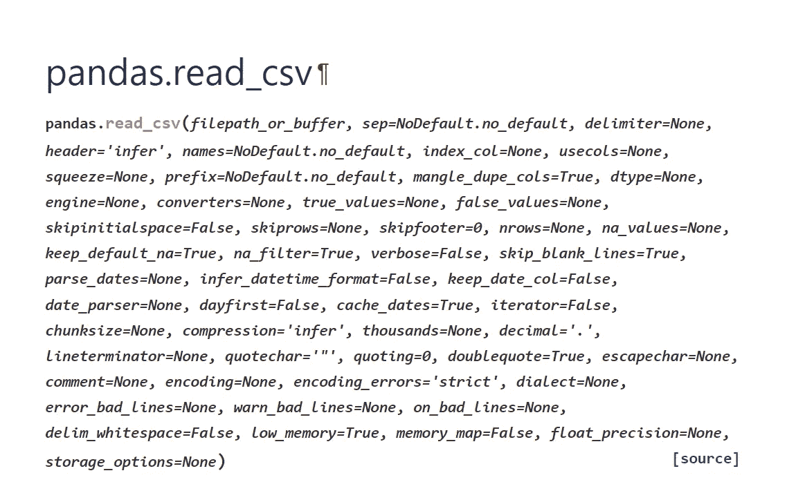
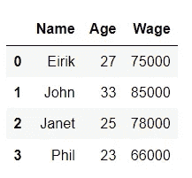
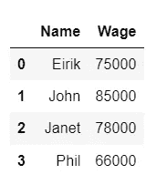
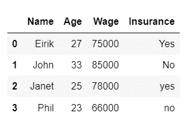
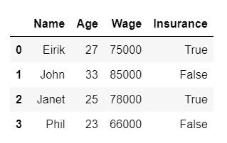
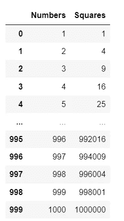
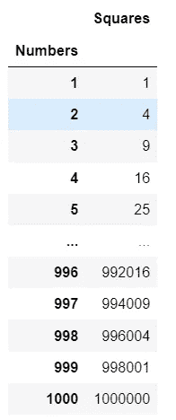
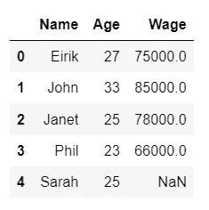

# 关于如何将 CSV 文件读入熊猫的高级技巧

> 原文：<https://towardsdatascience.com/advanced-tips-on-how-to-read-csv-files-into-pandas-84ebb170f6e5>

## 学习 5 个小技巧，让你远离痛苦。


由 [Sam Dan Truong](https://unsplash.com/@sam_truong?utm_source=medium&utm_medium=referral) 在 [Unsplash](https://unsplash.com?utm_source=medium&utm_medium=referral) 上拍摄的照片

# 您的旅程概述

1.  [设置舞台](#5d0c)
2.  [以普通的方式导入 CSV 文件](#6fd9)
3.  [第一个提示:仅导入选定的列](#a6e8)
4.  [第二个提示:处理真值和假值](#2d13)
5.  [第三个技巧:偷看数据](#b6fd)
6.  [第四个提示:设置索引列](#d5e9)
7.  [第五个技巧:像专家一样处理缺失值](#37ac)
8.  [收尾](#0e70)

# 1 —搭建舞台

在从事数据科学和数据分析工作时，**将数据加载到熊猫**中是令人难以置信的常见。有许多不同的格式需要考虑，如 *CSV 文件*、 *Excel 文件*、 *JSON 文件*、*原始文本文件*、*拼花文件*等。

说到 CSV 文件，你很快就知道熊猫可以用方法`pd.read_csv()`轻松导入 CSV 文件。然而，鲜为人知的是可以传递给方法`pd.read_csv()`的可选参数数量惊人。这给了你很大的定制！如果你认为我夸张了，看看下面熊猫文档的截图:



截图来自[https://pandas . pydata . org/docs/reference/API/pandas . read _ CSV . html](https://pandas.pydata.org/docs/reference/api/pandas.read_csv.html)

这是相当压倒性的，对不对？😧别担心，**我会教你知道的最重要的 5 个**。

如果没有这些有用的可选参数，您将不得不做额外的预处理。这通常较慢，并且需要较高的计算成本。简而言之，这些可选参数中的一些可以节省大量时间，让你从枯燥的工作中解脱出来。

> 告别不必要的预处理，向导入 CSV 文件的高效、干净的代码问好。

**先决条件:**你应该已经安装了 Pandas，并且知道什么是 CSV 文件。除此之外，没有任何先决条件。我们走吧！

# 2-以普通的方式导入 CSV 文件

在您学习这些很酷的技巧之前，让我们确保您知道在 Pandas 中导入 CSV 文件的基本方法。假设您有一个名为`employees.csv`的 CSV 文件，其中包含以下信息:

```
Name,Age,Wage
Eirik,27,75000
John,33,85000
Janet,25,78000
Phil,23,66000
```

然后您可以用下面的代码片段将整个文件`employees.csv`导入到 Pandas 中:

```
import pandas as pdemployees = pd.read_csv("filepath_to_employees.csv")
```

你得到的数据帧`employees`包含以下信息:



熊猫数据帧从简单的 CSV 文件。

上面的代码是在 Pandas 库中使用函数`read_csv()`的最基本方法。**导入整个 CSV 文件**。

如果 CSV 文件格式完美，没有丢失的值，并且您需要所有的列和行，这将非常有用。然而，实际上，对许多人来说，这些要求更像是白日梦，而不是现实。让我们看看如何使用可选参数来处理更复杂的情况🔥

# 3 —第一个提示:仅导入选定的列

通常，您只需要 CSV 文件中的一些列，而不是所有列。对此的一个解决方案是导入整个 CSV 文件，然后按如下方式过滤掉列:

```
employees = pd.read_csv("filepath_to_employees.csv")
employees = employees[["Name", "Wage"]]
```

数据框`employees`现在包含以下信息:



包含选定列的熊猫数据框架。

虽然这种方法确实有效，但在代码长度和性能方面效率都很低。您导入了整个`Age`列，但从未使用过它！

最好告诉函数`read_csv()`只导入您需要的列。您可以使用可选参数`usecols`来完成此操作，如下所示:

```
employees = pd.read_csv(
  "filepath_to_employees.csv", 
  usecols=["Name", "Wage"]
)
```

这产生了完全相同的结果。避免导入大量不需要的数据，避免编写 Pandas 代码来过滤掉无用的列。那是一石二鸟😄

参数`usecols`通常期望您要导入的列名列表。但是，您也可以传递一个(通常是匿名的)函数来确定一个列是否被选中。有关这方面的更多信息，请查看 [Pandas 文档](https://pandas.pydata.org/docs/reference/api/pandas.read_csv.html)中的`usecols`可选参数。

# 第二个技巧:处理真值和假值

CSV 文件通常包含指示某事物是真还是假的值。问题是，这种迹象可以有各种各样的味道。要查看示例，请考虑具有以下额外列的 CSV 文件`employees.csv`:

```
Name,Age,Wage,Insurance
Eirik,27,75000,Yes
John,33,85000,No
Janet,25,78000,yes
Phil,23,66000,no
```

这个 CSV 文件中的真值有两个直接问题:

*   CSV 文件使用单词`Yes`和`No`，而不是 Python 识别的关键字`True`和`False`。
*   `Yes/yes`和`No/no`既有小写也有大写。可能是 HR 员工手动输入的数据？无论如何，你都要考虑到这一点。

通过做一个简单的导入语句，熊猫不知道单词`Yes`和`No`是什么意思:下面的代码

```
employees = pd.read_csv("filepath_to_employees.csv")
```

简单给出数据框架:



带有保险栏的数据框很难处理。

现在，根据`Insurance`列中的值过滤列非常麻烦。

您可以使用`map()`功能手动重命名`Insurance`列中的值。然而，如果你已经在博文中走到这一步，你就知道这不是办法。

最好的处理方式是在函数`read_csv()`中使用可选参数`true_values`和`false_values`。两个参数都只需要一个单词列表，这些单词应该被翻译成 Python 关键字`True`和`False`:

```
employees = pd.read_csv(
    "filepath_to_employees.csv", 
    true_values=["Yes", "yes"], 
    false_values=["No", "no"]
)
```

数据帧现在看起来如下:



带有保险栏的数据框易于操作。

# 5 —第三个技巧:查看数据


在 [Unsplash](https://unsplash.com?utm_source=medium&utm_medium=referral) 上由 [Dmitry Ratushny](https://unsplash.com/@ratushny?utm_source=medium&utm_medium=referral) 拍摄的照片

这是一个短的。如果您有一个巨大的 CSV 文件，但只想看一眼数据，那么加载整个文件是一个巨大的时间浪费。相反，您可以使用可选参数`nrows`来指定应该读入多少行 CSV 文件。

让我们考虑下面这个简单的 CSV 文件`numbers.csv`:

```
Numbers,Squares
1,1
2,4
3,9
4,16
5,25
6,36
7,49
8,64
9,81
10,100
.
.
.
1000000,1000000000000
```

这是一个包含 1.000.000 个数字的文件。我知道这很做作，但它是一个很好的例子。下面的代码将只导入 1.000 行:

```
numbers = pd.read_csv(
  "filepath_to_numbers.csv",
  nrows=1000
)
```

此代码仅挑选出前 1000 行，您将获得数据帧:



前 1000 行。

通常，选择这样的样本就足以探索数据。

> **注意:**如果您正在导入的数据是以某种方式排序的(如时间序列)，那么导入前 1000 行可能会使数据呈现出非常扭曲的画面。

在上面的例子中，您可能还想将索引列设置为 CSV 文件中的`Numbers`列。现在的数据框架有很多冗余信息。这是下一个提示！

# 6 —第四个技巧:设置索引列

考虑`numbers`数据帧


索引列和数字列本质上是相同的。

有时您希望将一个列(在本例中是`Numbers`列)设置为索引列。这在时间序列数据中经常发生，其中事件的时间是索引数据的一个很好的列。Pandas 将默认创建自己的索引列。但是，您可以通过使用可选参数`index_col`来决定自己的索引列，如下所示:

```
numbers = pd.read_csv(
  "filepath_to_numbers.csv",
  nrows=1000,
  index_col="Numbers"
)
```

使用此代码，您将获得以下数据帧:



Numbers 列现在是索引。

可选参数`index_col`通常需要一个与 CSV 文件中的列名相对应的字符串。然而，如果你传入一个字符串列表，那么你会得到一个 [Pandas MultiIndex](https://pandas.pydata.org/pandas-docs/stable/user_guide/advanced.html) 👍

# 第五个技巧:像专家一样处理缺失值

熊猫功能`read_csv()`不傻。每当 CSV 文件中的条目具有值 **NULL** 、 **NaN** 或 **n/a** ，则`read_csv()`会将该值解释为缺失。在 [read csv 文档](https://pandas.pydata.org/docs/reference/api/pandas.read_csv.html)中有一个 Pandas 将识别为缺失的值的完整列表。很聪明，对吧？

然而，有时 CSV 文件包含微妙格式的缺失值。让我们回头看看你在博文中提到的`employees.csv`文件:

```
Name,Age,Wage
Eirik,27,75000
John,33,85000
Janet,25,78000
Phil,23,66000
```

现在让我们假设一个叫“Sarah”的新员工即将开始工作。但是，她的新工资尚未被 HR 登记，因此在输入正确的金额之前，该工资将被设置为零:

```
Name,Age,Wage
Eirik,27,75000
John,33,85000
Janet,25,78000
Phil,23,66000
Sarah,25,0
```

显然，Sarah 的工资应该被认为是一个缺失值，因为它还没有被写入系统。然而，熊猫不会理解这一点，只会简单地把它当作莎拉是一个拿“经验”报酬的实习生😡

对此的一个解决方案是在数据导入后过滤掉工资为零的员工。但是，正如您现在所期望的，您可以在`read_csv()`函数中使用一个可选参数。如下使用可选参数`na_values`:

```
employees = pd.read_csv(
    "path_to_employees.csv",
    na_values=["0"]
)
```

现在，数据框架已经正确地将 Sarah 的工资识别为丢失:



莎拉的工资被正确地认定为失踪。

如果您想将更多的值标记为缺失，那么只需将它们提供给传递给`na_values`参数的列表。

> **警告:**如果您的其他列中有一列的有效值为零，那么这种方法也会将它们标记为缺失。不太好。为了避免这种情况，你也可以传递一个字典给`na_values`。字典的键是有问题的列名(在您的例子中是“工资”)，值是缺少的值(在您的例子中是“0”)。运行 Pandas 的`info()`方法来检查您没有引入错误的缺失值总是一个很好的明智检查。

# 8 —总结


Joshua Hoehne 在 [Unsplash](https://unsplash.com?utm_source=medium&utm_medium=referral) 上拍摄的照片

我已经向您展示了在 Pandas 中导入 CSV 文件的 5 个技巧。我希望你学到了一些新东西，并且能够在未来的项目中使用。如果你需要知道更多，那么看看熊猫文档。

**喜欢我写的？**查看我的其他帖子，了解更多 Python 内容:

*   [用漂亮的类型提示使你罪恶的 Python 代码现代化](/modernize-your-sinful-python-code-with-beautiful-type-hints-4e72e98f6bf1)
*   [用 Python 可视化缺失值非常简单](/visualizing-missing-values-in-python-is-shockingly-easy-56ed5bc2e7ea)
*   [使用 PyOD 在 Python 中引入异常/异常值检测🔥](/introducing-anomaly-outlier-detection-in-python-with-pyod-40afcccee9ff)
*   [5 个能在紧要关头救你的牛逼数字功能](/5-awesome-numpy-functions-that-can-save-you-in-a-pinch-ba349af5ac47)
*   [5 个专家提示，让你的 Python 字典技能一飞冲天🚀](/5-expert-tips-to-skyrocket-your-dictionary-skills-in-python-1cf54b7d920d)

如果你对数据科学、编程或任何介于两者之间的东西感兴趣，那么请随意在 LinkedIn 上加我，并向✋问好