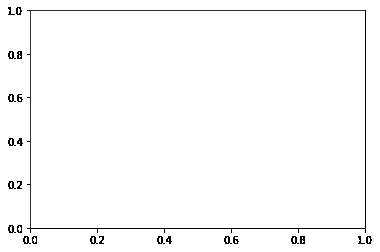
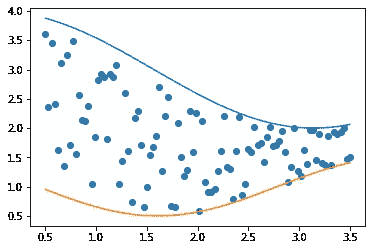
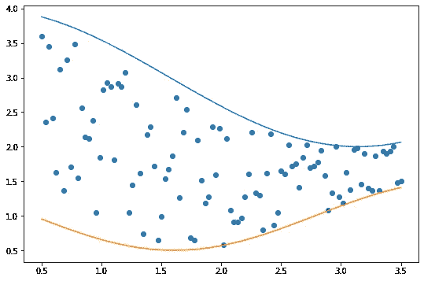
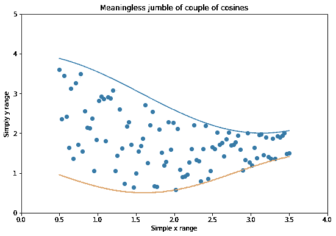
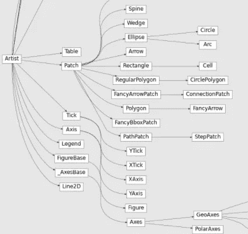
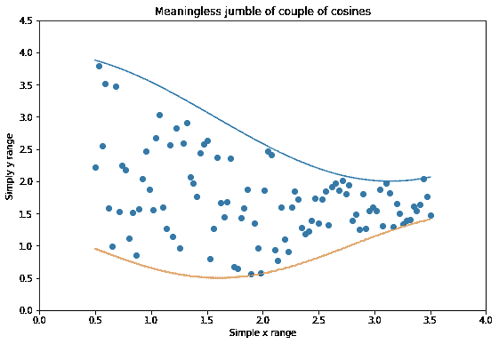
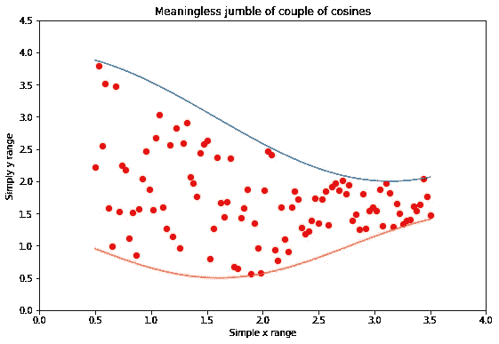
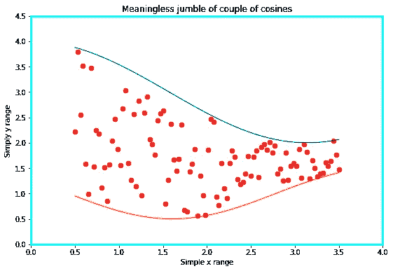

# 进阶教程:如何像绝对 Boss 一样掌握 Matplotlib

> 原文：<https://towardsdatascience.com/advanced-tutorial-how-to-master-matplotlib-like-an-absolute-boss-aae2d4936734>

## 前所未有地使用 Matplotlib


露丝·齐默曼在 [Unsplash](https://unsplash.com/s/photos/boss-in-a-suit?utm_source=unsplash&utm_medium=referral&utm_content=creditCopyText) 上拍摄的照片

# 我曾经有一个原则…

当我还是一个初学数据可视化的人时，我曾经有一个原则——永远不要访问 Matplotlib 文档。

从没有好东西从那里出来。当我在它的页面上时，我的眼睛会处理*英语单词*，但是，不知何故，它们被解释进我的大脑，就像我在破译一门外语一样。然后我会偶然发现一些像[这些](https://ibexorigin.medium.com/yes-these-unbelievable-masterpieces-are-created-with-matplotlib-b62e0ff2d1a8)的杰作，我会想，我甚至会使用同一个库吗？

即使您是一名经验丰富的程序员，我相信您在学习 Maplotlib 时也面临过类似的挑战。这不是一个容易的图书馆。有如此多的类和如此多的方法来完成最简单的任务——完全混乱。

如果你在那个位置，或者想加强你的 Matplotlib 游戏，我有你需要的指南。我会告诉你如何深入 Matplotlib 丛林的根部，放一把火，然后乘着喷气背包飞出去了。你准备好了吗？开始吧！

[](https://ibexorigin.medium.com/membership) [## 通过我的推荐链接加入 Medium-BEXGBoost

### 获得独家访问我的所有⚡premium⚡内容和所有媒体没有限制。支持我的工作，给我买一个…

ibexorigin.medium.com](https://ibexorigin.medium.com/membership) 

获得由强大的 AI-Alpha 信号选择和总结的最佳和最新的 ML 和 AI 论文:

[](https://alphasignal.ai/?referrer=Bex) [## 阿尔法信号|机器学习的极品。艾总结的。

### 留在循环中，不用花无数时间浏览下一个突破；我们的算法识别…

alphasignal.ai](https://alphasignal.ai/?referrer=Bex) 

# 艺术家创造了 Matplotlib

虽然优秀的程序员编写了 Matplotlib，但它由称为 Artists 的基类组成。

情节中每一个带圆圈注释的组件都被实现为一个单独的类，这个类从基础艺术家那里继承了。但是这种将所有事物表示为一个类的能力有它的优点和缺点。

一方面，它赋予了 Matplotlib 前所未有的灵活性。使用它们各自的类，您可以调整几乎任何绘图组件，直到您满意为止。通常，您有多个选项来完成相同的任务，使您能够在不同的界面之间切换。

也许，这是 Pythonistas 对 MPL 最不满意的地方。根据 Python 的[禅，应该有一种，最好只有一种显而易见的方法来做某事。而 Matplotlib API 在任何你能想到的方面都违反了这个规则。](https://www.python.org/dev/peps/pep-0020/)

结果是新手很迷茫。他们不知道使用哪个类或函数来完成一个简单的任务。他们不理解文档，因为，坦白地说，它太难理解了。即使是有经验的开发人员也可能不知道这样的错误意味着什么:

很自然，您会感到沮丧，因为您不知道在哪里使用了 Lined2D 对象，也不知道它是从哪里来的。

如果你是这些人中的一员，我将向你展示我学到的一些技巧，这将使你成为一个专业的 Matplotlib 用户，并像阅读儿童睡前故事一样阅读文档。

# 创建您自己的统一工作流程

我们将从选择一种统一的方法来完成任务开始。做单个的方法有很多种，坚持只做一种风格并掌握它是必不可少的。

我用来创建和自定义图的工作流程如下:

1.  用基本元素和低定制来创建剧情本身。
2.  找出情节的弱点，记下你想改进的部分。
3.  用相关的 Matplotlib 函数隔离那些弱组件。
4.  使用 Matplotlib 的瑞士军刀对它们进行微调，直到您满意为止(稍后将详细介绍)。
5.  保存或显示绘图。

我们将详细学习如何做每一步。我向你保证，这个框架几乎适用于你创建的任何类型的情节和你想要的定制。

# 形象地说…

让我们从学习如何使用图形创建情节开始。MPL 中的一个人物对象就是最高级别的艺术家，可以认为是你画一切的画布。

您可以使用`figure`功能创建一个没有绘制任何内容的图形。就其本身而言，图形什么也不做——记住，它是你用来绘图的空白白纸。

我们稍后将回到数字上来。

# 让我们扔斧子吧！


**Photo by**[**Mathias p . r . Reding**](https://www.pexels.com/@matreding?utm_content=attributionCopyText&utm_medium=referral&utm_source=pexels)**on**[**Pexels**](https://www.pexels.com/photo/old-axe-with-rusty-blade-in-stump-6835322/?utm_content=attributionCopyText&utm_medium=referral&utm_source=pexels)

当我们给图形添加轴时，乐趣就开始了。`Axes`类是一个在绘图中表示一组 x，y 坐标系的 artist:

向图形添加空白轴的功能是`add_axes`，但实际上，您从未使用过它。相反，通常使用`subplots`功能同时创建一个图形和一个或多个轴:

```
>>> fig, ax = plt.subplots()
```



作者图片

这将立即创建一个图形并附加一个轴(坐标系)。接下来，我们开始使用绘图方法在轴上绘制数据。

这些地块有`bar`、`hist`、`scatter`、`boxplot`等名称。让我们创建一个简单的散点图，并画几条线:



作者图片

我们已经可以看到这个情节需要几个文本标签。此外，我们不喜欢点和线的默认颜色。还有，数字本身有点小。

看到我们在这里做的了吗？我们首先创建了一个基础图，并确定了我们想要改进的组件。现在，我们需要弄清楚如何提取这些组件并定制它们。

# 分解图组件及其组件及其组件

由于我们一开始就创建了轴和图形，它们已经被隔离为对象(`fig`和`ax`)。

现在，让我们暂时假设我们有图形，但没有坐标轴。我们如何从图中提取它？

每个 matplotlib 艺术家都有几个以`get_*`前缀开头的方法。如果我们调用`fig`上的`dir`函数，我们可以看到几个例子:

在列表中，我们看到一个名为`get_axes`的小函数，所以我们将使用它。

axes 的官方类名称是`AxesSubplot`，正如我们所见，列表上只有一个:

```
ax = axes_list[0]
```

我知道这些是基本概念，但是你应该从这里吸取的教训是，MPL 中的每个类都有这样的`get_*`函数，允许你检索组件类的不同部分。

# Matplotlib 的瑞士军刀


**照片由** [**卜锦昭**](https://pixabay.com/users/bujinzhao-10495661/) **在 Pixabay 上**

现在我们有了几个对象，是时候使用它们的参数来定制它们了。但是首先，我们要问——我的对象接受什么参数，它们取什么值？

这就是 Matplotlib 的瑞士军刀发挥作用的地方。这是函数`plt.setp` ( *设置参数*)，可通过 PyPlot API 访问。

因此，让我们看看 figure 对象接受哪些参数:

在没有参数的对象上调用函数会打印所有对象参数的文档。在参数列表中，我们看到了我们想要更改的参数，即图形大小。就是那个叫`size_inches`的:

将对象及其参数名作为字符串传递是打印出参数可能值的一种简化方式。现在，让我们最后改变图形大小:

该函数返回 None，表示操作成功。现在，我们再来看看这个情节:

```
>>> fig.get_figure()
```



作者图片

现在，该用斧子了:

我们希望更改轴标签、限制、标题和轴脊线颜色。如果我们不知道这些参数的当前值，我们就打电话给`plt.getp`—`setp`的朋友:

```
>>> plt.getp(ax, "xlim")(0.35, 3.65)
```

与`setp`类似，`getp`返回参数的默认值或当前值。在对象上不带任何参数调用它将返回所有默认值。让我们改变我们想要的:



作者图片

但是线条和标记的颜色呢？我们也说过我们会调整轴线？它们是独立的类，所以我们需要把它们从坐标轴中提取出来。但在此之前，我们需要了解几个至关重要的概念。本节仅作为`setp`和`getp`功能的介绍。

# 容器和原语

为了从基础艺术家到丰富多彩的情节，组件需要通过许多 MPL 类的继承链。沿着这条链，两组类对于如何使用 Matplotlib 至关重要。这些组被称为**容器**和**原语**。

我们已经看到了**容器**的两个实例——图形和轴。这个图形包含了轴，而轴包含了几乎所有的东西。

**图元**是所有进入容器的图形或几何对象。你很少直接使用这些原语。它们是在您调用绘图函数时动态创建的。您可以在 Matplotlib 的`patches`模块下访问它们的所有名称:

如您所见，我们已经获得了创建直方图、散点图、箱线图和线图所需的一切。它们都可以使用**补丁**制作，如圆形、矩形、多边形和直线。



**你可以从 docs 这里找到** [**的全貌。**](https://matplotlib.org/stable/_images/inheritance-50f63fede88c32059ff6460c4a9c89a5f3850a4a.png)

从上面 Matplotlib 类的映射中，我们看到了我之前提到的小 **Lind2D** 。当我们使用`plot`或`scatter`函数绘制散点图和线条时，它是一个绘制线条和标记的类。

现在，回到我们的情节——这里是我们到目前为止所做的步骤:



作者图片

让我们看看`ax`内的所有艺术家:

我们看到了我们的线条。我们还可以看到四个棘，它们是独立的类。X 轴和 Y 轴对象与第一个元素一起可见，这是我们以前没有见过的。

`PathCollection`代表一组点。因此，让我们提取它，并给点一些定制:



作者图片

我们增加了一点尺寸，给这些点加上红色的黑边，

类似地，我们可以调整脊柱:



作者图片

我推荐的最后一个技巧是将所有创建的图存储到一个变量中，以便您可以单独处理它们，而不必通过轴访问它们:

# 把所有东西放在一起

让我们把今天学到的所有杂乱的信息组织起来:

1.  创建情节并标记要改进的部分。
2.  提取单一成分。如果你不知道你在找什么，就在坐标轴或图形对象上调用`dir`。同样，`get_*`前缀函数在这种情况下也很有用。
3.  拥有一个组件后，通过调用`plt.getp`查看其参数的默认值。
4.  标记您需要的参数，并在每个参数上调用`plt.setp`来查看它们可能接受的值。
5.  使用相同的函数设置您的自定义值。
6.  重复 2–5，直到你得到你需要的完美的情节。

一旦你经历了这个工作流程几次，你就会对更高层次的功能更加适应。您将开始直接向函数调用传递参数，或者在创建轴时传递参数，而不是从轴和原语中提取每个组件。

但是`setp`、`getp`和`dir`函数是您遇到未知 Matplotlib 类或函数时所需的一切。

此外，学习艺术家、补丁和容器/原语的概念可以帮助您最大程度地理解文档。这些是在[文档](https://matplotlib.org/)中出现最多的术语。我强烈建议用你新获得的知识去浏览它们，以便学到更多。

# 摘要

数据可视化不是学习绘图库。它是创造力、理解观众以及以专业和信息丰富的方式提供见解的结合。

我希望这三种技能都来自你。我的部分是展示如何使用 Python 生态系统中最强大的绘图库之一来补充这些技能。我已经教了你一个强大的迭代过程，使你能够以智能和结构化的方式改进 Matplotlib 图。

[](https://ibexorigin.medium.com/membership) [## 通过我的推荐链接加入 Medium。

### 获得独家访问我的所有⚡premium⚡内容和所有媒体没有限制。你可以给我买一个 coffee☕，用你的…

ibexorigin.medium.com](https://ibexorigin.medium.com/membership) [](https://ibexorigin.medium.com/subscribe) [## 每当 Bex T .发布时收到电子邮件。

### 每当 Bex T .发布时收到电子邮件。注册后，如果您还没有中型帐户，您将创建一个…

ibexorigin.medium.com](https://ibexorigin.medium.com/subscribe) 

# 您可能会对这些热门话题感兴趣…

[](/10-sklearn-gems-buried-in-the-docs-waiting-to-be-found-ad95a8fabdfd) [## 埋藏在文档中等待被发现的 10 颗 Sklearn 宝石

### 隐藏的宝藏

towardsdatascience.com](/10-sklearn-gems-buried-in-the-docs-waiting-to-be-found-ad95a8fabdfd) [](https://ibexorigin.medium.com/python-became-the-language-of-the-year-3-times-in-4-years-it-wont-be-this-year-e5c724758ef) [## Python 在 4 年内 3 次成为“年度语言”。今年不会了

### 猜猜会是哪种语言。

ibexorigin.medium.com](https://ibexorigin.medium.com/python-became-the-language-of-the-year-3-times-in-4-years-it-wont-be-this-year-e5c724758ef) [](/matplotlib-vs-plotly-lets-decide-once-and-for-all-dc3eca9aa011) [## Matplotlib vs. Plotly:让我们决定一劳永逸

### 从 7 个关键方面进行深入快速的比较

towardsdatascience.com](/matplotlib-vs-plotly-lets-decide-once-and-for-all-dc3eca9aa011) [](https://ibexorigin.medium.com/how-to-use-matplotlib-annotations-like-you-know-what-you-are-doing-da61e397cce3) [## 如何像知道自己在做什么一样使用 Matplotlib 注释

### 了解如何将文本放置在绘图上的任意位置并绘制箭头

ibexorigin.medium.com](https://ibexorigin.medium.com/how-to-use-matplotlib-annotations-like-you-know-what-you-are-doing-da61e397cce3)