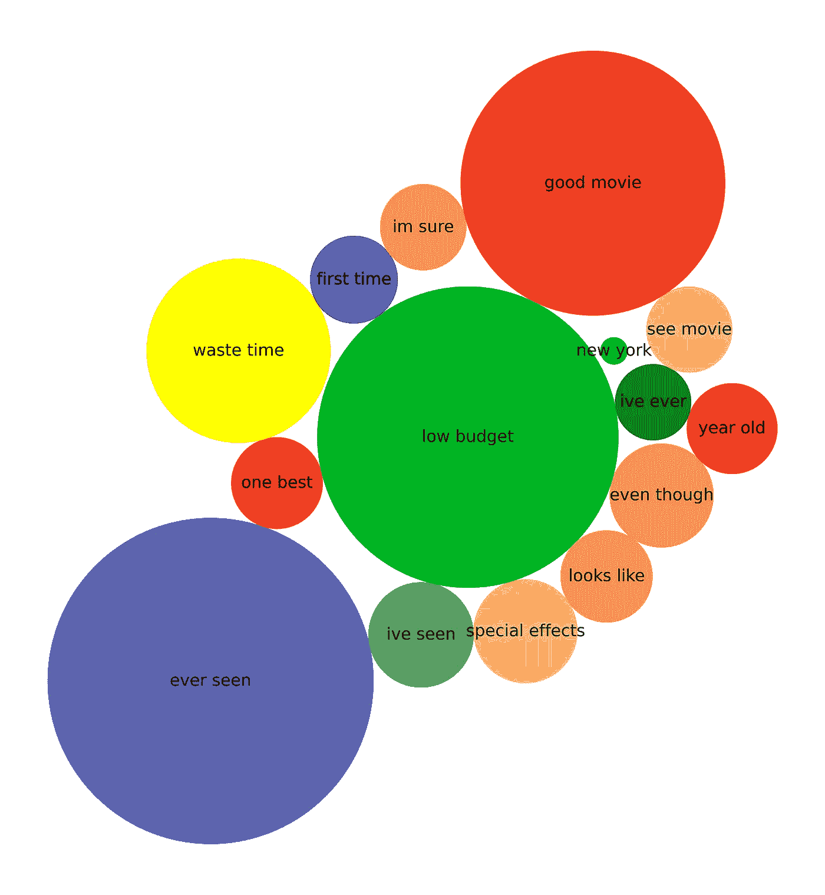
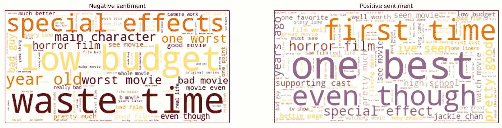
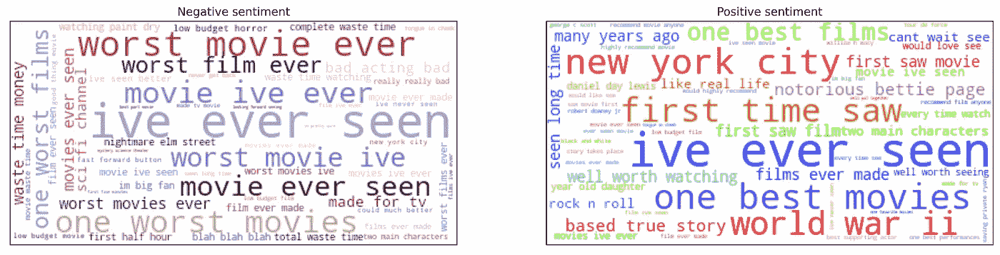
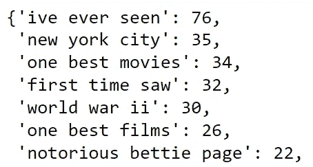
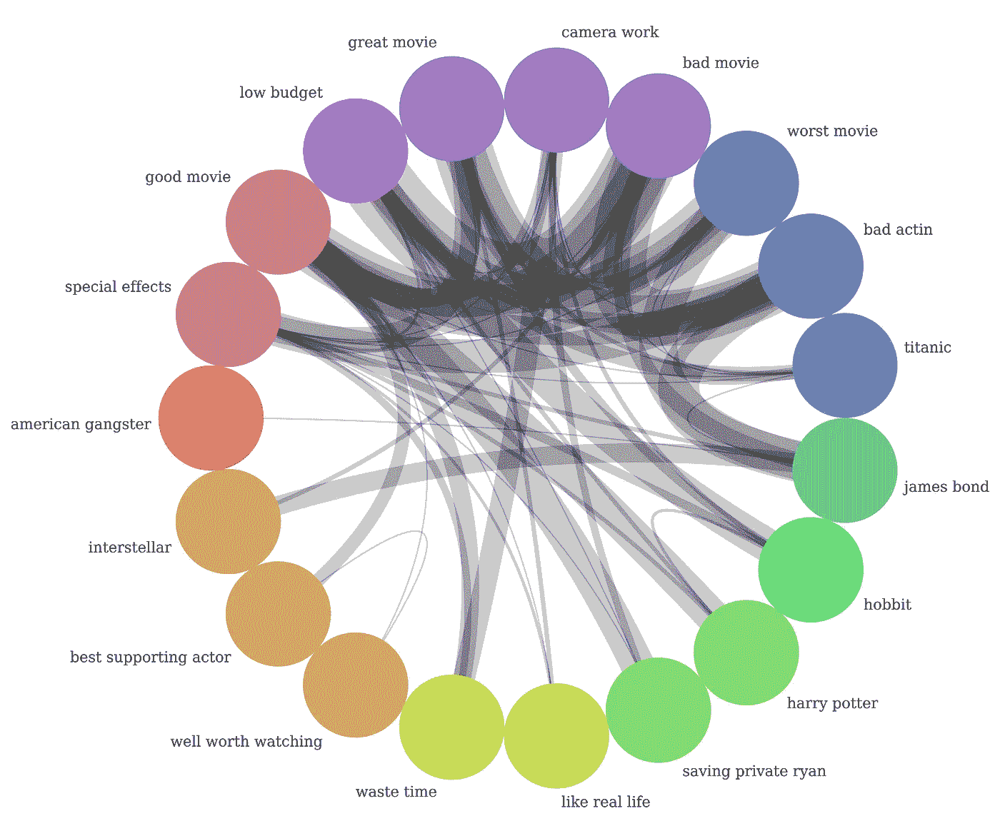
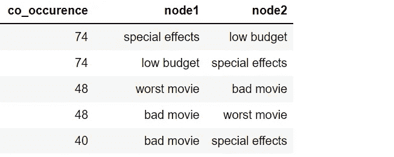
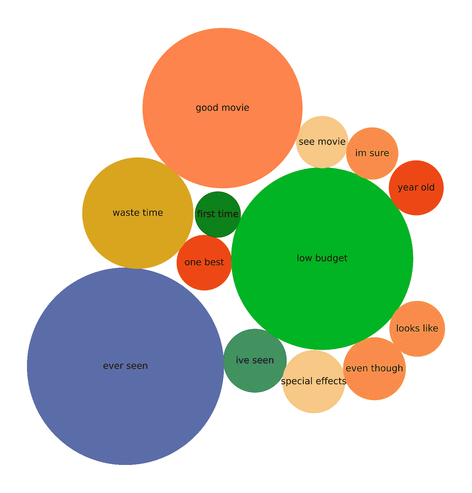

# 用于文本数据分析的高级可视化

> 原文：<https://towardsdatascience.com/advanced-visualisations-for-text-data-analysis-fc8add8796e2>

## 探索 n-gram 单词云、和弦图和气泡图，以及它们在 Python 中的实现

图一。打包气泡图，作者图片

本文将介绍几个稍微高级一点的图形，用于 Python 中的文本数据可视化。更准确地说:

*   **N 元词云:**显示高阶 N 元词出现的频率
*   **弦图:**显示几个实体之间的联系及其强度
*   **包装气泡图:**词频视觉化展示

为了说明它们的应用和 python 编码，我使用了经典的 [IMDb 50K 电影评论](https://www.kaggle.com/datasets/atulanandjha/imdb-50k-movie-reviews-test-your-bert)(数据许可在这里是)。数据的子集已经进行了预处理，清除了数字、停用词和特殊字符。

# #1: N 元单词云

Python 的 [wordcloud](https://pypi.org/project/wordcloud/) 库中的标准单词云显示 unigrams(单个单词，如“猫”、“桌子”或“花”)。我们将探索一个稍微高级一点的图表版本，它描绘了二元模型和三元模型(即两个和三个连续单词)的频率。

图二。Bigram 词云，图片作者

图 3。三元词云，作者图片

## 二元词云

首先，我们导入正面和负面电影评论的数据:

*Collocation _ threshold = 2*和 *collocations =True* 参数告诉 Python 在生成的 wordcloud 对象中显示二元模型:

我们使用 *matplotlib* 来显示图像。

照片由 [Geri Mis](https://unsplash.com/@gerimis?utm_source=medium&utm_medium=referral) 在 [Unsplash](https://unsplash.com?utm_source=medium&utm_medium=referral) 上拍摄

## 三元词云

使用*generate _ from _ frequency(trigrams _ dict)*生成三元模型和高阶 n 元模型(例如，4 元模型)，其中*三元模型 _dict* 是 n 元模型及其频率的字典。

在我们的案例中:

图 4。含有三元模型及其频率的字典

下面是从三元模型及其消极和积极情绪样本的频率生成 wordcloud 对象的代码。

图 3 中的词云的生成类似于二元模型的图表。

# #2:和弦图

**弦图**是一种显示实体间相互关系(流程或连接)的方法。创建图表需要一些网络理论的基础知识，这在 Erik Ma 的电子书 [*网络分析变得简单*](https://ericmjl.github.io/Network-Analysis-Made-Simple/) 中有很好的解释。

在图表中，数据围绕一个圆呈放射状排列。实体之间的关系通常绘制为*弧*，它们的大小与连接的重要性成正比([数据可视化目录，2022](https://datavizcatalogue.com/methods/chord_diagram.html) )。

图 5。和弦图，图片由作者提供

在我们的数据中，我们感兴趣的是电影的**质量，如“特效”或“最佳男配角”，是如何与 7 部受欢迎的**电影**及其**评级**(如“好电影”、“坏电影”、“浪费时间”)进行讨论的。弦图通过分析语料库中二元模型(三元模型)之间的关系，帮助我们更好地解释和呈现评论者的观点。**

*   **节点** *【所有 str】*:质量、电影名称和口头评级
*   **边缘***【int】*:影评中的同现

我们将继续以下步骤:

*   为图形网络准备数据
*   创建网络图对象
*   在弦图中可视化网络

## 1.数据准备

预处理的 IMDb 数据具有节点和边结构。我们看到，比如“烂片”bigram 在同一个评论中被提到了 40 倍的“特效”。

图 6。数据为文字网络，图片由作者提供

## **2。创建网络结构**

NetworkX 是一个用于创建和研究复杂网络的 Python 包。此代码读取数据，创建网络结构，并绘制网络图:

## 3.准备一张和弦图

Nxviz 是一个 Python 库，用于构建 NetworkX 图形对象的 rational 网络可视化。这个例子使用`nxviz==0.6.3.`首先，我们计算每个节点的度(参考 [Nxviz 文档](https://networkx.org/documentation/stable/reference/classes/generated/networkx.Graph.degree.html))。接下来，我们将数据中的边形式化。

*CircosPlot 是*NX viz 中的一个和弦图实现。下面是创建图表的代码(图 5)。

> 电影评论的弦图可能表明，许多评论家对詹姆斯·邦德电影的评价很差，因为糟糕的表演，他们可能会将它与《星际穿越》相比较。《拯救大兵瑞恩》因为摄影排得好，《霍比特人》因为特效排得好。

# #3:包装气泡图

一个**包装的气泡图**以一串圆圈显示数据。它的基本积木是( [Tableau，2022](https://help.tableau.com/current/pro/desktop/en-us/buildexamples_bubbles.htm) ):

*   **尺寸**定义单个气泡
*   **尺寸**代表单个圆圈的大小和颜色。

气泡的位置通常针对紧凑性进行了优化，使图形更好地呈现。在 IMDb 数据中，最常见的二元模型代表一个维度，它们的频率是图 7 中气泡图大小的度量。颜色是随机设置的。

图 7。二元模型及其频率的打包气泡图，图片由作者提供

用 Python 制作打包气泡图最简单的方法可能是使用 [matplotlib 文档中指定的`BubbleChart`类中的函数。](https://matplotlib.org/3.5.0/gallery/misc/packed_bubbles.html)我们将使用这个类，不做任何修改。

数据被格式化了一点，这样我们可以更好地说明圆圈的大小。从 [matplotlib 的调色板](https://matplotlib.org/3.5.0/tutorials/colors/colors.html)中选择颜色。下面是示例的样子:

接下来，我们调用带有 *bubble_spacing* 参数的`BubbleChart`类，该参数指定气泡之间的最小间距。

最后，图 7 中的气泡图显示了数据。

Pixabay 在[像素上拍摄的照片](https://www.pexels.com/cs-cz/foto/scrabble-slovo-248360/)

# 结论

本文建议使用三种更复杂的图表来绘制文本数据。以下是一些可能的应用:

**N-gram 词云:**

*公告摘要*

*   美国总统对闯入国会大厦说了什么？
*   随着时间的推移，中国国家主席的公开声明是如何发展的？

*文章标题和摘要概要*

*   发表在特定主题文章中的关键词是什么(例如，区块链在经济学中的应用)？

**弦图:**

*文字网络分析*

*   可视化多对多关系及其优势
*   发现数据中的复杂结构(例如客户使用相同的电子邮件地址来获得特定的折扣)

**包装气泡图:**

*数据讲故事*

*   有助于说明问题，介绍程式化的事实，并准备引人入胜的演示

我的 [GitHub](https://github.com/PetrKorab/Advanced-Visualisations-for-Text-Data-Analysis) 上有 Jupyter 笔记本的完整代码。请随意在您的数据上使用它。

*PS:你可以订阅我的* [*邮件列表*](https://medium.com/subscribe/@petrkorab) *在我每次写新文章的时候得到通知。而如果你还不是中等会员，可以在这里* *加入* [*。*](https://medium.com/@petrkorab/membership)

# 参考

[1] Tableau 桌面和 Web 创作帮助。构建一个打包的气泡图。从[https://help . tableau . com/current/pro/desktop/en-us/build examples _ bubbles . htm](https://help.tableau.com/current/pro/desktop/en-us/buildexamples_bubbles.htm)检索到 2022-5-7。

[2]数据可视化目录。和弦图。从[https://datavizcatalogue.com/methods/chord_diagram.html](https://datavizcatalogue.com/methods/chord_diagram.html)取回 2022–5–7。