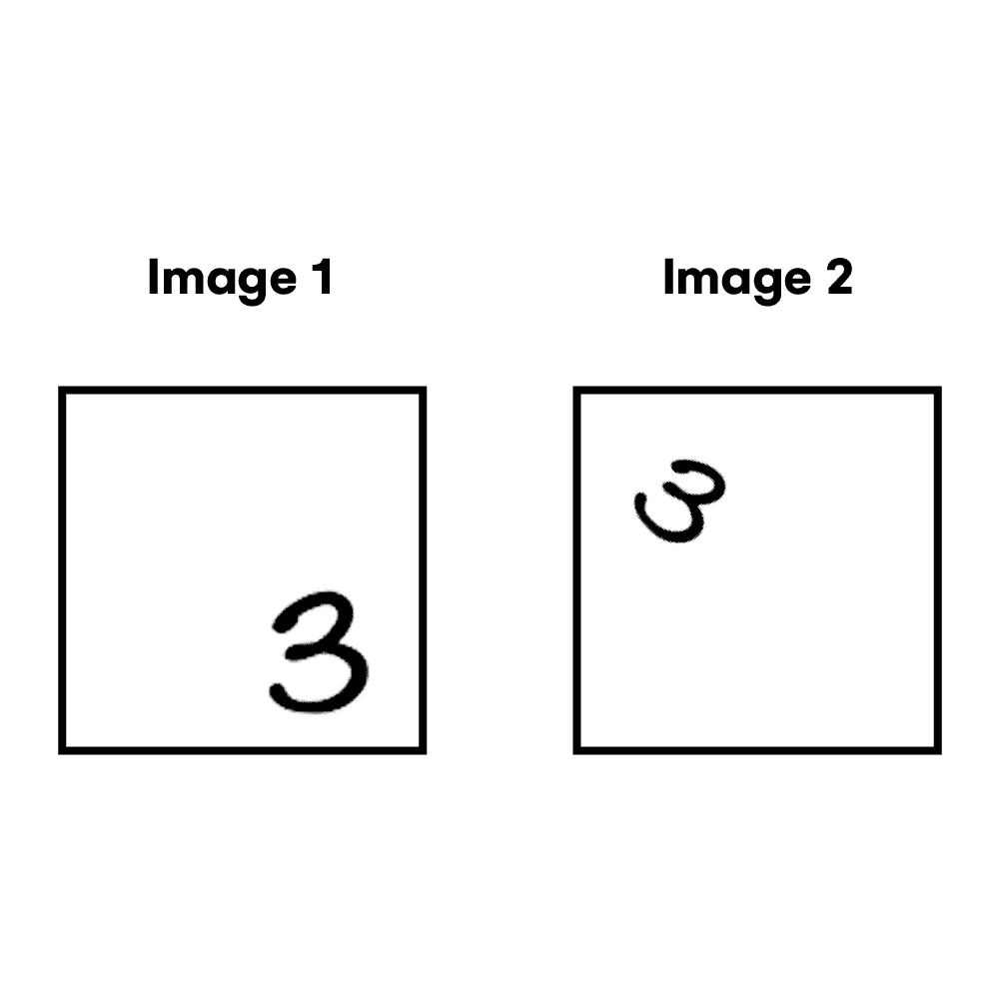
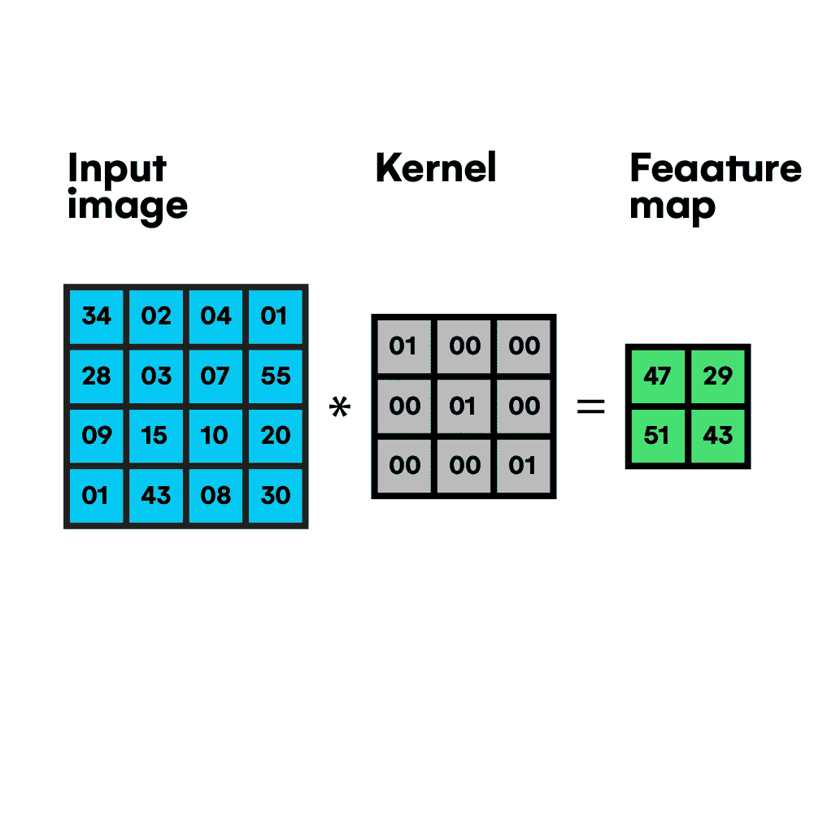
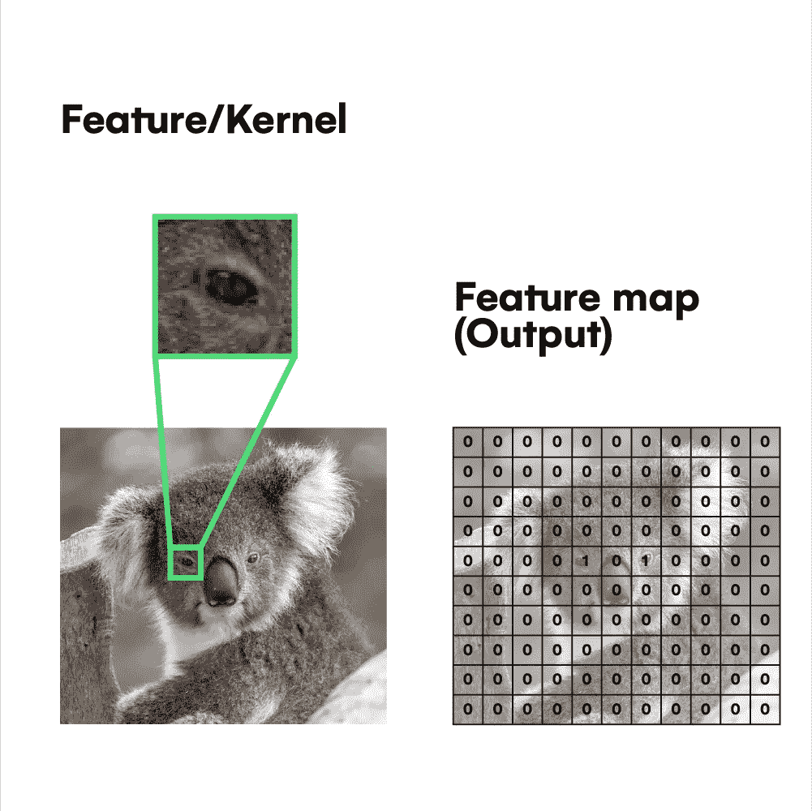
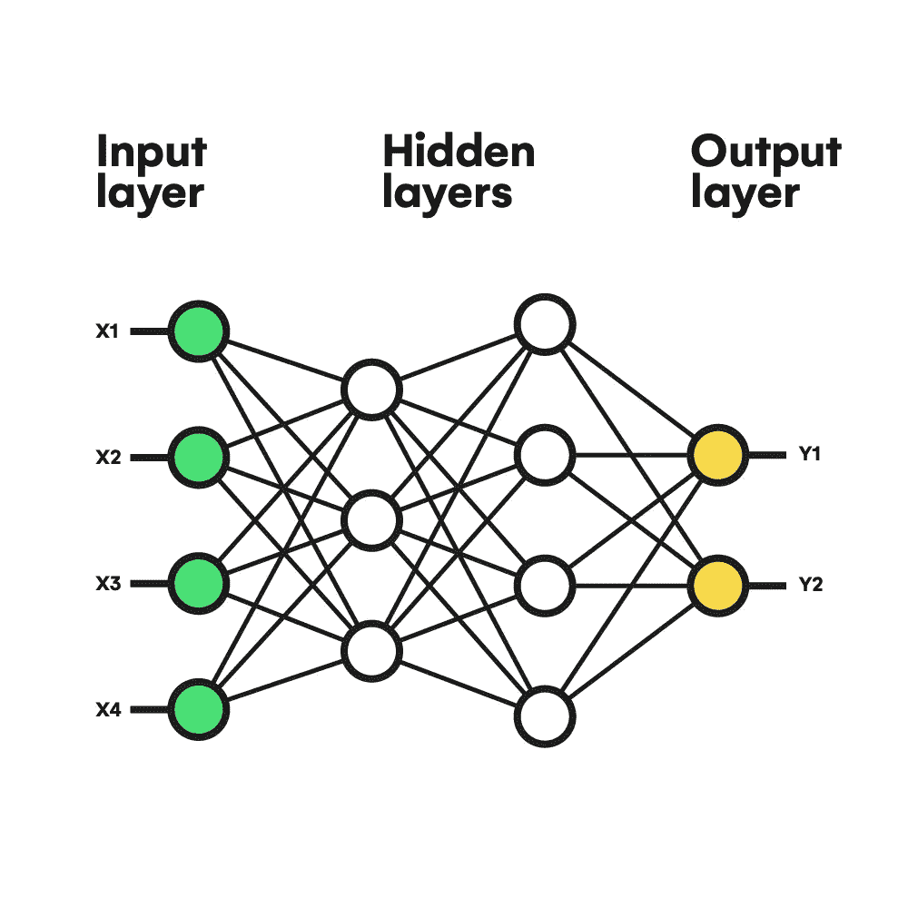
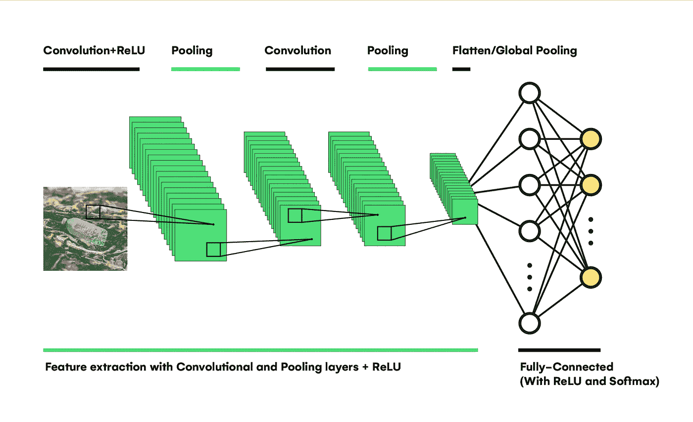
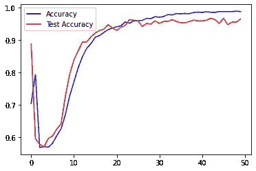
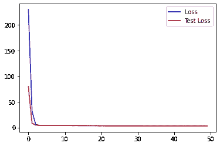
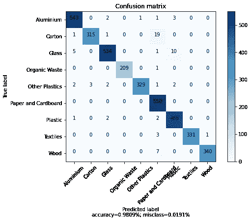

# 具有机器学习功能的高级垃圾分类

> 原文：<https://towardsdatascience.com/advanced-waste-classification-with-machine-learning-6445bff1304f>

## [变更数据](https://towardsdatascience.com/tagged/data-for-change)

# 具有机器学习功能的高级垃圾分类

## 改进废物分类技术


照片由 Alfonso Navarro 在 [Unsplash](https://unsplash.com?utm_source=medium&utm_medium=referral) 上拍摄

# 介绍

如果我们作为一个社会不采取行动来防止这种情况发生，不可回收废物在世界各地垃圾填埋场的积累以及大多数材料生物降解所需的大量时间会在不久的将来以显著的方式影响我们的生活方式。此外，在人类面临的最臭名昭著的风险中，废物积累可以通过苍蝇、蚊子和更多昆虫等媒介加速疾病传播。此外，除了破坏自然栖息地的美丽、砍伐森林和为垃圾填埋场提供足够空间的地形占用之外，土壤和水也容易受到污染，因为有毒化学物质存在于处理不当的材料中。与此同时，污染会改变食物链，从而不可避免地给人类和全球自然生态系统带来更多疾病和健康问题。

在过去的 50 年里，废物堆积成为一个日益严重的问题，主要有三个原因。第一个是市场上缺乏可回收物品，尽管公司很长时间以来一直在开发更可持续和生态的产品。第二个原因是当今另一个最普遍的问题，称为*人口过剩。必须为大量人口提供各种资源这一事实意味着在处理垃圾产生时会面临非常复杂的物流挑战，因此可回收产品的比例有所增加，但相比之下，这些产品最终会进入垃圾填埋场甚至海洋，影响成千上万海洋物种的生活。最后，第三个原因是我们的社会缺乏对气候变化等问题的参与。*

*为了以数据的形式显示废物堆积问题，有必要知道[世界人口](https://iopscience.iop.org/article/10.1088/1748-9326/ab8659)每年产生 70 至 90 亿吨废物，其中 70%被不当处理，最终被填埋，有污染自然环境的风险，并对人类健康造成新的威胁，如 [***海洋微塑料***](https://oceanservice.noaa.gov/facts/microplastics.html) 。该数据指的是人类创造的用过的、不想要的和丢弃的物品的总量。但是，产生的废物总量与所谓的 [***【城市固体废物】***](https://datatopics.worldbank.org/what-a-waste/trends_in_solid_waste_management.html)*是有区别的，后者仅包括城市中心或其影响区域产生的垃圾。关于剩余垃圾的数量，每年大约产生 20 亿吨的城市垃圾，其中大约 33%没有得到充分的管理。是指每人每天产生从 ***0.1*** 到 ***4.5*** 公斤的垃圾，平均***0.7 公斤*** 。此外，预计到 2050 年，由于全球人口的快速增长以及工业发展和人类文明持续发展对自然资源的密集使用的需求，城市垃圾将增加到 3.4 亿吨。**

**理想情况下，一个全面实施的 [***循环经济***](https://www.repsol.com/en/sustainability/circular-economy/index.cshtml) 模式本质上是一个解决积累问题的绝佳方案，除了气候变化，甚至是我们世界某些地方的供应危机。这是因为它的三个原则*(消除浪费和污染，循环产品和材料，再生自然)*导致了一种有效的管理自然资源的方式，而我们有时并没有正确地重视这些资源。然而，主要由于技术、工程和后勤方面的限制，以完整的方式执行这样一个复杂的计划并不容易。**

## **环境保护中的机器学习**

**尽管有这些限制，一些新兴的最新技术正开始改变我们看待和面对这些问题的方式。如今最臭名昭著的一个是**机器学习**，它是**人工智能**的一个分支，使机器有可能学习特定而复杂的任务，如分类、预测、决策、内容生成等。，通过使用大量数据并结合受人类学习方式启发的高级学习算法。由于机器学习的可扩展性和性能，使用机器学习来自动化这些任务有时对人类非常有用。**

**就其与可持续性和循环经济实施的关系而言，机器学习具有自动化各种任务的潜力。从改善我们呼吸的空气质量的数据趋势预测，以及从收集的数据中寻找模式来测量全球变暖，识别自然环境中的废物，甚至对几种类型的垃圾材料进行分类，以提高垃圾处理厂的性能。因此，正确识别和区分垃圾中的可回收物品也是迈向可持续循环经济模式的重要一步。然而，机器学习现在出现在比我们想象的更多的与环境保护相关的过程中。例如，模型做出的正确的能源或产品需求预测可以避免自然资源的浪费。此外，足够先进的模型甚至可以通过化学结构发现新材料，提高日常产品的效率和可回收性。**

# **目标**

**本文的目标是促进机器学习技术的发展和改进，专注于解决上述*(废物堆积、全球变暖、污染等)等环境问题。)*通过创建一个能够根据制造材料在九种不同类型的废物之间进行分类的模型，从而实现其 ***的可回收性。*** 此外，自其开源以来，它将接受专业人士和主题专家的实验。当改善机器学习领域中的模型的性能时，该实验是关键，以及在该过程中使用的数据收集和处理技术。**

**此外，直观地解释机器学习算法的内部功能以及它们在未来可能给人类带来的好处，可以提高社会对这些新指数技术的理解和信任。此外，专注于使用新的破坏性方法来尝试解决环境问题，可以提高我们所有人保护地球的意识，让位于在日常生活中可能实施的新的可持续习惯。**

# **它是如何工作的？**

**因此，为了建立一个正确分类不同类型废物的分类器，我们需要一个名为 ***卷积神经网络*** 的模型架构，因为我们的数据集将主要由 ***标记为*** 的图像组成，这意味着每个图像都有一个相应的标签，指示模型必须提供的正确预测*(废物类型)*。同时，该模型在卷积模块之后还需要一个 ***全连接网络*** 来将其给出的任意响应转换为一组具有特定结构的值，这将允许我们确定该模型预测的类别。**

**使用 ***卷积网络*** 处理图像的目的在于其从具有位置、旋转和比例不变性的图像中提取某些模式或特征的能力。为了理解在检测图像中的特征时这些属性的力量，让我们考虑一个例子。**

****

***(图片作者)***

**例如，如果我们想检测手写数字 3 作为特征，我们可以使用一个完全连接的网络。尽管如此，它只会***‘see’***特定图像区域中的数字和旋转，当元素被放置在随机位置或旋转时会给出错误的预测。相反，具有卷积部分的模型可以独立于其属性有效地检测特征。**

****

**作者 GIF**

**如果你想知道这是如何做到的，这种架构的基本操作是 ***卷积*** ，因此得名 ***卷积网络。*在上面的动画中可以看到，一个深灰色的矩阵称为 ***内核*** 遍历所有输入图像像素*(蓝色矩阵)*将内核的每个像素值乘以输入图像的相应像素值。之后，它将所有结果值的总和按顺序放入特征映射矩阵中。为了保持特征图相对于输入图像的维度，您可以添加 ***填充、*** ，这是图像周围的一行空值。此外，您可以更改 stride 等参数，它决定了内核在遍历图像时向左移动的 ***【步长】*** 。****

****

***(图片作者)***

**机器学习模型可以修改内核的值来检测复杂的特征，如人脸、车轮等。例如，正如您在上面看到的，您可以使用卷积将眼睛检测器内核传递给图像，并通过查看输出特征图来了解眼睛的位置。要更详细地了解它是如何工作的，可以访问 [***这个资源。***](https://youtu.be/8rrHTtUzyZA)**

****

***(图片作者)***

**在进入完整的网络之前，我们先来看看神经网络的基础知识。这个数学模型通过模仿我们人类大脑的工作方式来学习一组数据中的模式和关系。神经网络最基本的组件是神经元，它获取 ***n 个*** 输入值，并计算其 ***加权和*** *(所有输入的和乘以相应的权重参数)。*然后，它通过激活函数传递该值，以引入非线性，并输出该函数的结果。因此，组织在不同层的多个神经元的组合使网络能够获得“知识”为了理解所有的底层细节，你可以在下面的资源中了解更多关于神经网络的知识。**

****

**(图片由作者提供，灵感来自 [Erik Mclean](https://unsplash.com/photos/GjCx5KhulZI) 在 [Unsplash](https://unsplash.com/) 上)**

**最后，让我们看看前面的所有元素是如何共同组成一个完整的 [***卷积模型***](https://youtube.com/playlist?list=PL3FW7Lu3i5JvHM8ljYj-zLfQRF3EO8sYv) 就像上面所表示的那样。首先，输入图像通过一系列卷积层，随后使用每层中具有不同值的多个核来提取复杂性不断增加的特征。然后，结合卷积图层并为了降低影像的维数，一些池图层使用特定变量(如平均值、最大值或最小元素)执行卷积，而不是传统的加权和。这些操作也有助于保存网络中的信息。**

**提取特征后， ***展平*** 或 ***全局池*** 层转换最后一个卷积层的输出，并馈送给一个 ***全连接*** *【密集】*网络，该网络根据学习到的模式执行分类。整个网络的最后一层包含的神经元和我们要预测的类别一样多。利用[***soft max***](https://youtu.be/LLux1SW--oM)激活函数，该层可以为每个神经元分配一个概率，该概率表示特征类在输入图像中存在的程度。**

# **履行**

**为了以编程方式构建*卷积神经网络，我们将使用运行在 web 平台[***Google Colab***](https://colab.research.google.com/)上的 Python 代码，它为训练这样的大型模型提供了一个快速、舒适和健壮的云环境。此外， ***Python*** 编程语言有各种各样的库，用于构建机器学习算法，使训练和评估变得更加容易。这样的库有 Tensorflow，Keras，Numpy，Matplotlib 等。***

## **数据收集和处理**

**在构建、训练和评估我们的模型之前，我们必须收集一个带有标签的垃圾图像数据集。互联网上有许多资源，您可以下载数据集用于机器学习项目，不仅有图像数据集，还有基于数字的数据集，如交通、销售等。**

**在这个项目中，我们将通过以下来源从[***Github***](https://github.com)*收集数据:***

*   ***[https://github.com/AgaMiko/waste-datasets-review](https://github.com/AgaMiko/waste-datasets-review)***
*   ***https://github.com/garythung/trashnet***

***准备好数据后，让我们开始用所有的 Python 代码构建 ***Colab 笔记本*** 。但是，首先，我们需要导入我们将需要的库:***

```
****import** tensorflow **as** tf
**import** numpy **as** np
**import** matplotlib.pyplot **as** plt
**import** random
**import** math
**import** os
**import** cv2 **as** cv
**from** sklearn.linear_model **import** LinearRegression
**from** sklearn.preprocessing **import** PolynomialFeatures, StandardScaler, LabelEncoder
**from** sklearn.model_selection **import** train_test_split**
```

**之后，我们必须将数据分成两个数据集*(训练和测试)。*每一个都只在项目*的相应阶段使用(模型的训练和评估)。*该操作对于使模型能够从提供的数据归纳到用户将在生产中使用的任何输入非常关键。对于培训和测试，通常的拆分率分别为 70/30、80/20 和 90/10。**

**以下代码使用[***tensor flow***](https://www.tensorflow.org/)库的[*Keras*](https://keras.io/)*API，通过将所有图像调整为 256x256 的标准尺寸并将批处理大小设置为 128 来预处理位于文件夹中的数据集，这意味着在训练过程中，数据将以 128 个图像的块通过网络。***

```
***DIR **=** "/content/WasteClassificationNeuralNetwork/WasteImagesDataset"train_dataset **=** tf**.**keras**.**preprocessing**.**image_dataset_from_directory(DIR, validation_split**=**0.1, subset**=**"training", seed**=**42, batch_size**=**128, smart_resize**=True**, image_size**=**(256, 256))test_dataset **=** tf**.**keras**.**preprocessing**.**image_dataset_from_directory(DIR, validation_split**=**0.1, subset**=**"validation", seed**=**42, batch_size**=**128, smart_resize**=True**, image_size**=**(256, 256))***
```

***此外，我们可以将从训练数据集对象*(本例中为 9 个类)*中提取的类的数量存储在一个变量中，并使用[***TF . data . auto tune***](https://www.tensorflow.org/guide/data_performance)来优化训练和测试数据集对象的性能。***

```
**classes **=** train_dataset**.**class_names
numClasses **=** len(train_dataset**.**class_names)
print(classes)AUTOTUNE **=** tf**.**data**.**AUTOTUNE

train_dataset **=** train_dataset**.**prefetch(buffer_size**=**AUTOTUNE)
test_dataset **=** test_dataset**.**prefetch(buffer_size**=**AUTOTUNE)**
```

## **模型构建和培训**

**由于我们正在处理一个相对较大的数据集 *(+5000 张图像)，*当在如此大量的数据上训练一个模型时，使用一种通用的技术是很方便的，这种技术被称为 [***【转移学习】***](https://youtu.be/_2EHcpg52uU) ***。*** 这是指用一个已经训练好的模型替换你的模型的卷积部分。因此，在训练之前，由于经过训练的卷积部分，您的模型将能够从输入图像中提取有用的特征。此外，它将只需要训练最后几个密集层，从而减少计算能力和时间。有很多经过训练的卷积模型可用，但最常见的包括在我们目前用于该项目的 ***Keras API*** 中。**

```
**baseModel **=** tf**.**keras**.**applications**.**MobileNetV3Large(input_shape**=**(256, 256,3), weights**=**'imagenet', include_top**=False**, classes**=**numClasses)
**for** layers **in** baseModel**.**layers[:**-**6]:
  layers**.**trainable**=False**

last_output **=** baseModel**.**layers[**-**1]**.**output
x **=** tf**.**keras**.**layers**.**Dropout(0.45) (last_output)
x **=** tf**.**keras**.**layers**.**GlobalAveragePooling2D()(x)
x **=** tf**.**keras**.**layers**.**BatchNormalization() (x)
x **=** tf**.**keras**.**layers**.**Dense(256, activation **=** tf**.**keras**.**activations**.**elu, kernel_regularizer**=**tf**.**keras**.**regularizers**.**l1(0.045), activity_regularizer**=**tf**.**keras**.**regularizers**.**l1(0.045),  kernel_initializer**=**'he_normal')(x)
x **=** tf**.**keras**.**layers**.**Dropout(0.45) (x)
x **=** tf**.**keras**.**layers**.**Dense(numClasses, activation**=**'softmax')(x)

model **=** tf**.**keras**.**Model(inputs**=**baseModel**.**input,outputs**=**x)**
```

**正如您在代码中看到的，该模型建立在[***mobilenetv 3 large***](/everything-you-need-to-know-about-mobilenetv3-and-its-comparison-with-previous-versions-a5d5e5a6eeaa)*预训练模型的基础上，没有其原始的最终*密集层，而是由一个从全局平均池操作接收数据的 256 个神经元的隐藏层、一个用于固定内部的 [***批处理规范化***](https://youtu.be/DtEq44FTPM4) 层所取代之后，最后一层包含由***【num classes】***变量确定的输出类一样多的神经元。注意，我们需要添加[****正则化****](/l1-and-l2-regularization-methods-ce25e7fc831c) *来防止过度拟合，导致缺乏泛化能力。*****

**除了迁移学习，有时解冻预训练卷积模型的最后几个卷积层也是合适的。这种做法被称为<https://youtu.be/5T-iXNNiwIs>**微调，提高了模型的整体性能。这里只解冻最后六层*(可以训练)。*****

```
**model**.**compile(optimizer**=**tf**.**keras**.**optimizers**.**Adam(learning_rate**=**0.00125), loss**=**tf**.**keras**.**losses**.**SparseCategoricalCrossentropy(from_logits**=True**), metrics**=**['accuracy'])

epochs **=** 50
history **=** model**.**fit(train_dataset, validation_data**=**test_dataset, epochs**=**epochs)**
```

**一旦建立了模型，我们通过分配用于优化所有网络参数的[***SparseCategoricalCrossentropy***](https://stackoverflow.com/questions/59787897/how-does-tensorflow-sparsecategoricalcrossentropy-work)损失函数、 [***亚当***](/adam-latest-trends-in-deep-learning-optimization-6be9a291375c) 算法和精度度量来编译它。最后，使用[***fit()***](https://www.tensorflow.org/api_docs/python/tf/keras/Model#fit)函数在 50 个时期*(整个数据集通过网络的时间)内训练模型。***

## **模型评估**

**所需的训练时间取决于硬件、模型复杂性和数据集大小。但在这种情况下，使用配备有*****GPU、*** 的 ***Google Colab*** 环境，一个大约 5000 张图像大小的数据集和一个具有大约 4500000 个参数的模型，其中只有大约 150 万个是可训练的，完成训练过程需要大约 7 分钟。****

************

*(图片由作者提供)***** 

****完成训练后，我们可以使用[***Matplotlib***](https://matplotlib.org/)库在图表中绘制各时期的损失和精度值，以检查模型在该过程中的表现。如左图所示，训练值和测试值*(每个数据集一个)*的精度在第一个时期以类似的方式增加，直到达到测试精度低于训练精度*(蓝线)*的点。这是过度拟合的指标；训练值和测试值之间的差异越大，模型的过度拟合程度就越高，可推广性就越差。尽管失去了泛化能力，但在这种情况下，从训练的 98.75%的准确度到测试的 96.45%，差异不超过 2%，这不会以显著的方式影响模型的结果。****

********

****(*作者图片*)****

****我们可以通过构建 [***混淆矩阵***](/understanding-confusion-matrix-a9ad42dcfd62) 并使用来自两个数据集的数据评估模型来观察最终结果。获得的精度达到 98%，但是之前提出的过拟合问题可以将这个值降低到 ***97%*** 甚至 ***96%。*** 然而，测试模型性能的最佳方式是将其部署到生产中，并使用大量的 ***【未知】*** 数据对其进行评估。****

****要对单个图像进行预测，这是该模型的主要用途，我们可以通过 Keras API 对输入图像进行预处理，将其转换为一组值，并使用[***predict()***](https://www.tensorflow.org/api_docs/python/tf/keras/Model#predict)函数从模型中获取预测。****

```
****path **=** "/content/img.jpg"

img **=** tf**.**keras**.**preprocessing**.**image**.**load_img(path, target_size**=**(256, 256))
img_array **=** tf**.**keras**.**preprocessing**.**image**.**img_to_array(img)
img_array **=** tf**.**expand_dims(img_array, 0) 

predictions **=** model**.**predict(img_array)****
```

********

****照片由 [Dstudio Bcn](https://unsplash.com/@dstudiobcn?utm_source=medium&utm_medium=referral) 在 [Unsplash](https://unsplash.com?utm_source=medium&utm_medium=referral) 拍摄****

****例如，这个塑料勺子的图像会得到以下结果:****

```
****[1.1614963e-01 1.0170896e+00 3.3458400e-01 3.6209685e-01 9.5969460e+01
 5.7956848e-02 1.9298062e+00 8.9533217e-02 1.2331158e-01] 
 ['Aluminium', 'Carton', 'Glass', 'Organic Waste', 'Other Plastics', 'Paper and Cardboard', 'Plastic', 'Textiles', 'Wood']
Prediction:  Other Plastics 95.96946239471436%****
```

# ****应用程序****

****看到了像[***tensor flow***](https://www.tensorflow.org/)这样的现代图书馆为构建这样复杂的机器学习算法提供的设施，分析这种模型在处理环境威胁时的真正好处就很方便了。第一个是它的重量，仅占用 30MB 的磁盘空间，这要归功于我们在执行 [***迁移学习***](https://youtu.be/LsdxvjLWkIY)**(MobileNetV3)*时使用的移动优化卷积模型，这使得模型易于部署，从而鼓励用户利用它。此外，尽管在损失和精度曲线中观察到小的过拟合，但其在评估阶段的结果和泛化能力使其足够健壮，可以扩展到更大的数据集。*****

****但是，要构建一个庞大的数据集并随着时间的推移进行扩展，需要一个强大的基础设施来存储数据。此外，许多人的合作对于收集和人工解释数据更为必要。这就是为什么像[***joinus 4 the planet***](https://joinus4theplanet.org/)*(一个连接并为人们提供解决环境问题机会的平台)*这样的倡议如此关注合作，使社会能够改造世界并保护环境。此外，协作是提高机器学习和整体技术的基本要求之一。因此，如果我们想要一个平衡的大自然和一个没有污染或任何危险的世界，我们必须共同努力。****

## ****资源****

****github repo:[https://github . com/cardstani/waste classificationneuralnetwork](https://github.com/cardstdani/WasteClassificationNeuralNetwork)****

****您可以在 [***本网站***](https://wasteclassificationwebsite.cardstdani.repl.co/#:~:text=Pru%C3%A9balo-,Pru%C3%A9balo,-Choose%20File)***:***[***【https://wasteclassificationwebsite.cardstdani.repl.co/】***](https://wasteclassificationwebsite.cardstdani.repl.co/#:~:text=Pru%C3%A9balo-,Pru%C3%A9balo,-Choose%20File)上测试部署的模型****