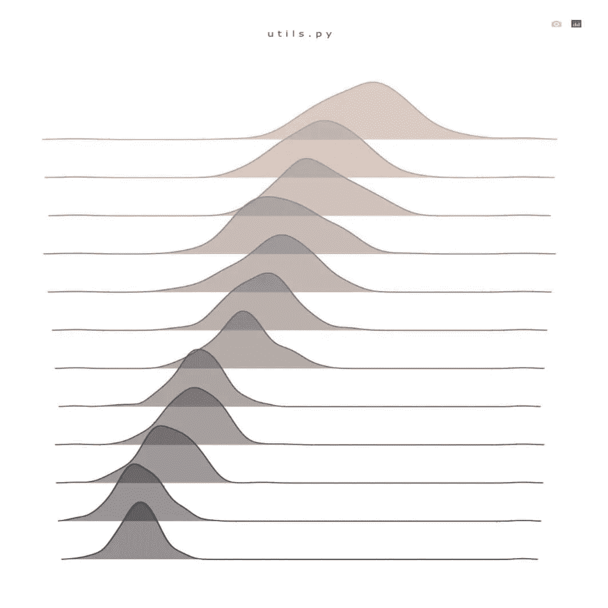
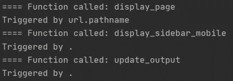

# 使用 Dash 通过 Python 升级到专业仪表板

> 原文：<https://towardsdatascience.com/advancing-to-professional-dashboard-with-python-using-dash-and-plotly-1e8e5aa4c668>

## 增强初始框架代码的高级方法



我的 Dash web 应用程序的登录页面—作者图片

那么您已经遵循了推荐的文件夹结构，构建了一个简单的框架 dash 应用程序，或者甚至可能将它部署到了某个服务器上，那么现在呢？您添加了更多的组件，但是面临需要调试的错误，或者 web 应用程序不够“专业”。这篇文章包含了让 Dash 应用程序运行得更快，提高 web 应用程序的美观性，减少调试的痛苦，SEO，跟踪和一些额外的高级东西的技巧。本文的结构是这样的，随着我们的进展，它的复杂性增加了，但是不要担心，演示代码可以用来说明每一点。

# **目录**

*   [先决条件](https://medium.com/p/1e8e5aa4c668/#efc9)
*   [管理回拨效率](https://medium.com/p/1e8e5aa4c668/#98ab)
*   [专业外观的 CSS 样式](https://medium.com/p/1e8e5aa4c668/#7cd8)
*   [与装修工一起调试](https://medium.com/p/1e8e5aa4c668/#65c0)
*   [带有客户端回调的多标签应用](https://medium.com/p/1e8e5aa4c668/#99ca)
*   [多页面应用](https://medium.com/p/1e8e5aa4c668/#c202)
*   [搜索引擎优化](https://medium.com/p/1e8e5aa4c668/#ea88)
*   [使用谷歌分析进行跟踪](https://medium.com/p/1e8e5aa4c668/#cf77)
*   [结论](https://medium.com/p/1e8e5aa4c668/#43cc)
*   [相关链接](https://medium.com/p/1e8e5aa4c668/#17ed)

# 先决条件

了解 Dash 应用的基本知识。如果没有，Dash 官方文档[中的 Dash 教程](https://dash.plotly.com/)可以让你快速上手。

# 管理回拨效率

有没有注意到 web 应用程序在页面加载或切换选项卡时需要一些时间来渲染？Dash 的工作方式是，当一个组件出现在屏幕上时，该组件的所有相关回调都将被触发——即使输入没有被触发。如果屏幕上没有太多组件，这可能不是问题，但是当在没有正确初始化的变量上触发回调时，您将遇到可伸缩性问题甚至错误。

官方 Dash 文档建议引发`PreventUpdate`异常以防止更新输出，然而，这涉及到检查输入是否为`None`，这可能是也可能不是不同组件的情况。我采用的一个解决方案是初始化返回变量，只有当回调通过输入触发时才更新返回变量。下面显示了一个例子，

```
@app.callback(...)
def sample_function(trigger)
    reply = ""
    if dash.callback_context.triggered:
        reply = "Callback is triggered"
    return reply
```

这样，如果无意中触发了回调，它将跳过所有中间处理，从而节省页面加载或 tab 切换的时间。

***更新*** :您可以在`@app.callback()`装饰器中设置`prevent_initial_call=True`来防止回调级别的初始回调。这可以在[高级回调仪表板文档](https://dash.plotly.com/advanced-callbacks)中找到。

# 专业外观的 CSS 样式

在屏幕上添加更多组件时，您可能会注意到默认颜色使 web 应用程序看起来非常单调或空洞。一个建议是为你的网络应用选择一个颜色方案。我使用的一些网站是 [colour-hex](https://www.color-hex.com/color-palettes/) 和 [Adobe](https://color.adobe.com/explore) ，它们为获取预设调色板提供了一个很好的起点。

使用 CSS 样式可以帮助同时改变多个组件的样式，而不是手动改变颜色方案的字体和背景，只要它们属于同一个“组”。这可以通过使用 Dash 组件的`className`属性来完成。

```
app.layout = html.Div([
    html.Div(className="custom-div"),
    html.Div(className="custom-div"),
])
```

在`/assets`文件夹的 CSS 文件中，为该类添加自定义样式

```
.custom-div {
    color: steelblue;
}
```

# 用 decorators 调试

编码时，错误是不可避免的，使用`app.run_server(debug=True)`可以帮助热重装，并在错误发生时显示回溯消息。但是，当您不知道触发了哪些回调，或者触发回调的顺序时，可能很难进行调试。

> 装饰器允许对现有函数进行扩展，而无需修改原始函数源代码

将 decorators 堆叠到回调函数中可以用来在回调被触发时添加打印语句。它实现起来很简单(每个回调只有一行代码)，如果您想进入或退出调试模式，您可以很容易地打开和关闭它！

```
# Toggle this to enter or exit debug mode
debug_mode = True

def print_callback(debug_mode):
    def decorator(func):
        def wrapper(*args, **kwargs):
            if debug_mode:
                print(f"==== Function called: {func.__name__}")
                print(f"Triggered by {dash.callback_context.triggered[0]['prop_id']}")
            result = func(*args, **kwargs)
            return result
        return wrapper
    return decorator

# Using the decorator
@app.callback(...)
@print_callback(debug_mode)
def sample_function(trigger):
    pass
```



装饰函数添加的打印语句示例

# 具有客户端回调的多标签应用程序

客户端回调是直接在浏览器中运行的回调，而不是向 Dash 发出请求，当回调由于数据传输或回调链而导致大量开销时，客户端回调非常有用。一般来说，我不使用很多客户端回调，除了选项卡(来自 dash 核心组件)，我希望不同的选项卡可以改变 web 应用程序的标题。这是一个非常小的改进，但是我发现与在不同的标签上只显示一个标题相比，它使 web 应用程序更加定制化和交互式。

```
app.layout = html.Div(
    html.Div(id="dummy-component"),
    dcc.Tabs(
        id="tabs-parent",
        value=None,
        children=[
            dcc.Tab(label="Tab 1", value="tab1"),
            dcc.Tab(label="Tab 2", value="tab2"),
        ],
    )
)

app.clientside_callback(
    """
    function(tab_value) {
        if (tab_value === 'tab1') {
            document.title = 'Tab One'
        } else if (tab_value === 'tab2') {
            document.title = 'Tab Two'
        }
    }
    """,
    Output("dummy-component", "children"),
    [Input("tabs-parent", "value")],
)
```

# 多页应用程序

使用多个选项卡的另一种方法是使用扩展，如*www.example.com/extension*，在多个页面上呈现 web 应用程序。为此，您需要为不同的页面准备好多个`html.Div`容器，并利用`dcc.Location`获取当前的 web 应用程序 URL。

```
app.layout = html.Div(
    [
        dcc.Location(id="url", refresh=False),
        html.Div(id="page-content"),
    ]
)

@app.callback(Output("page-content", "children"), Input("url", "pathname"))
@print_callback(print_function)
def display_page(pathname):
    if pathname == "/":
        return html.Div("Main application")
    elif pathname == "/extension":
        return html.Div("Extension application")
```

# 搜索引擎优化

你可以使用元标签来执行 SEO，一些重要的标签包括标题标签、元描述标签和社交媒体元标签。这些标签不仅能与搜索引擎交流，还能让你的网络应用程序的 URL 更易于共享！我的 web 应用程序就是一个例子，如下所示

[](https://kayjan.fly.dev) [## 让生活变得有趣和轻松的工具

### Kay Jan 的副业——自动化重复的数据分析任务，执行预测和优化，以及玩游戏

kayjan.fly.dev](https://kayjan.fly.dev) 

下面的代码示例展示了如何将 meta 标签添加到 Dash 应用程序中。请注意，必须为谷歌(以`og:`开头的标签)和 Twitter(以`twitter:`开头的标签)分别添加重复的标签。

```
meta_tags = [
    {
        "name": "author",
        "content": "Kay Jan WONG"
    },
    {
        "name": "description",
        "content": "Kay Jan's Side Project - Automate repetitive data analysis tasks and perform predictions and optimizations",
    },
    {
        "name": "viewport",
        "content": "width=device-width, initial-scale=1"
    },
    {
        "property": "og:type",
        "content": "website"
    },
    {
        "property": "og:title",
        "content": "Tools to make life easier"
    },
    {
        "property": "og:description",
        "content": "Automate repetitive data analysis tasks and perform predictions and optimizations",
    },
    {
        "property": "og:image",
        "content": "link-to-image.png"
    },
    {
        "property": "twitter:title",
        "content": "Tools to make life easier"
    },
    {
        "property": "twitter:description",
        "content": "Automate repetitive data analysis tasks and perform predictions and optimizations",
    },
    {
        "property": "twitter:image",
        "content": "link-to-image.png",
    },
]
app = dash.Dash(__name__, meta_tags=meta_tags)
```

# 使用谷歌分析进行跟踪

部署后，很自然地想要执行跟踪和查看网站流量。一种方法是将 Google Analytics 整合到 Dash 应用程序中。有一系列的安装步骤我不会在这里介绍，但是你可以按照谷歌文档中的[开始使用分析](https://support.google.com/analytics/answer/1008015?hl=en)的说明。之后，你应该会得到一个类似于`<script async src="https://www.googletagmanager.com/gtag/js?id=XXX"></script>`的谷歌标签脚本。

Dash 中使用的 HTML 组件是 pythonic 代码。为了合并原始的 HTML 脚本，我们可以改变应用程序的`index_string`组件。您可以直接复制下面的代码，并相应地填写您的 Google 标记脚本。

```
app.index_string = """
<!DOCTYPE html>
<html>
    <head>
    <!-- Global site tag (gtag.js) - Google Analytics -->
    <script async src="https://www.googletagmanager.com/gtag/js?id=XXX"></script>
    <script>
        window.dataLayer = window.dataLayer || [];
        function gtag(){dataLayer.push(arguments);}
        gtag('js', new Date());
        gtag('config', 'XXX');
    </script>
        
        <title></title>
        
        
    </head>
    <body>
        
        <footer>
            
            
            
        </footer>
    </body>
</html>
"""
```

# 结论

诚然，我不是 Dash 方面的专家，也没有受过前端开发的专业训练；我只为我的工作和个人项目构建了一个 web 应用程序。分享的代码是我很好奇的东西，为了让它们工作，我经历了很多困难。希望这也能让你受益。

**感谢您的阅读！**如果你喜欢这篇文章，请随意分享。

# 相关链接

**我的个人 Dash 应用**:[https://Kay Jan . fly . dev](https://kayjan.fly.dev)

**Plotly Dash-你需要知道的一切**:[https://medium . datadriveninvestor . com/Plotly-Dash-你需要知道的一切-bc09a5e45395](https://medium.datadriveninvestor.com/plotly-dash-everything-you-need-to-know-bc09a5e45395)