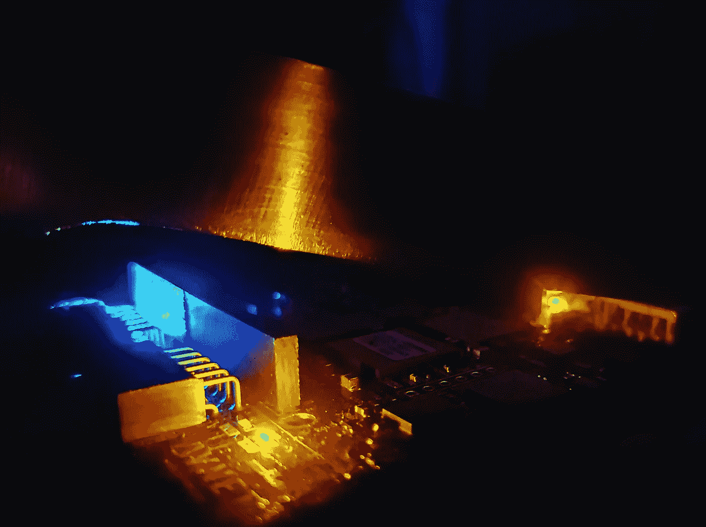
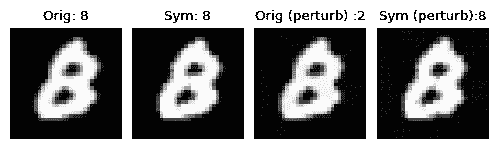

# 嵌入式视觉系统的对抗鲁棒性

> 原文：<https://towardsdatascience.com/adversarial-robustness-for-embedded-vision-systems-773ee518fbf0>

## 什么是恶意攻击，如何保护您的嵌入式设备免受这些攻击



作者图片

## 快速介绍

由于嵌入式系统的*相对健壮的*深度神经网络(DNN)的选项非常有限，本文试图提供该领域的入门知识，并探索一些现成的框架。

## 什么是*对抗强大的* DNN？

深度神经网络已经使机器学习和推理大众化。这有两个主要原因。首先，我们不需要从目标数据集中查找和设计要素，DNN 会自动完成这项工作。其次，预训练模型的可用性有助于我们快速创建特定于任务的、经过微调/转移的学习模型。

尽管 dnn 广受欢迎，但它有一个严重的弱点，这使得这些网络无法用于现实生活中的安全关键系统。尽管 DNN 模型被证明对随机噪声相当稳健，但它无法抵抗精心设计的对输入的*对抗性扰动*。

在计算机视觉中，对抗性攻击通过像素的微小变化来改变输入图像，使得这些变化对于人类来说仍然是视觉上不可察觉的，但是 DNN 不能正确地推断图像。后果可能非常严重。自动驾驶车辆的交通标志识别模块可能会将左转解释为右转路标，并掉入沟渠中！光学字符识别器(OCR)可能会错误地读取数字，从而导致财务欺诈。

幸运的是，许多专心致志的研究人员正在努力创造出对抗稳健的 DNN 模型，这种模型不会轻易被对抗扰动所愚弄。

## 对抗鲁棒性对嵌入式视觉重要吗？

*绝对。*思科预测，到 2023 年，机器对机器(M2M)连接数量将达到 147 亿[8]；来自 Linux 基金会的这份报告[9]预计到 2028 年*边缘计算*的功率足迹将达到 102 千兆瓦(MW)，Statista 预测到 2030 年将有 77.02 亿个边缘支持的物联网设备[10]。许多*边缘计算*应用都是嵌入式视觉相关应用，通常部署在安全关键系统中。然而，对于嵌入式系统来说，对抗鲁棒性的选择并不多。我们正在积极研究这一领域，我将在这里提到我们最近的一项研究。

但是在深入研究嵌入式系统的对抗性健壮性之前，我将在下一节给出这个主题的简单背景。已经熟悉这个题目的读者可以跳到下一部分。

## 对抗性鲁棒性引物

对抗性鲁棒性是一个非常流行和快速发展的研究领域。在这个博客[1]中，你可以看到致力于这一领域的大量研究文章。

对敌对图像最大的担忧是几乎不可能发现图像被篡改。



列 1:原始图像，标准 CNN 推理，列 3:被攻击的图像，标准 CNN 推理列 2:原始图像，鲁棒 CNN 推理，列 4:被攻击的图像，鲁棒 CNN 推理(Sym)手写数字 8 取自[MNIST](http://yann.lecun.com/exdb/publis/index.html#lecun-98)【15】在[知识共享署名-共享 3.0 许可](https://creativecommons.org/licenses/by-sa/3.0/)下，由作者使用类可视化的图像集合

例如，上图中来自 [MNIST](http://yann.lecun.com/exdb/publis/index.html#lecun-98) 数据集【15】的 *a 手写数字 8* 被标准的卷积神经网络(CNN)推理误归类为*数字 2* 。你能看出第一栏和第三栏中的图像有什么显著的不同吗？我不能。

CNN 做了。对手做了一些微小的改变，这些改变对人眼来说并不重要，但它对 CNN 的决策过程造成了严重破坏。然而，当我们使用健壮的推理机制(由 Sym 表示)时，我们看到被攻击的图像也被正确分类(列 4)。

让我们从另一个角度想一想。第 3 栏的图片从任何角度看都是*数字 2* 吗？不幸的是，CNN 是这么认为的。这是一个更大的问题。对手可以调整任何图像，哄出一个有利于它的决定，以实现其恶意的目标。

事实上，这些对立的例子就是这样被发明出来的。正如 Ian Goodfellow 在本次演讲中所述(大约 7 分钟)，他们在探索 CNN 运作如此之好的原因。在这个过程中，他们想对不同类别的图像进行小的改变，这样这些图像就变成了*飞机*类别的图像。虽然他们期望某种飞机特有的特征(比如说，机翼)能够在飞船图像中显现出来，但这种事情并没有发生。在对图像做了一些改变后，他们的 CNN 开始自信地推断出一张完全看起来像一艘*船*的图像，作为一架*飞机。*

现在，有了基本的概述，让我快速总结一下开始对抗鲁棒性需要知道的要点:

1.  ***对抗性攻击*** 是*优化*算法，用于找到 DNN 做出错误决策的示例输入。有趣的是，这样的例子一点也不难找到，相反，它们几乎存在于输入流形的任何地方。尽管标准的、基于经验风险最小化的训练方法在训练 DNN 模型时可能不包括这样的例子。
2.  一个好的 ***对抗性攻击*** *快速*找出最有效的对抗性例子。*有效*对抗图像在视觉上与原始图像相似(就距离度量而言)，但迫使模型将其映射到不同于原始图像的决策边界。距离度量是曼哈顿距离(L1 范数)、欧几里德距离(L2 范数)或切比雪夫距离(L∞范数)。
3.  如果对手的目标是迫使 DNN 将决策映射到*任何错误的*类，则称为 ***无目标*** 攻击。相反，在 ***有针对性的*** 攻击中，对手迫使 DNN 映射到对手期望的特定类别*。*
4.  ***扰动*** 以每像素的变化来度量，通常用ϵ.来表示例如，0.3 的ϵ将意味着干净示例(原始图像)的每个像素在相应的相反示例中经历 0.3 的最大变化*。*
5.  用*清晰*图像和*对抗*图像测量的 DNN 的精度通常分别称为 ***清晰精度*** 和 ***稳健精度*** 。
6.  对手可以攻击 DNN 推论，而不需要访问模型、训练细节和对测试数据分布的有限估计。这个 ***威胁模型*** 叫做一个完整的 ***黑盒*** 设置【2】。这可以像在一个真实的物体上贴一个小的物理标签一样简单，DNN 正试图推断出这一点。在另一个极端，完整的 ***白盒*** 设置指的是一种攻击模型，其中的模型、训练细节，甚至防御机制都是对手已知的。这被认为是对抗性辩护的考验。在上述两种设定的*中级*下评估不同的攻击和防御。
7.  ***对抗性防御*** 旨在挫败对抗性攻击。对抗鲁棒性可以通过*经验*防御(例如，使用对抗示例的对抗训练)或*启发式*防御(例如，预处理被攻击的图像以消除干扰)来实现。然而，这些方法经常通过实验结果得到验证，使用*然后是*攻击。没有理由为什么一个新的更强的对手不能在以后打破这些防御。这正是对抗性鲁棒性研究中正在发生的事情，通常被称为*猫捉老鼠游戏*。

对抗性研究社区旨在解决最后一点中强调的这种追赶游戏。该领域目前的研究重点是开发 ***认证和可证明的防御*** 。这些防护修改模型操作，使得这些操作对于输入值的范围是可证明正确的，或者使用高斯噪声执行分类器的随机平滑，等等。

## 嵌入式视觉系统的对抗性鲁棒性？

到目前为止，对抗性研究团体并没有关注嵌入式系统的对抗性健壮性。这是完全正常的，因为这个领域本身仍在形成之中。

我们在卷积神经网络中看到了同样的趋势。AlexNet [12]在 2012 年赢得 ILSVRC 挑战赛[14]后，DeepCompression [11]花了四年时间才率先生成小型修剪模型。然而，在那个时期，没有办法完全利用这些修剪过的模型，因为没有既定的硬件支持来*在 CNN 推断期间利用稀疏性*。最近，这种支持正在发展，研究人员甚至在微控制器上运行 CNN。

嵌入式系统的对抗性防御必须在*大小*、运行时间*内存*、 *CPU 周期*和*能量*消耗方面*非常低的开销*。这立即取消了最佳可用选项，即对抗性训练模型。这些型号*巨大*， [CIFAR-10](http://www.cs.toronto.edu/~kriz/cifar.html) 约 500 MB(此处[见](https://robustbench.github.io/))。正如本文[3]中恰当解释的那样，与标准模型相比，对抗性训练的模型倾向于学习更复杂的决策区域。这种可证明的强大防御还没有扩展到现实生活中的网络。使用生成式对抗网络(GAN)或自动编码器来净化受攻击图像的启发式防御对于嵌入式设备来说太耗费资源了。

这使得基于简单*启发式输入转换的*防御成为资源有限设备的唯一选择。然而，正如开创性的著作[4–5]所示，所有这些防御都依赖于某种形式的*梯度混淆*，并且最终可以被强大的*适应性*攻击打破。这种防御可以带来一些好处的方式是使转变变得非常强大。这不能抵御强大的适应性攻击，但是破坏转换的时间将取决于对手可获得的计算资源。

其中一个成功的作品[6]使用了一系列简单的变换*,例如降低颜色的位分辨率、JPEG 压缩、噪声注入等。它们一起防御[4]中介绍的*反向传递可微逼近* (BPDA)攻击。遗憾的是，本文没有公开的实现可供尝试。*

*另一个最近的工作[7]使用输入*离散化*在 DNN 推理之前净化对立的图像。在*净化*过程中，位于不受限制的实数域中的图像像素值被转换成一组受限的离散值。由于这些离散值是从大型干净的图像数据集中学习的，因此转换*难以打破*，并且替换移除了一些不利的扰动。*

***有人动手…***

*首先，让我们看一些示例攻击，以创建一些敌对的图像。*

*我们可以使用任何现有的库，例如 [Foolbox](https://github.com/bethgelab/foolbox) 、[对抗性攻击 pytorch](https://github.com/Harry24k/adversarial-attacks-pytorch) 、 [ART](https://github.com/Trusted-AI/adversarial-robustness-toolbox) …,等等。*

*下面是一个用[对抗性攻击-pytorch](https://github.com/Harry24k/adversarial-attacks-pytorch) 使用 AutoAttack 的实现来攻击和创建对抗性例子的例子[13]:*

```
*from torchattacks import *attack = AutoAttack(your_dnn_model, eps=8/255, n_classes=10, version='standard')for images, labels in your_testloader:
    attacked_images = attack(images, labels)*
```

*这里是另一个用 [Foolbox](https://github.com/bethgelab/foolbox) 使用投射梯度下降攻击[3]攻击和创造对抗性例子的例子:*

```
*import foolboxattack = foolbox.attacks.PGD(your_dnn_model)for images, labels in your_testloader:
    attacked_images = attack(images, labels)*
```

*这些*被攻击的图像*可用于通过 DNN 进行推断。*

*接下来，让我们尝试用 SymDNN 来防御攻击。使用这个库的第一步是从[这个](https://github.com/swadeykgp/SymDNN)链接克隆或下载这个库。*

*下一步是安装 SymDNN 的依赖项。存储库的自述文件中描述了这一步骤和 python 可选虚拟环境设置。*

*接下来，我们需要为*离散化*设置一些*默认参数*。所提供的缺省值对于一些数据集和攻击来说工作良好。我们可以稍后调整这些，以进行推断*健壮性-延迟-内存*的权衡。*

```
*# For similarity search
import faiss
import sys
sys.path.insert(1, './core')# function for purification of adversarial perturbation
from patchutils import symdnn_purify# Setup robustness-latency-memory tradeoff parameters, defaults are good enough, then call the purification function on attacked imagepurified_image = symdnn_purify(attacked_image, n_clusters, index, centroid_lut, patch_size, stride, channel_count)*
```

*这些*净化后的*图像可用于使用 DNN 的进一步推断。这个净化功能在*处理*和*内存*方面极其*低开销*，适合嵌入式系统。*

*SymDNN 存储库包含在几种攻击和不同威胁模型下对 CIFAR-10、ImageNet 和 MNIST 的许多攻击示例。*

*这是一个在 SymDNN 中使用 *BPDA 攻击*【4】实现攻击和创建对抗示例的示例，摘自[此处](https://github.com/anishathalye/obfuscated-gradients):*

```
*bpda_adversary16 = BPDAattack(your_dnn_model, None, None, epsilon=16/255, learning_rate=0.5, max_iterations=100)for images, labels in your_testloader:
    attacked_images = bpda_adversary16.generate(images, labels)*
```

**攻击强度*，*迭代*等。*超参数*在原始论文【4】中有解释，通常取决于应用场景。*

## *结论*

*尽管对抗性鲁棒性是一个经过充分研究的领域，但我们认为，在它能够成功部署到现场之前，有几个点需要连接，特别是在*边缘计算*场景中。我们提出的 SymDNN 防御，不能够*撤销*所有攻击。然而，它可以很容易地用于使嵌入式视觉系统对一些敌对攻击具有鲁棒性。随着嵌入式人工智能(AI)在未来迅速发展，手头有*东西*来保护它们总比什么都没有好。*

## *参考*

*[1] Nicholas Carlini，*所有(arXiv)对抗性示例论文完整列表* (2019)，[https://Nicholas . Carlini . com/writing/2019/All-Adversarial-Example-Papers . html](https://nicholas.carlini.com/writing/2019/all-adversarial-example-papers.html)*

*[2] Nicolas Papernot，Patrick McDaniel，Ian Goodfellow，Somesh Jha，Z. Berkay 切利克和 Ananthram Swami，*针对机器学习的实际黑盒攻击* (2017)，在 2017 年亚洲计算机与通信安全会议上*

*[3] Aleksander Madry，Aleksandar Makelov，Ludwig Schmidt，Dimitris Tsipras，和 Adrian Vladu，T *owards 深度学习模型抵抗对抗性攻击* (2018)，在 2018 年 ICLR*

*[4] Anish Athalye，Nicholas Carlini 和 David A. Wagner，*模糊的梯度给人一种错误的安全感:绕过对抗例子的防御* (2018)。在 2018 年的 ICML*

*[5] Florian Tramèr，Nicholas Carlini，维兰德·布伦德尔和亚历山大·马德瑞，*关于对抗性示例防御的适应性攻击* (2020)。在 NeurIPS 2020 中*

*[6] Edward Raff，Jared Sylvester，Steven Forsyth 和 Mark McLean，*随机变换的弹幕，用于对抗性的稳健防御* (2019)，2019 年在 CVPR 举行*

*[7] Swarnava Dey、Pallab Dasgupta 和 Partha P Chakrabarti， *SymDNN:简单&嵌入式系统的有效对抗鲁棒性* (2022)，CVPR 嵌入式视觉研讨会 2022*

*[8]思科、*思科年度互联网报告(2018–2023)*、[https://www.cisco.com/c/en/us/solutions/collateral/](https://www.cisco.com/c/en/us/solutions/collateral/326)高管视角/年度互联网报告/白皮书-c11–741490 . html*

*Linux 基金会，*State of The edge 2021*(2021)[https://stateofthedge . com/reports/State-of-The-edge-report-2021/](https://stateoftheedge.com/reports/state-of-the-edge-report-2021/)*

*[10] Statista，*2020 年至 2030 年全球物联网(iot)设备的数量，按市场划分* (2022 年)，[https://www . Statista . com/statistics/1259878/edge-enabled-IOT-device-market-world wide/，](https://www.statista.com/statistics/1259878/edge-enabled-iot-device-market-worldwide/,) 2022 年*

*[11]宋涵，，毛，威廉·戴利，*深度压缩:通过剪枝、训练量化和霍夫曼编码压缩深度神经网络* (2016)，2016*

*[12] A. Krizhevsky、I. Sutskever 和 G. E. Hinton，*使用深度卷积神经网络的 Imagenet 分类* (2012 年)，载于 NeurIPS 2012 年*

*[13] Francesco Croce 和 Matthias Hein，*对各种无参数攻击集合的对抗性鲁棒性的可靠评估* (2020)，ICML 2020*

*[14] Olga Russakovsky*、Jia Deng*、苏浩、Jonathan Krause、Sanjeev Satheesh、Sean Ma、、Andrej Karpathy、Aditya Khosla、Michael Bernstein、Alexander C. Berg 和李菲菲。(* =同等贡献) *ImageNet 大规模视觉识别挑战赛。* *IJCV，* 2015*

*[15] Y. LeCun、L. Bottou、Y. Bengio 和 P. Haffner。*基于梯度的学习应用于文档识别。美国电气和电子工程师学会会议录，86(11):2278–2324，1998 年 11 月**