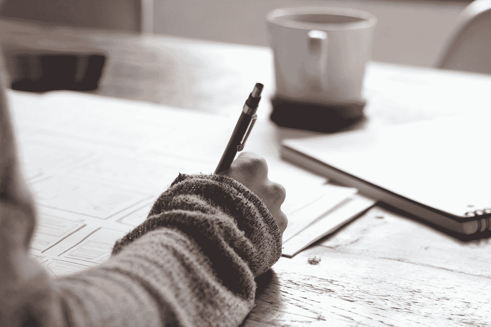

# 通过 AWS 机器学习专业的建议和提示

> 原文：<https://towardsdatascience.com/advice-tips-for-passing-aws-machine-learning-specialty-102f7f5f99a0>

# 通过 AWS 机器学习专业的建议和提示

## 关于 2021 年底通过 CLF-C01 和 MLS-C01 考试的思考和建议

[绿色变色龙](https://unsplash.com/@craftedbygc?utm_source=medium&utm_medium=referral)在 [Unsplash](https://unsplash.com?utm_source=medium&utm_medium=referral) 上的照片

2021 年下半年(又名。2020 年第 673 天)，我参加并通过了 AWS 认证机器学习专业考试。我读了一堆关于这个主题的其他文章，所有这些都在我通过考试的道路上帮助和支持了我。完成后，我想为这个知识库做出贡献，所以，在真正的数据科学时尚中，我想我应该继续下去，开源我的经验和准备材料。

# **背景**

每个人对待这些考试的方式都不一样，所以在我进入这篇文章之前，详细介绍一下我的背景和我从哪里开始准备考试可能会有所帮助。在我开始学习的时候，我已经从事数据科学大约 7 年了。我拥有应用统计学硕士学位，并在大学期间辅修了数学。在参加考试的时候，我在云计算方面的经验包括在 SageMaker 上培训和部署 XGBoost。尽管比我训练的基于树的算法更环保，我还是把目光放在了轻盈蓬松的云朵上，并开始行动。

# **考试时间表和准备时间长度**

现在我们已经了解了初步的信息，让我们来看看我的考试之路是怎样的。

正如之前很多人建议的那样，我选择先从云从业者开始([亚当·德扬斯](https://medium.com/u/10046f93711f?source=post_page-----102f7f5f99a0--------------------------------)在[做了很好的工作，解释了](https://medium.com/@adam.dejans/my-path-to-passing-the-aws-machine-learning-certification-e8fc45ad7762)为什么你会想这么做(从准备的角度和财务的角度)。9 月底报名了执业医师考试，劳动节周末后开始认真学习。一旦我开始钻研，我发现云从业者考试虽然范围很广，但并不是一个很难的考试——大约三周的时间足以掌握材料。

通过云从业者考试后，我休息了一个周末，才开始准备 11 月中旬的机器学习专业考试。这次考试需要我更多的注意力，我在十月初开始学习，给自己整整 6 周的时间准备。我全职工作，所以为了保持理智，偶尔看看外面的世界，我选择安排每周大约 2-3 个晚上的 2 小时学习时间，周末的学习时间更长。总而言之，我给了自己 3 周的时间参加云从业者考试，6 周的时间参加机器学习专业考试，我发现在全职工作的同时，这些时间足够彻底地覆盖材料。

我在学习期间采用的主要策略是浏览 Udemy 课程，然后用剩下的时间参加模拟考试，并复习原始资料寻找我错过的答案。实践考试有助于发现我的知识缺口，并帮助我为考试中的知识测试做准备(例如，区分类似的服务(如 Lex/transcriptor/Polly/understand)非常重要)。最后一点:我没有浏览白皮书(我个人更喜欢角落里有小涂鸦的粉红色纸张)或使用正式的 AWS 培训，尽管我看了一些 Emily Webber 和以前的 re:Invent 会议视频。

由于 MLS 考试更难，很少有人分享他们的考试经历，我将在这篇文章的剩余部分更具体地关注 MLS 考试(尽管我也会参考下面一些有助于通过 CPP 的文章和资源)。

# **考试经历**

由于我是在疫情报名参加这两项考试的，所以我选择在家里参加 Pearson OnVue 考试，而不是去考试中心(我可能会因为 In-N-Out 的动物薯条而被 COVID，但不是 CPP)。很明显，如果没有 AWS 的突击队从我的窗口闯入，我不能透露考试的内容，但我会分享一些关于我考试经历的想法。

像许多其他有类似数学/统计背景的人一样，对我来说，考试最容易的部分是数据分析和建模部分。例子包括破译图表，解释混乱矩阵(名称完全检查出来)，调整特定的算法，如随机森林，等等。就我个人而言，考试中涉及 AWS 服务的特定用例及配置的部分(确定特定 AWS 服务的适当参数、文件夹结构的特定顺序等)更难。由于 CPP，我能够很容易地识别 AWS 服务，但因为 MLS-C01 是一个专业水平的考试，它比我准备的更深入这些服务的实现。我最后花了整整 3 个小时，因为我已经标记了我不确定的问题，并在最后花时间回溯这些问题。在考试结束时，我没有被留在悬念中——测试平台带我完成了一项简短的调查，然后给出了我是否通过的即时反馈。我一定还在肾上腺素的刺激下，因为我在 10 个问题的调查中一路汗流浃背。

# **学习资料&资源**

其他博客帖子和文章中有用的是每个作者认为最有用的材料和资源列表。我整理了自己的清单，以下是在整个过程中对我帮助最大的材料:

*   首先，我真的很欣赏这个 Reddit 帖子。作者在考试前分享了一些关于他的实践考试结果的精彩分析，并详细介绍了他使用的资源。
*   这些是我在 Udemy 上的课程—

*强烈推荐* [AWS 认证机器学习专业 2022 —动手！| Udemy](https://www.udemy.com/course/aws-machine-learning/)

*好，但不如上面的* [AWS 机器学习认证考试|全指南| Udemy](https://www.udemy.com/course/amazon-web-services-machine-learning/)
[亚马逊 AWS SageMaker，AI 与机器学习用 Python 课程| Udemy](https://www.udemy.com/course/aws-machine-learning-a-complete-guide-with-python/)

*   这些实践考试(也在 Udemy 上):
    [AWS 认证机器学习专业实践考试| Udemy](https://www.udemy.com/course/aws-certified-machine-learning-specialty-practice-exams-amazon/)
    [AWS 认证机器学习专业:3 实践考试| Udemy](https://www.udemy.com/course/aws-certified-machine-learning-specialty-full-practice-exams/)
    [AWS 认证机器学习专业全实践考试| Udemy](https://www.udemy.com/course/aws-machine-learning-practice-exam/)

Quizlet 。2021 年 8 月至 11 月间，Quizlet 取代 Instagram，成为我最好的朋友。在我的 Udemy 课程中，我一直使用 Quizlet 作为不熟悉的术语和信息的存储库，以及我犯了错误并想重新讨论的问题的存储库。以下是我的 Quizlet 牌和其他我认为有用的牌:

*   [考试前我复习过的试题的练习板](https://quizlet.com/626019794/aws-machine-learning-qs-flash-cards/)
*   [我的套牌专门针对条款/服务](https://quizlet.com/626951212/aws-machine-learning-concepts-flash-cards/)
*   [我发现对考试有帮助的另一副牌](https://quizlet.com/610314886/aws-ml-readiness-prep-flash-cards/)

# **最后几条建议**

回顾我的个人历程，这里有一些我会给过去的自己的建议:

*   拥有更多 SageMaker 经验会使考试体验更容易
    *考试创建者建议拥有至少两年使用 AWS ML/AI 服务和平台的经验。如果我等到考试的时候，多和 SageMaker* 合作，我可能就不会这么纠结了
*   **考试不是关于准确性，而是关于知道的比曲线更多。你将会被那些过去答对的人评判，而不是整体的准确性。 *本文解释评分标准* [*揭秘您的 AWS 认证考试成绩| AWS 培训与认证博客*](https://aws.amazon.com/blogs/training-and-certification/demystifying-your-aws-certification-exam-score/)
    *考试前的周末，我正在重考，平均准确率约为 70%，这让我感到不安，因为实践考试估计 75%的准确率是通过考试的基准***
*   **将考试安排在一天中你最警觉的时候** *我最初在下午 3 点到 5 点参加 CPP，我可以感觉到我的大脑在变慢，所以对于机器学习专业考试，我将考试安排在一天的早些时候(上午 11:30 到下午 2:30)，感觉更加警觉*
*   考试前充分补充燃料有很多研究和营养专家都在谈论食物和我们大脑的表现之间的相关性。我从自己的亲身经历中知道，当我的身体处于禁食状态时，我的头脑往往会更清晰。所以我在考试前一周和考试当天限制卡路里。对我来说，我的大脑处于最佳状态，我在考试中经历了更少的精神迷雾。
*   **仔细阅读问题并练习放慢速度** *有时我会快速阅读问题并错过关键细节，所以我使用了 Pearson 平台上的笔记功能，并从问题中键入关键单词和短语，以放慢速度，专注于问题的重要细节*
*   **使用问题标记功能** *我在模拟考试和实际考试中使用了标记功能来区分难的和容易的问题，这样当我回去查看我的回答时，我可以跳过容易的问题*
*   **在准备参加模拟考试之前兑换免费模拟考试券** *在通过任何认证后，您可以兑换免费模拟考试券，但我没有意识到的是，模拟考试在您兑换后一个月到期，因此我的建议是在接近您计划参加的时间兑换，我错误地认为我可以无限制地参加计时考试*
*   **家里的考试桌上可以有水** *最后，皮尔森说，你可以在考试桌上喝一杯水，但不建议使用洗手间，所以我不得不坐了整整 3 个小时。另外，不要忘记把你的笔记本电脑插上电源，把你的手机放在旁边(但不要放在桌子上)*

我尽了最大努力来记录我学习、准备和参加考试的经历——希望这对你的旅程有所帮助！我很乐意在 [Twitter](https://twitter.com/_maisiedaisie) 上回答任何进一步的问题(或者在 [LinkedIn](https://www.linkedin.com/in/maisiehall/) 上找到我)，并在考试的另一边与你联系！感谢您的阅读——祝您好运，希望在未来的 AWS 活动中见到您！

# 云从业者资源

[AWS 认证云从业者考试培训【新】2022 | Udemy](https://www.udemy.com/course/aws-certified-cloud-practitioner-training-course/)
[【Quizlet 套牌】AWS 云从业者服务](https://quizlet.com/620913594/aws-cloud-practitioner-services-flash-cards/)
[【Quizlet 套牌】AWS CPP 竞猜题](https://quizlet.com/620917074/aws-cpp-quiz-questions-flash-cards/)