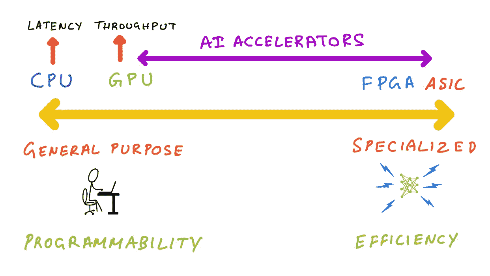
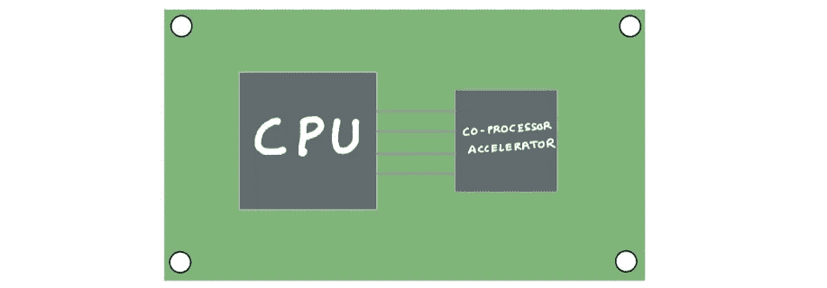
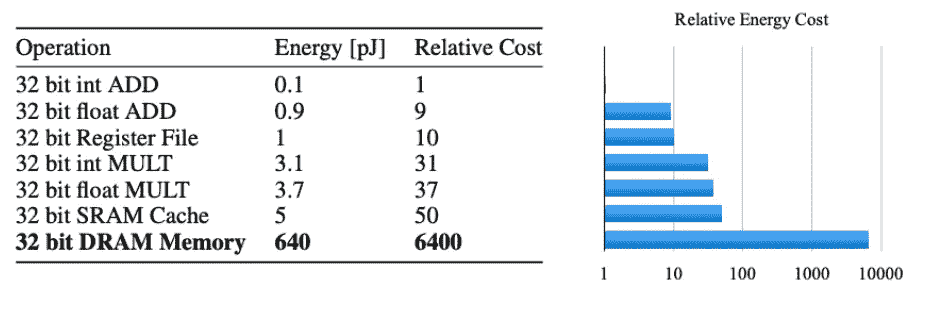
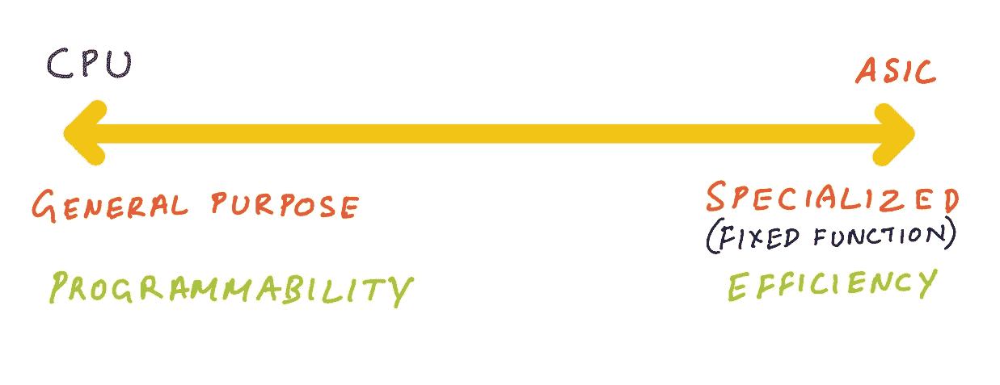
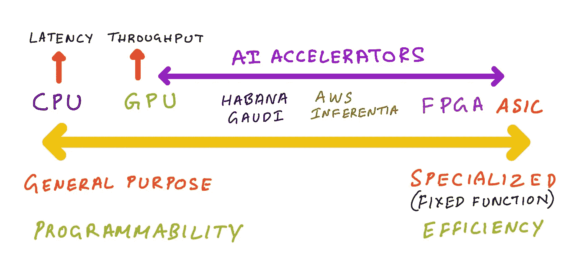
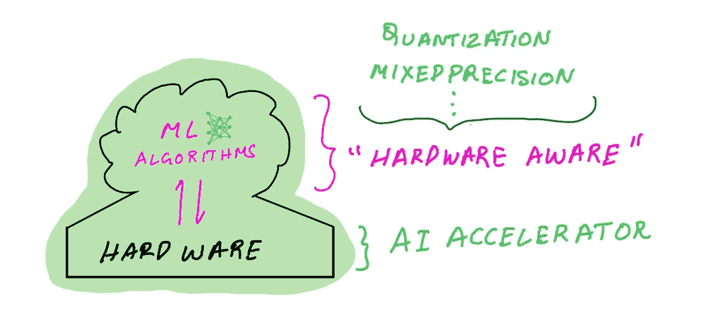
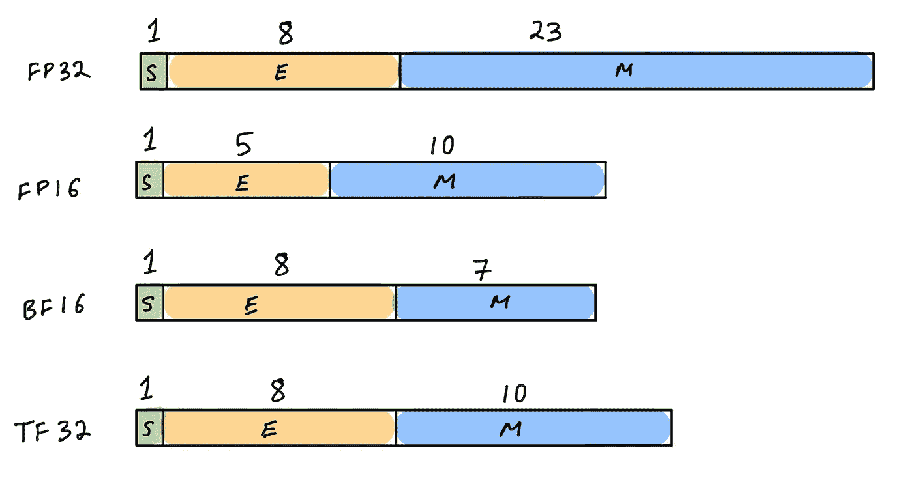

# 人工智能加速器和机器学习算法:协同设计和进化

> 原文：<https://towardsdatascience.com/ai-accelerators-machine-learning-algorithms-and-their-co-design-and-evolution-2676efd47179>

## 人工智能加速器机器学习中的高效算法和方法—英伟达 GPU、英特尔 Habana Gaudi 和 AWS Trainium 和推理

作者插图

很有可能你正在一台现代电脑上阅读这篇博文，这台电脑要么放在你的膝盖上，要么放在你的手掌上。这种现代计算机具有中央处理器(CPU)和其他专用芯片，用于专门的任务，如图形、音频处理、网络和传感器融合等。这些专用处理器可以比通用 CPU 更快、更有效地执行专门的任务。

从计算的早期开始，我们就将 CPU 与专用处理器配对。70 年代早期的 8 位和 16 位 CPU 在执行浮点计算时速度很慢，因为它们依赖软件来模拟浮点指令。由于计算机辅助设计(CAD)、工程模拟等应用需要快速浮点运算，CPU 与一个数学协处理器配对，它可以将所有浮点计算卸载到这个专用协处理器。数学协处理器是专用处理器的一个例子，它被设计用来比 CPU 更快更有效地完成特定任务(浮点运算)。

作者插图

如果你一直在关注人工智能或半导体行业的最新进展，你可能听说过专用机器学习处理器(人工智能加速器)。虽然最受欢迎的加速器是 NVIDIA GPUs，但还有其他加速器，包括英特尔 Habana Gaudi、Graphcore Bow、谷歌 TPUs、AWS Trainium 和 Inferentia。为什么今天有这么多 AI 加速器选项？它们和 CPU 有什么不同？算法如何改变以支持这些硬件？硬件如何发展以支持最新的算法？让我们找出答案。在这篇博文中，我将介绍:

*   为什么我们需要专门的 AI 加速器？
*   对机器学习硬件进行分类——CPU、GPU、AI 加速器、FPGAs 和 ASICs
*   “硬件感知”算法和“算法感知”硬件
*   人工智能加速器和高效机器学习算法的共同进化
*   人工智能加速器和有效的推理算法
*   人工智能加速器和用于训练的高效算法
*   人工智能加速器的未来

# 为什么我们需要专门的 AI 加速器？

构建机器学习专用处理器的三个最重要的原因是 **(1)能效(2)** **更快的性能和(3)模型大小和复杂性**。提高模型准确性的最新趋势是引入具有更多参数的更大模型，并在更大的数据集上训练它们。我们在包括计算机视觉、自然语言和推荐系统在内的所有应用中都看到了这种趋势。

像 GPT 3 这样的语言模型有 1750 亿个参数，这在几年前还被认为是极端的。从那时起，我们已经看到了像 GLaM 的模型有 1.2 万亿个参数，NVIDIA 的 MT-NLG 有 5300 亿个参数。如果历史有任何指示，模型大小将继续变大，当前的处理器将无法在严格的训练时间和推理延迟要求下提供训练或运行这些模型的推理所需的处理能力。

然而，我们需要专门的人工智能加速器并使开发定制芯片的经济性发挥作用的一个最重要的原因是对能源效率的需求。

## **为什么我们需要节能处理器？**

机器学习模型越大，需要执行的内存访问操作就越多。像矩阵-矩阵和矩阵-向量计算这样的计算操作是比存储器访问更节能的操作。如果你看看从存储器读取访问所消耗的能量与加法和乘法运算所消耗的能量相比，存储器访问操作比计算操作多消耗几个数量级的能量。由于大型网络不适合片上存储，因此需要更多消耗能源的 DRAM 访问。

来源:[https://arxiv.org/pdf/1506.02626v3.pdf](https://arxiv.org/pdf/1506.02626v3.pdf)

当像深度神经网络这样的应用程序在通用处理器上运行时，即使通过扩展来实现很小的性能改善，也会带来巨大的能耗和设备成本。

> G 通用处理器(如 CPU)以能效换取多功能性，专用处理器(人工智能加速器)以能效换取多功能性。

另一方面，人工智能加速器可以设计为具有最大限度地减少内存访问的功能，提供更大的片上缓存，并包括专用硬件功能来加速矩阵-矩阵计算。由于人工智能加速器是专门建造的设备，它“知道”它运行的算法，其专用功能将比通用处理器更有效地运行它。

# 对机器学习硬件进行分类——CPU、GPU、AI 加速器、FPGAs 和 ASICs

现在让我们来看看不同类型的处理器，以及它们在通用处理器和专用处理器中的位置。

作者插图

在谱的左端是 CPU，这些是真正通用的，因为你可以在它们上面运行任意代码。您可以使用它们来执行专用芯片执行的任何任务，包括图形、音频处理、机器学习等。如前所述，您将放弃性能和能效。

另一端是专用集成电路(ASICs)。这些也被称为固定功能芯片，因为它们的存在只是为了做一件或几件事情，通常是不可编程的，并且不公开开发人员关注的 API。这方面的一个例子是耳机中的噪声消除处理器。它需要高能效以延长耳机的电池寿命，并且功能足够强大以达到目标延迟，这样当您使用它们观看您最喜欢的电视节目时，就不会遇到延迟或令人沮丧的不同步问题。

谱的左端是关于通用和可编程性，谱的右端是关于专用和效率。

## 像 GPU、FPGAs 和 AI 加速器这样的处理器属于这个范围的什么位置？

**回答:**介于这两个极端之间。

作者插图

更接近 ASIC 一端的是现场可编程门阵列(FPGAs)。顾名思义，它是可编程的，但你需要硬件设计技能和硬件描述语言(HDL)的知识，如 verilog 或 VHDL。换句话说，它太低级了，离芯片太近，软件开发人员没有技能和工具来编程。

在 CPU 一端的右边是 GPU。与 CPU 不同，GPU 是专用处理器，擅长并行工作负载，如图形着色器计算和矩阵乘法。CPU 更适合延迟敏感型应用，而 GPU 更适合需要高吞吐量的应用。GPU 在某种意义上类似于 CPU，它们是可编程的，并使用 NVIDIA CUDA 和 OpenCL 等语言。与 CPU 相比，这些并行处理器可以运行更少的任意功能，但真正擅长利用并行性的代码。

人工智能加速器，如英特尔 Habana Gaudi、AWS Trainium 和 AWS 推理，位于 GPU 的右侧。Habana Gaudi 提供可编程性，但不如 GPU 通用，所以我们可以让它更接近 GPU。AWS 推理是不可编程的，但它提供了一系列支持的操作，如果您的机器学习模型不支持这些操作，那么 AWS 推理会为这些操作实现 CPU 后退模式。因此，我们可以将 AWS 推理进一步放在光谱的右边。

# “硬件感知”算法和“算法感知”硬件

既然我们已经有了一个思考不同类型处理器的心智模型，让我们来讨论这些处理器如何与运行在其上的软件进行交互。

作者插图

通用计算模型有两个组件(1)软件和算法，以及(2)运行软件的硬件处理器。在大多数情况下，这两者是相当独立的，因为当你写软件时，你很少考虑它在哪里运行。设计硬件功能时，它们旨在支持最广泛的软件。

作者插图

该模型开始为深度学习等需要更高性能和能效的应用而发展，弥合了算法设计和硬件设计之间的差距。现代机器学习计算模型还包括两个组件(1)机器学习算法和软件框架(2)与 AI 加速器配对的通用处理器。

与通用计算模型不同，研究人员开发了“硬件感知”的机器学习算法，即他们编写的代码利用了硬件特定的功能，如多精度类型(INT8、FP16、BF16、FP32)，并针对特定的芯片功能(混合精度、结构化稀疏)。作为用户，你可以通过流行的机器学习软件框架来利用这些特性。类似地，硬件设计师构建“算法感知”的人工智能加速器，即他们设计专用的硅功能，可以加速机器学习矩阵计算(例如张量核)。

这种“硬件-算法意识”是可能的，因为人工智能加速器硬件和机器学习算法正在共同进化。硬件设计师正在向人工智能加速器添加由机器学习算法利用的功能，机器学习研究人员正在创建新的算法和方法，可以利用人工智能加速器上的特定功能。

> 硬件和软件作为一个整体更加紧密地工作，从而带来更高的性能和**能效**。

# 人工智能加速器和高效机器学习算法的共同进化

人工智能加速器分为两类——**(1)用于训练的人工智能加速器(2)用于推理的人工智能加速器**。由于训练和推理的目标是不同的，并且 AI 加速器是用于专门工作负载的专用处理器，因此为每种类型的工作负载设计单独的处理器是有意义的。

训练加速器的目标是减少训练时间，并且训练加速器被设计成具有训练算法可以利用的硬件特征。这通常意味着训练加速器是更高性能的处理器，更多的内存支持更高的吞吐量(每秒处理的数据)。由于训练加速器是吞吐量集中的设备，如果您最大化吞吐量或利用率，它的能量成本/吞吐量将会更低。训练加速器还支持混合精度训练，使用专用硬件功能，在低精度下执行计算速度更快，在高精度下累积结果，与通用处理器相比，更加节能。我们将在人工智能训练加速器一节中更详细地讨论混合精度训练。

另一方面，推理加速器的目标是减少大量独立数据批次的预测延迟。因此，推理加速器需要是能量有效的，并且具有低能量成本/预测。您可以使用训练加速器进行推理(训练的正向传递本质上是一个推理任务)，但是训练加速器上的能量成本/推理会高得多，因为它在小批量推理请求中没有得到充分利用。

作者插图

一个训练加速器就像一辆公共交通巴士，只有当巴士一直爆满，燃料成本/乘客成本较低时，它才是节能的。如果你使用公共汽车每次只运送一个人，那么每位乘客的燃料成本就会更高。另一方面，推理加速器就像一辆跑车，比公共汽车更快，比一个乘客的公共汽车更节能(因为每名乘客的燃料成本更低)。但是，如果你想用一辆跑车运送 50 个人，效率会很低，速度也会很慢(更不用说违法了)。

在下一节中，我们将分别仔细研究训练和推理工作流。对于每一个，我们将看看为其任务提供最佳性能和能效的人工智能加速器和软件功能。

# 人工智能加速器和有效的推理算法

我们知道，机器学习推理包括将训练好的模型应用于新数据，以获得模型预测结果。在这一节中，我们将讨论在人工智能加速器上运行的高效算法，以使推理更加高效和节能。

作者插图

能让机器学习推理更高效的最重要的软硬件绝招就是**量化**。为了充分理解量子化，我们必须理解计算机硬件中的数字表示。数字计算机中的浮点数是连续实数值的离散表示。机器学习算法通常存储和处理基于 IEEE 754 标准的单精度(FP32)数字。IEEE 754 指定了额外的浮点类型，如 AI 加速器通常支持的半精度(FP16)和双精度(FP64)。现代 AI 加速器还支持其他非 IEEE 754 标准表示，如 bfloat16(由 Google Brain 推出，由 NVIDIA Ampere GPUs、AWS Inferentia、AWS Trainium、Intel Habana Gaudi、Google TPUs 支持)和 TF32(在 NVIDIA Ampere 架构和 AWS Trainium 加速器中)。推理加速器通常也支持整数精度，如 INT8 和 INT4。

## **推理量化的好处**

对于推理任务，模型权重和激活可以被量化，即从 FP32(典型的训练精度)转换为较低精度的表示，例如 FP16、bfloat16 或 INT8。较低精度的型号意味着更好的性能和能效。当您从 FP32 位转到 FP16 操作时，数据大小减少了 2 倍，能耗减少了大约[4 倍](https://arxiv.org/pdf/1506.02626v3.pdf)，FP16 操作的芯片面积减少了大约 4 倍。

从仅推理硬件设计的角度来看，构建更小的仅推理加速器是有意义的，这些加速器仅支持较低的精度，因此更节能。从 FP32 迁移到 INT8 结果将导致更低的能源利用率，因为数据大小减少了 4 倍。

这种巨大的性能效率提升通常是以模型预测准确性为代价的。移动到较低精度的表示是一种压缩，这意味着量化时会丢失一些数据。与 FP16 和 INT8 相比，FP32 具有较大的动态范围，如下所示。因此，推理量化的目标是在量化到较低精度时只保留“信号”,并去掉“噪声”,有几种方法可以做到这一点。

## **用 NVIDIA GPUs 量化**

基于 NVIDIA Ampere 和 NVIDIA Turing 架构的新一代 NVIDIA GPUs 支持一系列仅用于推断的精度类型。虽然 FP16 precision type 早在 2016 年就在 NVIDIA Pascal 架构中首次推出，但最新的 NVIDIA Ampere 和基于图灵的 GPU 是真正“硬件-算法协同进化”的例子。我已经在我的博客文章中讨论了 GPU、GPU 架构及其特性的完整历史:

</choosing-the-right-gpu-for-deep-learning-on-aws-d69c157d8c86>  

在这一节中，我将重点介绍 GPU 上量化的硬件和软件支持。

我们以 NVIDIA Ampere GPU 架构为例。在 AWS 上，您可以通过启动 p4d Amazon EC2 实例来访问基于 Ampere 的 NVIDIA A100，通过从 G5 实例类型启动 GPU 来访问 NVIDIA A10G。这两款基于 NVIDIA Ampere 的 GPU 都支持 FP64、FP32、FP16、INT8、BF16、TF32 精度类型，并且还包括专用于混合精度算法的芯片，NVIDIA 称之为张量内核。为了便于推断，我们只关心的精度类型是 FP16 和 INT8，在下一节讨论训练时，我们将再次讨论其他精度类型。

由于大多数深度学习框架在 NVIDIA GPUs 上以 FP32 训练模型，因此为了更有效地运行推理，NVIDIA 提供了 TensorRT，这是一种可以将模型权重和激活量化为 FP16 或 INT8 的编译器。为了执行量化，TensorRT 将确定一个比例因子，以将 FP32 张量的动态范围映射到 FP16 或 INT8 的动态范围。这对 INT8 来说尤其具有挑战性，因为它的动态范围远远小于 FP32 的动态范围。INT8 只能表示 256 个不同的值，而 FP32 可以表示大约 4.2 倍的 10⁹值！

ML 研究和硬件社区提出了两种方法来利用量化而不损失准确性:

1.  训练后量化(PTQ):从 FP32 中的训练模型开始，导出比例因子以映射 FP32 -> INT8。TensorRT 通过测量每一层的激活分布并找到最小化参考分布和量化分布之间的信息损失(KL 散度)的比例因子来做到这一点。
2.  量化感知训练(QAT):在训练过程中计算比例因子，允许模型适应并最小化信息损失。

让我们花点时间来欣赏一下硬件和算法之间的这种动态关系。我们可以看到，硬件已经发展到提供更高效的芯片功能，如降低精度，现在算法必须发展到利用芯片功能！

有关量化如何在 GPU 上与 NVIDIA TensorRT 一起工作的代码示例，请阅读我的博客文章:

</a-complete-guide-to-ai-accelerators-for-deep-learning-inference-gpus-aws-inferentia-and-amazon-7a5d6804ef1c>  

## **用 AWS 推理进行量化**

虽然 NVIDIA GPUs 最初是为了加速图形而创建的，并正在发展成为强大的人工智能加速器，但 AWS Inferentia 的创建只有一个目的，即加速机器学习推理。每个 AWS 推理芯片有 4 个神经内核，每个神经内核是一个脉动阵列矩阵乘法引擎，具有两级存储器层次和一个非常大的片上缓存。它支持 FP16、BF16 和 INT8 数据类型，不支持更高精度的格式，因为您不需要它来进行推断——它毕竟是一个专用处理器。就像英伟达针对 GPU 的 TensorRT 编译器，AWS Neuron SDK 以及支持量化和优化高效推理的编译器。

在撰写本文时，尽管 AWS 推理硬件支持 INT8，但 AWS 神经元编译器仅支持 FP16 和 bfloat16 作为量化目标。在编译过程中，用 FP32 训练的模型会自动转换成 bfloat16。如果您在使用 AWS Neuron 编译器之前手动将权重从 FP32 量化到 FP16，那么它将保留 FP16 精度进行推理。

与 GPU 相比，AWS 推理加速器不可编程，因此在我们之前讨论的硬件频谱中，它属于 GPU 的右侧，更接近 ASICs。如果模型具有 AWS 推理完全支持的操作，那么对于特定模型和批量大小的组合，它可能比 GPU 更节能。但是，如果模型有不支持的操作，AWS Neuron 编译器会自动将这些操作放到主机 CPU 上。不幸的是，这会导致 CPU 和加速器之间的额外数据移动，从而降低其性能和效率。

# 训练人工智能加速器和高效算法

机器学习训练包括使用训练数据优化模型的参数，以提高模型的预测准确性。在这一节中，我们将讨论在人工智能加速器上运行的高效算法，以使推理更加高效和节能。

让我们重新审视一下 precision，但这次是为了培训工作流。正如我们之前在训练期间讨论的，权重和激活存储在 FP32 表示中，FP32 表示是先于深度学习的 IEEE 754 浮点标准。ML 的研究人员选择这个作为默认的浮点表示，因为在训练期间，FP16 不能容纳足够的信息，而 FP64 太大了，我们实际上不需要那么大的数量和精度。他们需要的是介于两者之间的东西，但当时硬件中没有这种东西。

换句话说，现有的硬件不知道算法需求，或者说不知道我们前面讨论过的“算法感知”。

如果 ML 研究人员有能力选择任何对机器学习非常有用的浮点表示，那么他们会选择一种看起来不同于 FP32 的表示，或者使用精度的组合来提高性能和效率。这正是人工智能加速器在混合精度训练中采取的方向，它需要硬件和算法的共同设计才能工作。

作者插图

## **混合精度训练以提高性能和效率**

矩阵乘法运算是神经网络训练和推理的面包和黄油，人工智能加速器的大部分时间都花在乘以各层输入数据和权重的大型矩阵上。混合精度训练背后的想法是，训练期间的矩阵乘法发生在较低精度的表示(FP16、bfloat16、TF32)中，因此它们更快、更节能，结果在 FP32 中累积，以最大限度地减少信息损失，使训练更有效、更快。

## **使用 NVIDIA GPUs 进行混合精度训练**

2017 年，英伟达宣布了 Volta 架构，该架构在其芯片中采用了专门的机器学习功能，称为英伟达张量核心。张量核心支持使用 FP16 数学和 FP32 累加的混合精度训练。新一代 NVIDIA GPU 架构将支持从 FP16 扩展到其他精度降低的格式(bfloat16、TF32)。在芯片级，Tensor Core 通过 FP32 累加执行精度降低的融合乘加(FMA)。

每一代 NVIDIA 架构的改进都是硬件算法协同设计和协同进化的一个很好的例子。

*   NVIDIA Volta architecture (2017)推出了第一代张量内核，仅支持 FP16 数学和 FP32 混合精度累加
*   NVIDIA Turing (2018)扩展了张量核以支持 INT8 和 INT4 简化精度(这主要有利于推理，而不是训练)
*   NVIDIA Ampere (2020)扩展了张量内核以支持 bfloat16、TF32，这意味着它可以执行 FP16、bfloat16 或 TF32 数学运算，并在 FP32 中累加以实现混合精度

混合精度训练的一个挑战是，从软件的角度来看，它不“只是工作”。用户必须在训练过程中执行额外的步骤，例如在可能的情况下将权重转换为 FP16 数据类型，同时保留 FP32 权重和损失比例的副本。虽然 NVIDIA 支持深度学习框架在最少代码更改的情况下完成这些步骤，但它对最终用户的概念要求很高，不像 FP32 中的培训那样简单。

通过 NVIDIA Ampere，硬件已经发展到支持新的 TF32 格式，显著解决了这一用户体验缺陷。TF32 令人兴奋的是，它具有 FP32 的范围和 FP16 的精度，这意味着深度学习框架可以支持它开箱即用，而不需要执行像转换和簿记这样的额外步骤。虽然 TF32 在没有开发人员开销的情况下提供了比 FP32 更好的性能，但 NVIDIA 仍然建议使用基于 FP16 或 bfloat16 的混合精度训练来获得最快的训练性能。

## **用其他 AI 加速器进行混合精度训练**

## **英特尔哈瓦那高迪**

Habana Gaudi 加速器[支持混合精度](https://docs.habana.ai/en/latest/PyTorch/PyTorch_User_Guide/PyTorch_Gaudi_Integration_Architecture.html?highlight=mixed%20precision#mixed-precision-support)的方式与 NVIDIA 支持它的方式类似——借助一个附加工具，你可以与深度学习框架一起使用，该框架可以为你执行造型和记账。在 AWS 上，您可以通过启动亚马逊 EC2 DL1 实例来访问英特尔 Habana Gaudi AI 加速器，这将为您提供 8 个 Gaudi 加速器。

## **AWS Trainium**

AWS 在 re:invent 2021 上宣布了 AWS Trainium，这是一个由 AWS 的 Annapurna 实验室建造的人工智能加速器。在撰写本文时，AWS Trainium 尚未全面上市。在这次发布会上，AWS 分享了 AWS Trainium 在发布时将支持 FP16、TF32、bfloat16、INT8 以及一种令人兴奋的新格式 cFP8，它代表可以定制的 8 位浮点。

# 人工智能加速器的未来

对于机器学习算法研究和机器学习硬件设计来说，我们都生活在一个激动人心的时代。人工智能加速器将继续发展，以提供更高的性能，更好的能效，并变得像通用处理器一样无缝使用。

现代人工智能加速器已经包括预期的硬件功能，例如支持 INT1 和 INT4 精度类型，这种类型目前不用于训练或推理任务，但有一天可能会实现新的机器学习算法。人工智能加速器的网络是另一个正在经历变革的重要领域。随着模型规模的不断增长，我们将需要更大的计算集群，其中许多人工智能加速器相互连接，以支持更大的工作负载。英伟达通过 NVLink 和 NVSwitch 提供高带宽 GPU 间互连，英特尔 Habana Gaudi 集成了片上和基于以太网的 RoCE RDMA。随着越来越多的应用程序集成基于人工智能的解决方案，人工智能加速器将继续存在，并将成为现代计算环境中的一个主要部分。

我期望看到更多进步的领域是用户/开发者体验。今天的异构计算模型涉及到使用多个 CPU、人工智能加速器及其网络和存储设置，这对大多数数据科学家和开发人员来说都是非常具有挑战性的。虽然像 Amazon SageMaker 这样的云中托管服务消除了管理基础设施的所有需求，使扩展机器学习变得容易，但开源框架仍然希望用户了解底层硬件、精度类型、编译器选项和网络原语等。

在未来，开发人员将登录远程 IDE 并使用开源机器学习框架运行代码，而不会再考虑它在哪里以及如何运行。他们只会指定成本与速度的权衡——更快的结果花费更多，更慢的结果节省成本——这将是他们唯一的认知负担。我是一个乐观的人，我认为我们很接近了。

# 你好。谢谢朋友，看完！

如果你觉得这篇文章很有趣，可以考虑给它一点掌声，然后在 medium 上跟我学。也请查看我在 [medium](https://medium.com/@shashankprasanna) 上的其他博客帖子，或者在 twitter ( [@shshnkp](https://twitter.com/shshnkp) )、 [LinkedIn](https://www.linkedin.com/in/shashankprasanna/) 上关注我，或者在下面留下评论。想让我写一个特定的机器学习主题吗？我很想收到你的来信！