# 人工智能应用于掩模检测:迁移学习应用

> 原文：<https://towardsdatascience.com/ai-applied-to-mask-detection-a-transfer-learning-application-2105956c8720>

## 应用机器学习

## 将预训练模型应用于分类问题

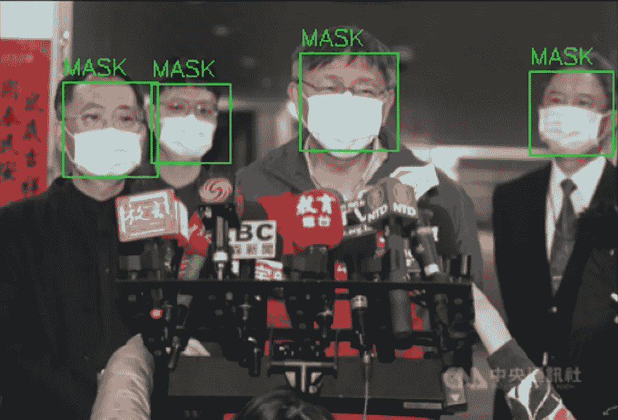

图片改编自[面罩检测| Kaggle](https://www.kaggle.com/datasets/andrewmvd/face-mask-detection)

T 转移学习是在几分钟内适应极其复杂的模型以获得极好结果的最佳方式。在这篇文章中，我将迁移学习应用于面具检测。

# 介绍

掩模检测是当今世界的一个相关问题。在写这篇文章的时候，欧洲的许多国家仍然强迫你在室内和公共交通工具上穿着它们。训练一个模型来检测是否戴了面具是一个有趣的问题，在这里我可以展示迁移学习的潜力。

从图片预测口罩佩戴是否正确涉及多个步骤。每个图像可以包含多个人，我们希望对每个人进行预测。问题的第一部分包括找到每张图像中的人脸，裁剪人脸，并准备将它们用作机器学习模型的输入。问题的第二部分是分类问题。被裁剪的面部被分为 3 类:“面具”、“无面具”、“面具佩戴不正确”。

# 数据

在整篇文章中，我使用了[面具检测| Kaggle](https://www.kaggle.com/datasets/andrewmvd/face-mask-detection) 数据集，这是一个公共数据集，包含 800 多张带面具的人的标签图像。

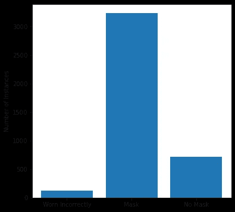

每个类别图像数量的条形图。作者图片

数据集被标记。每张图片都包含了每张脸的位置信息，以及这个人戴面具的方式是正确的、错误的还是根本没戴。绝大多数被贴标签的脸都戴着口罩。

# 检测人脸

问题的第一部分是检测图像中的人脸，对它们进行裁剪，并准备好用作分类器的输入。

为了检测人脸，我使用了 CV2 的预训练模型，该模型接收图像并返回图像中人脸的坐标。我尝试了他们的许多模型，但我发现“Haar cascode _ frontal face _ alt 2 . XML”最适合戴面具的人。

上面的代码加载 CV2 人脸模型，然后遍历每张图像，找到每张人脸，并将鲮鱼的位置添加到熊猫数据帧中。生成的数据框如下所示:

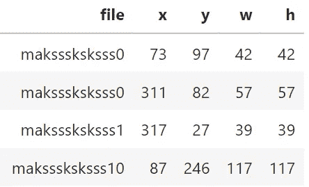

经过处理的图像和人脸的数据帧。作者图片

CV2 模型经过训练，可以在没有面具的情况下检测人脸，因此它们无法找到每张照片中的每张脸是正常的。众所周知，这些型号还会与不直接面对摄像机的人发生冲突。

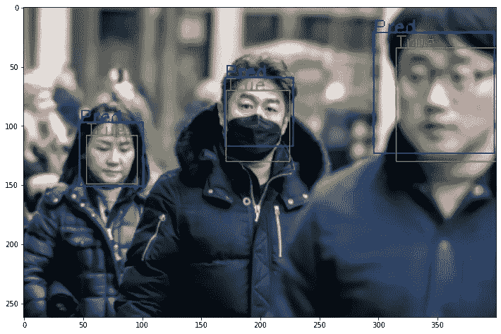

在随机图像中寻找人脸。图像改编自[面罩检测| Kaggle](https://www.kaggle.com/datasets/andrewmvd/face-mask-detection) 数据集

在上图中，绿色方块表示数据集中提供的每个面的位置标签。蓝色的是模型的预测。对于这张特定的图像，模型表现良好，检测到了所有三张脸。

为了验证面部的检测，我查看预测的中心，如果它在数据集中标记的正方形内，我认为预测是正确的。

该模型并不完美，它错过了大约 80%的标记人脸。

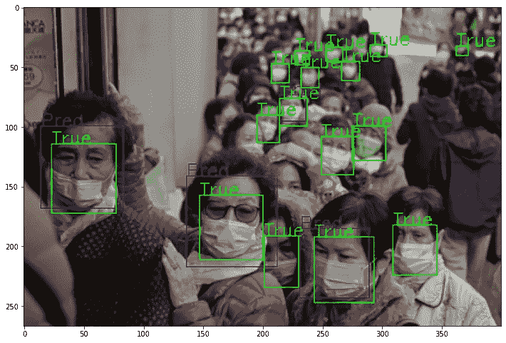

在样本图像中查找人脸。从[面罩检测| Kaggle](https://www.kaggle.com/datasets/andrewmvd/face-mask-detection) 数据集调整的图像

该模型被训练成仅检测正面人脸。在上图中，该模型仅检测到 16 张人脸中的 4 张。尽管性能很好，但我仍然会使用这个模型来检测人脸，我自己的训练超出了范围。

## 为分类器准备数据

一旦我们确定了每张图像中的人脸位置，我就可以裁剪图像并单独保存每张人脸。然后，在训练分类器之前，我可以重新缩放和整形图像，使它们都一致。

为了裁剪和保存每张脸，我使用了上面的代码。整形和归一化可以使用数据发生器来完成，该数据发生器在训练期间被馈送给神经网络。

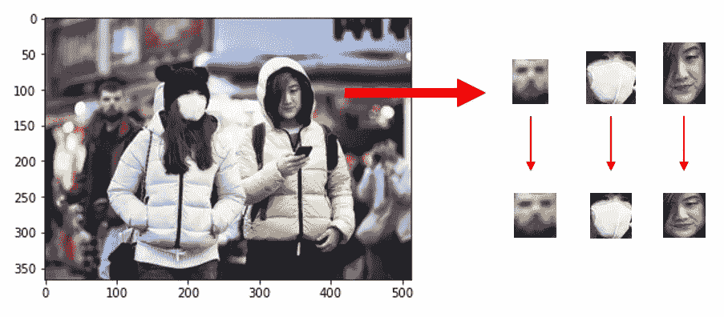

人脸面具检测的图像预处理流程。图片改编自[面具检测| Kaggle](https://www.kaggle.com/datasets/andrewmvd/face-mask-detection)

上面是预处理的图表。我首先使用 CV2 模型来定位面部并裁剪它们。然后我把它们调整到普通大小。在这之后，我还将数据标准化，以便神经网络更容易学习。

预处理图像的 9 个样本。图片改编自[面具检测| Kaggle](https://www.kaggle.com/datasets/andrewmvd/face-mask-detection)

上述 9 幅图像是分类器的示例输入。该模型将尝试将这些图像中的每一个分类为“面具”、“无面具”或“不正确佩戴”。

# 面部分类

一旦图像得到处理，我们就可以训练一个分类器来预测每张图像显示的是一个人正确戴着面具、不正确戴着面具还是根本没戴面具。

在图像上训练分类器可能非常昂贵，尤其是为了获得良好的性能。这就是我使用迁移学习的原因:

## 迁移学习

迁移学习包括采用预先训练好的模型，并根据我们自己的应用进行调整。迁移学习对图像数据模型特别有效。

在用于图像分类的迁移学习中使用的最流行的模型是为 ImageNet 竞赛训练的模型。ImageNet 是一项竞赛，由大公司训练极其庞大的模型，将数百万张图像中的对象分类到 1000 个类别中。

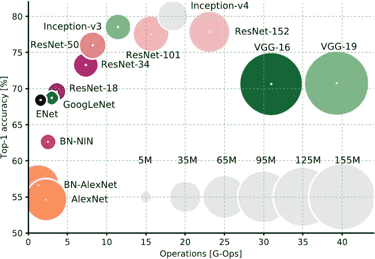

不同架构的性能。下图 [CC BY 4.0](https://creativecommons.org/licenses/by/4.0/) 来自[深度学习讲座](https://www.youtube.com/watch?v=p-_Stl0t3kU&list=PLpOGQvPCDQzvgpD3S0vTy7bJe2pf_yJFj&index=1)【1】

上图显示了模型的性能与其训练成本的关系。我希望在没有 GPU 的本地机器上训练这些，因此我选择了 ResNet-50(图片左上角的粉红色)。该模型取得了很好的性能，训练效率很高。

ResNet-50 是一个真正的巨型模型。它包含超过 2300 万个参数。当它在 ImageNet 比赛时，它被训练将图像分类成 1000 个类别，然而，我的分类问题只包含 3 个类别(面具，没有面具，面具佩戴不当)。因此，我们必须调整模型，以便能够在这个问题中使用它。

所以为了让这个模型适应我的应用，我去掉了神经网络的最后一层，然后加上我自己的；这次输出大小为 3 而不是 1000(因为我想要 3 个类别)。然后，我可以训练这最后一层，而不接触其他层的任何重量。用 2300 万个参数训练整个模型会很昂贵，但因为我只训练最后一层，所以这样做很便宜。

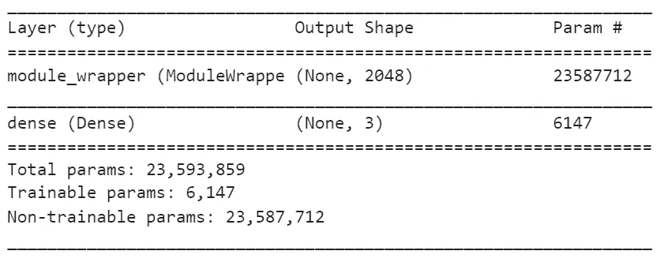

模型总结。作者图片

在上面的模型摘要中，您可以看到该模型有超过 2300 万个不可训练的参数(为 ImageNet 训练的参数)。我正在训练的唯一一层是包含 6147 个参数的最终层。

在这些深度神经网络中，大多数模型试图在输入图像中找到重要的特征，如形状、纹理等。通过改变最后一层，我们使用所有的信息，但只改变最后一部分，使其对我们的应用有用。

在上面的代码中，我使用 Keras 加载了预训练的 ResNet50。模型中唯一可训练的层是最后一层。然后，我可以像训练任何其他神经网络一样训练该模型。

## 培训和结果

我对最后一层进行了 30 次训练，在没有 GPU 的情况下花了大约 10 分钟。该模型达到了 90%以上的准确率。

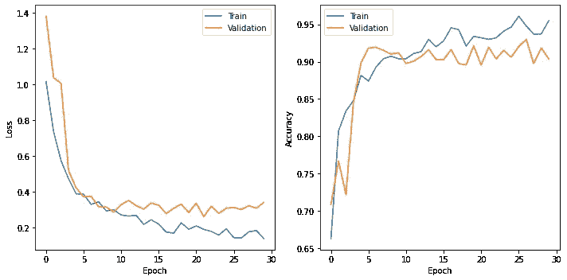

训练和验证在训练期间每个时期的损失和准确性。作者图片

正如你在上面看到的，仅仅过了 30 个时期，这个模型似乎就收敛到了一个好的性能。如果没有迁移学习，这将需要相当长的时间。

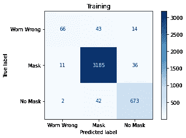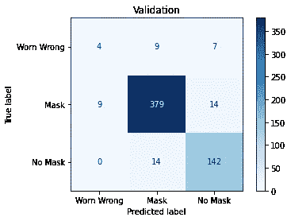

训练模型在训练数据集和验证数据集上的性能。作者图片

以上是用于训练和验证的混淆矩阵。混乱矩阵可以让你看到模型哪里出错了。验证数据集由前面部分提到的 CV2 模型提取的人脸组成。该模型很好地标记了戴面具和不戴面具的人，在这些方面达到了 90%以上的准确率和召回率。这个模型很难正确地给戴错面具的人贴上标签。

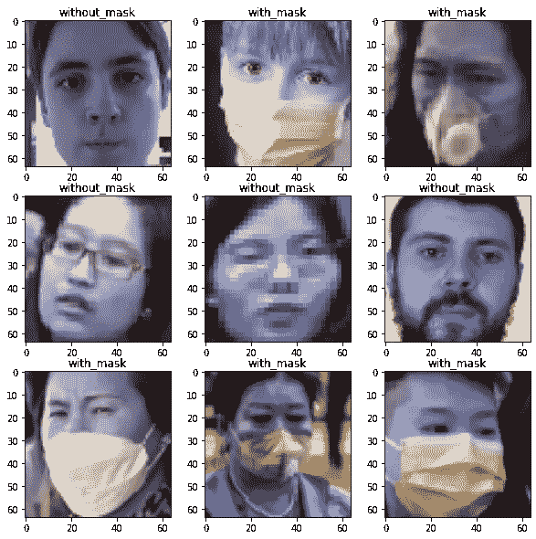

ResNet-50 对口罩分类的预测。图片改编自[面罩检测| Kaggle](https://www.kaggle.com/datasets/andrewmvd/face-mask-detection)

# 结合两种模式

我们现在可以从图像中提取人脸，并对其进行预测。让我们来看看模型的表现:

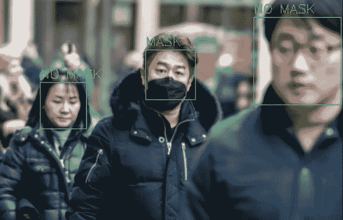

迁移学习模型预测。图片改编自[面具检测| Kaggle](https://www.kaggle.com/datasets/andrewmvd/face-mask-detection)

## 面向前方的预测

当图像的主体面对摄像机时，该模型表现得非常好。然而，当对象很远并且没有看着相机时，模型无法检测到任何人脸。

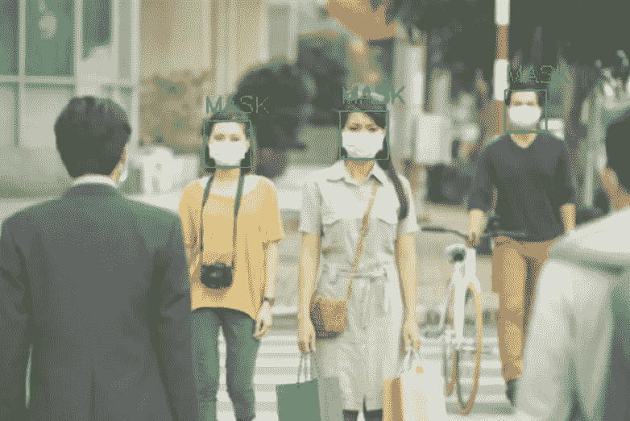

模特在正面人物身上表现很好。图片改编自[面具检测| Kaggle](https://www.kaggle.com/datasets/andrewmvd/face-mask-detection)

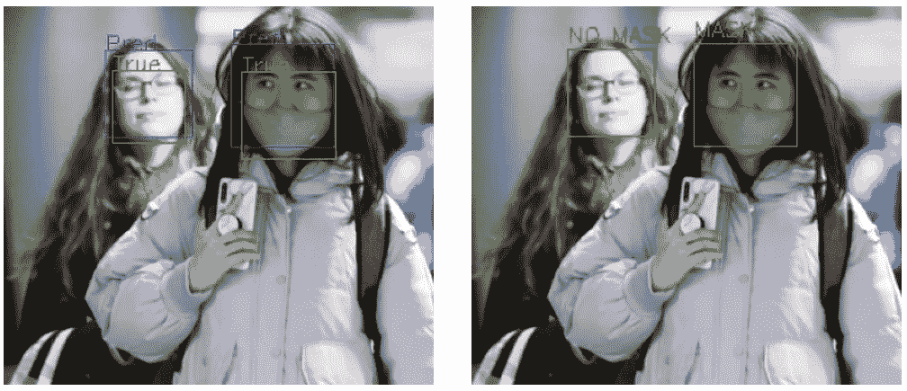

模特在正面人物身上表现很好。图片改编自[面具检测| Kaggle](https://www.kaggle.com/datasets/andrewmvd/face-mask-detection)

该模型在上面的图像中表现很好，因为图像中的人大致面对摄像机。在左边你可以看到数据的真实标签，在右边你可以看到分类器的预测。

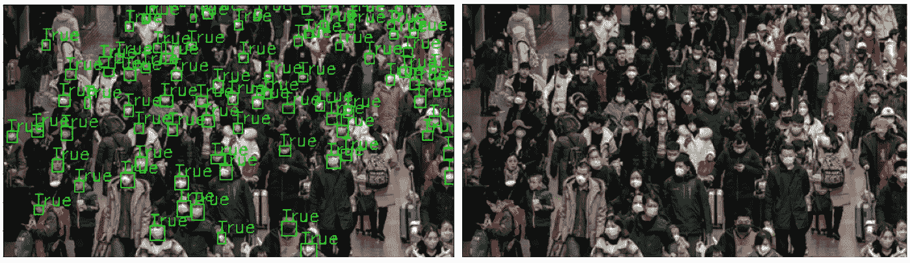

当人们不面对镜头时，模型表现不佳。图片改编自[面具检测| Kaggle](https://www.kaggle.com/datasets/andrewmvd/face-mask-detection)

然而，当人们不面对相机或离得太远时，该模型无法识别一张脸。

## 面具佩戴不当

该模型特别擅长检测戴面具和不戴面具的情况，但很难检测戴错面具的情况。

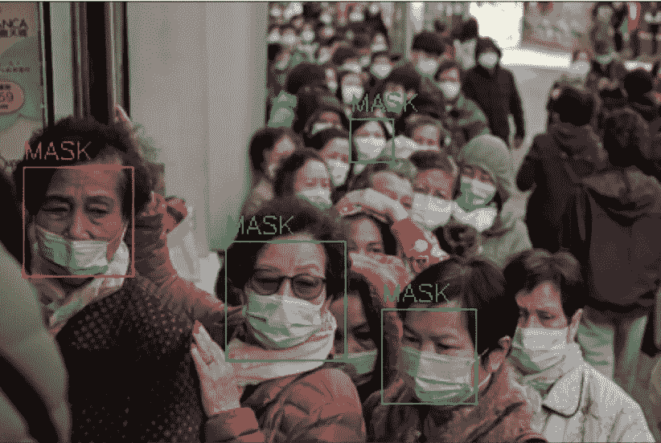

模特努力发现戴错的面具。图像改编自[面罩检测| Kaggle](https://www.kaggle.com/datasets/andrewmvd/face-mask-detection)

在上面的图片中，左边的女人把她的面具放在鼻子下面，但是模型仍然把它归类为面具。

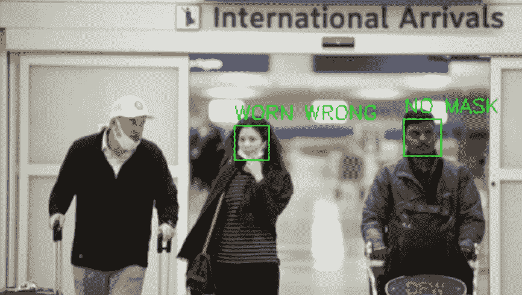

模特努力发现戴错的面具。图像改编自[面罩检测| Kaggle](https://www.kaggle.com/datasets/andrewmvd/face-mask-detection)

在上面的图像中，模型正确地识别出戴着错误面具的女人，但是没有看到左边的男人，因为他没有面对镜头。

# 结论

迁移学习可以让您立即训练出复杂且性能良好的模型。在这篇文章中，我展示了我用来解决面具检测问题的管道。这个问题包括两个关键部分，在第一部分中，我希望检测人们的面部并对它们进行预处理，以便它们可以用作分类器的输入。在第二阶段，我使用迁移学习训练一个分类器来预测这个人是否戴着面具。

模型训练结果令人满意。该分类器运行良好，并且可以检测面具是否被正确佩戴。人脸检测可以改进，它检测到的人脸大部分是正确的，但它很难找到每张图像中的所有人脸。

## 潜在风险和道德问题

在处理面部识别和其他个人身份信息时，会涉及风险和道德问题。在这些项目中，尊重人们的隐私权是很重要的。我可能会在未来的文章中探讨这个问题的一个解决方案，就是在机器学习模型中使用差分隐私。

在为屏蔽检测模型选择合适的应用时，应该考虑伦理问题。一个潜在的用例可能是计算在健身房正确佩戴口罩的人的百分比，而不是对佩戴不当的人进行罚款。对某人罚款将涉及从图像中确定此人的身份，这引起了伦理问题，因为这些数据可能被恶意使用。正确选择用例是使这些模型安全和合乎道德的关键。

## 支持我

希望这对你有所帮助，如果你喜欢，你可以 [**关注我！**](https://medium.com/@diegounzuetaruedas)

你也可以成为 [**中级会员**](https://diegounzuetaruedas.medium.com/membership) 使用我的推荐链接，获得我所有的文章和更多:[https://diegounzuetaruedas.medium.com/membership](https://diegounzuetaruedas.medium.com/membership)

## 你可能喜欢的其他文章

[无监督学习:K 均值聚类](/unsupervised-learning-k-means-clustering-6fd72393573c)

[数据可视化理论](/data-visualization-theory-an-introduction-a077c0d80498)

## 参考

[1][https://www . semantic scholar . org/paper/An-Analysis-of-Deep-Neural-Network-Models-for-Canziani-Paszke/9a 786 D1 ECF 77 dfba 3459 a 83 CD 3 fa 0 f 1781 BBC ba 4](https://lme.tf.fau.de/lecture-notes/lecture-notes-dl/lecture-notes-in-deep-learning-architectures-part-4/)