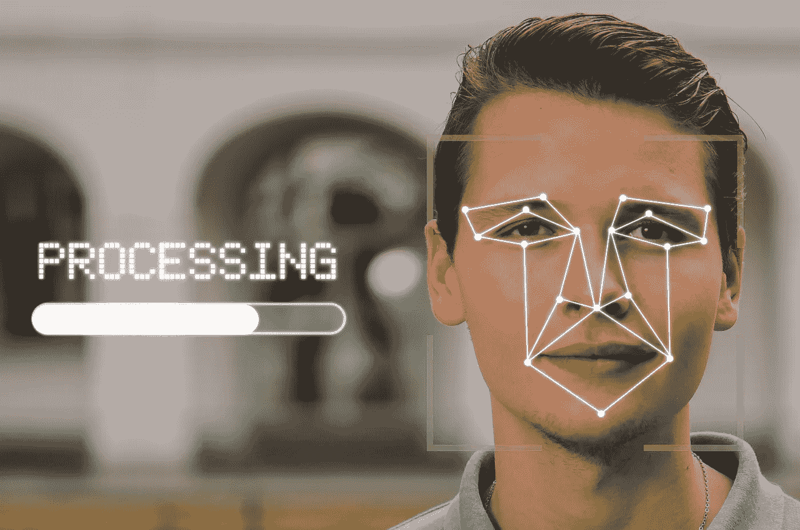
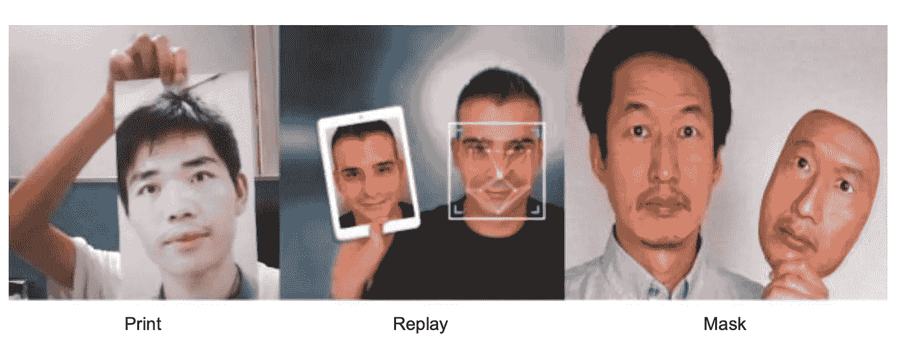
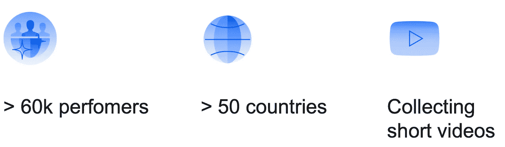
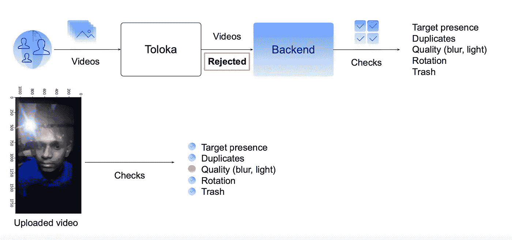
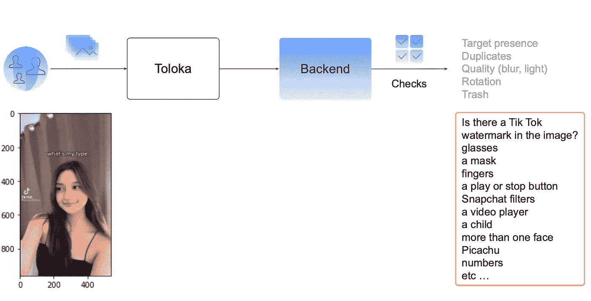
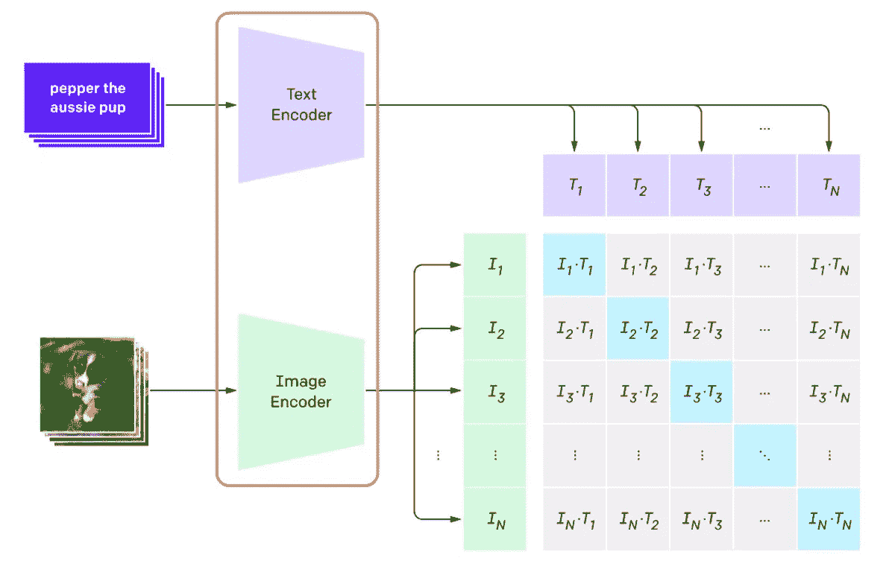
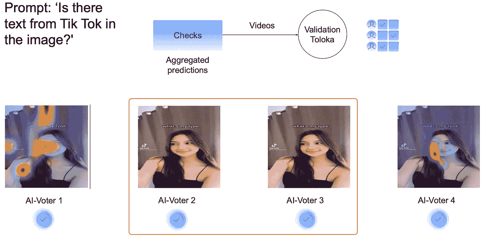

# 基于多模态神经网络的人工智能辅助标注

> 原文：<https://towardsdatascience.com/ai-assisted-annotation-with-multimodal-neural-networks-1c69f5a4017c>

# 基于多模态神经网络的人工智能辅助标注

## 反垃圾邮件人脸检测项目的真实数据验证示例

图片由 [T](https://pixabay.com/users/stokpic-692575/?utm_source=link-attribution&utm_medium=referral&utm_campaign=image&utm_content=600497) umisu 来自 [Pixabay](https://pixabay.com/?utm_source=link-attribution&utm_medium=referral&utm_campaign=image&utm_content=600497)

**简介**

近年来，人们对人脸识别系统进行了大量的研究。因此，这一领域最先进的算法已经达到了相当高的精度。足够体面，可以跨不同行业实施解决方案。

人脸识别系统现在已经成为我们日常生活的一部分，帮助我们完成解锁手机等基本任务。然而，这项技术激起了人们对隐私的担忧，以及政府和大型组织对其使用的争议。

关于人脸识别系统的挑战之一是它们容易受到欺诈攻击。在本文中，您将看到如何为一个人脸反垃圾邮件项目收集和验证数据。

**欺骗攻击**

有不同类型的欺骗攻击可以用来欺骗人脸识别系统。最常见的包括打印的照片，重播的视频，或者一个戴面具的人。

作者照片

那么，我们如何收集数据来训练反垃圾邮件模型呢？一种快速而经济的收集数据的方式是使用众包平台，如 [Toloka](https://toloka.ai/) 。

为了这个反垃圾项目的目的，Toloka 被用来收集 3-5 秒钟的人脸视频。来自 50 多个国家的 60，000 多名表演者提交了视频。

作者照片

在数据收集阶段之后，视频被分解成单独的照片，然后发送进行数据验证。

**用简单的人工神经网络验证收集的数据**

作者照片

最简单的验证形式包括基本检查，如寻找重复、模糊、照明或目标是否确实出现在图片中。然而，一些照片需要更先进的技术来评估照片的质量是否可以接受。

**使用多模态神经网络进行高级验证**

作者照片

更高级的验证检查点包括检查图像中是否有 Tik Tok 标记，或者该人是否戴着面具或眼镜。也许图片上有水印图像。这种情况需要专门的算法，通常需要特定的训练来发现这些特征。一种替代方法是使用多模态神经网络，如 CLIP，这正是在这个项目中使用的方法。

**什么是 CLIP，我们如何使用它来验证图像？**

[CLIP](https://openai.com/blog/clip/) (对比语言——图像预训练)是一种从自然语言监督中学习视觉概念的模型。然后，它可以应用于任何标准的视觉分类任务，如 ImageNet 分类。它在 ImageNet 数据上实现了与 ResNet100 相同的准确性，尽管它没有看到来自它的任何示例。该模型根据图像及其描述进行训练，如下图所示。

剪辑模型表示，作者照片。

因为模型能够预测看不见的类，我们可以问这样的问题“图像中有来自抖音的文本吗？”或者“图像里有面具吗？”剪辑结果帮助我们识别图像中的某些元素，而无需为我们想要检查的每个特征明确训练模型。

这就是在反垃圾邮件项目的图像集合中实现的内容。但是没有使用一个剪辑模型，而是使用了它的几个变体，然后将结果汇总。

作者照片

上图显示了提示“*图像*中有来自抖音的文本吗？”的剪辑聚合的可视化效果基于综合决策，图像被接受或拒绝用于项目，并继续进行下一个检查，例如“*图像中有掩模吗？*“一旦通过所有检查，该项目将被接受。

**总结**

在本文中，我们研究了如何使用简单的人工神经网络和更复杂的多模态神经网络(如 CLIP)来收集和验证人脸识别项目的数据。更多细节，请看扎哈尔·帕什金的[演讲](https://www.youtube.com/watch?v=jJnyj0OH0lk)，他是 CFT[的计算机视觉工程师。此外，如果您想了解更多关于数据收集和数据验证流程的信息，请加入这个数据赋能社区](https://www.cft.ru/en)。

*PS:我正在 Medium 和*[***aboutdatablog.com***](https://www.aboutdatablog.com/)*上撰写深入浅出地解释基本数据科学概念的文章。你可以订阅我的* [***邮件列表***](https://medium.com/subscribe/@konkiewicz.m) *每次我写新文章都会收到通知。如果你还不是中等会员，你可以在这里加入***。**

*下面还有一些你可能喜欢的帖子:*

* [## 用户生成内容的审核渠道

### 欧洲科技巨头如何利用 Toloka 的人群来调节其内容

towardsdatascience.com](/moderation-pipeline-for-user-generated-content-59e7f3c320e0)  [## 机器翻译系统中的人在回路

### 使用众包评估机器翻译质量

towardsdatascience.com](/human-in-the-loop-in-machine-translation-systems-bdf3fe82bfa3)  [## 如何成功将大型数据集添加到 Google Drive

### 并在谷歌实验室中使用它们…

towardsdatascience.com](/how-to-successfully-add-large-data-sets-to-google-drive-130beb320f1a)*