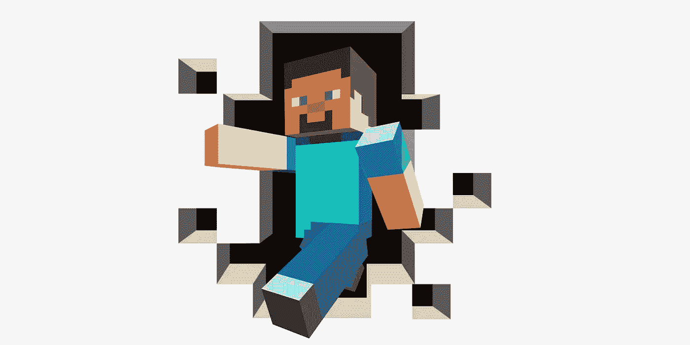
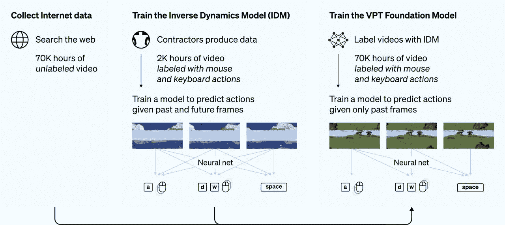

# 人工智能现在可以玩《我的世界》了——离环游世界又近了一步

> 原文：<https://towardsdatascience.com/ai-can-now-play-minecraft-and-is-a-step-closer-to-navigate-the-world-1f19cfe37ef>

## 开放式人工智能的开始

照片由摄影师 Gersamina Donnichi 拍摄

在语言处理([【GPT-3】](/gpt-3-a-complete-overview-190232eb25fd))和文本到图像生成( [DALL E 2](/dall-e-2-explained-the-promise-and-limitations-of-a-revolutionary-ai-3faf691be220) )方面建立了令人印象深刻的模型之后，OpenAI 现在面临着一个可以说是更大的挑战:开放式行动。在解决所谓的人工通用智能(AGI)的伟大任务中，他们意识到语言和视觉不是人工智能应该擅长的唯一领域。GPT-3 和 DALL E 2 在他们所做的事情上非常出色，但是尽管他们很强大，他们仍然被限制在他们虚拟世界的有限范围内。

Sharif Shameem 是 GPT 3 的早期测试者之一。他意识到 GPT-3 可以被提示解决编码任务——这导致 OpenAI 最终开发了 Codex，现在嵌入到 [GitHub Copilot](/github-copilot-a-new-generation-of-ai-programmers-327e3c7ef3ae) 中。他尝试了其他方法让 GPT 3 号站到了边上。其中一项任务是让 GPT 3 号在沃尔玛买一对苹果平板电脑。尽管 GPT 3 号走得相当远，但它无法成功完成指定的任务。语言是一个强大的工具，但它不是绝对的。

GPT 3 号失败了，因为它试图做的事情与一种特殊的能力有关。就像操作计算机和——保持距离——在现实世界中导航一样，在互联网上搜索是一种内在的开放式活动，需要一种当前人工智能所缺乏的智能形式。这就是 OpenAI 现在试图解决的问题，他们已经开始通过模仿人类来教一个 [AI 扮演《我的世界》](https://openai.com/blog/vpt/)。

# VPT:开放式学习的开端

《我的世界》是一个开放世界的游戏。这意味着玩家可以做许多不同的事情，执行许多不同的动作，而不必遵循预先定义的路径。它也特别容易玩和理解，这当然有助于使它成为目前世界上最受欢迎的游戏。

这些特点使它成为完美的候选人。YouTube 和其他平台上记录了成千上万的游戏时间。这是一个等待开发的大量训练数据。然而，这些数据集并没有被贴上人类玩家懒得解释*如何*的标签。他们只展示了*什么*。如果一个玩家在《我的世界》建了一座房子，你会看到他在做什么——动作——而不是他怎么做的——命令。

OpenAI 几天前在它的[博客](https://openai.com/blog/vpt/)(和[论文](https://cdn.openai.com/vpt/Paper.pdf))中展示了它的解决方案。视频预训练(VPT)，如其名，是一种“半监督模仿学习方法”为了充分利用现有数据，研究人员将学习过程分为两步(他们证明这种方法比单一过程产生更好的结果)。首先，他们在一个小型数据集(2K 小时的《我的世界》视频)中训练了一个名为逆动力学模型(IDM)的神经网络，该数据集带有动作命令标签。这个模型学习从“过去和未来的信息”中预测行动。

打个比方，这就像试图猜测视频中的一个动作，只看到开头和结尾，却看不到中间。了解行动的结果给 IDM 带来了现实世界中不存在的明显优势(即我们知道发生了什么，但不知道将会发生什么)。

第二，IDM 用于标记剩余的 70K 视频小时，并训练一个 VPT 基金会模型(注意:基金会模型这个术语在 AI 社区中仍然存在广泛的争论，并且没有被普遍接受为大型神经网络的默认命名)。完整的 VPT 神经网络然后可以学习使用较大的标记数据集作为训练数据来预测给定的过去帧的未来帧。这为 VPT 提供了一种能力，OpenAI 称之为“行为克隆”——通过看到动作来学习复制动作。

VPT 概述。信用: [OpenAI](https://openai.com/blog/vpt/)

使用这种新颖的方法，VPT 已经学会了在《我的世界》做一些人类玩家做的基本任务(例如，游泳、吃食物或狩猎)，这些任务在以前的解决方案如强化学习(RL)中是不可能的。开放式设置不提供 RL 模型所需的必要约束。例如，国际象棋或围棋已经被 RL 和搜索算法(例如 AlphaZero)的组合所掌握。这是可能的，只是因为设置和规则受到极大的限制。在国际象棋中奖励行动很容易，但在《我的世界》，或者就此而言，在现实世界中就不那么容易了。

VPT 可以通过特定任务的视频进行进一步微调，以指导模型学习复杂的动作，如建造房子所需的动作(这需要制作工具等)。OpenAI 还证明了 VPT 可以成功地用作 RL 方法的先验。VPT 像人类玩家一样“行动”，这使得它“对 RL 来说是一个更好的先验”(即，跟随人类的行动比使用随机行动作为先验更好，就像在 RL 中常见的那样)。

随着大型神经网络的出现，开源倡议在人工智能中的重要性日益增加，作为对开源倡议的认可，OpenAI 决定开放标记的数据、代码和权重，以帮助对这种方法的进一步研究。

# VPT 与人类智慧

VPT 是开放式人工智能代理向前迈出的重要一步。它可以超越强化学习，在过于复杂的环境中定义合理的先验，建立具体的奖励，并建立足够好的模拟器来进行 RL 模型所需的无数模拟。

然而，澄清这一新范式仍然远远没有为人工智能提供类似人类的智能是很重要的。VPT 和我们之间的这三个重要差异可以凸显出我们距离 OpenAI 的 AGI 之梦有多远。

## 模仿 vs 原始动作

众所周知，在认知科学中，婴儿不仅通过观察来学习，还通过模仿来体现他们对他人行为的感知。作为群居动物，我们从很小的时候就在与他人的互动中成长。VPT 在这方面向前迈出了一步。行为克隆恰恰在于复制一个基于动作的过程，并不断重复，直到学会为止。尽管如此，这与 GPT-3 预测下一个令牌的能力没有太大区别，因为它给出了前一个令牌的历史。

虽然模仿是人类早期认知发展的关键，但我们很快就开始自己尝试。我们以独特的方式行动，因为与 VPT 相反，我们有一个游乐场，可以让我们边行动边学习。支配大脑的反馈过程总是接受新信息来更新我们的世界模型。如果一个蹒跚学步的孩子建造了一座砖砌的塔，并推着它直到砖块落下，她将会学到一些关于这个世界的新东西。VPT 在任何意义上都做不到这一点。

## **虚拟世界 vs 现实世界**

VPT 解决开放式虚拟行动问题的方法和自动驾驶汽车解决受约束的现实世界行动问题的方法有一些相似之处。两者都在处理超越感知或语言的行动领域。而且两者都极其有限。自动驾驶汽车——除了没有准备好——旨在以非常具体的目标作为动力来导航世界:从 A 到 B，不接触任何东西，遵守交通规则。虽然如果可能的话非常有用，但它远不及人类驾驭世界的能力。

VPT 驾驭《我的世界》世界的能力同样无法模仿人类的行为。即使视频游戏比国际象棋和围棋复杂得多，但与现实世界相比，它仍然有很大的局限性。VPT 已经学会了一些命令，以及这些命令的有序组合如何导致连贯的行动(尽管连贯是由我们而不是系统本身赋予的)。但是现实世界不是简单的命令就能解决的。我们的大脑使用一套复杂的——也不是完全理解的——过程来处理世界发送的多模态感知，并通过规划和决策将它们转化为行动。这可能不仅仅是规模的问题。我们可能需要一个质量上截然不同的范式来实现我们现在所处的 AGI。

## **预测 vs 理解**

人类对世界的理解很大一部分来自于行动和探索。虽然 VPT 在一个开放的环境中行动，这使它与 GPT-3 或达尔-2 处于不同的类别，但它仍然是一台预测机器。VPT 可以在《我的世界》建房子或者钻石斧子，但是它仍然不知道为什么要这么做。它已经“看到”人类在做这件事，但还不知道这个动作的意义。考虑到人类在游戏中的目标和目的，这有什么关系呢？

视频数据集中人类动作背后的目的和意图隐藏在命令之外。当人类玩游戏或者在世界上导航时，总会有一个更大的计划，这是无法通过观察单独的甚至后续的行动来了解的。VPT 不能进入那个计划。玩家在《我的世界》建造房子，不仅仅是因为他们可以，而是为了有一个避难所度过夜晚，也许以后可以升级成更大的东西。他们用金刚石材料改进工具，以防止它们破裂。如果 VPT 直接去制造一把钻石斧子，那并不是因为它知道其他类型的低质量工具最终会失败。动机和意图对于人类的计划和行动至关重要。我们所做的一切都不是从这些中抽象出来的，而 VPT 缺乏这些。

OpenAI 一直在建设通往它热爱的 AGI 的道路。每一步都值得分析和审视，但我们离那个目标还很远。

*订阅* [**算法桥**](https://thealgorithmicbridge.substack.com/) *。弥合算法和人之间的鸿沟。关于与你生活相关的人工智能的时事通讯。*

*您也可以直接支持我在 Medium 上的工作，并通过使用我的推荐链接* [**这里**](https://albertoromgar.medium.com/membership) 成为会员来获得无限制的访问权限！ *:)*