# 人工智能聊天机器人让一切变得简单，礼貌

> 原文：<https://towardsdatascience.com/ai-chatbots-made-easy-courtesy-rasa-8ecdc2853e66>

## 使用 RASA & Python 构建板球聊天机器人的分步指南

在本文中，我们将使用 RASA 框架构建一个简单的板球聊天机器人。本文的重点是理解 RASA 的基础知识，并展示一个人可以多快地开始使用一个工作机器人。


图片:来自 [Pixabay](https://pixabay.com/illustrations/chatbot-bot-assistant-support-icon-4071274/)

# RASA 是什么&为什么

## 什么是 RASA？

RASA 是一个开源工具，它使用自然语言理解来开发基于人工智能的聊天机器人。它提供了一个框架，可以用最少的编码技巧创建聊天机器人。RASA 允许用户通过各种配置来训练和调整模型。它的易用性使其成为全球开发者创建行业级聊天机器人的热门选择。

## 为什么是拉莎？

*   这是一个开源的免费框架
*   开始很容易
*   构建一个基本的机器人不需要预先的编码知识

# RASA 框架

任何聊天机器人都必须执行两个主要活动，首先必须理解用户想要说什么，然后为用户提供有意义的响应。RASA 使用 RASA NLU 和 RASA 核心来实现这一目标。

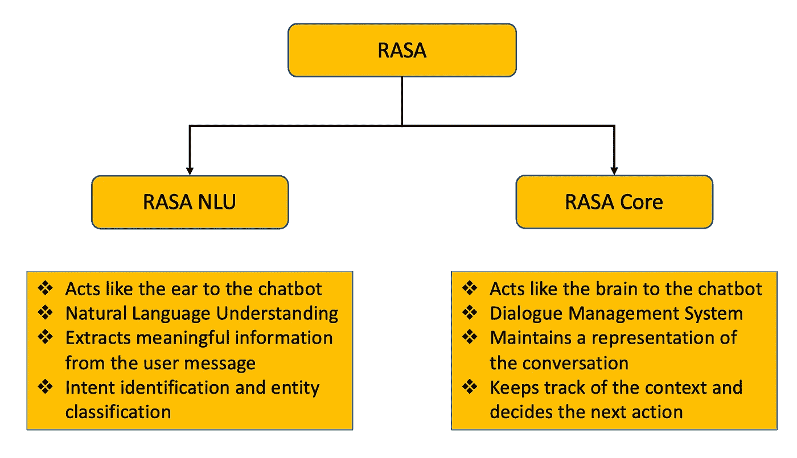

**拉萨 NLU &拉萨核心**(图片由作者提供)

# 理解术语

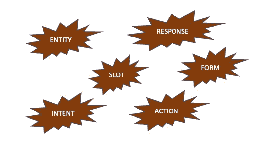

**常用术语**(图片由作者提供)

# 目的

*   意图是从消息中识别用户的意图
*   意图分类为用户消息分配一个标签

## 实体

*   实体抽取从用户消息中提取有用的信息
*   在训练数据中处理常见的拼写错误和同义词

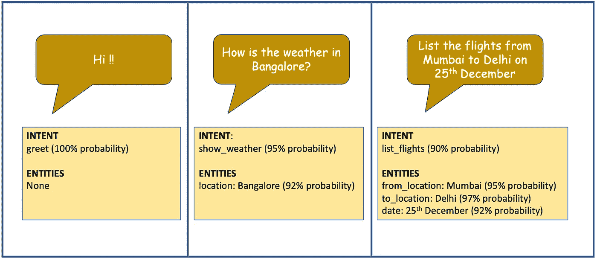

**样本意图识别&实体分类**(图片由作者提供)

## 反应

*   响应或模板是机器人响应的消息
*   可以为单个响应类型定义不同的文本消息，这样机器人就不会向用户发送重复的消息

## 行为

*   动作定义了机器人如何响应用户。它可能是一个简单的文本响应，也可能是向用户提出一个问题
*   自定义操作也可以用一段代码来定义。它通常用于文件查找或进行外部 API 调用

## 狭槽

*   插槽就像机器人中的内存位置
*   它用于存储对话期间需要的字段

## 形式

*   表单用于从用户处收集多个数据点
*   它使用插槽来存储用户输入

# **使用 RASA 构建聊天机器人的步骤**

1.  安装和初始化
2.  创建用户流
3.  从外部 API 读取
4.  构建用户旅程
5.  使用 CLI 进行培训和测试
6.  UI 集成

在这个例子中，我们将构建一个基本的 cricket chatbot，它连接到一个外部 URL 来获取实时 cricket 数据。

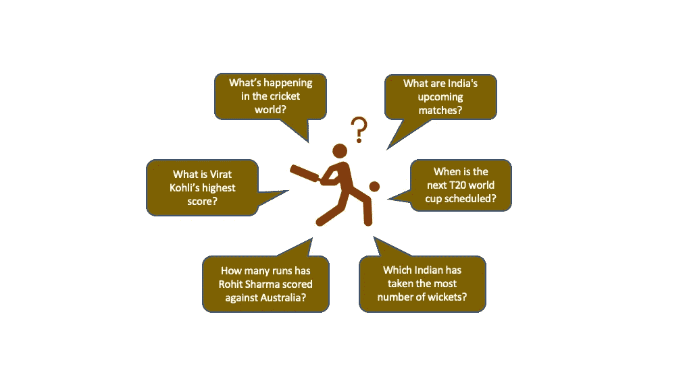

**蟋蟀聊天机器人**(图片由作者提供)

# 步骤 1:安装和初始化

建议在单独的虚拟环境中安装 rasa，因为它有许多依赖项。使用 pip 命令安装 rasa。

```
pip install rasa# Check the rasa version
rasa --version
```

本教程中使用了 rasa 3.1.0。现在 rasa 已经安装好了，我们可以开始了。Rasa 提供了一个基本的样例项目。在新的项目文件夹中，运行下面的命令来设置项目。

```
rasa init
```

这将创建一个样例项目，其中包含运行一个基本聊天机器人所需的所有文件。初始化后的目录结构如下所示。

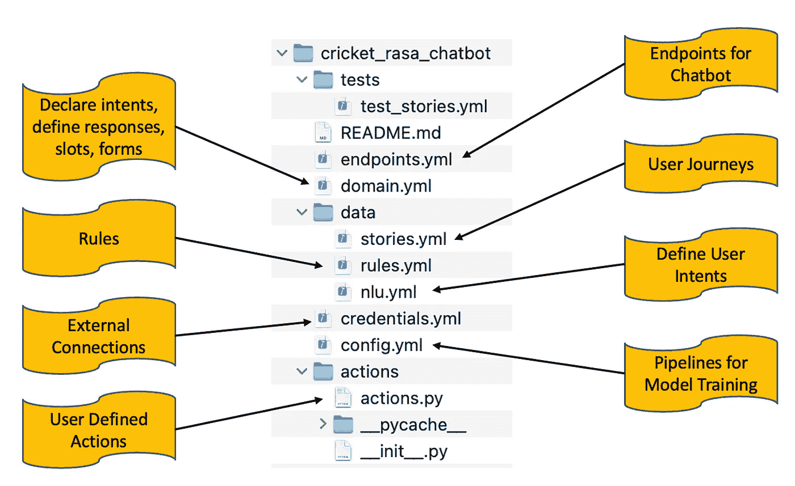

**默认 RASA 目录结构**(图片由作者提供)

# 步骤 2:创建用户流

对于用户流，有两个主要文件需要更新——nlu . yml 和 domain.yml

nlu.yml 文件包含用户可能输入的所有可能的消息。用户可以为该文件中捕获的相同意图提供不同形式的输入。

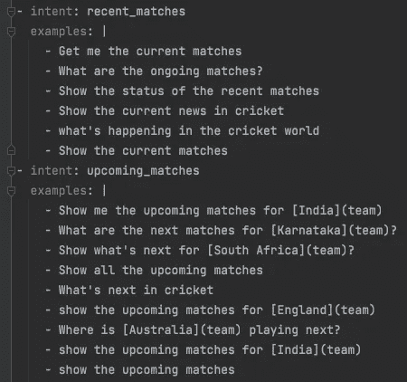

**板球聊天机器人**nlu . yml 的样本内容(图片由作者提供)

domain.yml 文件类似于主文件，包含有关用户意图、机器人响应、插槽、表单、动作等信息。

**板球聊天机器人**的示例 domain.yml

# 步骤 3:从外部 API 读取

如果需要任何外部 API 调用来获取数据，这是一个可选步骤。

在示例 cricket chatbot 中，使用 API 从外部源获取 cricket 数据。

actions.py 文件用于与外部 API 进行交互。在板球聊天机器人中，我们将使用 cricketdata api 服务。这项服务每天提供 100 个免费请求，足以构建聊天机器人的演示版。

在[cricketdata.org](https://cricketdata.org/)注册获取 api 密钥。使用 actions.py 文件中的 api 键连接到 url 并获取数据。

这个板球聊天机器人定义了两个动作。一个动作是获取所有最近举行的比赛的结果。另一个动作是获取即将到来的比赛的列表，要么是为插槽中设置的特定球队，要么是为所有球队。

**定义了使用外部 api 获取最近匹配结果的操作**

**定义了使用外部 api 获取即将到来的匹配的动作**

获取数据的代码更新后，需要启动 actions 服务器，这样 chatbot 就可以调用获取外部数据所需的端点。默认情况下，操作服务器在端口 5055 上启动。

注意:应该在 endpoints.yml 文件中设置操作服务器 url

```
action_endpoint:
  url: "[http://localhost:5055/webhook](http://localhost:5055/webhook)"
```

现在用下面的命令在其中一个 shells 上启动操作服务器。

```
rasa run actions
```

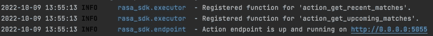

**为板球聊天机器人**定义的动作(图片由作者提供)

# 步骤 4:构建用户旅程

stories.yml 文件中更新了各种可能的用户旅程。开心和不开心的经历都可以更新。添加更多的故事将增强聊天机器人处理不同用户流的能力。

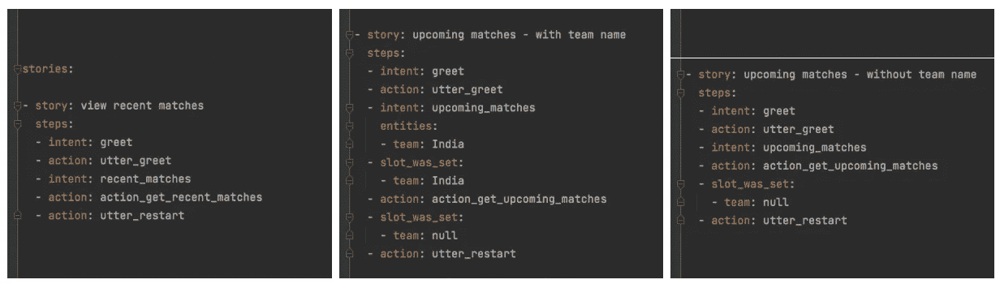

板球聊天机器人的示例故事(图片由作者提供)

# 步骤 5:使用 CLI 进行培训和测试

模型使用的组件和策略在 config.yml 文件中定义。如果该文件中未设置“管道”和“策略”, rasa 将使用默认模型来训练 NLU 和核心。

```
rasa train
```

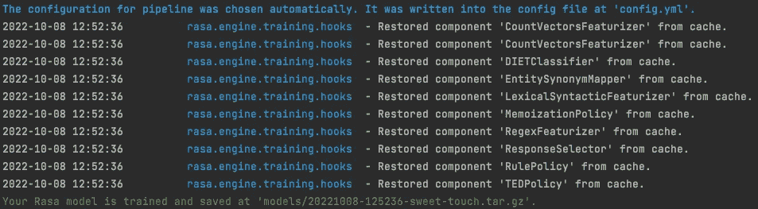

**使用默认组件的 rasa 训练**(图片由作者提供)

训练完成后，模型将存储在 models/文件夹中。既然模型已经训练好了，我们就可以测试聊天机器人了。要在命令行上运行 chatbot，请使用以下命令。

```
rasa shell
```

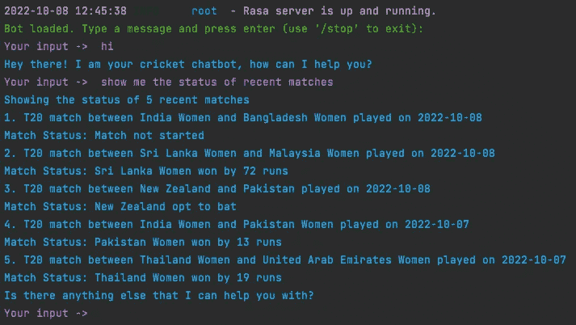

**shell 提示符下与机器人交互的示例**(图片由作者提供)

在任何时候使用/stop 退出机器人


**在 shell 提示符下停止 bot**(图片由作者提供)

# 步骤 6:用户界面集成

聊天机器人可以作为聊天工具集成到任何现有的网站上，或者可以与脸书、Slack、Twilio、Webex、Mattermost 等应用程序连接

对于这个例子中的板球聊天机器人，我们将使用 slack 与聊天机器人进行交互。如何配置 slack 的详细信息可在此处获得: [rasa — slack integration](https://rasa.com/docs/rasa/connectors/slack/)

由于 slack 将无法访问本地主机 url，因此使用 ngrok 来获取聊天机器人的公共 URL。设置 ngrok 的详细信息可在此处获得: [ngrok-setup](https://rasa.com/docs/rasa/messaging-and-voice-channels/#testing-channels-on-your-local-machine)

一旦 slack 和 cricket 聊天机器人之间建立了连接，就可以使用 slack 通道开始与机器人聊天。

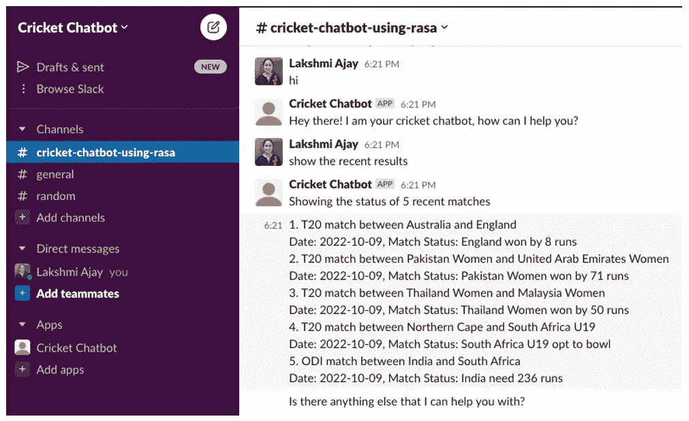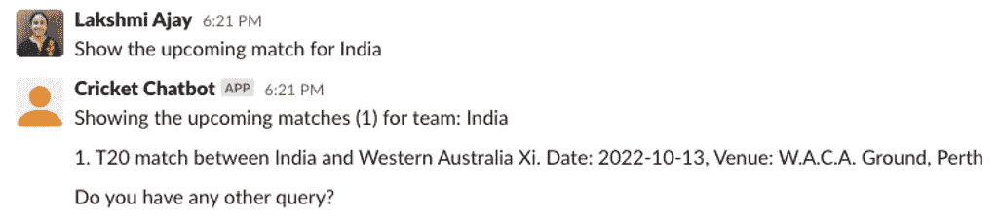

**聊天机器人集成到 slack 的样本**(图片由作者提供)

# RASA —附加组件

除了到目前为止解释的基本概念之外，RASA 中还有其他几个可用的特性。本节将介绍几个有趣的可用附件。

## 创作互动故事

创建故事的另一个选项是使用 rasa 交互模式。此选项可用于调试项目或添加新故事。

```
rasa interactive
```

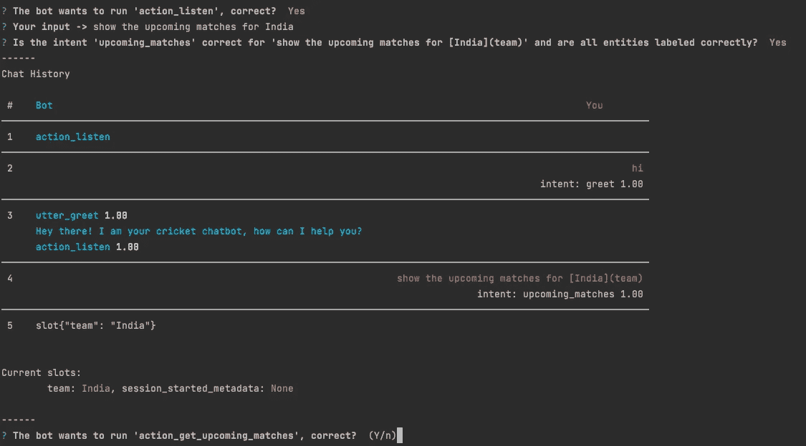

**与 rasa 互动构建故事的示例**(图片由作者提供)

一旦构建了用户场景，现有的配置文件就会用新的条目进行更新。

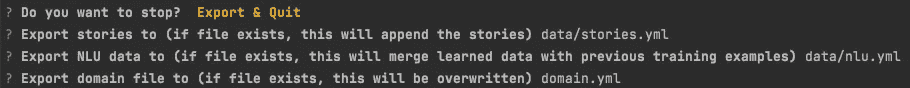

**使用 rasa interactive 更新配置文件**(图片由作者提供)

## 聊天可视化

默认情况下，当模型在交互模式下学习时，可以使用以下 URL 来可视化这些故事。

[http://localhost:5006/visualization . html](http://localhost:5006/visualization.html)

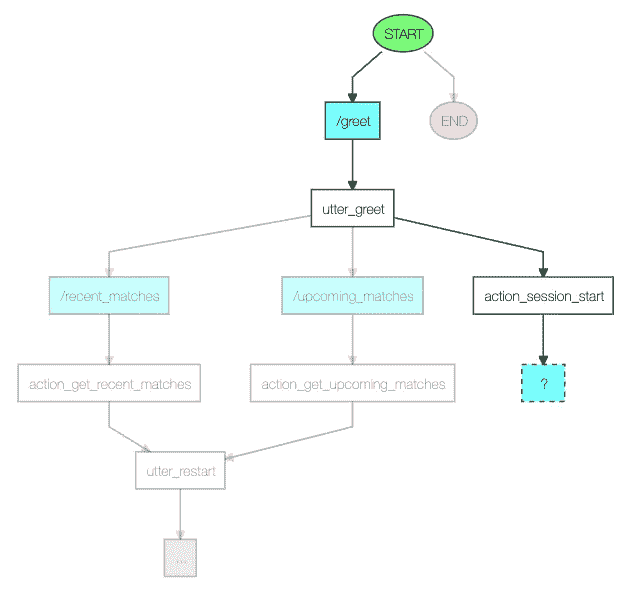

**以互动模式训练的故事样本**(图片由作者提供)

# 源代码

样本 cricket 聊天机器人的完整源代码可以通过以下链接获得: [cricket_rasa_chatbot](https://github.com/Lakshmi-1212/cricket_rasa_chatbot.git)

# 结论

RASA 非常容易设置，您可以快速开始使用自己的个性化聊天机器人。一旦开始，就不应该停止。这篇简短的教程仅仅触及了冰山一角。RASA 文档非常全面，非常方便用户使用。

点击[这里](https://rasa.com/docs/rasa/)探索&利用其他令人兴奋的可用功能。
聊天愉快！！:-)