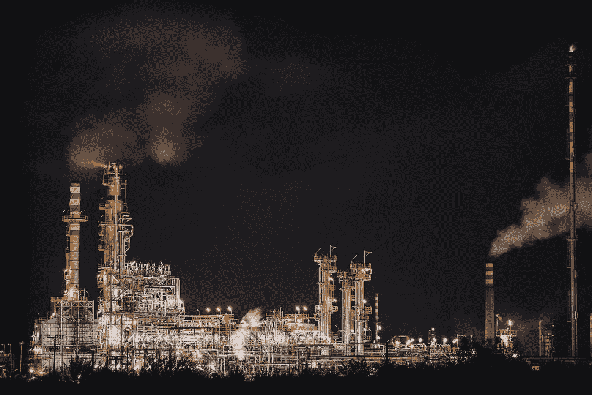
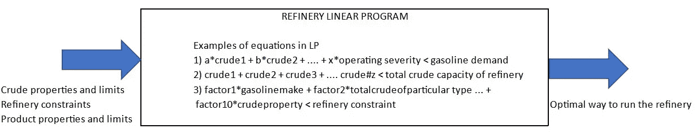
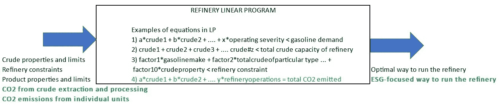

# 人工智能、ESG 和炼油:3 如何成为 1 的一部分

> 原文：<https://towardsdatascience.com/ai-esg-and-oil-refining-how-3-can-become-part-of-1-ac5577583168>

## 思考三个有趣世界的交集和对未来的展望

迈克·什切潘斯基在 [Unsplash](https://unsplash.com?utm_source=medium&utm_medium=referral) 上的照片

**TL/DR:随着炼油厂追踪他们的环境足迹，碳排放将成为运营计算的一部分，目前经济和物流因素在很大程度上扮演着唯一的角色。人工智能也将有助于减少碳足迹，但这里的情况更加微妙。**

在我职业生涯的第一个十年，我使用从基于 Excel 的计算到更复杂的机器学习等数据和工具来优化炼油和石化流程，现在我的工作重点是增加环境、社会和治理(ESG)要求对公司的影响。当考虑数据和分析在帮助公司满足这些要求方面所扮演的角色时，我想思考一下对环境绩效和数据的关注如何重塑炼油业。

我们将首先回顾炼油厂目前用于优化生产的方法，然后评估增加对“E”的审查会如何影响这种方法，最后开始探索数据和机器学习所起的作用。我要强调的是，这些主题非常复杂，值得单独撰写文章，而我主要选择突出前两个主题中的关键点。第三个——数据和机器学习扮演的角色——将是另一篇文章的主题。这篇文章包含了我的想法，而不是现在或以前的雇主的想法。

在开始之前，为什么要在这个考虑上投入这个时间和空间？因为 ESG 的日益突出意味着它正在理所当然地侵入运营考虑，因为公司意识到投资者对 ESG 表现的关注意味着他们需要修改传统方法以实现利润最大化。这不仅是维持它们声誉的关键，也是维持它们经济状况的关键，例如，通过降低借贷成本[正如 MSCI 链接文章中概述的那样。](https://www.msci.com/www/blog-posts/esg-and-the-cost-of-capital/01726513589)

H **炼油厂目前如何实现优化？**

照片由 [Tasos Mansour](https://unsplash.com/@mantasos?utm_source=medium&utm_medium=referral) 在 [Unsplash](https://unsplash.com?utm_source=medium&utm_medium=referral) 上拍摄

一个炼油厂寻求在约束条件下最大化输出产品和输入原料之间的利润。这是一个优化问题，目前由精炼厂使用一些精炼厂称为“LP”的商用软件来解决，因为这些优化问题过去很大程度上可以通过传统的线性规划来解决。本文将使用术语“LP will 将有以下具体输入:

*   输入原料通常包括炼油厂可能从世界任何地方购买的各种原油。这些原油具有不同的质量，影响炼油厂的限制、产品规格，其定价水平既反映了其独特的属性，也反映了更大的宏观经济因素
*   产品包括炼油厂出售的任何东西；这不仅包括汽油/柴油/喷气燃料等汽车燃料，还包括沥青等产品的组成部分。LP 将像对每种原油一样对每种产品定价
*   限制解空间的约束。这些包括原油的可获得性，例如，是否只有这么多原油可以通过炼油厂购买或加工？、需求限制以及精炼厂内的限制。这最后一类的例子很多，可应用于单个装置的生产能力、管道冶金、用于将原油转化为最终产品的化学催化剂的健康状况等。

炼油厂将根据上述限制优化产品、原油和其他运营成本之间的利润。这种数学优化之所以可能，是因为炼油厂的线性规划具有[数千个方程和变量](https://www.google.com/url?sa=t&rct=j&q=&esrc=s&source=web&cd=&ved=2ahUKEwicjNX_n7f4AhXeJ0QIHSPzDScQFnoECBEQAw&url=http%3A%2F%2Fhomsrefinery.sy%2Fuserfiles%2F7721X_13a.pdf&usg=AOvVaw3OvYlqwTY6xd0YsId-RutQ)，这些方程和变量将约束条件和产品与原油质量联系起来，因此线性规划可以准确预测原油选择和/或产品布局对炼油厂运营的影响。或者，如果设置了炼油厂约束条件，那么 LP 将在这些约束条件内找到原油选择和/或产品布局的最佳组合。

这些都是复杂的话题，网上有大量的参考资料——这里有一个[的例子](https://www.linkedin.com/pulse/downstream-refinery-planning-using-linear-programming-manmeet-khalsa)。就本文而言，可以说 LP 将根据供应链和经济变量的组合来选择原油和销售产品。下面是总结刚才讨论的概念的示意图:

图 1——传统炼油厂低压系统示意图

H

当使用其 LPs 分析原油选择和产品布局时，炼油厂将在所有 3 个范围内纳入其碳排放。

这里有一些背景:当我说碳排放时，我指的是二氧化碳(CO2)和甲烷(CH4)，当我谈到范围时，我指的是温室气体议定书(GHGP)将排放分配到范围 1、范围 2 和范围 3。关于这个话题，网上有太多的信息——这里有一个[例子](https://www.nationalgrid.com/stories/energy-explained/what-are-scope-1-2-3-carbon-emissions)——现在可以说，范围 1 的排放是记者拥有的资产的排放，范围 2 的排放是由购买的公用事业间接造成的，范围 3 的排放是由记者供应链中的其他实体间接造成的。

炼油厂如何将排放评估纳入 LP？有几种方法可以做到这一点，下面列出了其中的两种:

1.  为排放的 CO2 和 CH4 创造产品并指定负价格，因此 LP 将这些排放视为成本。通过这种方式，LP 将为那些导致高 CO2 排放和/或 CH4 排放的炼油厂操作、原油选择和/或产品布局分配成本。
2.  为炼油厂产生的排放设定一个上限作为约束

我应该强调，这些都是了不起的成就。正如这篇[工作帖子](https://careers.aramco.com/expat_us/job/Linear-Programs-%28LP%29-Modeling-Engineer/766661923/)中所述，推导出支持 LP 的正确方程是一项复杂的工作，需要正确的过程数据和对精炼操作的透彻了解。通过方程式将排放量与上述各种炼油厂输入量联系起来是非常困难的，必须小心谨慎地进行，以实现最佳的相关性，从而最大限度地提高预测的准确性。

也就是说，在炼油厂的 LP 中建立碳成本代表着成功地包含了链接中列出的[外部性](https://www.man.com/maninstitute/case-for-carbon-pricing)。**这是一个重大的转变，因为 LP——以及炼油厂的运营——现在将为原油选择、产品布局和炼油厂运营提供信息，从而最大限度地减少二氧化碳排放。**

这对炼油厂意味着什么？

*   这意味着原油选择不再纯粹是价格和炼油厂限制的函数——原油的“肮脏度”或其每桶排放量现在将成为炼油厂选择原油的一个因素，其确切影响程度与选择的价格相关。
*   落基山研究所的这篇文章包括一张图表，展示了各种类型原油的肮脏程度——虽然历史上更脏、更重的原油更便宜，运行更多这些原油一直是炼油厂投资的动机，但二氧化碳排放现在将影响这些类型的决策。*正确的原油选择有助于减少范围 1 排放和范围 3 类别 1(购买的货物和服务)排放。*
*   炼油厂以前将减排项目视为“必须做的事情”,预计不会产生任何经济价值，现在，测量实现的 CO2 减排并使用 LP 中相应的 CO2 价格可以为这些项目创造收入。炼油厂现在将清楚地看到*的经济价值，这是通过减少他们的范围 1 排放而认识到的。*

以下是炼油厂 LP 的新视图:

图 2 —包含 ESG 的炼油厂 LP

最后，机器学习如何融入到这个讨论中？

照片由 [h heyerlein](https://unsplash.com/@heyerlein?utm_source=medium&utm_medium=referral) 在 [Unsplash](https://unsplash.com?utm_source=medium&utm_medium=referral) 上拍摄

通过建立机器学习模型，利用资产和生产数据预测排放，并帮助避免炼油厂危险带来的安全风险，我相信人工智能是炼油厂了解和管理排放因素的工具包中的一个重要组成部分。

有许多资源涵盖了这一主题，以下来自[碳氢化合物处理](https://www.hydrocarbonprocessing.com/magazine/2019/january-2019/columns/ai-how-ai-and-machine-learning-benefit-refineries-and-petrochemical-plants)和[创新](https://www.innovyze.com/en-us/ai-for-intelligent-control-of-petrochemical-refineries)的文章仅提供了一些例子；这保证了我目前正在撰写的一篇文章，这篇文章回顾了一些令人兴奋的使用人工智能的机会，但是有一些警告集成了早期围绕 LP 和 ESG 的讨论。下面是一个概要，稍后将提供更多详细信息:

*   由于炼油厂传统上使用 LP 来优化运营，当要求利益相关者采用新的工具和技术时，例如由机器学习支持的基于网络的应用程序，将会遇到阻力。这将需要炼油厂 LP 用户和其他利益相关方的开放性和灵活性，以及教育和培训人员的变革管理计划，从而让他们有信心使用这些新工具。
*   虽然人工智能有可能改善炼油厂的成本和排放状况，但其高计算需求会在内部或云中造成大量电力使用——这篇谷歌人工智能博客[文章](https://ai.googleblog.com/2022/02/good-news-about-carbon-footprint-of.html)谈到了正在进行的努力，以最大限度地减少对范围 3 排放(范围 2，如果是内部存储)的影响。人工智能模型也占用存储空间，伴随着能源需求和排放。
*   炼油厂 LPs 还需要计算来运行用于求解 1000 个方程的算法，以达到最佳结果；这些计算资源需要电力。LP 型号可能高达数千兆字节(GB ),因此会产生自己的电力消耗和范围 3 排放足迹(范围 2，如果是内部存储)。

数据和分析在以 ESG 为中心的炼油厂中扮演的角色将是我下一篇文章的重点。