# 人工智能生成的艺术:如何开始生成你自己的图像

> 原文：<https://towardsdatascience.com/ai-generated-art-how-to-get-started-with-generating-your-own-images-821bc130fef4>

## DALL E2、中途和稳定扩散的非技术性比较

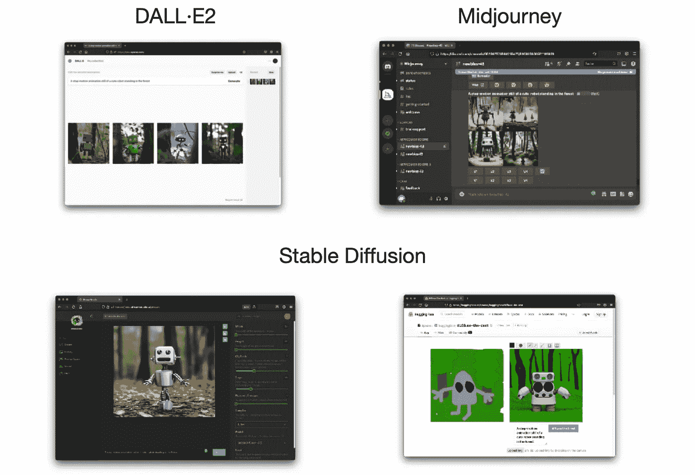

作者图片

如果你没有生活在岩石下，你可能已经看到人工智能(AI)生成的图像到处出现。这些图像通常是用“文本到图像”生成模型生成的。也就是说，你输入一个文本描述(“提示”)，几分钟后模型就会生成一个或多个描述你的提示的图像(“生成”)。

> 也就是说，你输入一个文本描述(“提示”)，几分钟后模型就会生成一个或多个描述你的提示的图像(“生成”)。

在撰写本文时，三个最受欢迎的模型是[稳定扩散](https://colab.research.google.com/github/huggingface/notebooks/blob/main/diffusers/stable_diffusion.ipynb)、[中途](https://www.midjourney.com/)和[达尔 E2](https://openai.com/dall-e-2/) 。

在本文中，我们将从以下方面比较这三种模型:

*   如何创建人工智能生成的图像
*   创造人工智能生成的艺术需要多少钱？
*   可以商业化使用 AI 生成的图像吗？

我们不会解释这些人工智能模型是如何在引擎盖下工作的。此外，我们不会对这三种型号进行并排比较。例如，在这个伟大的 Twitter 线程中已经完成了:

Twitter 帖子，并排比较了由 [Fabian Stelzer](https://medium.com/u/789c56318cab?source=post_page-----821bc130fef4--------------------------------) 在稳定扩散 vs midway vs DALL E2 中使用相同提示生成的图像

让我们按字母顺序来看看这三种型号。

出于本文的目的，我们将通过提示“一个可爱的机器人站在森林中的静止动画”来探索这三个模型。

*注意撰写时间(2022 年 9 月)三款车型都是* ***在积极开发*** *(beta 阶段)。因此，如果您稍后阅读这篇文章，它可能不代表当前的状态。*

# DALL E2

[DALL E2](https://openai.com/dall-e-2/) 由 [OpenAI](https://openai.com/) 开发，目前处于 beta 阶段。

## 如何用 DALL E2 生成图像？

为了用 [DALL E2](https://openai.com/dall-e-2/) 生成图像，OpenAI 为你提供了一个极简的 web 应用。然而，在你用 DALL E2 生成你的第一张图片之前，你必须首先被邀请去试用它。你可以通过[候补名单](https://labs.openai.com/waitlist)【5】申请。

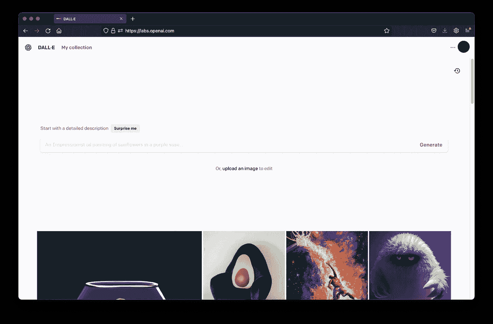

2022 年 9 月 4 日 [DALL E](https://labs.openai.com/) 截图(图片由作者提供)。

**先决条件**

通过[等候名单](https://labs.openai.com/waitlist)申请后的邀请。

然而，**并不能保证**你会被录取，可能需要**几个月才能被录取**【7】。

**功能**

在 DALL E2 中，您可以使用**“文本到图像”和“文本引导图像到图像”**生成算法生成图像。使用“文本引导图像到图像”生成算法，您可以上传图像并删除上传图像中您希望 DALL E2 重新生成的部分。

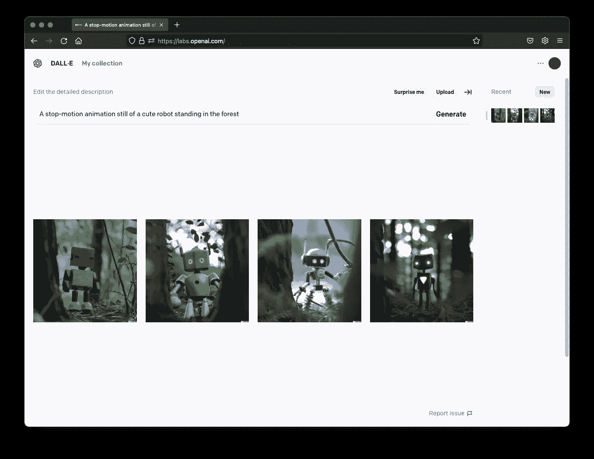

2022 年 9 月 4 日 [DALL E](https://labs.openai.com/) 代对提示“一个可爱的机器人站在森林里的定格动画剧照”(图片由作者提供)。

您也可以创建已生成图像的变体。

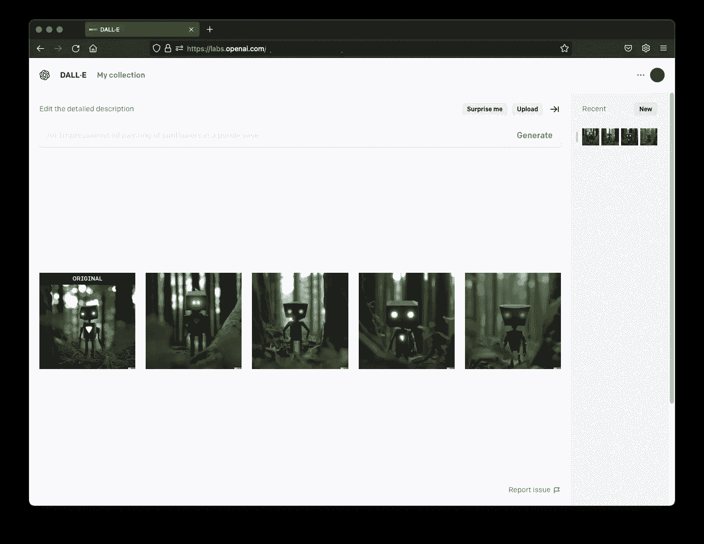

2022 年 9 月 4 日 [DALL E](https://labs.openai.com/) 变奏到提示“一个可爱的机器人站在森林里的定格动画剧照”(图片由作者提供)。

此外，或**使用“文本引导图像到图像”生成算法编辑生成的图像**。您甚至可以使用“Generation frame”选项在已经生成的图像上生成另一个图像，从而扩展您生成的图像。

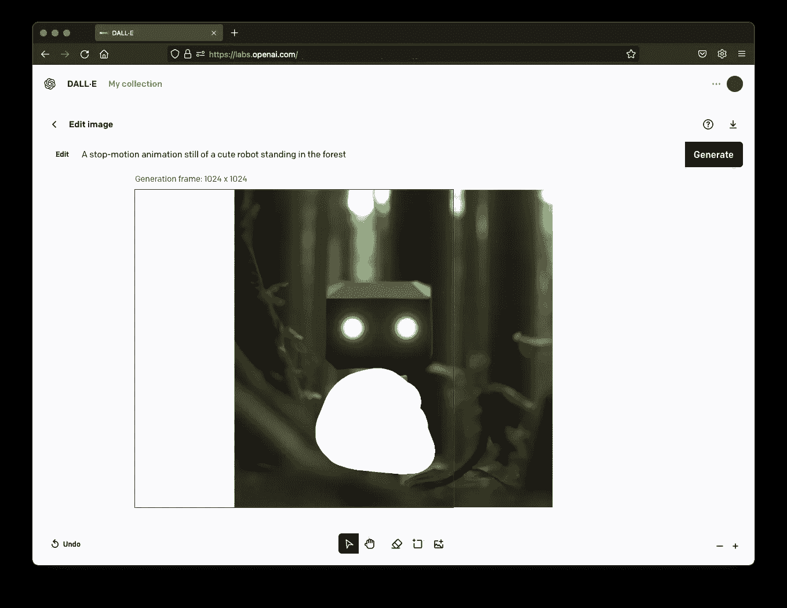

2022 年 9 月 4 日 [DALL E](https://labs.openai.com/) 编辑应用截图(图片由作者提供)。

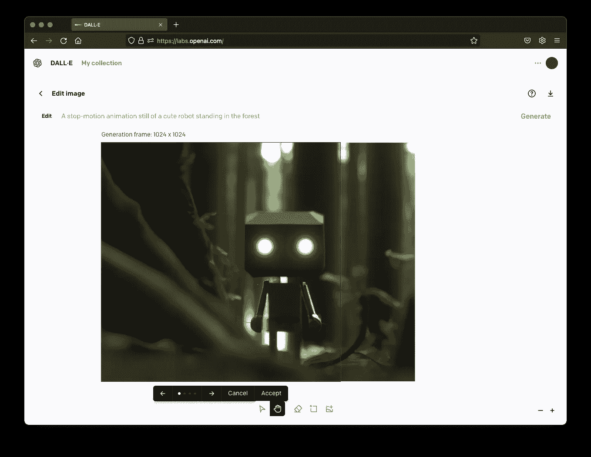

2022 年 9 月 4 日 [DALL E](https://labs.openai.com/) 生成的文字引导图像到图像生成的截图(图片由作者提供)。

**分辨率和格式**

在 DALL E2 中，所有生成的图像都具有 1024 乘 1024 的固定图像尺寸**。**

## 使用 DALL E2 要花多少钱？

当你进入 DALL E 的时候，你会得到 50 个免费积分，你必须在第一个月内用完。在接下来的每个月里，15 个免费的信用点数将会重新填满。请注意，这意味着免费积分不会在几个月内累计。

每个提示将创建四个图像，它将消耗大约一个信用点[8]。

如果这还不够，你可以花 15 美元购买 115 代的额外信用。一旦你的免费信用额度用完，大约是每一代 13 美分(T2)。

## 你能在商业上使用 DALL E2 生成的图像吗？

是的，根据他们的条款[4]，您可以在商业上使用 DALL E2 生成的图像:

> 在遵守这些条款和我们的[内容政策](https://labs.openai.com/policies/content-policy)、**的前提下，您可以出于任何合法目的使用 Generations，包括商业用途**。这意味着你可以将你的权利出售给你所创造的一代人，将它们整合到书籍、网站和演示文稿等作品中，或者以其他方式将它们商业化。— [4]

# 中途

[Midjourney](https://www.midjourney.com/home/) 由同名研究实验室开发，目前处于公测阶段。

## 你如何在中途生成一个图像？

要使用[中途](https://www.midjourney.com/home/)生成图像，您可以使用[中途不和谐服务器](https://discord.gg/midjourney)。

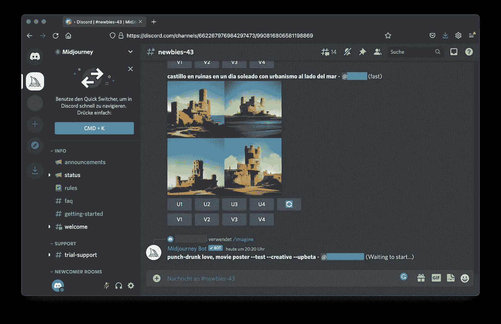

2022 年 9 月 4 日[中途不和服务器](https://discord.gg/midjourney)截图(图片由作者提供)。

**先决条件**

Discord 帐户访问[中途 Discord 服务器](https://discord.gg/midjourney)。

**特性**

Midjourney 主要在他们的 discord 服务器上提供**【文本到图像】**代。您只需向 Discord bot 发送一条消息，以命令`/imagine`开始，后跟您的提示。

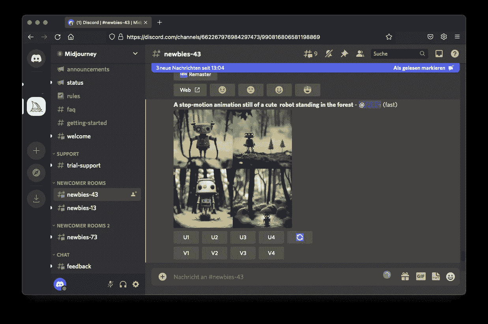

[中途不和服务器](https://discord.gg/midjourney)截图 2022 年 9 月 4 日世代到提示“一个可爱的机器人站在森林里的定格动画剧照”(图片由作者提供)。

此外，您可以创建生成的图像的其他变体，或者将生成的图像放大到更高的分辨率。

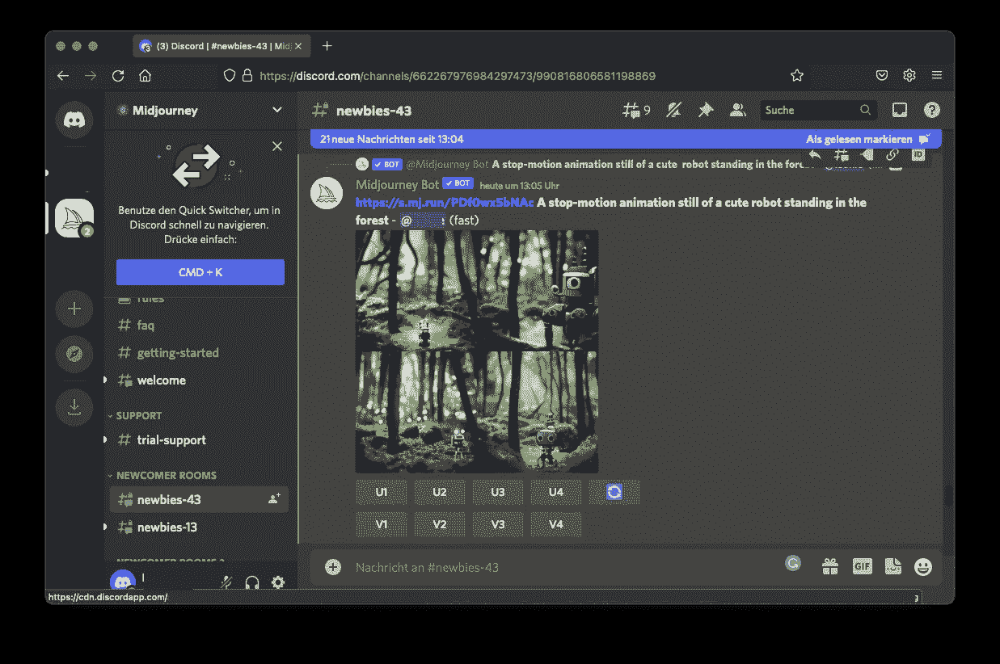

2022 年 9 月 4 日[中途不和服务器](https://discord.gg/midjourney)变奏曲精选一代对提示“一个可爱的机器人站在森林里的定格动画剧照”(图片由作者提供)。

但是，您也可以将文本导向图像的一个或多个图像的 URL 输入到图像生成中。

此外，你可以在[midjourney.com/app](https://www.midjourney.com/app/)上找到你生成的所有图像，并在那里进行过滤和组织。

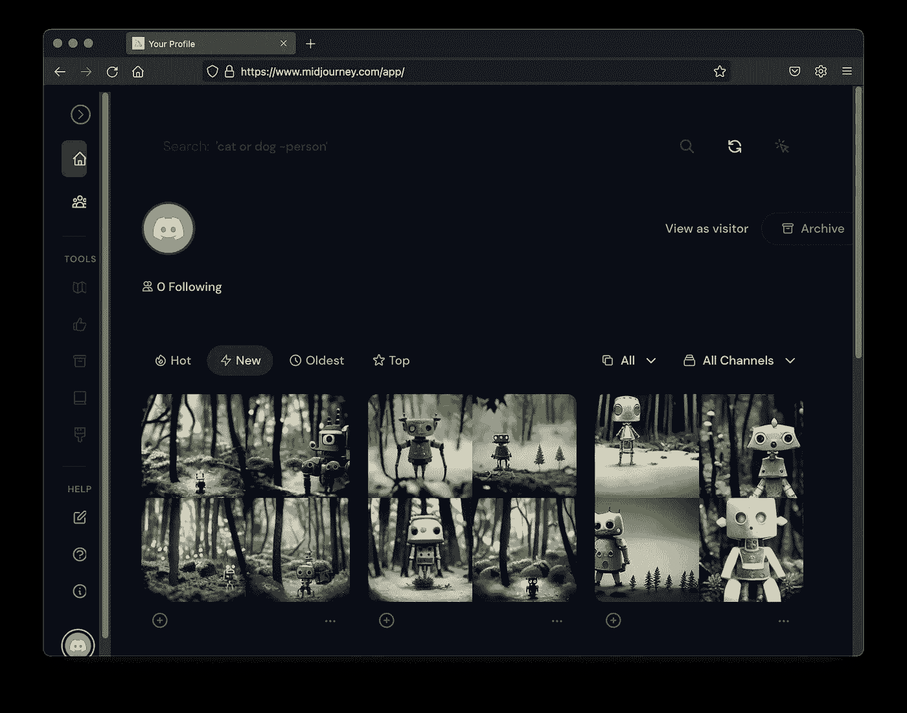

2022 年 9 月 6 日 midjourney.com/app 截图(图片由作者提供)

**分辨率和格式**

在中途，您可以创建 v **各种格式的图像，图像分辨率高达 2048×2048**。

## 使用 mid travel 要花多少钱？

当你第一次加入 midway Discord 服务器时，你可以获得 25 分钟的免费 GPU 时间，你可以用自己的时间[3]。这大约相当于 25 代免费的，因为一代大约需要一个 GPU 分钟[3]。一个请求将根据您的提示生成四个选项。

之后，您可以从两个计划中进行选择[3]:

*   基本计划的费用是每月 10 美元，200 分钟的 GPU 时间(大约每代 5 美分)
*   标准计划每月花费 30 美元，使用 15 个小时的 GPU 时间(大约每代 3 美分)

如果你想为一家年收入超过 100 万美元的公司商业使用这些图片，你需要以每年 600 美元的价格获得公司计划。

## 你能在商业上使用 Midjourney 生成的图像吗？

是的，如果你是付费会员，你可以根据他们的条款商业使用 Midjourney 生成的图片。

> 根据上述许可，**您拥有使用服务创建的所有资产**。如果您属于以下例外情况，则这不适用。 *[…]*
> 
> 如果您**不是付费会员，Midjourney 授予您知识共享非商业性使用** 4.0 归属国际许可下的资产许可(“资产许可”)。— [3]

这也意味着，如果你不是付费会员，你可以将这些图片用于非商业目的，还可以修改它们。

# 稳定扩散

稳定扩散是由来自 [CompVis](https://github.com/CompVis) 、 [Stability AI](https://stability.ai/) 和 [LAION](https://laion.ai/) 的研究人员和工程师创造的。它是开源的，于 2022 年 8 月向公众发布。

## 如何生成扩散稳定的图像？

您有两种选择来生成具有稳定扩散的图像:

*   在您的计算机或云服务上运行稳定的本地扩散
*   使用像 [Dream Studio](https://beta.dreamstudio.ai/) 这样的网络应用

**先决条件**

如果你想自己运行稳定扩散模型，你需要一个至少有 10GB VRAM 的 GPU。Huggingface 提供了关于如何使用稳定扩散模型的[教程](https://colab.research.google.com/github/huggingface/notebooks/blob/main/diffusers/stable_diffusion.ipynb)【2】。

如果你想了解更多，这里有一个由[吉姆·克莱德·蒙赫](https://medium.com/u/819323b399ac?source=post_page-----821bc130fef4--------------------------------)提供的很棒的分步指南:

  

如果不想处理任何代码，也可以使用 [Dream Studio](https://beta.dreamstudio.ai/) web 应用。为此，你只需要注册一个帐户。

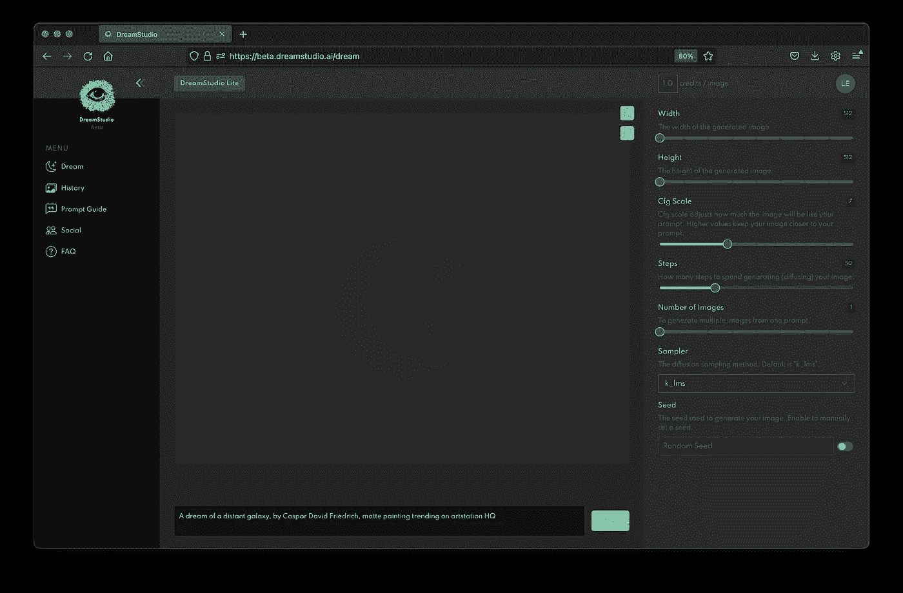

2022 年 9 月 4 日[梦想工作室](https://beta.dreamstudio.ai/)截图(图片由作者提供)。

**特性**

梦想工作室主要提供**“文字到图像”**基于稳定扩散的世代。然而，它有各种选项，如设置生成图像的步骤数或设置随机种子。

您还可以将每代图像的数量设置在 1 到 9 之间。

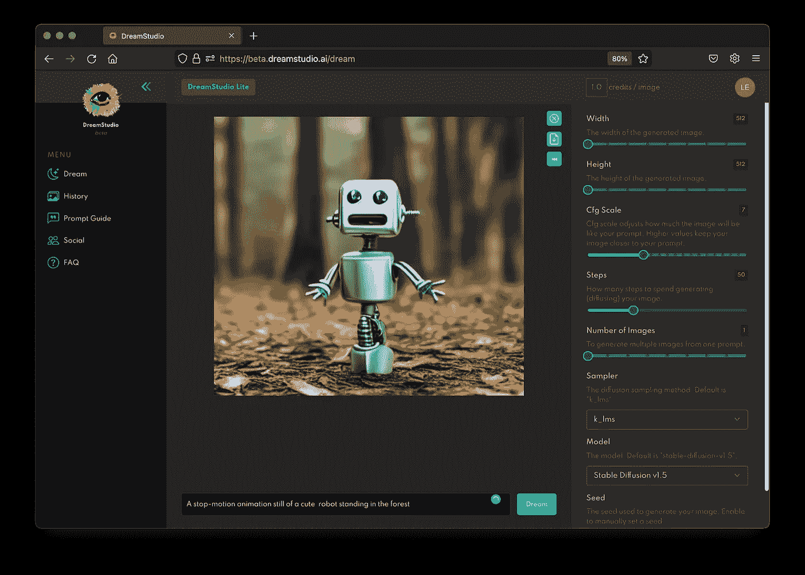

[梦工厂截图](https://beta.dreamstudio.ai/)生成到提示“一个可爱的机器人站在森林里的定格动画剧照”2022 年 9 月 4 日(图片由作者提供)。

此外，稳定扩散能够使用文本引导的图像到图像生成算法来生成图像。你可以在[上摆弄它，通过](https://huggingface.co/spaces/huggingface/diffuse-the-rest)[拥抱脸](https://huggingface.co/)来扩散其余的。

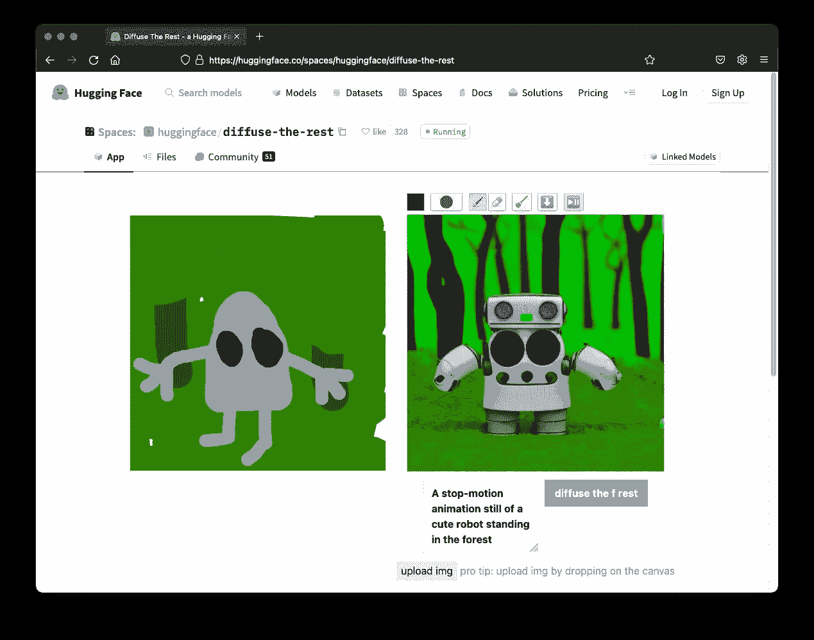

2022 年 9 月 6 日拍摄的[扩散其余](https://huggingface.co/spaces/huggingface/diffuse-the-rest)截图(图片由作者提供)

**分辨率和格式**

通过稳定的扩散，您可以创建各种格式的图像，图像分辨率高达 1024 x 1024。

## 使用稳定扩散要花多少钱？

当你第一次在[dream studio beta](https://beta.dreamstudio.ai/)上注册时，你会得到价值 2 英镑的积分[1]。这大致相当于每张图片免费生成 200 次。一个图像生成的价格在每个图像 1 到 28 个信用点之间变化，取决于图像的大小和您希望模型花费多少步骤来生成您的图像。

免费试用后，您可以购买 10 个增量的额外点数[1]。

## 你能在商业上使用稳定扩散生成的图像吗？

是的，根据他们的条款[9]，你可以在商业上使用稳定扩散生成的图像。

> 请注意，虽然用户已经丧失了这些图像的版权(以及任何/所有知识产权要求)，但它们仍然是公共领域，任何人都可以出于任何目的使用，包括用户。请随意使用来自 DreamStudio Beta 和 Stable Diffusion Beta Discord service 的图像用于任何目的，**包括商业目的**。— [9]

# 结论

在本文中，我们比较了目前最流行的三种图像生成模型:稳定扩散、[、](https://www.midjourney.com/)和 DALL E2。在这次比较中，我们采用了一种非技术性的方法:

*   如何开始使用每个模型，以及从开始使用到生成第一张图像需要多长时间
*   使用每种型号的成本是多少
*   你是否可以在商业上使用这些图片

下面，你可以找到一个表格，总结了三个模型在写作时的比较。请记住，下表可能会发生变化，因为三款车型正在积极开发中**，该表可能很快就会过时。**

**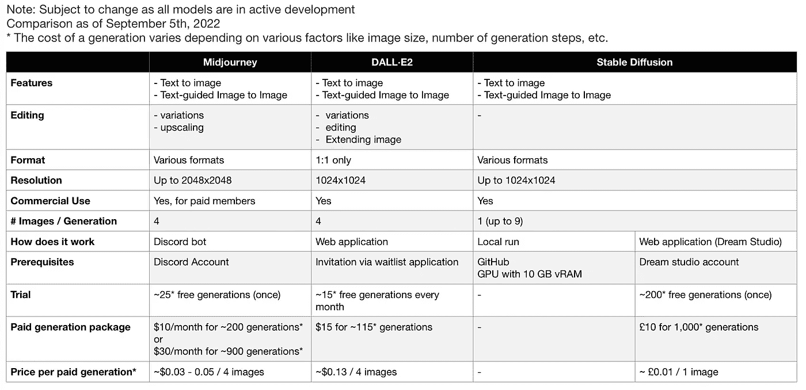**

**DALLE、Midjourney 和 Stable Diffusion 的非技术比较:截至 2022 年 9 月的特征、格式、分辨率、商业用途、先决条件、成本和试验。(图片由作者提供)请注意，随着模型的积极开发，内容可能会发生变化。**

# **喜欢这个故事吗？**

***以下是我收集的其他生成性人工智能文章:***

**

莉奥妮·莫尼加蒂** 

## **生成人工智能**

**[View list](https://medium.com/@iamleonie/list/generative-ai-275f9c85361b?source=post_page-----821bc130fef4--------------------------------)****3 stories**************

***如果你想把我的新故事直接发到你的收件箱，* [*订阅*](https://medium.com/subscribe/@iamleonie) *！***

**成为一名媒体会员，阅读更多来自我和其他作家的故事。报名时可以使用我的 [*推荐链接*](https://medium.com/@iamleonie/membership) *支持我。我将收取佣金，不需要你额外付费。***

**  

*在*[*Twitter*](https://twitter.com/helloiamleonie)*[*LinkedIn*](https://www.linkedin.com/in/804250ab/)*[*Kaggle*](https://www.kaggle.com/iamleonie)*！***

# **参考**

**[1]梦工作室，[https://beta.dreamstudio.ai/faq](https://beta.dreamstudio.ai/faq)(2022 年 9 月 5 日访问)**

**[2]拥抱脸，“🧨扩散器的稳定扩散”，google.com。[https://colab . research . Google . com/github/hugging face/notebooks/blob/main/diffusers/stable _ diffusion . ipynb # scroll to = GD-vx3 CAV oct](https://colab.research.google.com/github/huggingface/notebooks/blob/main/diffusers/stable_diffusion.ipynb#scrollTo=gd-vX3cavOCt)**

**[3]中途，“中途文档”。git book . io .[https://midjourney.gitbook.io/docs/](https://midjourney.gitbook.io/docs/)(2022 年 9 月 4 日访问)**

**[4] OpenAI，“使用条款”。openai.com。[https://labs.openai.com/policies/terms](https://labs.openai.com/policies/terms)(2022 年 9 月 4 日访问)**

**[5] OpenAI，“DALL E Now
有 Beta 版”openai.com。https://openai.com/blog/dall-e-now-available-in-beta/(2022 年 9 月 4 日访问)**

**[6] J. Jang，“信贷是如何运作的”。openai.com。[https://help . open ai . com/en/articles/6399305-how-Dall-e-credits-work](https://help.openai.com/en/articles/6399305-how-dall-e-credits-work)(2022 年 9 月 4 日访问)**

**[7] Reddit，“DALL-E 2 等候名单需要多长时间？如果你申请的话，有百分之百的把握会被录取吗？”。reddit.com。[https://www . Reddit . com/r/open ai/comments/vahnqg/how _ much _ time _ does _ the _ dalle _ 2 _ wait list _ take _ and/](https://www.reddit.com/r/OpenAI/comments/vahnqg/how_much_time_does_the_dalle_2_waitlist_take_and/)(2022 年 9 月 4 日访问)**

**[8] D. Schnurr，“DALL E 编辑指南”，openai.com。[https://help . open ai . com/en/articles/6516417-Dall-e-editor-guide](https://help.openai.com/en/articles/6516417-dall-e-editor-guide)(2022 年 9 月 6 日访问)**

**[9]稳定 AI，《稳定扩散梦想工作室 beta 服务条款》。稳定. ai .[https://stability.ai/stablediffusion-terms-of-service](https://stability.ai/stablediffusion-terms-of-service)(2022 年 9 月 5 日访问)****