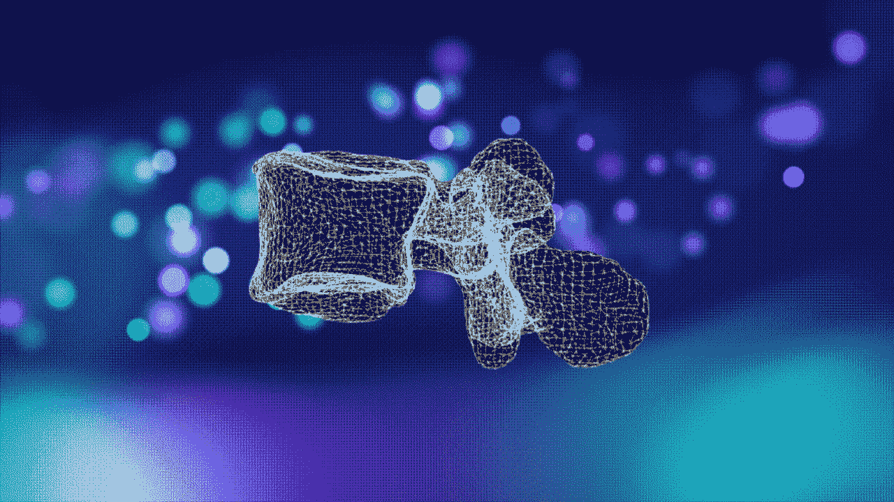
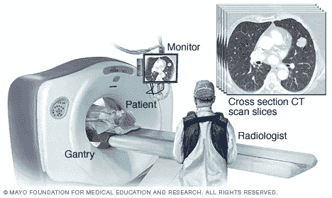
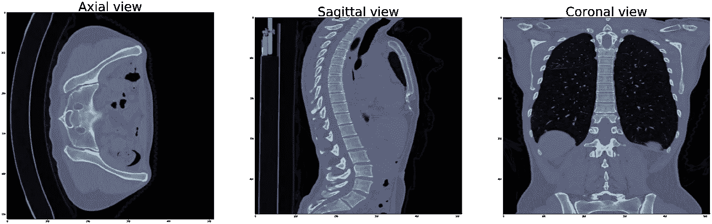
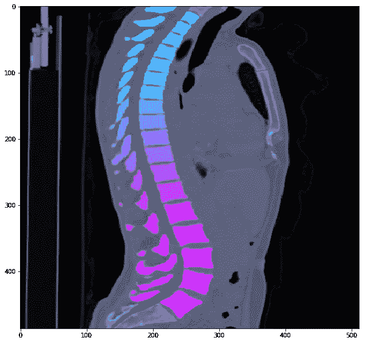
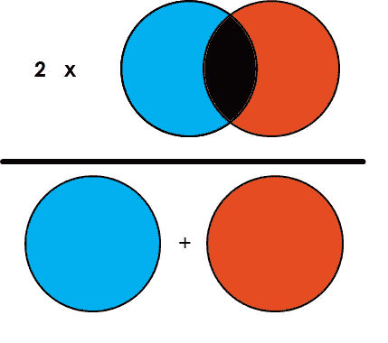
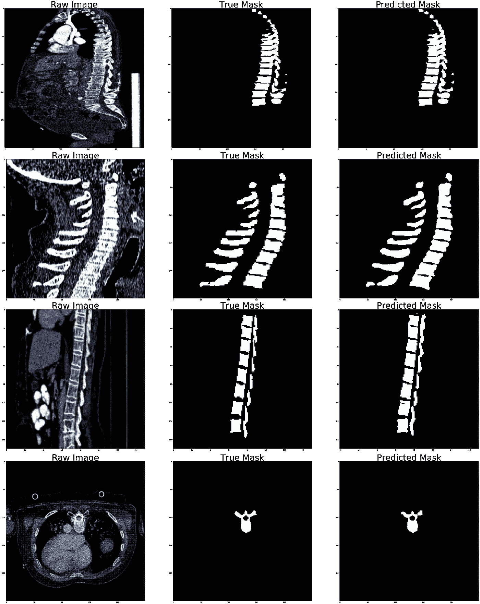

# 人工智能让你的背部分段(PyTorch)

> 原文：<https://towardsdatascience.com/ai-got-your-back-segmented-pytorch-72ef14856db6>

## 用于脊柱的 UNet 分割

图片部分由[本来源](http://grand-challenge.org)部分由作者提供

随着我们每天收集更多的数据，人工智能(AI)将越来越多地用于医疗保健领域。医疗保健中人工智能应用的一个关键类别是诊断。医疗诊断中的人工智能有助于决策、管理、自动化等。

脊柱是肌肉骨骼系统的重要组成部分，支撑着身体及其器官结构，同时在我们的流动性和负荷转移方面发挥着重要作用。它还能保护脊髓免受冲击造成的损伤和机械冲击。

在自动脊椎处理流水线中，脊椎标记和分割是两个基本任务。脊柱图像的可靠和精确处理有望有益于临床决策支持系统，用于脊柱和骨骼健康的诊断、手术计划和基于群体的分析。设计用于脊柱处理的自动算法是具有挑战性的，这主要是由于解剖和采集协议中的相当大的变化以及公开可用数据的严重缺乏。

在这篇博客中，我将只关注给定 CT 扫描数据集中的脊柱分割。标记每个椎骨和进一步诊断的任务没有包括在这个博客中，可以作为这个任务的继续。

脊柱或椎骨分割在所有关于脊柱形态学和病理学的自动量化的应用中是至关重要的步骤。随着深度学习的出现，对于计算机断层扫描(CT)扫描这样的任务，大量不同的数据是主要的受欢迎资源。但是，目前还没有大规模的公共数据集。[VerSe I](https://github.com/anjany/verse)是一个大规模、多探测器、多站点的 CT 脊柱数据集，由来自 355 名患者的 374 次扫描组成。2019 年和 2020 年的数据集都有。在这篇博客中，我将两个数据集合并成一个数据集，以便从更多的数据中获益。

<https://github.com/anjany/verse#download>  

`*The data is provided under the CC BY-SA 4.0 License, making it fully open-sourced.*`

NIfTI(神经成像信息学技术倡议)是一种用于神经成像的文件格式。NIfTI 文件在神经科学甚至神经放射学研究的成像信息学中非常常用。每个 NIfTI 文件包含多达 7 维的元数据和体素，并支持各种数据类型。前三个维度被保留来定义三个空间维度 *x* 、 *y、*和 *z* ，而第四维被保留来定义时间点 *t* 。剩下的维度，从第五到第七，则是其他用途。然而，第五维度仍然可以有一些预定义的用途，例如存储体素特定的分布参数或保存基于向量的数据。VerSe 数据集包含 NIfTI 文件的 zip 文件。

[**ITK 快照**](http://www.itksnap.org) 是一款用于分割 3D 医学图像中结构的软件应用。它是可以安装在不同平台上的开源软件。我已经使用它能够在 3D 视图中可视化 NifTi 文件，并在原始图像上加载和覆盖 3D 蒙版。我强烈推荐在这个任务中使用它。

CT 扫描机— [图像来源](https://www.mayoclinic.org/)

**计算机断层扫描** (CT)是一种 x 射线成像程序，在该程序中，一束狭窄的 x 射线在围绕身体快速旋转的同时瞄准患者。机器收集的信号将被存储在计算机中，以生成身体的横截面图像，也称为“切片”。这些切片被称为断层图像，包含比传统 x 射线更详细的信息。一系列切片可以数字地“堆叠”在一起，以形成患者的 3D 图像，该图像允许更容易地识别和定位基本结构以及可能的肿瘤或异常。

动作步骤如下。我开始下载 2019 年和 2020 年的数据集。然后，我将两个数据集合并到它们的训练、验证和测试文件夹中。下一步是读取 CT 扫描图像，并将 CT 扫描图像的每个切片转换为一系列 PNG 原始图像和蒙版。后来我使用了这个 [Github repo](https://github.com/milesial/Pytorch-UNet) 中的 UNet 模型，并训练了一个细分模型。

**数据理解:**在开始数据处理和训练之前，我想加载几个 NIfTI 文件，以便更熟悉它们的 3D 数据结构，并能够可视化它们和从图像中提取元数据。

下载完 VerSe 数据集后，我能够使用 NiBabel 库打开一个 *.nii.gz* 文件(解释如下)。通过读取一个文件并查看 CT 扫描图像的一个特定切片，我能够运行 Numpy transpose 函数来查看轴向、矢状和冠状三个不同视图中的一个切片。

三个不同角度的 CT 扫描切片——图片由作者提供

在我更加熟悉原始图像并且能够从原始 3D 图像中取出一个切片后，现在是时候查看同一切片的蒙版文件了。正如你在下图中看到的，我能够在原始图像切片上叠加蒙版切片。我们在这里看到渐变颜色的原因是，遮罩文件不仅定义了存在的每个椎骨的区域，而且它们还具有不同的标签(用不同的颜色显示),即每个椎骨的编号或标签。为了更好地理解脊柱标签，你可以参考[这一页](https://en.wikipedia.org/wiki/Vertebral_column#Vertebrae)。

将蒙版数据叠加在原始图像的一个切片上—按作者分类的图像

**数据准备:**数据准备的任务是从原始图像和掩模文件中生成每个 3D CT 扫描文件的图像切片。它从在*中读取原始和掩模图像开始。zip"* 格式，并将它们转换成 Numpy 数组。然后浏览每幅 3D 图像，检查每幅图像的视角，并尝试将大多数图像转换为矢状视图。接下来，我从每个切片生成了 **PNG** 文件，并将它们存储为灰度值“L”格式。在这种情况下，我们不需要生成 RGB 图像，因为每个 CT 扫描切片都只有 1D 值。

在这项任务中，我使用了 **UNet** 架构来对数据集应用**语义分段**。为了更好地了解 UNet 和语义分割，我推荐查看这个博客。

我还使用了 **Pytorch** 和 **Pytorchvision** 来完成这个任务。正如我提到的[这个回购](https://github.com/milesial/Pytorch-UNet)使用 PyTorch 很好地实现了 UNet，我一直在使用其中的一些代码。

由于我正在处理 NIfTI 文件，并且能够用 python 阅读这些文件，我将使用[**ni Abel**](https://nipy.org/nibabel/)**库。NiBabel 是一个 python 库，用于读写一些常见的医学和神经成像文件格式，如 NIfTI 文件。**

****Dice Score:** 为了评估我们的模型在语义分割任务中的表现，我们可以使用 Dice Score。Dice 系数是 2 *重叠面积(在预测遮蔽面积和真实遮蔽面积之间)除以两幅图像中的像素总数。**

****

**骰子点数— [图片来源](https://www.kaggle.com/yerramvarun/understanding-dice-coefficient)**

****训练:**首先我定义了 UNet 类，然后定义了 PyTorch 数据集类，它包括读取和预处理图像。预处理任务包括加载 PNG 文件，将它们的大小调整为一个大小(在本例中为 250x250)，然后将它们全部转换为 NumPy 数组和 PyTorch 张量。通过调用 dataset 类(VerSeDataset ),我们可以在我定义的批处理中准备我们的数据。为了确保 raw 图像和 mask 图像之间的映射是正确的，我曾经调用过`next(iter(valid_dataloader))`来获取一批中的下一个项目并将其可视化。**

**后来我把模型定义为`model = UNet(n_channels=1, n_classes=1)`。通道数是 1，因为我有一个灰度图像，而不是 RGB，如果你的图像是 RGB 图像，你可以将通道数改为 3。类的数量是 1，因为我只有一个类来判断一个像素是不是椎骨的一部分。如果你的问题是多类分割，你可以设置你有多少个类就有多少个类。后来我训练了一些时期的模型。对于每一批，我首先计算损失值，通过反向传播更新参数。后来，我再次检查了所有批次，只计算了验证数据集的损失，并存储了损失值。接下来，我直观地查看了训练和验证的损失值，并跟踪了我们模型的性能。**

**在我保存了模型之后，我能够抓取其中一个图像，并将其传递给训练好的模型，并接收到一个预测的掩模图像。通过绘制原始、真实遮罩和预测遮罩的所有三幅图像，我能够直观地评估结果。**

****

**原始图像(左)、真实蒙版(中)和预测蒙版(右)-按作者分类的图像**

**正如你从上面的图像中看到的，这个模型在矢状面和轴向上都做得很好，因为预测的遮罩与真实的遮罩区域非常相似。**

**您可以在这里找到完整的代码:**

****未来工作:**这项任务也可以用 3D UNet 来完成，这可能是学习脊椎结构的更好方法。因为我们有每个椎骨的每个掩模区域的标签，那么我们可以进一步做多类掩模分割。此外，当图像视图为矢状时，模型性能最佳，因此可能将所有切片转换为矢状会具有最佳模型。**

**感谢阅读！**