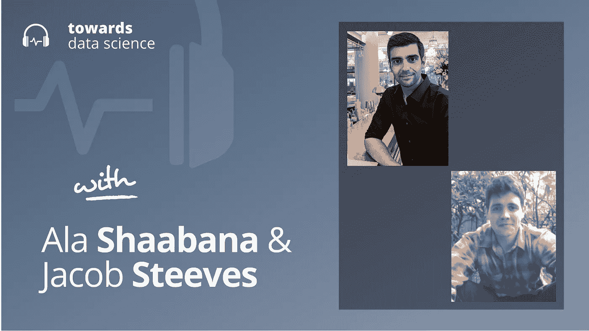

# 人工智能在区块链(它实际上可能只是有意义)

> 原文：<https://towardsdatascience.com/ai-on-the-blockchain-it-actually-might-just-make-sense-6763389453cc>

## [播客](https://towardsdatascience.com/tagged/tds-podcast)

## Ala Shaabana 和 Jacob Steeves 谈去中心化人工智能的好处

[苹果](https://podcasts.apple.com/ca/podcast/towards-data-science/id1470952338?mt=2) | [谷歌](https://www.google.com/podcasts?feed=aHR0cHM6Ly9hbmNob3IuZm0vcy8zNmI0ODQ0L3BvZGNhc3QvcnNz) | [SPOTIFY](https://open.spotify.com/show/63diy2DtpHzQfeNVxAPZgU) | [其他](https://anchor.fm/towardsdatascience)

*编者按:TDS 播客由杰雷米·哈里斯主持，他是人工智能安全初创公司墨丘利的联合创始人。每周，Jeremie 都会与该领域前沿的研究人员和商业领袖聊天，以解开围绕数据科学、机器学习和人工智能的最紧迫问题。*

两位拥有世界级血统的人工智能研究人员决定建立一家公司，将人工智能应用于区块链。现在对大多数人来说，包括我自己在内，“区块链上的人工智能”听起来像是某种创业时髦词 bingo 中的获奖词。但我在与雅各布和阿拉的交谈中发现，他们实际上有很好的理由将这两种成分结合在一起。

在高水平上，在区块链上进行人工智能允许你分散人工智能研究，并奖励实验室建立更好的模型，而不是在华而不实的期刊上发表论文，这些期刊往往有偏见的评论者。

这还不是全部——正如我们将看到的，Ala 和 Jacob 正在用他们的分散式机器学习方法解决人工智能中一些最棘手的问题。从设计强大的基准到奖励优秀的人工智能研究的问题，甚至是将权力集中在少数几家建立强大人工智能系统的大公司手中的问题——这些问题都在他们建立区块链初创公司 Bittensor 的时候出现了。

Ala 和 Jacob 和我一起在这一集的 TDS 播客中谈论所有这些事情。以下是这一集里我最喜欢的带回家的东西。

*   从某种意义上说，比特币是世界上最大的超级计算机。它由无数的矿工组成，每个人都在狂热地生成随机的字符串，希望他们能找到正确的序列，从而获得向区块链添加区块的权利——以及随之而来的经济奖励。当你缩小时，这看起来像是浪费了大量的计算能力。随机数生成并不完全是一项有价值的经济活动，然而成千上万的 GPU 正在疯狂地进行这项工作，保持比特币生态系统的运行。Ala 和 Jacob 开始思考:我们能不能设计一种新的区块链，把所有的计算导向更有建设性的东西？
*   这就是位张量的用武之地。Bittensor 上的矿工不是猜测随机字符串，而是解决机器学习问题。他们竞相生成图像、句子或其他有用输入的潜在表征，当他们开始在相似的表征上趋同时，就形成了共识。当矿工们的表现和其他人相似时，他们就会得到奖励。
*   Bittensor 的网络一直在快速扩张，很快接近 Open AI 的 GPT-3 模型的规模。这是一个非常保守的估计，很大程度上是因为 Jacob 和 Ala 无法知道位张量挖掘者正在使用的模型的架构:实际上他们只能看到模型的输出，这使得他们的网络本质上是精英化的。

你可以在推特上点击[这里](https://twitter.com/shibshib89?lang=en)，或者[我这里](https://twitter.com/jeremiecharris)。

## 章节:

*   0:00 介绍
*   2:40 阿拉和雅各布的背景
*   4:00 区块链的人工智能基础知识
*   11:30 创造人类价值
*   17:00 谁看到了好处？22:00 使用 GPU
*   28:00 模特们互相学习
*   37:30 网络规模
*   45:30 这些系统的校准
*   51:00 购买系统
*   54:00 总结