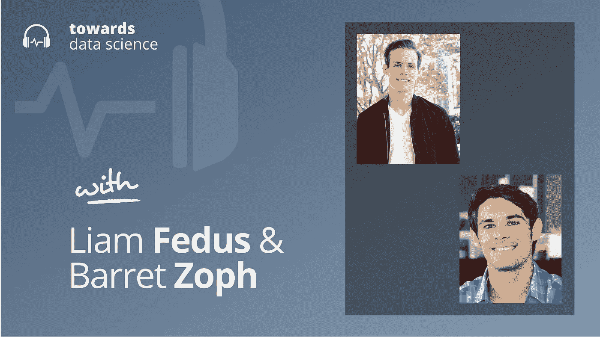

# 混合专家模型的人工智能缩放

> 原文：<https://towardsdatascience.com/ai-scaling-with-mixture-of-expert-models-1aef477c4516>

## [播客](https://towardsdatascience.com/tagged/tds-podcast)

## Liam Fedus 和 Barret Zoph 关于计算高效、稀疏和缩放模型

[苹果](https://podcasts.apple.com/ca/podcast/towards-data-science/id1470952338?mt=2) | [谷歌](https://www.google.com/podcasts?feed=aHR0cHM6Ly9hbmNob3IuZm0vcy8zNmI0ODQ0L3BvZGNhc3QvcnNz) | [SPOTIFY](https://open.spotify.com/show/63diy2DtpHzQfeNVxAPZgU) | [其他](https://anchor.fm/towardsdatascience)

*编者按:TDS 播客由杰雷米·哈里斯主持，他是人工智能安全初创公司墨丘利的联合创始人。每周，Jeremie 都会与该领域前沿的研究人员和商业领袖聊天，以解开围绕数据科学、机器学习和人工智能的最紧迫问题。*

人工智能的发展真的很快。自从 GPT-3 问世以来，很明显，我们需要做的事情之一是超越狭隘的人工智能，走向更普遍的智能系统，这将是大规模扩大我们模型的规模，它们消耗的处理能力和它们接受训练的数据量，同时进行。

这导致了一波大规模模型的浪潮，训练这些模型非常昂贵，很大程度上是因为它们庞大的计算预算。但是，如果有一种更灵活的方式来扩展人工智能——一种允许我们从计算预算中分离模型大小的方式，以便我们可以跟踪更有效的计算过程来扩展，会怎么样？

这就是所谓的混合专家模型(MoEs)的前景。与更传统的变形金刚不同，moe 不会在每次训练时更新所有的参数。相反，他们将输入智能地路由到称为专家的子模型，每个子模型可以专门从事不同的任务。在给定的训练过程中，只有那些专家的参数被更新。结果是一个稀疏的模型，一个计算效率更高的训练过程，以及一个新的潜在的扩展途径。

谷歌一直在推进 MoEs 研究的前沿，特别是我今天的两位客人，他们参与了这一战略的开拓性工作(还有许多其他工作！).Liam Fedus 和 Barret Zoph 是谷歌大脑的研究科学家，在这一集的 TDS 播客中，他们和我一起谈论了人工智能缩放、稀疏性以及 MoE 模型的现在和未来。

以下是我在对话中最喜欢的一些观点:

*   专家模型混合通常包含一个路由模型或开关，它决定特定输入将被发送给哪个专家。Liam 和 Barret 仍然不确定对于一个给定的问题有多少专家是最佳的，他们已经测试了有 2 到 1000 个专家的系统。
*   人们常说，人工智能的历史涉及研究人员逐渐了解到，他们应该将越来越少的假设硬编码到他们的模型中(这些假设被称为“归纳先验”)。例如，在从 2010 年之前的时代到深度学习时代的飞跃中，我们了解到决策树和支持向量机等固执己见的结构不如神经网络那样可扩展，神经网络似乎对数据“应该”如何处理做出更少的假设。同样，卷积网络和递归网络对图像中的平移不变性和文本中的标记排序做出了假设，现在这些假设看起来越来越没有必要，因为变压器在各自的专业领域优于这两种模型类型。因此，一个问题出现了:MoEs 是放松关于模型架构的假设的另一个步骤吗？如果是，它们到底放松了什么假设？
*   在某种意义上，MoEs 可以被认为是密集变压器的更一般的版本。毕竟，密集变压器实际上只是一个专家的 MoE。出于这个原因，Barret 和 Liam 倾向于认为 MoEs 是从机器学习中去除归纳先验的进一步发展。
*   历史上，MoEs 比密集模型遭受更多的训练不稳定性。其中一个原因与路由机制有关，该机制决定了哪个专家将看到给定的输入。因为该决定是离散的(必须选择专家的特定子集，并且您不能半选一个专家)，所以样本通过 MoE 的路径可能会有很大的不同，根据路由器的输出，将它暴露给完全不同的专家。因此，反向传播变得更具挑战性。从工程的角度来看，由于与密集模型相比，moe 的参数数量较多，因此更难训练和部署。Barret 指出，一个常见的策略是按照专家的方式划分模型，在每个可用的 GPU 上训练一个专家。因此，当决定在您的模型中包含多少专家时，硬件的可用性成为一个关键的考虑因素。
*   moe 仍然在一般化上挣扎，当在新任务上进行微调时，表现往往比密集模型差一些。Liam 和 Barret 认为这是因为过度拟合，由于 MoE 模型的高参数计数，这成为一个特别重要的问题。但他们对可能克服这个问题的潜在正规化策略保持乐观，并认为 MoEs 可以在通用人工智能的未来发挥重要作用。

你可以在这里[在 Twitter 上关注利亚姆](https://twitter.com/liamfedus)，在这里[在 Twitter 上关注巴雷特](https://twitter.com/barret_zoph?lang=en)，或者在这里[关注我](https://twitter.com/jeremiecharris)。

## 章节:

*   0:00 介绍
*   2:15 嘉宾背景
*   8:00 了解专业化
*   13:45 对未来的推测
*   21:45 开关变压器与密集网络
*   27:30 更多可解释的模型
*   33:30 假设和生物学
*   39:15 总结