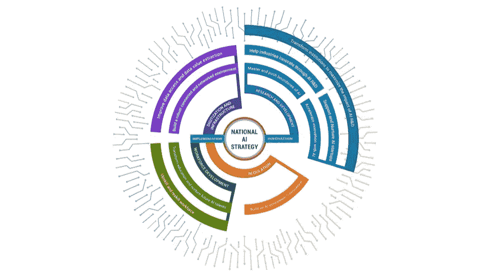
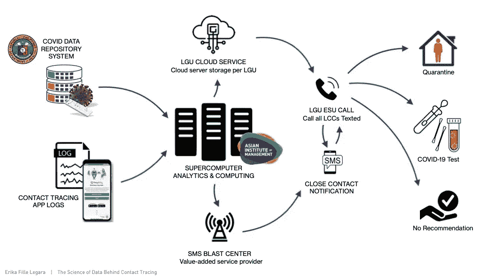

# 人工智能策略现在是一个国家定义的能力

> 原文：<https://towardsdatascience.com/ai-strategy-is-now-a-nation-defining-capability-35f64bda1054>

## [社区聚焦](https://towardsdatascience.com/tagged/community-spotlight)

# 人工智能策略现在是一个国家定义的能力

## 为菲律宾设计国家人工智能路线图，通过人工智能生态系统“良心”平衡创新和责任

*在 Community Spotlight 系列中，TDS 编辑与数据科学社区成员畅谈有助于推动该领域发展的激动人心的计划。今天，我们很高兴与您分享埃利奥特·冈恩***与埃里卡·莱加拉**【的对话，埃里卡·莱加拉是菲律宾亚洲管理学院的数据科学教授，也是菲律宾和新加坡政府机构的人工智能项目顾问。****

**

*图片由 Erika Legara 提供*

***Erika 参与了新加坡和菲律宾的中小型企业(SME)、跨国公司(MNC)和政府机构的数百万美元的研发项目。2019 年，菲律宾政府聘请 Erika 和她的同事起草了国家人工智能路线图。***

*作为人工智能、基础设施、教育和智能治理方面的政府政策顾问，我很想更多地了解你的工作。你能分享一下你在菲律宾贸易和工业部起草国家人工智能路线图的角色吗？这个项目在哪些方面对菲律宾具有重要的战略意义？*

*许多企业和组织已经将数据科学和人工智能(DSAI)视为战略能力。它们不再是可选的，“最好拥有”的能力，而是必要的，“必须拥有”——关系到组织的生存。世界各地的领导者已经意识到，如果他们希望他们的组织保持相关性，甚至生存下去，他们必须具有竞争力和创新能力。因此，拥抱技术已经成为一种必然，尤其是分析，因为它的预测能力。*

*近年来，各国政府也开始认识到同样的事情，菲律宾也不例外。像军事能力一样，人工智能现在被广泛认为是一种定义国家的能力，特别是因为人工智能跨越了各个行业和部门。*

*最终，菲律宾政府的目标是通过创新和企业家精神来利用我们人民和资源的潜力。例如，当地贸易部贸易和工业部(DTI)正在实施包容性创新产业战略(i3S ),旨在发展制造业、农业和服务业中具有全球竞争力的创新产业。除其他技术外，DSAI 在实现这一目标、推动创新、数字化转型和提高行业竞争力方面处于前沿和中心位置。*

*DTI 与我和我的同事 Chris Monetrola 博士签订了合同，共同设计和制作菲律宾的人工智能路线图。它的制定是我们开发和实施人工智能战略、计划和项目的第一步，特别是帮助当地企业变得更有生产力和竞争力。在制定路线图的过程中，我带来了我在数据驱动科学方面的专业知识，以及与各种利益相关者合作的丰富经验，特别是在三螺旋项目上。我的另一部分职责是审查其他国家发布的现有人工智能政策和战略，确定菲律宾可以采用的最佳政策和实践，并根据我们的文化定制和调整这些原则和实践。最后，DTI 还要求我们分析该国的人工智能政策景观和生态系统。考虑到我们过去的 R&D 项目，我们还确定了具有有形社会经济效益的 DSAI 应用程序，包括短期和长期的。*

*你最喜欢或特别引以为豪的项目是什么？*

*除了设计国家人工智能路线图，我特别自豪的是最近与一家跨国公司(Aboitiz Group)、我们的学术机构(亚洲管理学院)、由国家经济发展局领导的各种政府机构以及一些地方政府单位合作的接触追踪项目。该项目是一个以数据换利益的志愿项目，旨在提高我国追踪接触者的能力，这一能力此前被确定为我国政府应对新冠肺炎疫情的“最薄弱环节”。*

**

*图片由 Erika Legara 提供*

*该项目由两个主要部分组成——第一部分涉及各种数据源的整合和协调，特别是来自新冠肺炎测试结果的案例数据库和接触者追踪应用程序数据库。第二，我们设计了算法来有效地建立联系追踪网络，并随后识别社区中的“脆弱”个体。*

*这个项目的一个很好的竞争者是智慧城市项目，在菲律宾的一个发展中的小城市 Cauayan 市，我参与了这个项目。这是第一个由我们的科学部——科技部(DOST)资助的智能城市项目。在学术上，城市科学当然令人兴奋；但与科学相比，与各种个人，尤其是领域专家(例如政策和工程)一起工作的经历同样令人兴奋。*

*我研究城市复杂性已经有一段时间了，我接触到的大部分作品只涉及对拥有丰富数据源和已经成熟的数据驱动文化的先进城市和经济体的研究。然而，当研究菲律宾等发展中经济体的城镇动态时，数据驱动的城市研究人员面临不同的挑战。*

***您对政府如何降低部署人工智能解决方案和干预与边缘化社区相关的脆弱性的风险有什么见解吗？***

*我是道德和负责任的人工智能的大力倡导者。因此，菲律宾国家人工智能路线图设计也强调了建立人工智能生态系统“良心”的重要性，它在计划中有自己的战略维度。该维度涵盖 DSAI 的数据隐私和更具争议的道德问题，推动建立可靠、安全、可靠、包容、负责和透明的预测平台。因此，我们对贸易和工业部的建议是建立一个专注于负责任的数据和人工智能技术的委员会或咨询委员会。理想情况下，该委员会将由决策者、法律专家、伦理学家、学者和 DSAI 实践者组成。此外，这方面的努力将与其他国家为数据和人工智能制定的其他负责任的道德准则相融合。*

***在人工智能和 DS 领域，你认为哪些项目最好由政府机构处理，而不是以营利为目的？***

*正如我们在这一领域的大多数人所知，DSAI 跨越部门和行业。事实上，确定一个 DSAI 无法产生影响的部门或行业，或者至少是技术无法应用的部门或行业，是一个相当大的挑战。*

*现在，在政府推动的 DSAI 项目中，这些项目将对人们的生活和生计产生直接影响；即改善人民福利的倡议。*

*政府机构也应该支持专门改善公共服务和其他政府程序的 DSAI 项目。在我看来，示例项目包括土地使用设计和开发、交通管理、减少灾害风险、改善公共卫生服务管理以及能源和水资源管理。*

*最后，这些机构在宪法上有义务确保菲律宾人得到公平和适当的待遇，并在没有恐惧或偏袒的情况下提供后者的服务，可能会刺激公平人工智能的倡议，特别是为当地人工智能公平奠定基础所需的法律、政策和判例框架。*

*你认为政府(在菲律宾或新加坡)在数据科学造福社会方面扮演着什么样的领导角色？*

*我认为政府是各种社会公益项目数据科学的主要推动者。首先，我希望他们能为 DSAI 提供战略方向，以最大限度地提高社会经济效益。其次，我也相信政策制定者能够为数据科学家和 DSAI 团队提供实际的使用案例，确定必须优先解决的关键社会经济问题，并用数据驱动的方法加以解决。比如某政府机构力推我参与的接触者追踪项目。事实上，当我在新加坡的时候，我参与的大多数 R&D 项目都是由政府机构支持的——从交通管理到土地使用设计，再到改善人类流动性。*

*除了用例，我还看到政府支持数据管理和推动开放数据计划，主要是因为政府收集了大量关于公民和环境的信息。*

*我已经提到过，政府机构可以刺激法律、政策和法理框架的发展，为当地的公平人工智能打下坚实的基础。但是，更普遍的是，政府有责任提供必要的法律和政策框架，为人工智能倡议创造一个健康的当地生态系统，同时防止或尽量减少这些倡议对菲律宾人造成的不同待遇或影响。*

*最后，我认为政府是企业、社会和其他部门在数字化转型和 DSAI 计划中的主要合作伙伴。我还认为，政府的角色是提供合适的环境、基础设施和服务，让其他组织从大数据、人工智能和第四次工业革命中的其他新兴技术中获得最大收益。*

***你喜欢什么样的 DS/ML 写作，你更希望看到什么？***

*我通常会去《走向数据科学》获取更多技术文章，然后去其他来源，如《哈佛商业评论》和《麻省理工学院斯隆管理评论》，获取关于数据和人工智能战略、数据科学领导力、建立和管理数据科学团队以及技术创新的主题。我希望从 DSAI 团队和他们的非 DSAI 合作者的角度，在 TDS 中阅读更多的 DSAI 用例及项目实现。从经验来看，许多中小企业和传统的大公司在他们的数字化转型和 DSAI 之旅中苦苦挣扎。因此，如果能更多地了解世界各地的利益相关者在拥抱 DSAI 时面临的挑战，以及(如果可能的话)为克服这些困难而实施的战略，那将是一件非常棒的事情。*

*在接下来的几个月/几年里，你对 DS/ML 社区有什么希望？*

*事实上，我对 DSAI 社会寄予厚望。一是我们继续参与数据驱动的项目，为社会造福；除了实际帮助社会，这也是该领域被那些不像我们一样接触数据驱动方法的人认可的一种方式。*

*我也希望我们，特别是那些在交叉领域工作的人，学习一下我们 DSAI 会议厅外的人是如何说话的。就背景而言，高管(非 DSAI)往往会对 DSAI 能为他们的组织做什么感到失望，因为他们的技术团队，即数据科学家，根本无法将人工智能的结果转化为他们可以理解的东西——转化为对业务有价值的见解。因此，企业和其他更传统的组织经常会问 DSAI 从业者，“那又怎么样？”我害怕自己陷入这种境地。我真诚地希望，在不久的将来，在 DSAI 从业者的帮助下，越来越多的组织接受更加数据驱动的文化。*

*最后，我希望我们作为 DSAI 的实践者对我们在算法创新方面的建设变得更加尽责——我们都将成为负责任和有道德的人工智能冠军。*

*好奇想了解更多关于莱加拉博士的工作吗？在[推特](https://twitter.com/eflegara)、 [LinkedIn](https://www.linkedin.com/in/erika-fille-legara/?originalSubdomain=ph) 上关注她，查看她的[网站](https://erikalegara.site/)。这是采访中提到的两个项目，展示了机器学习如何用于社会公益。*

*   *" [ACCeSs@AIM-Cauayan City 智慧城市项目](https://erikalegara.site/project/pcieerd-paturo/)":le gara 博士是一个智慧城市项目的共同负责人，该项目旨在制定一个智能指数，能够可靠而准确地捕捉一个城市的“健康状况”。*
*   *菲律宾人工智能路线图:Legara 博士和她的同事领导了菲律宾国家人工智能战略的发展。*