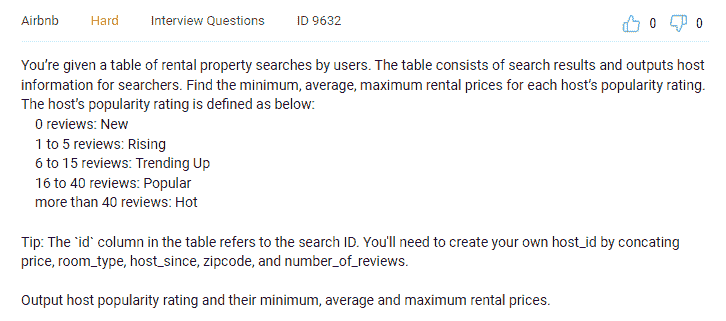
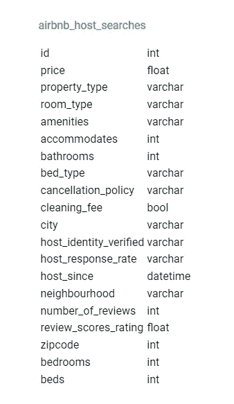
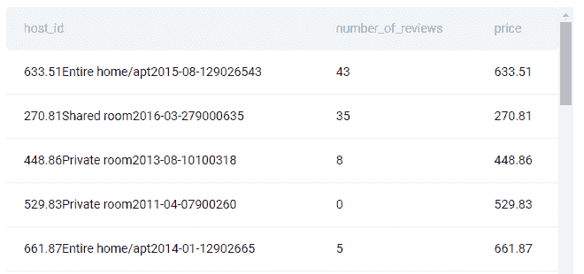
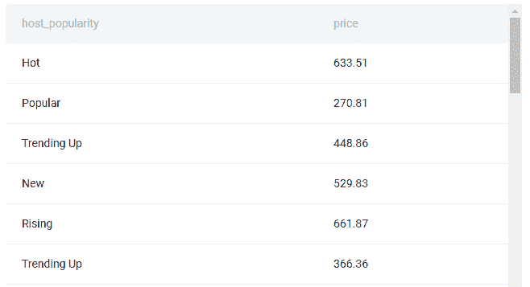
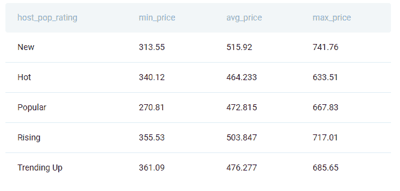

# Airbnb 数据科学家面试问题

> 原文：<https://towardsdatascience.com/airbnb-data-scientist-interview-questions-9e2dfa7d9df2>

## *本文将教你如何解决 Airbnb 数据科学家面试中的一个难题*


作者在 [Canva](https://canva.com/) 上创建的图片

Airbnb 是最受数据科学家欢迎的[公司之一。这是在住宿和酒店行业。虽然传统上，你不会想到这是一个数据科学家高度感兴趣的行业，但 Airbnb 不同。当然，这种差异反映在他们是一个在线住宿市场，连接着主人和客人。要做到这一点，他们依赖于数据和数据科学家。](https://www.stratascratch.com/blog/11-best-companies-to-work-for-as-a-data-scientist/?utm_source=blog&utm_medium=click&utm_campaign=medium)

你依赖于在工作面试中给人留下深刻印象。如果你有兴趣在 Airbnb 工作，那就是。让你更容易在面试中表现出色的事情之一是[知道他们在 Airbnb](https://www.stratascratch.com/blog/airbnb-data-scientist-interview-guide/?utm_source=blog&utm_medium=click&utm_campaign=medium) 会问什么类型的问题。

另一件事是回答具体的问题，就像我们现在要讨论的问题。

# Airbnb 数据科学家面试问题

**主机人气租赁价格**

Airbnb 面试中的一个难题是:



截图来自 [StrataScratch](https://platform.stratascratch.com/coding/9632-host-popularity-rental-prices?code_type=1&utm_source=blog&utm_medium=click&utm_campaign=medium)

问题链接:[https://platform . stratascratch . com/coding/9632-host-popularity-rental-prices](https://platform.stratascratch.com/coding/9632-host-popularity-rental-prices?code_type=1&utm_source=blog&utm_medium=click&utm_campaign=medium)

*注意，平台上的问题略有修改。与视频相比，主要的区别是受欢迎程度分级类别和表格的名称。因此，这里的解决方案会略有不同，但方法是相同的。*

# 数据

您可以使用 airbnb_host_searches 表来解决这个问题。



运行小部件中的代码来查看数据。

```
SELECT * 
FROM airbnb_host_searches;
```

应该是这样的。我们将只显示前三行。显示整个表格会占用太多空间。


截图来自 [StrataScratch](https://platform.stratascratch.com/coding/9632-host-popularity-rental-prices?code_type=1&utm_source=blog&utm_medium=click&utm_campaign=medium)

# 解决方法

编写解决方案代码的方法可以分为以下几个步骤:

*   找到不同的主机
*   使用 CASE WHEN 语句创建流行度分级类别
*   使用聚合函数查找每个类别的最低、平均和最高租赁价格
*   按类别分组

# 解决方案假设


作者在 [Canva](https://canva.com/) 上创建的图片

当你参加[数据科学面试](https://www.stratascratch.com/blog/data-science-interview-guide-questions-from-80-different-companies/?utm_source=blog&utm_medium=click&utm_campaign=medium)时，陈述你的假设总是明智的。这样，面试官就能理解你的观点，并据此评估你的解决方案。如果你这样做了，你就可以避免你的解决方案因为没有解释解决方案中的假设而被扣分的可能性。

此外，通过陈述假设，你会对如何解决面试问题有一个更清晰的想法。对于这个 Airbnb 数据科学家面试问题，我们唯一的假设是:

*   “评论数量”列中的所有值都是整数，不会有空值

# Airbnb 面试问题解决方案

我们应该遵循上面概述的步骤。

这里要做的第一件事是找到独特的宿主。问题的提示建议我们通过连接几个列来创建自己的 host_id。

```
SELECT DISTINCT CONCAT(price, room_type, host_since, zipcode, number_of_reviews) AS host_id,
          number_of_reviews,
          price
   FROM airbnb_host_searches
```

我们使用 CONCAT()函数创建主机 ID，并将查询写成 CTE。我们还需要关于每个主机的评论数量和价格的信息。

这个查询被写成一个名为 hosts 的 CTE。它将输出包含以下前几行的结果:



截图来自 [StrataScratch](https://platform.stratascratch.com/coding/9632-host-popularity-rental-prices?code_type=1&utm_source=blog&utm_medium=click&utm_campaign=medium)

下一步是创建评级类别。为此，您需要使用 CASE WHEN 语句。最实用的方法是将查询的这一部分写成 CTE。

```
SELECT CASE
              WHEN number_of_reviews = 0 THEN 'New'
              WHEN number_of_reviews BETWEEN 1 AND 5 THEN 'Rising'
              WHEN number_of_reviews BETWEEN 6 AND 15 THEN 'Trending Up'
              WHEN number_of_reviews BETWEEN 16 AND 40 THEN 'Popular'
              WHEN number_of_reviews > 40 THEN 'Hot'
          END AS host_popularity,
          price
   FROM hosts;
```

如果同时运行第一步和第二步，代码将返回以下结果(仅显示前几行):



截图来自 [StrataScratch](https://platform.stratascratch.com/coding/9632-host-popularity-rental-prices?code_type=1&utm_source=blog&utm_medium=click&utm_campaign=medium)

现在，我们必须计算最低、平均和最高价格，并根据主持人的受欢迎程度进行分组。为此，我们将编写带有聚合函数的 SELECT 语句，并使用代码的前一部分作为子查询，如下所示:

```
SELECT host_popularity AS host_pop_rating,
       MIN(price) AS min_price,
       AVG(price) AS avg_price,
       MAX(price) AS max_price
FROM
  (SELECT CASE
              WHEN number_of_reviews = 0 THEN 'New'
              WHEN number_of_reviews BETWEEN 1 AND 5 THEN 'Rising'
              WHEN number_of_reviews BETWEEN 6 AND 15 THEN 'Trending Up'
              WHEN number_of_reviews BETWEEN 16 AND 40 THEN 'Popular'
              WHEN number_of_reviews > 40 THEN 'Hot'
          END AS host_popularity,
          price
   FROM hosts) a
GROUP BY host_pop_rating;
```

所有三个 [SQL 聚合函数](https://www.stratascratch.com/blog/the-ultimate-guide-to-sql-aggregate-functions/?utm_source=blog&utm_medium=click&utm_campaign=medium)都应用于 price 列，数据取自子查询。另一方面，子查询从 CTE 中获取数据。

如果将所有这些放在一起，最终的解决方案将是:

```
WITH hosts AS
  (SELECT DISTINCT CONCAT(price, room_type, host_since, zipcode, number_of_reviews) AS host_id,
          number_of_reviews,
          price
   FROM airbnb_host_searches)SELECT host_popularity AS host_pop_rating,
       MIN(price) AS min_price,
       AVG(price) AS avg_price,
       MAX(price) AS max_price
FROM
  (SELECT CASE
              WHEN number_of_reviews = 0 THEN 'New'
              WHEN number_of_reviews BETWEEN 1 AND 5 THEN 'Rising'
              WHEN number_of_reviews BETWEEN 6 AND 15 THEN 'Trending Up'
              WHEN number_of_reviews BETWEEN 16 AND 40 THEN 'Popular'
              WHEN number_of_reviews > 40 THEN 'Hot'
          END AS host_popularity,
          price
   FROM hosts) a
GROUP BY host_pop_rating; 
```

这个查询返回正确的答案。



截图来自 [StrataScratch](https://platform.stratascratch.com/coding/9632-host-popularity-rental-prices?code_type=1&utm_source=blog&utm_medium=click&utm_campaign=medium)

## 结论

通过在数据科学工作面试中问这个问题，Airbnb 测试了几个[重要的 SQL 概念](https://www.stratascratch.com/blog/top-sql-interview-concepts-and-questions-to-sail-through-interviews/?utm_source=blog&utm_medium=click&utm_campaign=medium)。例如，使用 CONCAT()函数查找不同的值和操作数据。

第二个重要的概念是 SQL 聚合函数。此外，这个 Airbnb 数据科学家面试问题测试了您在陈述和分组数据时使用 CASE 的技能。

此外，为了让所有这些概念在一个非常简洁的查询中工作，您必须熟练地编写 cte 和子查询。除了你的技术知识之外，你对问题的理解程度和解决方法也是写出正确答案的重要因素。遵循结构化和编写 SQL 代码的[最佳实践总是一个好主意！](https://www.stratascratch.com/blog/best-practices-to-write-sql-queries-how-to-structure-your-code/?utm_source=blog&utm_medium=click&utm_campaign=medium)