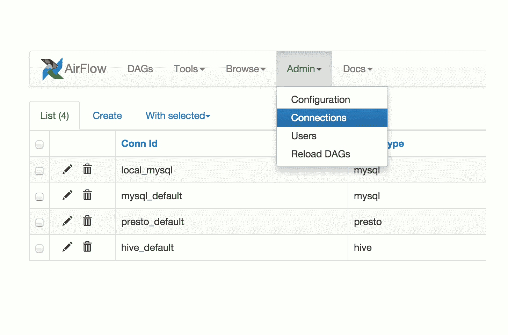

# 气流，级长，和 Dagster:一个内部看看

> 原文：<https://towardsdatascience.com/airflow-prefect-and-dagster-an-inside-look-6074781c9b77>


约书亚·索蒂诺在 [Unsplash](https://unsplash.com?utm_source=medium&utm_medium=referral) 上拍摄的照片

现代数据堆栈的一大优点是与组成堆栈的所有不同组件的互操作性，但不幸的是，编排仍然是一个棘手的问题。数据管道仍然涉及定制脚本和逻辑，它们并不完全适合 ETL 工作流。无论是定制的内部服务，还是像下载文件、解压文件和读取内容这样简单的事情，仍然需要编排工具。

虽然现代数据堆栈确实提供了很大的灵活性，各种组件可以很好地相互配合，但能够协调整个堆栈的工作流仍然不是一个已解决的问题。

进入流程编排工具，如 Apache Airflow、Prefect 和 Dagster。这些工具是数据工程团队的面包和黄油。阿帕奇气流(Apache Airflow)是三者中最古老的一个，是一个经过战斗考验的可靠解决方案，它脱胎于 Airbnb，由 Maxime Beauchemin 创建。当时，数据工程是一个不同的世界，主要关注定期调度的批处理作业，这些作业通常涉及带有 Hive 和 Druid 等词的丑陋系统。今天你仍然可以在气流中看到很多这种传统。

Prefect 和 Dagster 是较新的产品，都受其云产品 Prefect Cloud 和 Dagster Cloud 的支持。Prefect Cloud 可以自由启动并托管一个调度程序，而混合架构允许您在本地或基础架构上运行任务。Dagster Cloud 刚刚发布，正在提前访问中！

# 什么是气流，它的顶级替代品是什么？

Airflow 是一个工作流编排工具，用于编排分布式应用程序。它通过使用 DAGs(有向无环图)在不同的服务器或节点上调度作业来工作。Apache Airflow 提供了一个丰富的用户界面，可以轻松地可视化管道中的数据流。您还可以监控每个任务的进度并查看日志。

如果你曾经对日期如何在气流中工作感到困惑，你会看到一些遗产。很少有人不被什么是执行日期以及为什么他们的 DAG 没有在他们期望的时候运行所迷惑。所有这些都是从午夜后一段时间运行日常工作的日子里滋生出来的。



来看看多年前的气流 1.4，来源:[Github 上的气流](https://github.com/apache/airflow/tree/efd9e4c4f5dc413308fa958a8038240a38840f67)

Airflow 现在是 Apache 的一个项目，Apache 基金会对它的采用巩固了该项目作为现状开源编排和调度工具的地位。今天，成千上万的公司使用气流来管理他们的数据管道，你很难找到一家大公司在他们的堆栈中没有一点气流。像天文学家和 AWS 这样的公司甚至提供托管气流作为服务，这样围绕部署和维护实例的基础设施就不再是工程团队关心的问题。

也就是说，随着数据环境的变化，在测试、非预定工作流、参数化、数据传输和存储抽象方面，Airflow 经常会遇到一些障碍。

# 气流的好处

在我们深入其中一些陷阱之前，有必要提一下气流的一些好处:毫无疑问，一个已经存在了十多年、得到 Apache 基金会支持、完全开源并被数千家公司使用的项目是一个值得考虑的项目。从很多方面来说，选择气流是最安全的选择，社区支持和被证明的有用性使它成为一个如此安全的选择，你甚至可能会说没有人因为选择气流而被解雇(可能)。

例如，与任何其他竞争对手相比，气流的堆栈溢出问题要多 2 个数量级。如果你有问题，你不是一个人，其他人有希望找到解决方案。几乎所有你能想到的工具都有气流提供器，使得用你现有的数据工具创建管道变得容易。

# 气流的问题

随着数据环境的不断发展，数据团队使用工具做的事情越来越多。他们正在构建复杂的管道来支持数据科学和机器学习用例，从各种系统和终端接收数据以将其收集到仓库和数据湖中，并为跨多个数据系统的终端用户工具编排工作流。有一段时间，气流是唯一真正可用的编排工具，因此许多团队试图将他们日益复杂的需求挤进气流，经常碰壁。

我们看到的气流部署的主要问题分为以下几类:

*   本地开发、测试和存储抽象
*   一次性和不定期计划的任务
*   任务之间的数据移动
*   动态和参数化的工作流

我们将通过探索两个替代工具 Dagster 和 Prefect 如何解决这些问题来深入研究每一个问题。

# 看看达格斯特和长官

Dagster 是一个相对年轻的项目，由尼克·施勒克于 2018 年 4 月启动，他之前是脸书 GraphQL 的联合创始人。同样，2018 年，耶利米·劳因(Jeremiah Lowin)成立了 Prefect，他在设计 Prefect 时吸取了作为阿帕奇气流(Apache air flow)PMC 成员的经验。

这两个项目都在解决一个共同的问题，但却有着不同的驱动理念。Dagster 采用第一性原理方法进行数据工程。它构建时考虑了整个开发生命周期，从开发到部署，再到监控和可观察性。另一方面，Prefect 坚持负面工程的哲学，建立在用户知道如何编码的假设上，并且尽可能简单地获取代码，并将其构建到分布式管道中，由其调度和编排引擎支持。

这两个项目都获得了很大的牵引力，并迅速改善。让我们来看看这两个项目是如何应对气流所面临的一些挑战的。

# 本地开发和测试

有了气流，本地开发和测试可能是一场噩梦。如果您的 production Airflow 实例使用 Kubernetes 作为执行引擎，那么您的本地开发也需要 Kubernetes，因为使用 S3Operator 编写的任务需要连接到 AWS S3 才能运行:这对于本地开发来说并不理想。

```
# In Airflow, the task writes to S3, using the S3 hook, and the function doesn't take any arguments.
def to_s3():
    path_file = 'test.csv'
    df = pd.read_csv(path_file)
    csv_buffer = StringIO()
    df.to_csv(csv_buffer)
    s3 = S3Hook(aws_conn_id='my_s3')
    s3.get_conn()
    s3.put_object(Body=csv_buffer.getvalue(),
                  Bucket=BUCKET_NAME,
                  Key='test.csv')task_to_s3_op = PythonOperator(
    task_id='UploadToS3',
    provide_context=True,
    python_callable=to_s3,
    dag=dag
)
```

对于 Dagster，计算和存储是两个不同的问题，可以抽象出来。您的函数接受输入和输出，而不是显式地向 DAG 提供特定的 Kubernetes 实例，这取决于在运行时配置的持久化数据的资源，无论是用于开发的本地临时文件，还是生产云中的加密对象存储。

```
# In Dagster, a function is explicit about  data frames as inputs and outputs. How these are persisted is defined at run-time, not in the code itself. 
@solid
def filter_over_50(people: DataFrame) -> DataFrame:
  return people.filter(people['age'] > 50)# Resource definitions can be swapped out depending on the environment through code
calories_test_job = calories.to_job(
    resource_defs={"warehouse": local_sqlite_warehouse_resource}
)
calories_dev_job = calories.to_job(
    resource_defs={"warehouse": sqlalchemy_postgres_warehouse_resource}
)
```

尽管通过 RunConfigs，Prefect 也支持存储上的抽象级别。

```
from prefect import Flow
from prefect.run_configs import KubernetesRun# Set run_config as part of the constructor
with Flow("example", run_config=KubernetesRun()) as flow:
    ...
```

然而，这并没有提供与 Dagster 相同的抽象级别，这使得本地开发更加棘手。对于 Prefect 来说，参数化是局部开发的重点。通过能够参数化您的流，您可以为本地开发提供较小的数据集，为生产使用提供较大的数据集。

# 计划任务

在 Airflow 中，计划外任务会导致许多意外问题，所有 DAG 都需要某种类型的计划，并且不可能在相同的执行时间内多次运行 DAG。

使用 Prefect，流程可以随时运行，因为工作流是独立的对象。由于其调度程序的工作方式，我们通常需要等待 5-10 秒才能让 Airflow DAG 从预定时间运行，而 Prefect 通过利用 Dask 等工具，实现了 DAG 和任务的快速调度。

同样，Dagster 为手动运行和计划 Dag 提供了很大的灵活性。您甚至可以根据时间表本身修改特定作业的行为，这是非常强大的。例如，如果您希望在周末和工作日提供不同的运行时配置。

```
@schedule(job=configurable_job, cron_schedule="0 0 * * *")
def configurable_job_schedule(context: ScheduleEvaluationContext):
    scheduled_date = context.scheduled_execution_time.strftime("%Y-%m-%d")
    return RunRequest(
        run_key=None,
        run_config={"ops": {"configurable_op": {"config": {"scheduled_date": scheduled_date}}}},
        tags={"date": scheduled_date},
    )
```

在 Dagster 中运行作业非常简单:

```
dagster job execute -f hello_world.py
```

# 气流中的数据流，提督和达格斯特

气流最大的难点之一是相关任务之间的数据移动。传统上，每个任务都必须将数据存储在某个外部存储设备中，使用 XComs 传递关于数据存储位置的信息(先不说 XComs 出现之前的情况)，接下来的任务必须解析这些信息以检索数据并处理数据。

在 Dagster 中，作业的输入和输出可以更加明确。

```
import csvimport requests
from dagster import get_dagster_logger, job, op@op
def download_cereals():
    response = requests.get("<https://docs.dagster.io/assets/cereal.csv>")
    lines = response.text.split("\\n")
    return [row for row in csv.DictReader(lines)]@op
def find_sugariest(cereals):
    sorted_by_sugar = sorted(cereals, key=lambda cereal: cereal["sugars"])
    get_dagster_logger().info(
        f'{sorted_by_sugar[-1]["name"]} is the sugariest cereal'
    )@job
def serial():
    find_sugariest(download_cereals())
```

在上面的例子中可以清楚地看到，download _ 谷类操作返回一个输出，find_sugariest 操作接受一个输入。Dagster 还提供了一个可选的类型提示系统，以提供良好的测试体验，这在气流任务和 Dag 中是不可能的。

```
@op(out=Out(SimpleDataFrame))
def download_csv():
    response = requests.get("<https://docs.dagster.io/assets/cereal.csv>")
    lines = response.text.split("\\n")
    get_dagster_logger().info(f"Read {len(lines)} lines")
    return [row for row in csv.DictReader(lines)]@op(ins={"cereals": In(SimpleDataFrame)})
def sort_by_calories(cereals):
    sorted_cereals = sorted(cereals, key=lambda cereal: cereal["calories"])
    get_dagster_logger().info(
        f'Most caloric cereal: {sorted_cereals[-1]["name"]}'
    )
```

在 Prefect 中，输入和输出也很清楚，很容易连接在一起。

```
with Flow("Aircraft-ETL") as flow:
    reference_data = extract_reference_data()
    live_data = extract_live_data() transformed_live_data = transform(live_data, reference_data) load_reference_data(reference_data)
    load_live_data(transformed_live_data)
```

转换函数接受来自 reference_data 和 live_data 的输出。对于大文件和昂贵的操作，Prefect 甚至提供了缓存和持久化输入和输出的能力，从而在调试时缩短开发时间。

# 动态工作流

Dagster 和 Prefect 的另一个很棒的功能是创建动态工作流的简单界面，这是 Airflow 所缺少的。

在 Prefect 中，参数可以在云接口中指定，或者显式地提供给 Flow runner。这使得扩展到大型复杂计算变得容易，同时允许在管道上工作时进行合理的初始开发。

在 Dagster 中，您可以定义一个图，然后对该图进行参数化，以允许动态配置，这是完全定制资源、配置、挂钩和执行器的能力。

```
from dagster import graph, op
from dagster import ResourceDefinition@op(required_resource_keys={"server"})
def interact_with_server(context):
    context.resources.server.ping_server()@graph
def do_stuff():
    interact_with_server()prod_server = ResourceDefinition.mock_resource()
local_server = ResourceDefinition.mock_resource()prod_job = do_stuff.to_job(resource_defs={"server": prod_server})
local_job = do_stuff.to_job(resource_defs={"local": local_server})
```

# 包扎

我希望这是对一些新的编排工具的有益探索，这些工具已经开始在数据领域获得牵引力。尽管 Airflow 有缺点，但它仍然是一个可靠的、架构良好的平台，可以很好地为许多人服务。然而，这一领域的竞争只会有助于改进所有的工具，因为它们可以相互学习和改进。我很期待看到这个领域的发展，也很想知道你的想法。

您使用的是哪个调度程序？您是否有迁移气流的计划？请在下面评论或者在 [Twitter](https://twitter.com/@pedram_navid) 或者通过[电子邮件告诉我！](mailto:pedram@hightouch.io)

**喜欢这个关于 ETL 编排的内容吗？阅读更多关于下一代 ETL:** [**反向 ETL**](https://hightouch.io/blog/reverse-etl/) **，或联系 Hightouch 的**[**Pedram**](https://linkedin.com/in/pedramnavid)**或** [**团队。**](https://hightouch.io/demo/)