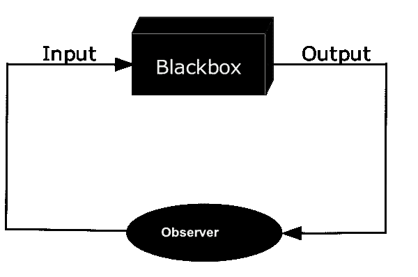
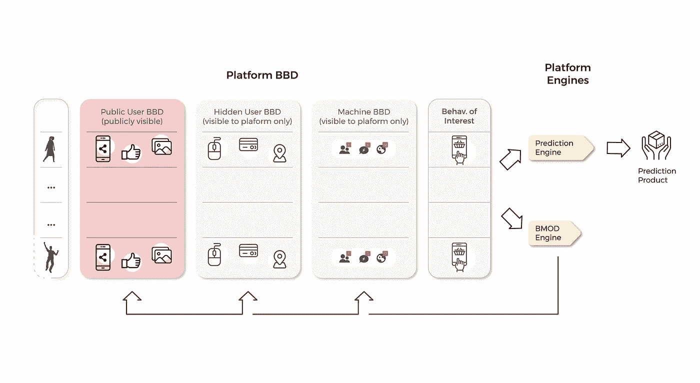

# 大科技的算法行为修正正在削弱学术数据科学研究

> 原文：<https://towardsdatascience.com/algorithmic-behavior-modification-by-big-tech-is-crippling-academic-data-science-research-c600d4fe696b>

## 意见

## 主要平台如何使用有说服力的技术来操纵我们的行为，并日益扼杀有社会意义的学术数据科学研究

我们社会的健康可能取决于让学术数据科学家更好地访问企业平台。马特·西摩在 [Unsplash](https://unsplash.com?utm_source=medium&utm_medium=referral) 上的照片

这篇文章总结了我们最近发表的论文 [**在*自然机器智能中通过数字平台***](https://rdcu.be/cLAti) 进行算法行为修改的新领域中学术数据科学研究的障碍。

一个由数据科学学者组成的多元化社区使用 [***行为大数据***](https://www.liebertpub.com/doi/abs/10.1089/big.2016.0043) (BBD)进行应用和方法研究。BBD 是由我们日常使用互联网和社交媒体平台、移动应用程序、物联网(IoT)小工具等产生的关于人类和社会行为、行动和互动的大型和丰富的数据集。

虽然缺乏对人类行为数据的访问是一个严重的问题，但缺乏关于 [**机器行为**](https://www.nature.com/articles/s41586-019-1138-y?_hsenc=p2ANqtz--lRCtofDpjC9xefSHwgX-1wh5xTGoBYy-A7yZ1G2CP25l76yByyqcaOmnwF941cIvJTbYVHezHzQXJASWORb6UtLzou7myGSVciGlHtthUAiyPRyw&_hsmi=72127156) 的数据也日益成为数据科学研究进展的障碍。有意义且可推广的研究需要访问人类和机器行为数据，并访问*算法机制***对人类行为产生因果影响的*或相关信息。然而，这样的机会对大多数学者来说仍然遥不可及，甚至对那些在名牌大学的人来说也是如此。***

**这些访问障碍提出了新的方法、法律、道德和实践挑战，并有可能扼杀对数据科学研究、公共政策和监管的宝贵贡献，而此时迫切需要对全球集体行为的循证、非营利[管理](https://www.pnas.org/doi/abs/10.1073/pnas.2025764118)。**

****

**平台越来越多地使用 [***说服技术***](https://en.wikipedia.org/wiki/Persuasive_technology) 来自适应地、自动地定制行为干预，以利用我们的[心理特征](https://www.pnas.org/doi/full/10.1073/pnas.1710966114)和动机。照片由[班农·莫里西](https://unsplash.com/@bannon15?utm_source=medium&utm_medium=referral)在 [Unsplash](https://unsplash.com?utm_source=medium&utm_medium=referral) 上拍摄**

## **下一代顺序适应性说服技术**

**像*脸书*、 *Instagram* 、 *YouTube* 和*抖音*这样的平台是庞大的[数字架构](https://journals.sagepub.com/doi/full/10.1177/2056305115603080)，面向用户数据的系统收集、算法处理、流通和货币化。平台现在实施数据驱动、自主、交互和顺序自适应的算法来大规模影响人类行为，我们称之为*算法*或*平台行为修正* ( **BMOD** )。**

**我们将算法 BMOD 定义为数字平台上旨在影响用户行为的任何算法动作、操纵或干预。两个例子是用于预测文本的[自然语言处理](https://en.wikipedia.org/wiki/Natural_language_processing) (NLP)算法和[强化学习](https://en.wikipedia.org/wiki/Reinforcement_learning)。两者都是用来个性化服务和推荐(想想[脸书的 *News Feed*](https://ai.facebook.com/blog/open-sourcing-reagent-a-platform-for-reasoning-systems/) )，增加用户参与度，产生更多的行为反馈数据，甚至通过长期习惯形成“[钩住](https://www.nirandfar.com/hooked/)”用户。**

**在医疗、治疗和公共卫生领域， [BMOD](https://en.wikipedia.org/wiki/Behavior_modification) 是一种可观察和可复制的干预措施，旨在在参与者明确同意的情况下改变人类行为。然而，平台 BMOD 技术越来越*不可观察*和*不可复制*，并且没有明确的用户同意。**

**至关重要的是，即使平台 BMOD 对用户可见，例如，作为显示的推荐、广告或自动完成的文本，外部研究人员通常也无法观察到。只能访问人类 BBD 甚至机器 BBD(但不能访问平台 BMOD 机制)的学者被有效地限制在基于*观察数据*研究*干预行为*。这对(数据)科学不利。**

****

**平台已经成为外部研究人员的算法黑匣子，阻碍了非营利数据科学研究的进展。来源:[维基百科](https://en.wikipedia.org/wiki/File:Blackbox3D-obs.png)。**

## **算法 BMOD 时代推广研究的障碍**

**除了增加错误和遗漏发现的风险，由于[算法混淆](https://dl.acm.org/doi/abs/10.1145/3240323.3240370)，回答因果问题变得几乎不可能。在平台上进行实验的学者必须尝试对平台的“黑盒”进行逆向工程，以便从他们自己的影响中理清平台的自动干预(即 A/B 测试、[多臂强盗](https://dl.acm.org/doi/abs/10.1145/1772690.1772758?casa_token=CXLBArY7JDUAAAAA:u4FdosjSFTBMkSLDLpSmZa5r7w3Coqog1CP43Fsb1LTKX7r3SHMoC87MXwAwDL2RrBoconFffXIs)和强化学习)的因果影响。这个经常不可行的任务意味着使用平台在其内部实验系统上公开发布的任何少量信息来“猜测”平台 BMOD 对观察到的治疗效果的影响。**

**学术研究人员现在也越来越依赖涉及机器人和虚拟用户账户的“游击战术”来探索平台算法的内部工作，这可能会使他们陷入法律危险。但是，即使知道平台的算法，也不能保证理解它在拥有数百万用户和内容项的平台上部署时的最终行为。**

****

****图 1:** 用于 BMOD 和预测的人类用户的行为数据和相关机器数据。行代表用户。学术界不知道或无法获得重要和有用的数据来源。来源:作者。**

**图 1 说明了学术数据科学家面临的壁垒。学术研究者通常只能访问 ***公共用户 BBD*** (例如，分享、点赞、帖子)，而 ***隐藏用户 BBD*** (例如，网页访问、鼠标点击、支付、位置访问、好友请求) ***机器 BBD*** (例如，显示的通知、提醒、新闻、广告)和 ***兴趣行为*** (例如，点击、停留时间)**

## **学术数据科学研究人员面临的新挑战**

**企业平台和学术数据科学家之间的鸿沟越来越大，这可能会扼杀关于长期平台 BMOD 对个人和社会的影响的科学研究。我们迫切需要更好地理解 BMOD 平台在促成[心理操纵](https://dl.acm.org/doi/10.1145/3383313.3418434)、[成瘾](https://link.springer.com/article/10.1007/s11023-018-9479-0)和[政治极化](https://www.tandfonline.com/doi/abs/10.1080/1369118X.2018.1444783?journalCode=rics20)中的作用。除此之外，学术界现在还面临着其他几个挑战:**

*   *****更复杂的伦理审查*** 大学[机构审查委员会](https://en.wikipedia.org/wiki/Institutional_review_board) (IRB)成员可能不了解平台使用的[自主实验系统](https://papers.ssrn.com/sol3/papers.cfm?abstract_id=2846909)的复杂性。**
*   *****新的出版标准*** 越来越多的期刊和会议要求证明部署的影响，以及对用户和社会的潜在影响的道德声明。**
*   *****可复制性较低的研究*** 平台研究人员或与学术合作者使用 BMOD 数据的研究不能被科学界复制。**
*   *****公司对研究结果的审查*** 平台研究委员会可能会阻止发表批评平台和股东利益的研究。**

## **学术隔离+算法 BMOD =碎片化社会？**

**学术孤立的社会影响不应该被低估。算法 BMOD 在无形中工作，可以在没有外部监督的情况下部署，放大公民和外部数据科学家的 [***认知碎片***](https://www.nature.com/articles/s42256-021-00358-3) 。不知道其他平台用户看到什么和做什么，减少了围绕数字平台在社会中的目的和功能进行富有成效的公开讨论的机会。**

**如果我们想要有效的公共政策，我们需要公正可靠的科学知识，了解个人在平台上看到什么和做什么，以及他们如何受到算法 BMOD 的影响。**

****

**脸书告密者弗朗西丝·豪根向国会作证。来源:[维基百科](https://en.wikipedia.org/wiki/Frances_Haugen)。**

## **我们的共同利益需要平台透明和可访问性**

**前脸书数据科学家和[告密者 Frances Haugen](https://en.wikipedia.org/wiki/Frances_Haugen) 强调透明和独立研究者访问平台的重要性。在她最近的美国参议院证词中，她写道:**

> **….没有人比脸书更能理解脸书的破坏性选择，因为只有脸书有机会一探究竟。有效监管的一个关键起点是透明度:完全获取非脸书指导的研究数据。只要脸书在暗中运作，不让公众看到它的研究，它就是不负责任的。如果放任不管，脸书将继续做出违背我们共同利益的选择。**

**我们支持 Haugen 对更大的平台透明度和访问的呼吁。**

## **学术孤立对科学研究的潜在影响**

**更多详情请参见我们的[论文](https://rdcu.be/cLAti)。**

1.  **进行了不道德的研究，但没有发表**
2.  **更多未经同行审评的出版物，例如关于第十四次评估报告的出版物**
3.  **错位的研究主题和数据科学方法**
4.  **对科学知识和研究的寒蝉效应**
5.  **支持研究主张的困难**
6.  **培训新数据科学研究人员的挑战**
7.  **浪费的公共研究基金**
8.  **错误的研究努力和无足轻重的出版物**
9.  **更多基于观察的研究和研究倾向于更容易访问数据的平台**
10.  **对数据科学领域的声誉损害**

## **学术数据科学何去何从？**

**学术数据科学家在这一新领域的角色仍不清楚。我们看到学术界出现了新的职位和职责，包括参与独立审计，与监管机构合作监督 BMOD 平台，开发评估 BMOD 影响的新方法，以及在流行媒体和学术机构中引导公众讨论。**

**打破当前的障碍可能需要超越传统的学术数据科学实践，但在算法 BMOD 时代，学术隔离的集体科学和社会成本太大，不容忽视。**